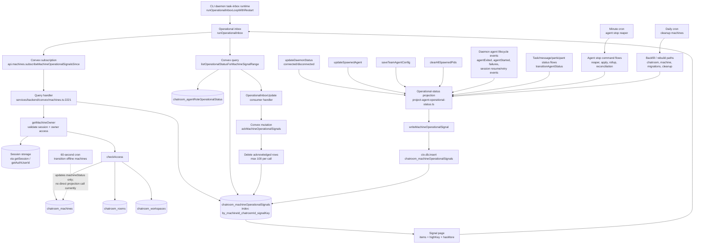
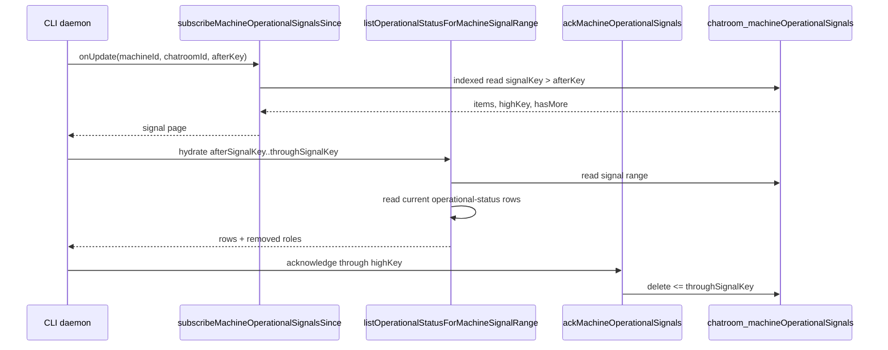

# `subscribeMachineOperationalSignalsSince` trace

## Daemon use cases supported by the signal table

`chatroom_machineOperationalSignals` is a daemon-facing change feed for machine-bound agent operational state. It supports these use cases:

- **Reactive wake-up:** the daemon waits on a lightweight Convex subscription and wakes only when a relevant operational signal arrives.
- **Chatroom-scoped delivery:** one machine can serve multiple chatrooms, while each inbox receives only signals for its own `(machineId, chatroomId)` scope.
- **Cursor-based catch-up:** `signalKey` provides an ordered cursor, allowing the daemon to resume after restart or reconnect without subscribing to the full operational projection.
- **Current-state hydration:** signals identify that a role changed; the daemon then fetches the current `chatroom_agentRoleOperationalStatus` row rather than relying on a potentially stale event payload.
- **Role removal propagation:** `removed: true` tells the daemon to remove a role from its local operational view even when the source operational row has already been deleted.
- **Backpressure and paging:** `limit`, `highKey`, and `hasMore` allow signal delivery and hydration to be processed in bounded pages.
- **At-least-once delivery with cleanup:** signals remain available until the daemon acknowledges them through a cursor, allowing retries after handler or process failure.
- **Low-bandwidth monitoring:** the table contains only routing and revision metadata (`role`, `revisionKey`, `signalKey`, `projectedAt`, and optional removal state), not the full operational row or task content.

## End-to-end flow



## Table dependencies

The subscription query directly reads only:

```text
chatroom_machineOperationalSignals
└── by_machineId_chatroomId_signalKey
```

Its authorization path additionally reads:

```text
session storage             getSession / getAuthUserId
chatroom_machines           machine ownership
chatroom_rooms              chatroom access relationships
chatroom_workspaces         machine workspace access relationships
```

The subsequent hydration query reads:

```text
chatroom_machineOperationalSignals
chatroom_agentRoleOperationalStatus
```

## Signal writer details

All signal inserts converge on:

```text
services/backend/src/domain/usecase/agent/write-machine-operational-signal.ts
    writeMachineOperationalSignal()
        └── ctx.db.insert('chatroom_machineOperationalSignals', signal)
```

The helper is called by these projection paths:

- `projectAgentOperationalStatusForRole` — normal role state changes.
- `projectAgentStopStateForRole` — stop-state changes.
- `projectAgentOperationalStatusForRoleRemoved` — emits `removed: true`.
- `projectDaemonConnectivityForMachine` — daemon connectivity changes.
- `rebuildAgentOperationalStatusForChatroom` / `rebuildAgentOperationalStatusForMachine` — rebuild and backfill paths.

## Acknowledgement path



## Important timing note

The `transitionOfflineMachines` cron currently changes `chatroom_machineStatus` from online to offline, but does not call `projectDaemonConnectivityForMachine`. Therefore, the timeout itself does not directly append a machine operational signal. A later projection/rebuild or another daemon-status mutation is required to produce that signal.
