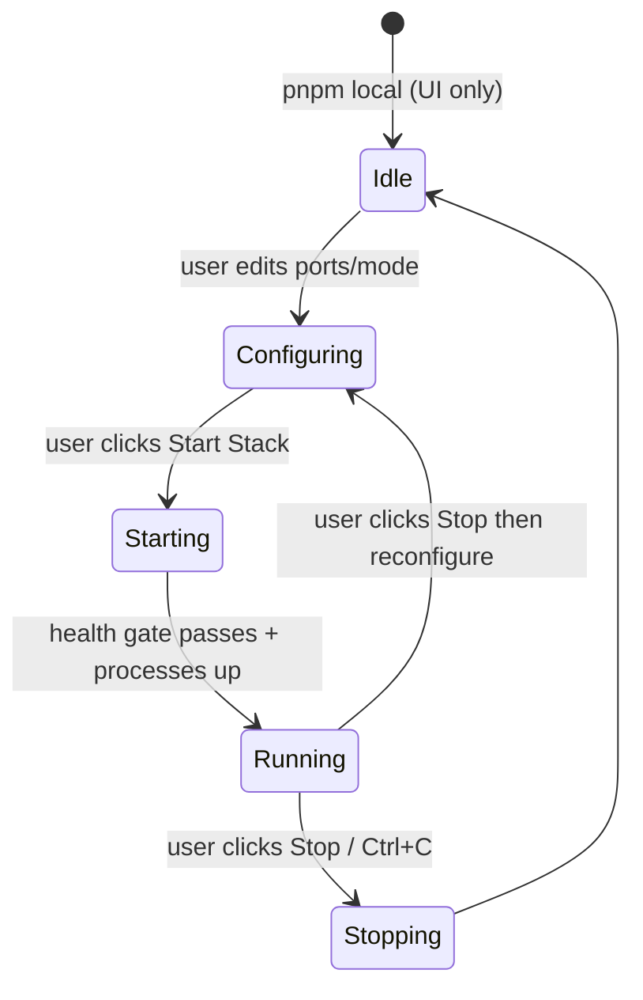
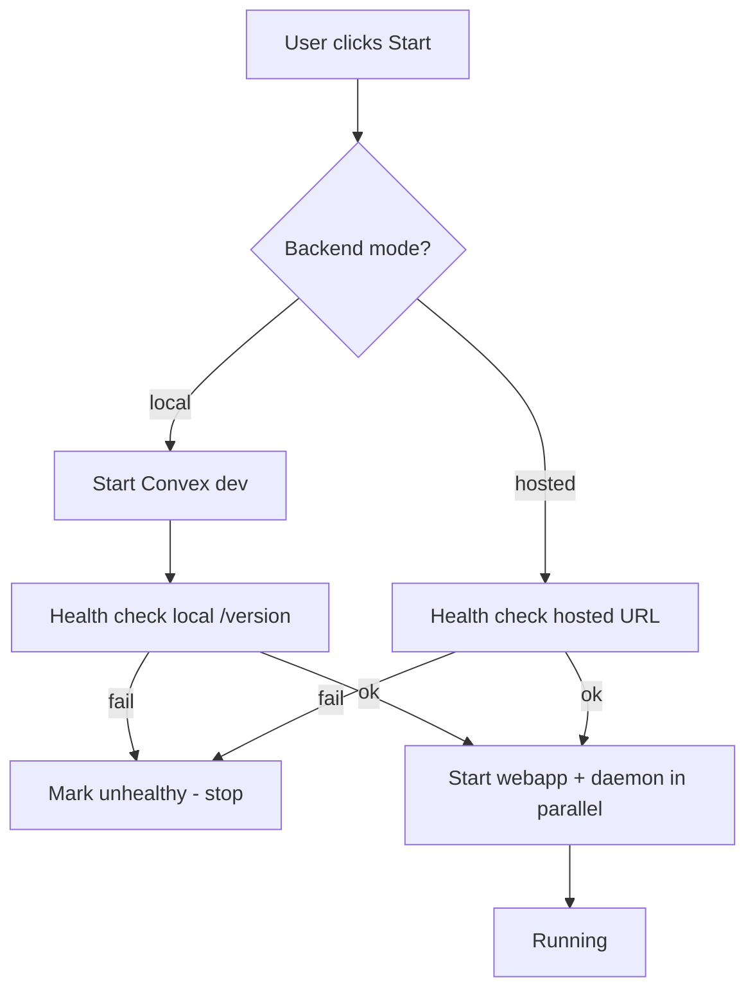

# @workspace/local — Architecture

Local dev process manager for the Chatroom monorepo. Manages Convex (optional), webapp, and chatroom daemon with an industrial dark-steel UI.

## Goals

1. **Non-interference** — configurable ports and backend mode so multiple dev setups can coexist.
2. **Easy switching** — toggle between local Convex backend and hosted Convex dev deployment without editing `.env.local` files manually.
3. **UI-first startup** — `pnpm local` opens the manager UI only; user configures and explicitly starts the stack.
4. **Predictable builds** — child processes use `pnpm turbo run build --filter=...` from repo root; restarting `pnpm local` rebuilds.

## Lifecycle



### Phases

| Phase      | Manager UI                         | Child processes                   |
| ---------- | ---------------------------------- | --------------------------------- |
| `idle`     | Setup screen (ports, backend mode) | None                              |
| `starting` | Progress + logs                    | Sequential start                  |
| `running`  | Dashboard (logs, restart)          | convex (optional), webapp, daemon |
| `stopping` | Stopping indicator                 | SIGTERM all                       |

## Configuration

### Launch-time (CLI / env only)

Used to bind the manager UI itself. Cannot change without restarting `pnpm local`.

| Flag             | Env                  | Default | Description            |
| ---------------- | -------------------- | ------- | ---------------------- |
| `--manager-port` | `LOCAL_MANAGER_PORT` | `3847`  | Manager UI + WebSocket |

### Runtime (UI / WebSocket)

User configures before starting the stack. Persisted in server memory for the session (not written to `.env.local`).

```typescript
export type ConvexBackendMode = 'local' | 'hosted';

export type RuntimeConfig = {
  webappPort: number;
  convexBackendMode: ConvexBackendMode;
  /** Local mode: Convex dev HTTP port (default 3210) */
  convexPort: number;
  /** Hosted mode: full deployment URL (e.g. https://*.convex.cloud) */
  convexUrl: string;
};

export type RuntimeConfigDefaults = RuntimeConfig & {
  /** Suggested manager port (read-only in UI) */
  managerPort: number;
  /** Source hints for UI */
  hostedConvexUrlFromEnv: string | null;
  webappPortFromEnv: number | null;
};
```

### Derived URLs

```typescript
function resolveConvexUrl(config: RuntimeConfig): string {
  if (config.convexBackendMode === 'hosted') return config.convexUrl;
  return `http://127.0.0.1:${config.convexPort}`;
}

const webappUrl = `http://localhost:${config.webappPort}`;
```

Defaults loaded from:

- `services/backend/.env.local` → `VITE_CONVEX_URL` / `CONVEX_DEPLOYMENT`
- `apps/webapp/.env.local` → `NEXT_PUBLIC_CONVEX_URL`, `PORT`

When env files disagree (backend local, webapp hosted), defaults prefer the `.convex.cloud` URL and hosted mode.

## Backend modes

### Local Convex (`convexBackendMode: 'local'`)

1. Spawn `pnpm --filter @workspace/backend dev` from repo root.
2. Health gate: `GET http://127.0.0.1:{convexPort}/version` → 200.
3. Pass `http://127.0.0.1:{convexPort}` to webapp (`NEXT_PUBLIC_CONVEX_URL`) and daemon (`CHATROOM_CONVEX_URL`).

### Hosted Convex (`convexBackendMode: 'hosted'`)

1. **Do not spawn** the convex process (show as `skipped` in UI).
2. Health gate: `GET {convexUrl}/version` → 200 (validates deployment is reachable).
3. Pass `convexUrl` from config to webapp and daemon env overrides.

This matches setups where `convex dev` syncs to a cloud deployment and the webapp already points at `*.convex.cloud`.

## Startup sequence



### Process commands (repo root `cwd`)

| Process             | Command                                                                                                                                             |
| ------------------- | --------------------------------------------------------------------------------------------------------------------------------------------------- |
| Convex (local only) | `pnpm --filter @workspace/backend dev`                                                                                                              |
| Webapp              | `pnpm turbo run build --filter=@workspace/webapp --no-cache && PORT={port} pnpm --filter @workspace/webapp exec dotenv -e .env.local -- pnpm start` |
| Daemon              | `pnpm turbo run build --filter=chatroom-cli --no-cache && pnpm exec chatroom machine daemon start`                                                  |

Env injected per child:

| Var                      | Source                      |
| ------------------------ | --------------------------- |
| `NEXT_PUBLIC_CONVEX_URL` | `resolveConvexUrl(config)`  |
| `CHATROOM_CONVEX_URL`    | `resolveConvexUrl(config)`  |
| `CHATROOM_WEB_URL`       | `webappUrl`                 |
| `PORT`                   | `config.webappPort`         |
| `NODE_ENV`               | `production` (webapp build) |

## WebSocket protocol

### Server → client

```typescript
type ServerMessage =
  | { type: 'snapshot'; phase: SessionPhase; processes: ProcessInfo[]; logs: ...; config: RuntimeConfigDefaults; runtime: RuntimeConfig | null }
  | { type: 'phase'; phase: SessionPhase }
  | { type: 'process-update'; process: ProcessInfo }
  | { type: 'log'; line: LogLine }
  | { type: 'runtime-config'; runtime: RuntimeConfig };
```

### Client → server

```typescript
type ClientMessage =
  | { type: 'start'; config: RuntimeConfig }
  | { type: 'stop' }
  | { type: 'restart'; processId: ManagedProcessId };
```

## Process status extensions

```typescript
type ProcessStatus = 'pending' | 'starting' | 'running' | 'stopped' | 'crashed' | 'skipped';
```

`skipped` — convex in hosted mode (not managed locally).

## UI screens

### Setup (`phase === 'idle'`)

- Backend mode: Local / Hosted (radio)
- Convex port (local) or Convex URL (hosted, pre-filled from env)
- Webapp port (pre-filled from `apps/webapp/.env.local` `PORT` or 3000)
- **Start Stack** button
- Show manager port (read-only)

### Dashboard (`phase === 'starting' | 'running'`)

- Existing sidebar + log viewer
- **Stop Stack** button
- Health badge on convex (or "Hosted — external" when skipped)
- Per-process restart

## Error handling

- **EADDRINUSE on manager port** — print clear message suggesting `--manager-port` or kill existing process.
- **Health timeout** — convex row `unhealthy`, webapp/daemon stay `pending`, user can fix config and retry.
- **Port conflicts** — user responsibility via UI ports; no auto-detection in v1.

## File layout

```
apps/local/
  docs/architecture.md          # this file
  src/
    shared/protocol.ts          # types
    server/
      parse-config.ts           # manager port only (launch)
      load-runtime-defaults.ts  # read .env.local defaults
      process-definitions.ts    # build from RuntimeConfig
      process-manager.ts        # idle + orchestration
      convex-health.ts
      websocket-hub.ts
    client/
      App.tsx                   # Setup vs Dashboard routing
      components/SetupPanel.tsx
      ...
```

## Validation

1. **Unit tests** — config parsing, health check mocks, process definition env for local vs hosted.
2. **Manual / agent browser** — after `pnpm local`:
   - Setup screen loads at manager URL
   - Hosted mode: Start → webapp + daemon reach running; convex shows skipped
   - Local mode: Start → all three processes healthy (requires local convex)
3. **Smoke script** (optional) — `curl` manager port + WebSocket snapshot.

## Implementation slices

1. **Architecture + idle mode** — docs, remove auto-start, protocol, defaults loader, Setup UI shell
2. **Hosted backend mode** — skip convex, health hosted URL, fix env injection
3. **Setup UI polish** — full form, stop stack, phase transitions
4. **Browser validation + commits** — verify flows, separate commits per slice
