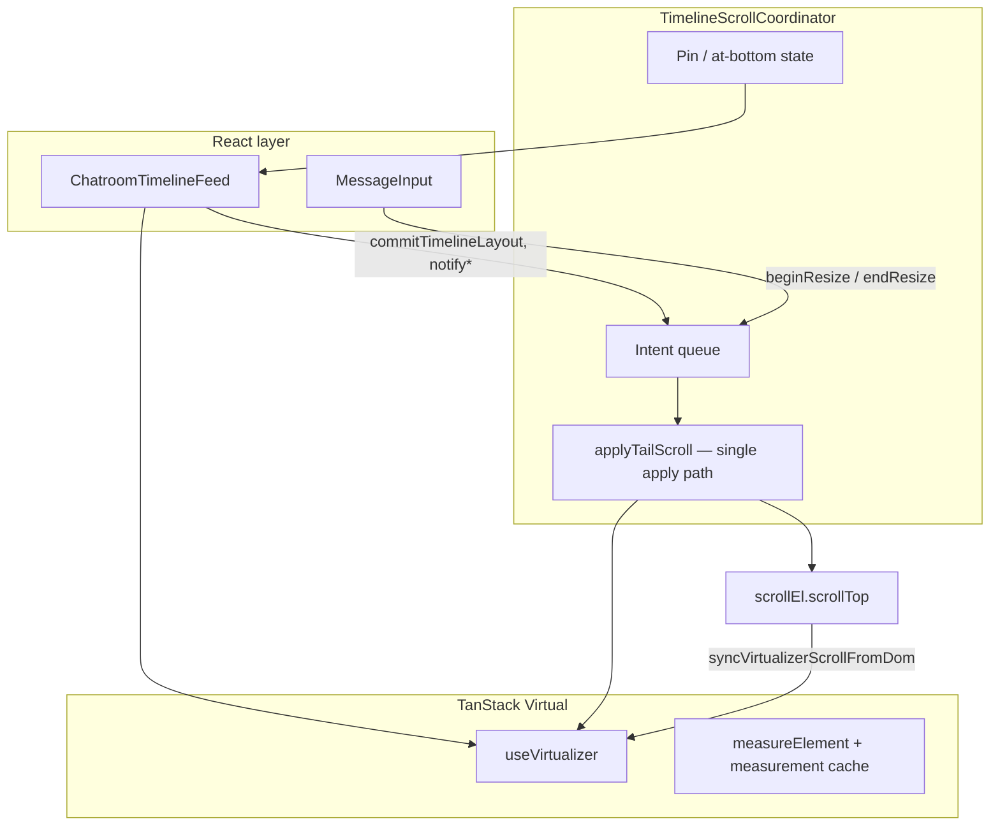

# Timeline scroll & virtualization — what works

This document explains the **working** virtualized chatroom timeline scroll design. It lives next to `timelineScrollCoordinator.ts` because most scroll behavior is imperative and easy to misread from React alone.

For the phased refactor history (what we tried and reverted), see [`docs/timeline-refactor-plan.md`](../../../../../docs/timeline-refactor-plan.md).

---

## Architecture at a glance



**Division of responsibility**

| Layer | Owns |
|-------|------|
| `ChatroomTimelineFeed` | Row rendering, virtualizer config, measurement cache, load-older triggers |
| `TimelineScrollCoordinator` | Pin state, all programmatic scroll, prepend preservation, tail follow/settle |
| TanStack Virtual | Visible range, row positions, `scrollToEnd` / `scrollToOffset` / `scrollToIndex` |

React **subscribes** to pin state (jump chip, `followOnAppend`-like UI). It does **not** drive tail follow directly — that goes through the coordinator.

---

## TanStack Virtual — config that matters

These choices in `ChatroomTimelineFeed` are load-bearing. Changing them without re-reading this doc will likely break scroll.

### `followOnAppend: false` (always)

TanStack's built-in tail follow reconfigures the virtualizer when pin toggles and causes a visible jump. Tail follow when pinned is handled imperatively via `commitTimelineLayout` → intent queue → `applyTailScroll`.

**Do not toggle `followOnAppend` on pin/unpin.**

### `anchorTo: 'end'`

Initial mount and append semantics assume the scroll surface is anchored to the bottom. Prepend preservation uses explicit height-delta math instead of relying on `anchorTo` alone (rows measure in asynchronously).

### Measurement cache + `initialMeasurementsCache`

```ts
measurementCacheRef.current.get(event.id) ?? TIMELINE_ESTIMATE_SIZE
```

Persisting measured row heights across reconciliations prevents load-older anchor drift when prepended rows were previously under-estimated at 100px.

The cache is snapshotted into `initialMeasurementsCache` once at mount (chatroom switch = new mount = fresh snapshot).

### `shouldAdjustScrollPositionOnItemSizeChange` — prepend only

The override returns `true` **only** while prepend preservation is active (`isPrependScrollPreservationActive()`). Otherwise TanStack's default adjustment competes with coordinator tail follow and causes jumps.

During normal pinned tail follow, size changes on the last row are handled by `notifyTailRowResized` → `tail_settle` intent.

### Thresholds (`timelineVirtualizerConfig.ts`)

| Constant | Value | Purpose |
|----------|-------|---------|
| `TIMELINE_PIN_AT_BOTTOM_THRESHOLD` | 8px | Pin / jump-chip UI — stricter than load-older |
| `TIMELINE_SCROLL_END_THRESHOLD` | 50px | TanStack `scrollEndThreshold`, load-older guards |

Pin uses a **tighter** threshold so a partial scroll (half the last message visible) stays unpinned and the jump chip remains actionable.

---

## The unintuitive part: two scroll authorities, one sync bridge

TanStack Virtual caches `scrollOffset` from scroll events. The coordinator sometimes writes `el.scrollTop` directly (snap, prepend preserve). Without syncing, TanStack's range becomes empty or stale until the user scrolls.

**`syncVirtualizerScrollFromDom()` is non-negotiable.** It:

1. Clamps `scrollTop` to max
2. Calls `virtualizer.scrollToOffset(top)`
3. Dispatches a synthetic `scroll` event

We tried removing this from tail follow (Phase 2 in the refactor plan). Result: pinned + new message did not scroll fully, jump chip broke, stutter increased. **Abandoned.**

The current design does not eliminate dual writers (DOM + TanStack). Instead, **all programmatic writes route through the intent queue** and always end with `syncVirtualizerScrollFromDom` in `applyTailScroll`.

---

## Intent queue — how competing scroll paths were deconflicted

Before the intent queue, tail follow fired from four places (`commitTimelineLayout`, `ResizeObserver`, `endResize`, `scheduleTailSettle`) and could race.

Now every programmatic action enqueues a `ScrollIntent`:

| Intent | When |
|--------|------|
| `follow_tail` | Append while pinned, resize end, guard correction |
| `tail_settle` | Multi-frame recovery after count/tail change or row growth |
| `snap` | ResizeObserver while pinned at bottom |
| `preserve_prepend` | Older messages loaded with position preservation |
| `adjust_top_chrome` | Load-older spinner changes top chrome height |
| `cancel_programmatic` | User wheel/touch — clears pending tail work |

**Per-frame coalescing** (`runFlushCycle`):

1. Process `cancel_programmatic` first
2. Drain prepend / chrome intents before tail work
3. Merge tail intents — last `follow_tail` behavior wins; `tail_settle` callbacks merge
4. Single apply via `applyTailScroll` → DOM snap + virtualizer + sync

Tail work is blocked during prepend (`isTailBlockedByPrepend()`).

---

## Pin vs at-bottom vs shouldFollowTail

Three related but distinct concepts:

- **`isPinned`** — user intent: "keep me at the tail as new messages arrive." Subscribed by React for UI.
- **`computeIsAtBottom()`** — physical DOM position within threshold.
- **`shouldFollowTail()`** — may we auto-scroll on append? Requires pinned **and** flush at tail, and **not** during prepend/load-older.

**Unpinning:** On scroll events, if pinned but not at bottom (and not in programmatic/tail-settle), cancel pending tail work and unpin immediately. User wheel/touch also enqueues `cancel_programmatic`.

**Re-pinning:** After user scroll timeout (200ms), if physically at bottom → pin. Scroll events can also pin when at bottom and not user-scrolling.

**Why wheel/touchmove listeners?** We tried replacing the 200ms `userScrolling` timeout with TanStack `isScrolling` (Phase 4). Result: blank rows, pin state never reconciled after gesture ended. The debounced timeout runs **after** the gesture ends; `isScrolling` going false does not fire a scroll event, so reconciliation never ran. **Abandoned.**

---

## Tail follow & settle

When pinned and the timeline grows (new message, tail key change with same count — subscription slide-off):

```
commitTimelineLayout → enqueue(follow_tail) + enqueue(tail_settle) → schedulePinnedTailGuard
```

### `applyTailScroll` (single apply path)

1. `scrollToIndex(tailIndex, { align: 'end' })` if index known
2. `scrollToEnd` on virtualizer
3. `snapDomImmediate()` — `scrollTop = maxScrollTop`
4. `syncVirtualizerScrollFromDom()`

### `tail_settle` — multi-frame recovery

Virtualizer visible range and DOM `scrollHeight` often lag 1–24 frames after data changes (variable-height rows, markdown render, footer measure-in). `tickTailSettle` re-applies tail scroll until:

- at bottom **and** visible count > 0 **and** frames ≥ 2, or
- max frames (24) reached

We tried lowering max frames to 6 (Phase 6). Large messages jumped noticeably. The high cap is only paid in worst case; common path settles in 2–3 frames. **Keep 24.**

### Pinned tail guard

While pinned, if `scrollTop < maxScrollTop - 0.5` (not flush), a guard rAF loop enqueues `follow_tail` + `tail_settle` (capped at 30 iterations). Corrects drift without a React effect watchdog.

### In-place tail row growth

When the last row's measured height increases (classification badge, content expansion, footer #603):

```ts
coordinator.notifyTailRowResized(tailIndex)
```

Only fires when `shouldFollowTail()` — pinned, at bottom, not prepending.

---

## Prepend (load older) preservation

Two intents:

- **`preserve_position`** — default; keep the same message in view
- **`fill_viewport`** — if content shorter than viewport, follow tail instead

Flow:

1. `setLoadOlderIntent` captures anchor (stable event id, scrollTop, scrollHeight, offsetInItem) and unpins
2. On prepend, `preserve_prepend` intent applies `scrollTop += heightDiff`
3. `schedulePrependScrollSettle` fine-tunes over ~8 frames using anchor key → `findIndexForKey` + `getItemStart`

Uses **live** `scrollTop` for height delta (not stale anchor) so top-chrome growth between capture and prepend is not overwritten.

`shouldAdjustScrollPositionOnItemSizeChange` is enabled during this window so TanStack adjusts as prepended rows measure in.

---

## Top chrome & composer resize

**Top chrome** (load-older spinner): height change enqueues `adjust_top_chrome` with pixel delta. Skipped when already at tail (chrome growth at bottom doesn't shift viewport).

**Composer resize** (`MessageInput` `onBeforeResize` / `onAfterResize` → `beginResize` / `endResize`):

- `beginResize` sets `resizing = true` (blocks tail guard)
- `endResize` enqueues follow + settle when pinned

Without the resize bracket, textarea auto-grow triggers ResizeObserver snap/follow fights.

---

## `programmaticScroll` depth counter

`runProgrammaticScroll` increments depth before DOM writes and clears when:

- `targetCheck()` returns true (e.g. reached max scroll), or
- frame cap hit, or
- 2 rAF fallback when no target check

Nested programmatic scrolls (settle tick inside flush) use depth so inner clears don't drop the flag early.

Scroll event handler **ignores** pin updates while `programmaticScroll` is true, except the explicit unpinned-at-not-bottom escape hatch.

---

## Integration checklist for new call sites

When touching timeline scroll:

1. **Never** call `virtualizer.scrollToEnd` or set `scrollTop` from React effects for tail follow — use coordinator APIs.
2. **Always** bracket composer resizes with `beginResize` / `endResize`.
3. **Route** chrome height changes through `notifyTopChromeDelta`.
4. **Commit** layout changes through `commitTimelineLayout` in `useLayoutEffect` (not `useEffect`).
5. **Gate** load-older on `getAllowLoadOlder()` (false until initial tail settle completes).
6. **Test** with variable-height rows: context dividers, handoffs, long markdown, agent streaming.

---

## Known limitations

- Tall messages may show a brief stutter then settle — multiple writers (DOM snap, TanStack, size-change adjustment) still exist; the intent queue reduces races but doesn't unify to a single authority.
- Future redesign option: drive all scroll through TanStack only and drop direct `scrollTop` writes — would require rethinking prepend pixel preservation.

See `TIMELINE_TAIL_SCROLL_FIX_ATTEMPTS` comment in `timelineScrollCoordinator.ts` for P0–P2 follow-ups.

---

## Tests

| File | Covers |
|------|--------|
| `timelineScrollCoordinator.test.ts` | Intent coalescing, pin/unpin, prepend, tail settle, guard, jump chip |
| `ChatroomTimelineFeed.test.tsx` | Integration: send message, load older, jump chip, chrome measure |

Assert on scroll outcomes (`mockScrollToEnd`, DOM `scrollTop`), not internal method calls like `followTail` — the queue may coalesce them.
