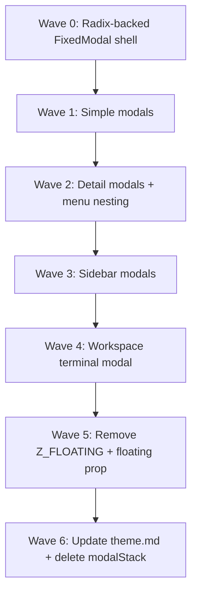

# FixedModal → Radix Dialog migration plan

Backlog: `ps7a0dfkef3d9dt7jrysxt18d58akeqt`

## Relationship to PR #976 (stacked modal bugfixes)

**Related surface area, separate timelines.**

| Concern | PR #976 (bugfix)                                                                                                               | This migration (refactor)                                                           |
| ------- | ------------------------------------------------------------------------------------------------------------------------------ | ----------------------------------------------------------------------------------- |
| Problem | View More list+detail closes both on Escape; z-index corruption when `onClose` identity changes                                | Dual modal systems (`FixedModal` inline z-index vs Radix `z-50` + `Z_FLOATING`)     |
| Scope   | `overlayDismissStack`, `FixedModal` escape registration, `WorkQueue` render order, `BacklogItemDetailModal` duplicate listener | Replace `FixedModal` internals with Radix Dialog; eliminate `Z_FLOATING` float band |
| Urgency | Ship on `release/v1.68.4`                                                                                                      | Significant refactor — not blocking release                                         |

**Does the migration change how we implement #976?** No. Land #976 first:

- `overlayDismissStack` remains the SSOT for Escape until Radix `onEscapeKeyDown` is unified — migration must preserve this behavior.
- Render-order rule (detail portals after queue) applies regardless of primitive.
- Tests added in #976 (`fixed-modal.test.tsx`, `BacklogQueueModal.test.tsx`) become the regression suite for migration.

**After migration:** inline `modalStack` z-index math and most `floating` / `Z_FLOATING` opt-ins should disappear; `overlayDismissStack` may simplify to Radix layer events or stay for portaled menus.

---

## Current architecture

```
FixedModal (custom portal)
  ├── modalStack module var → inline zIndex: 50 + 10 × depth
  ├── overlayDismissStack → global capture-phase Escape listener
  └── composition: Header, Body, Sidebar, Content

Radix chatroom Dialog / AlertDialog
  ├── z-50 base (Z_MODAL)
  └── floating prop / Z_FLOATING (z-[100]) for nested UI inside FixedModal

Portaled menus (Popover, Dropdown, Select)
  └── Z_FLOATING + useOverlayDismissStack
```

SSOT today: `apps/webapp/src/modules/chatroom/components/shared/overlayLayers.ts`

---

## FixedModal call-site inventory (22 files)

### Wave 1 — Simple single-pane modals (low risk)

| File                                                                                | Notes                                        |
| ----------------------------------------------------------------------------------- | -------------------------------------------- |
| `apps/webapp/src/modules/chatroom/components/WorkQueue/BacklogQueueModal.tsx`       | List only; stacked under detail in WorkQueue |
| `apps/webapp/src/modules/chatroom/components/WorkQueue/CurrentTasksModal.tsx`       | Same pattern as BacklogQueueModal            |
| `apps/webapp/src/modules/chatroom/components/TaskQueueModal.tsx`                    | Same pattern                                 |
| `apps/webapp/src/modules/chatroom/components/WorkQueue/QueuedMessagesModal.tsx`     | Queue list                                   |
| `apps/webapp/src/modules/chatroom/components/BacklogCreateModal.tsx`                | Create form                                  |
| `apps/webapp/src/modules/chatroom/components/AgentPanel/AgentRestartStatsModal.tsx` | Read-only stats                              |
| `apps/webapp/src/modules/chatroom/components/AgentPanel/UnifiedAgentListModal.tsx`  | Agent list                                   |
| `apps/webapp/src/modules/chatroom/components/AgentPanel/PromptViewerModal.tsx`      | Read-only prompt                             |
| `apps/webapp/src/modules/chatroom/components/SetupChecklistModal.tsx`               | Onboarding checklist                         |
| `apps/webapp/src/modules/chatroom/components/EditorModal.tsx`                       | Single editor pane                           |
| `apps/webapp/src/modules/chatroom/components/timeline/TimelineContextMessage.tsx`   | Context message viewer                       |
| `apps/webapp/src/modules/chatroom/attachments/shared/AttachmentMarkdownModal.tsx`   | Markdown preview                             |
| `apps/webapp/src/modules/chatroom/attachments/snippet/AttachedSnippetChip.tsx`      | Inline snippet viewer                        |

### Wave 2 — Detail modals with actions / nested menus

| File                                                                                 | Nested UI risk                                                      |
| ------------------------------------------------------------------------------------ | ------------------------------------------------------------------- |
| `apps/webapp/src/modules/chatroom/components/BacklogItemDetailModal.tsx`             | DropdownMenu Actions; edit-mode Escape via `useOverlayDismissStack` |
| `apps/webapp/src/modules/chatroom/components/TaskDetailModal.tsx`                    | DropdownMenu; stacked over queue modals                             |
| `apps/webapp/src/modules/chatroom/components/WorkQueue/QueuedMessageDetailModal.tsx` | DropdownMenu; edit tabs                                             |
| `apps/webapp/src/modules/chatroom/components/ArtifactRenderer.tsx`                   | Artifact preview                                                    |

### Wave 3 — Sidebar layout modals (composition-heavy)

| File                                                                             | Notes                                                                     |
| -------------------------------------------------------------------------------- | ------------------------------------------------------------------------- |
| `apps/webapp/src/modules/chatroom/components/AgentSettingsModal.tsx`             | Sidebar + tabs; **nested `DialogContent floating`** (purge cache confirm) |
| `apps/webapp/src/modules/chatroom/components/ReviewPanel/ReviewPanel.tsx`        | Split-pane review                                                         |
| `apps/webapp/src/modules/chatroom/components/FileSelector/FilePreviewDialog.tsx` | File tree sidebar + preview                                               |
| `apps/webapp/src/modules/chatroom/components/EventStreamModal.tsx`               | Sidebar event list                                                        |

### Wave 4 — Workspace / large viewport modals

| File                                                                           | Notes                                    |
| ------------------------------------------------------------------------------ | ---------------------------------------- |
| `apps/webapp/src/modules/chatroom/workspace/components/WorkspaceBottomBar.tsx` | Embedded terminal modal (`max-w-[96vw]`) |

---

## Non–FixedModal portaled UI audit (nested-overlay risks)

| Component                                                        | Z-index                     | Risk inside FixedModal                                   | Migration action                                                             |
| ---------------------------------------------------------------- | --------------------------- | -------------------------------------------------------- | ---------------------------------------------------------------------------- |
| `ui/popover.tsx`, `ui/dropdown-menu.tsx`, `ui/select.tsx`        | `Z_FLOATING`                | OK today                                                 | Keep `useOverlayDismissStack`; may drop `Z_FLOATING` after Radix unification |
| `ui/dialog.tsx` `floating` prop                                  | `Z_FLOATING`                | OK — used for nested confirms                            | Remove `floating` once single stack model                                    |
| `ui/alert-dialog.tsx`                                            | Always `Z_FLOATING` overlay | OK                                                       | Simplify to standard z-50 after migration                                    |
| `AgentSettingsModal` nested Dialog                               | `floating`                  | Purge cache confirm                                      | Covered by dialog migration                                                  |
| `workspace/.../RenameDialog`, `NewFileDialog`, `NewFolderDialog` | `floating`                  | Open from explorer (may be under FilePreviewDialog)      | Verify after Wave 3                                                          |
| `TerminalOutputPanel.tsx`                                        | Bare `Z_FLOATING` portal    | Opened from workspace bottom bar modal                   | Wave 4                                                                       |
| `SavedCommandModal.tsx`                                          | Bare `Z_FLOATING` portal    | Cmd palette — usually top-level                          | Audit open-context                                                           |
| `MermaidBlock.tsx` fullscreen                                    | Bare `Z_FLOATING` portal    | Inside message feed / modals                             | High-risk nested scenario                                                    |
| `CommandPalette/CommandOutputModal.tsx`                          | **`z-50` only**             | **Will render behind FixedModal** if opened inside modal | Add `floating` interim fix or migrate with Wave 1                            |
| `PromptModal.tsx`                                                | `z-40` / `z-50` side drawer | Different pattern (not centered modal)                   | Out of scope for FixedModal swap; separate decision                          |

---

## Recommended migration order



### Wave 0 — Infrastructure (1 PR)

- Reimplement `FixedModal` using `@radix-ui/react-dialog` internally while preserving public composition API (`FixedModalHeader`, `FixedModalBody`, `FixedModalSidebar`, `FixedModalContent`).
- Preserve: `closeOnBackdrop`, body scroll lock, `overlayDismissStack` registration, 70vh / mobile fullscreen layout.
- Add parity tests from `fixed-modal.test.tsx` + `BacklogQueueModal.test.tsx`.

### Waves 1–4 — Call-site migration

Migrate in waves above; no call-site changes until Wave 0 lands. Each wave = one reviewable PR with manual nested-menu smoke tests.

### Wave 5 — Cleanup

- Remove `modalStack` module variable and inline z-index math from `fixed-modal.tsx`.
- Remove `floating` prop from `dialog.tsx`; collapse `Z_FLOATING` usages.
- Update `overlayLayers.ts`, `industrialDialogStyles.ts`, `theme.md`.

---

## Test matrix (must pass before closing backlog)

| Scenario                                        | Source                                               |
| ----------------------------------------------- | ---------------------------------------------------- |
| Stacked modals: Escape closes top only          | `fixed-modal.test.tsx`, `BacklogQueueModal.test.tsx` |
| Popover/menu Escape before parent modal         | `portaledMenuPrimitives.test.tsx`                    |
| z-order when parent `onClose` identity changes  | `fixed-modal.test.tsx`                               |
| Purge cache confirm over Agent Settings         | Manual                                               |
| Mermaid fullscreen over message/modal           | Manual                                               |
| Terminal modal over workspace                   | Manual                                               |
| Rename/re-home confirm inside FilePreviewDialog | Manual                                               |

---

## PR stack

1. **#976** — `fix/stacked-modal-escape` → `release/v1.68.4` (bugfix; merge first)
2. **This PR** — migration inventory (this document)
3. **Future** — Wave 0 implementation PR (stacked on release after #976 merges)
