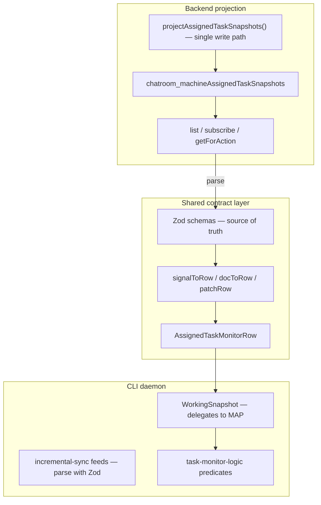

# Assigned Task Monitor — Contract Refactor Plan

**Status:** Phases 0–4 and Phase 7 done; Phase 5 in progress (same PR)  
**Related PRs:** [#779](https://github.com/conradkoh/chatroom/pull/779) (hotfix), `fe9ebb888` (incremental migration)  
**Last updated:** 2026-07-01

---

## Purpose

This document captures the production bug, root cause, hotfix, and a **full refactor plan** to prevent recurrence. It is the canonical reference for consolidating assigned-task monitor types, merge logic, and CLI ↔ backend contracts.

**Companion docs:**

- [packages/cli/src/infrastructure/incremental-sync/README.md](../../packages/cli/src/infrastructure/incremental-sync/README.md) — transport + `WorkingSnapshot` pattern
- [docs/developer/application/convex-daemon-incremental-sync.md](../developer/application/convex-daemon-incremental-sync.md) — pointer to the above
- [docs/conventions/domain-models.md](../conventions/domain-models.md) — zod-as-source-of-truth pattern

---

## Incident summary

### Symptom

Chatroom messages that create tasks (`messages.sendMessage`) were not picked up by a running daemon. Tasks stayed `pending` forever even though the backend projection and signal subscription were working.

### Commits involved

| Commit      | What it did                                                                                                                                                  |
| ----------- | ------------------------------------------------------------------------------------------------------------------------------------------------------------ |
| `fe9ebb888` | Replaced 15s `listAssignedTasksForReconcile` polling with write-time projection (`chatroom_machineAssignedTaskSnapshots`) + WS signal/presence subscriptions |
| `0d03b48ab` | Hotfix: build snapshot rows from first-seen signals; extend `AssignedTaskSignal` with bootstrap fields                                                       |

### Root cause (not “incremental sync is bad”)

`fe9ebb888` removed **two safety nets** without replacing them:

1. **15s reconcile poll** — periodically `replaceAll`’d the working snapshot from Convex (good to remove for perf).
2. **Cold hydrate on unknown signal** — `runDualChannelFeedLive` refetched reconcile rows when `mergeSignal` returned `undefined` (removed when task monitor stopped using `runDualChannelFeedLive`).

After the migration, task monitor called `mergeSignal` directly:

```typescript
// packages/cli/src/commands/machine/daemon-start/task-monitor.ts (pre-hotfix)
onItem: ({ item: signal, ack }) =>
  Effect.gen(function* () {
    ack();
    const row = snapshot.mergeSignal(signal);
    if (!row) return; // ← silently dropped first-seen tasks
    runMonitorPass([row], 'signal');
  }),
```

And merge explicitly dropped unknown rows:

```typescript
// packages/cli/src/commands/machine/daemon-start/task-monitor-snapshot.ts (pre-hotfix)
if (!existing) {
  return undefined;
}
```

**The README and `dual-channel-feed.ts` still documented cold hydrate as canonical** — production diverged from the library.

### Hotfix (`0d03b48ab`)

- `mergeSignalIntoTaskSnapshot` constructs a minimal row when `existing` is undefined.
- `AssignedTaskSignal` gains required bootstrap fields: `agentHarness`, `createdAt` (+ optional `workingDir`, `assignedTo`).
- `snapshotDocToSignal` maps those fields from the projection doc.
- Integration + contract tests for `sendMessage` → signal → daemon merge.

The hotfix is correct but **duplicates knowledge** across backend mappers and CLI merge logic.

---

## Current fragmentation

### Four representations of “the same task”

| Shape                      | Location                                                                      | Role                              |
| -------------------------- | ----------------------------------------------------------------------------- | --------------------------------- |
| `SnapshotDoc`              | `services/backend/convex/schema.ts` → `chatroom_machineAssignedTaskSnapshots` | Durable projection row            |
| `AssignedTaskSnapshotView` | `assigned-tasks-types.ts`                                                     | Hydrate + daemon working snapshot |
| `AssignedTaskSignal`       | `assigned-tasks-types.ts`                                                     | WS incremental delta              |
| `AssignedTaskView`         | `assigned-tasks-types.ts`                                                     | Action fetch (+ `taskContent`)    |

### Three backend mappers (CLI has a fourth)

| Function                      | File                                        | Output                                                         |
| ----------------------------- | ------------------------------------------- | -------------------------------------------------------------- |
| `snapshotDocToView`           | `machine-assigned-task-snapshot-sync.ts`    | `AssignedTaskSnapshotView`                                     |
| `snapshotDocToSignal`         | `machine-assigned-task-snapshot-sync.ts`    | `AssignedTaskSignal`                                           |
| `snapshotDocToPresenceSignal` | `machine-assigned-task-snapshot-sync.ts`    | `AssignedTaskPresenceSignal`                                   |
| `mergeSignalIntoTaskSnapshot` | `packages/cli/.../task-monitor-snapshot.ts` | Reconstructs view from signal (**duplicated field knowledge**) |

### Projection sync fan-out (easy to miss new paths)

`syncChatroomAssignedTaskSnapshots` is invoked from many mutation paths:

| File                                                                                  | Trigger                 |
| ------------------------------------------------------------------------------------- | ----------------------- |
| `services/backend/src/domain/usecase/task/create-task.ts`                             | Task created            |
| `services/backend/src/domain/usecase/task/transition-task.ts`                         | Task status change      |
| `services/backend/src/domain/usecase/agent/start-agent.ts`                            | Agent start             |
| `services/backend/src/domain/usecase/agent/stop-agent.ts`                             | Agent stop              |
| `services/backend/src/domain/usecase/agent/agent-exited.ts`                           | Agent exit              |
| `services/backend/src/domain/usecase/agent/restart-offline-agents-on-user-message.ts` | User message restart    |
| `services/backend/src/domain/usecase/team/update-team.ts`                             | Team config change      |
| `services/backend/convex/participants.ts`                                             | Participant join/action |
| `services/backend/convex/machines.ts`                                                 | Machine mutations       |
| `services/backend/convex/agentResumeStorm.ts`                                         | Resume storm            |

`fe9ebb888` follow-up fixes (“close snapshot sync gaps”) are evidence this scatter is fragile.

### Library vs consumer divergence

| Layer                                | Unknown-row behavior                                                  |
| ------------------------------------ | --------------------------------------------------------------------- |
| `dual-channel-feed.ts`               | `mergeSignal` → if undefined → `hydrateFromReconcile()` → merge again |
| `incremental-sync/README.md`         | Documents cold hydrate                                                |
| `task-monitor.ts` (post-`fe9ebb888`) | Direct `mergeSignal`; no cold hydrate; no reconcile poll              |

### Type semantics gap

`AssignedTaskSignal` was originally a **patch DTO** (only changed fields). After the hotfix it is also a **bootstrap DTO** (must create a row alone). TypeScript did not enforce “signal has enough fields to bootstrap” until fields were marked required — and CLI merge still hand-assembles the row.

---

## Target architecture



### Design principles

1. **One canonical row type** for daemon monitor logic (`AssignedTaskMonitorRow` — may alias `AssignedTaskSnapshotView` initially).
2. **One merge module** owns all doc ↔ row ↔ signal conversions (backend pure functions; CLI imports them).
3. **Zod at the wire boundary** — parse subscribe/hydrate responses in CLI; optional validate in backend queries.
4. **Explicit bootstrap vs patch** — either typed separately or documented + tested that every signal is bootstrap-capable.
5. **Contract tests** gate releases — “empty hydrate + sendMessage + merge” must pass in CI.
6. **Centralize projection writes** — reduce fan-out `syncChatroomAssignedTaskSnapshots` calls over time.

---

## Phased implementation plan

### Phase 0 — Done (hotfix, PR #779)

**Goal:** Stop production data loss.

**Changes (already merged or in PR):**

| File                                                                                      | Change                                        |
| ----------------------------------------------------------------------------------------- | --------------------------------------------- |
| `packages/cli/src/commands/machine/daemon-start/task-monitor-snapshot.ts`                 | Build row when `existing` is undefined        |
| `services/backend/src/domain/usecase/machine/assigned-tasks-types.ts`                     | Add bootstrap fields to `AssignedTaskSignal`  |
| `services/backend/src/domain/usecase/machine/machine-assigned-task-snapshot-sync.ts`      | Map bootstrap fields in `snapshotDocToSignal` |
| `packages/cli/src/commands/machine/daemon-start/task-monitor-snapshot.test.ts`            | Assert construct-on-first-seen                |
| `packages/cli/src/commands/machine/daemon-start/task-monitor-send-message-signal.test.ts` | CLI contract test via `snapshotDocToSignal`   |
| `services/backend/tests/integration/subscribe-assigned-task-signals.spec.ts`              | `sendMessage` after empty baseline            |
| `services/backend/src/domain/usecase/machine/assigned-tasks-core.test.ts`                 | Fixture fields for required signal props      |

---

### Phase 1 — Done (centralize merge logic)

**Goal:** Delete duplicated field assembly in CLI; single function for signal → row.

**New file:**

```
services/backend/src/domain/usecase/machine/assigned-task-monitor-row.ts
```

**Contents (sketch):**

```typescript
/**
 * Canonical merge + projection helpers for daemon assigned-task monitor rows.
 * Pure functions — safe for CLI import.
 */

import type {
  AssignedTaskSignal,
  AssignedTaskSnapshotView,
  AssignedTaskPresenceSignal,
} from './assigned-tasks-types';
import type { Doc } from '../../../../convex/_generated/dataModel';

export type AssignedTaskMonitorRow = AssignedTaskSnapshotView;

/** Full row from projection doc (hydrate path). */
export function monitorRowFromSnapshotDoc(
  doc: Doc<'chatroom_machineAssignedTaskSnapshots'>
): AssignedTaskMonitorRow {
  // Move logic from snapshotDocToView OR delegate to it
}

/** Bootstrap or patch: always returns a row when signal is valid. */
export function applyAssignedTaskSignal(
  existing: AssignedTaskMonitorRow | undefined,
  signal: AssignedTaskSignal
): AssignedTaskMonitorRow {
  if (!existing) {
    return bootstrapMonitorRowFromSignal(signal);
  }
  return patchMonitorRowFromSignal(existing, signal);
}

export function bootstrapMonitorRowFromSignal(signal: AssignedTaskSignal): AssignedTaskMonitorRow {
  return {
    taskId: signal.taskId,
    chatroomId: signal.chatroomId,
    status: signal.status,
    assignedTo: signal.assignedTo,
    updatedAt: signal.createdAt,
    createdAt: signal.createdAt,
    agentConfig: {
      role: signal.role,
      machineId: '', // TODO: add machineId to signal or drop from row predicate paths
      agentHarness: signal.agentHarness,
      workingDir: signal.workingDir,
      spawnedAgentPid: signal.spawnedAgentPid,
      desiredState: signal.desiredState,
    },
    participant: {
      lastSeenAction: signal.lastSeenAction ?? null,
      lastSeenAt: null,
      lastStatus: null,
    },
  };
}

export function patchMonitorRowFromSignal(
  existing: AssignedTaskMonitorRow,
  signal: AssignedTaskSignal
): AssignedTaskMonitorRow {
  return {
    ...existing,
    status: signal.status,
    agentConfig: {
      ...existing.agentConfig,
      spawnedAgentPid: signal.spawnedAgentPid ?? existing.agentConfig.spawnedAgentPid,
      desiredState: signal.desiredState ?? existing.agentConfig.desiredState,
    },
    participant: {
      lastSeenAction: signal.lastSeenAction ?? existing.participant?.lastSeenAction ?? null,
      lastSeenAt: existing.participant?.lastSeenAt ?? null,
      lastStatus: existing.participant?.lastStatus ?? null,
    },
  };
}

export function applyAssignedTaskPresence(
  existing: AssignedTaskMonitorRow | undefined,
  presence: AssignedTaskPresenceSignal
): AssignedTaskMonitorRow | undefined {
  if (!existing) return undefined;
  return {
    ...existing,
    participant: {
      lastSeenAction: presence.lastSeenAction ?? existing.participant?.lastSeenAction ?? null,
      lastSeenAt: presence.lastSeenAt,
      lastStatus: existing.participant?.lastStatus ?? null,
    },
  };
}
```

**Files to change:**

| File                                                                                      | Action                                                                                |
| ----------------------------------------------------------------------------------------- | ------------------------------------------------------------------------------------- |
| `services/backend/src/domain/usecase/machine/assigned-task-monitor-row.ts`                | **Create** — merge module                                                             |
| `services/backend/src/domain/usecase/machine/assigned-task-monitor-row.test.ts`           | **Create** — unit tests for bootstrap, patch, presence                                |
| `services/backend/src/domain/usecase/machine/machine-assigned-task-snapshot-sync.ts`      | Delegate `snapshotDocToView` internals to `monitorRowFromSnapshotDoc` if useful       |
| `packages/cli/src/commands/machine/daemon-start/task-monitor-snapshot.ts`                 | Replace inline merge with `applyAssignedTaskSignal` / `applyAssignedTaskPresence`     |
| `packages/cli/src/commands/machine/daemon-start/task-monitor-snapshot.test.ts`            | Keep behavior tests; optionally slim down                                             |
| `packages/cli/src/commands/machine/daemon-start/task-monitor-send-message-signal.test.ts` | Import merge from backend module instead of re-testing via `snapshotDocToSignal` only |

**Acceptance criteria:**

- [x] No field assembly logic remains in `task-monitor-snapshot.ts` except wiring to `WorkingSnapshot`
- [x] Bootstrap + patch paths tested with minimal + full signals
- [x] Patch preserves `createdAt`, `lastSeenAt`, `workingDir` on partial signals

---

### Phase 2 — Done (Zod contracts at CLI ↔ backend boundary)

**Goal:** Runtime validation; single source of truth per [domain-models convention](../conventions/domain-models.md).

**New file:**

```
services/backend/src/domain/usecase/machine/assigned-task-monitor-contract.ts
```

**Contents (sketch):**

```typescript
import { z } from 'zod';

/** Fields required to bootstrap a daemon working row from a signal alone. */
export const assignedTaskSignalBootstrapFields = {
  taskId: z.string(),
  chatroomId: z.string(),
  role: z.string(),
  status: z.enum(['pending', 'acknowledged', 'in_progress']),
  signalType: z.enum(['task', 'agent_config']),
  revisionKey: z.string(),
  agentHarness: z.string(),
  createdAt: z.number(),
  workingDir: z.string().optional(),
  assignedTo: z.string().optional(),
  lastSeenAction: z.string().nullable().optional(),
  spawnedAgentPid: z.number().optional(),
  desiredState: z.string().optional(),
  sessionAugmentation: z.enum(['none', 'compact', 'new_session']).optional(),
} as const;

export const assignedTaskSignalSchema = z.object(assignedTaskSignalBootstrapFields);

export const assignedTaskMonitorRowSchema = z.object({
  taskId: z.string(),
  chatroomId: z.string(),
  status: z.string(),
  assignedTo: z.string().optional(),
  updatedAt: z.number(),
  createdAt: z.number(),
  agentConfig: z.object({
    role: z.string(),
    machineId: z.string(),
    agentHarness: z.string(),
    model: z.string().optional(),
    workingDir: z.string().optional(),
    spawnedAgentPid: z.number().optional(),
    desiredState: z.string().optional(),
    circuitState: z.string().optional(),
  }),
  participant: z
    .object({
      lastSeenAction: z.string().nullable(),
      lastSeenAt: z.number().nullable(),
      lastStatus: z.string().nullable(),
    })
    .optional(),
});

export type AssignedTaskSignalWire = z.infer<typeof assignedTaskSignalSchema>;
export type AssignedTaskMonitorRowWire = z.infer<typeof assignedTaskMonitorRowSchema>;
```

**Wire-up in CLI feed:**

```typescript
// packages/cli/src/infrastructure/incremental-sync/feeds/assigned-task-signals.ts
import { assignedTaskSignalSchema } from '@workspace/backend/src/domain/usecase/machine/assigned-task-monitor-contract.js';

export const assignedTaskSignalsFeedDef: IncrementalFeedDef<AssignedTaskSignal, ...> = {
  name: 'assigned-task-signals',
  itemKey: (item) => `${item.taskId}:${item.role}`,
  parseItem: (raw) => assignedTaskSignalSchema.parse(raw), // add to IncrementalFeedDef if missing
};
```

**Files to change:**

| File                                                                                 | Action                                                           |
| ------------------------------------------------------------------------------------ | ---------------------------------------------------------------- |
| `services/backend/src/domain/usecase/machine/assigned-task-monitor-contract.ts`      | **Create**                                                       |
| `services/backend/src/domain/usecase/machine/assigned-task-monitor-contract.test.ts` | **Create** — sync test: schema ↔ `assigned-tasks-types.ts`       |
| `services/backend/src/domain/usecase/machine/assigned-tasks-types.ts`                | Derive types from zod (`z.infer`) or keep interfaces + test sync |
| `packages/cli/src/infrastructure/incremental-sync/types.ts`                          | Optional `parseItem` on `IncrementalFeedDef`                     |
| `packages/cli/src/infrastructure/incremental-sync/feeds/assigned-task-signals.ts`    | Parse with zod                                                   |
| `packages/cli/src/infrastructure/incremental-sync/feeds/assigned-task-presence.ts`   | Parse presence signal                                            |
| `packages/cli/src/commands/machine/daemon-start/task-monitor.ts`                     | Parse hydrate `listMachineAssignedTaskSnapshots` rows            |

**Backend query validation (dev-only or always):**

```typescript
// machine-assigned-task-snapshot-read.ts
import { assignedTaskSignalSchema } from './assigned-task-monitor-contract';

const items = page
  .slice(0, limit)
  .map((doc) => assignedTaskSignalSchema.parse(snapshotDocToSignal(doc)));
```

**Acceptance criteria:**

- [x] Invalid backend responses fail loudly in CLI (`parseItem` + `onError`), not silent drop
- [x] Contract test: bootstrap fields covered by `assignedTaskSignalSchema`
- [x] Wire types derived from Zod (`z.infer`) — Phase 7

---

### Phase 3 — Done (contract / integration test suite)

**Goal:** Prevent recurrence of “daemon running + new task” gap.

**New / expanded tests:**

| Test                                              | Location                                   | Scenario                                                                  |
| ------------------------------------------------- | ------------------------------------------ | ------------------------------------------------------------------------- |
| Backend: sendMessage → signal                     | `subscribe-assigned-task-signals.spec.ts`  | ✅ exists (PR #779)                                                       |
| Backend: handoff → signal                         | `subscribe-assigned-task-signals.spec.ts`  | **Add** — planner handoff creates task                                    |
| Backend: queued message → no signal until promote | `subscribe-assigned-task-signals.spec.ts`  | **Add** — documents queue behavior                                        |
| CLI: signal → row → nudge predicate               | `task-monitor-send-message-signal.test.ts` | ✅ exists                                                                 |
| CLI: signal → row → native inject predicate       | `assigned-task-monitor-row.test.ts` or new | **Add**                                                                   |
| Cross: doc → signal → apply → equals doc→view     | `assigned-task-monitor-row.test.ts`        | **Add** round-trip                                                        |
| Presence before signal                            | `task-monitor-snapshot.test.ts`            | **Add** — presence merge with no row returns undefined; signal then fixes |

**Optional golden fixture file:**

```
services/backend/src/domain/usecase/machine/__fixtures__/assigned-task-monitor-signal.json
```

Shared by backend + CLI tests for identical wire payloads.

**CI checklist entry** (add to `incremental-sync/README.md`):

```markdown
- [ ] Empty hydrate + incremental signal creates monitor row (bootstrap)
- [ ] sendMessage integration path emits bootstrap-capable signal
- [ ] applyAssignedTaskSignal ∘ snapshotDocToSignal ≈ monitorRowFromSnapshotDoc (field parity)
```

---

### Phase 4 — Done (cold hydrate fallback)

**Goal:** Pick one unknown-row strategy and enforce it in code.

**Options (choose one):**

| Option                                                 | Pros                            | Cons                                                                      |
| ------------------------------------------------------ | ------------------------------- | ------------------------------------------------------------------------- |
| **A. Bootstrap-capable signals only** (current hotfix) | No extra HTTP on signal path    | Signal payload larger; merge must stay complete                           |
| **B. Cold hydrate in task monitor**                    | Smaller signals; matches README | Rare HTTP refetch; need `listMachineAssignedTaskSnapshots` on unknown row |
| **C. Restore slow reconcile poll**                     | Strongest safety net            | Idle HTTP cost returns                                                    |

**Recommended:** **A + B fallback** — bootstrap from signal first; if merge returns undefined (parse failure / legacy), one-shot hydrate:

```typescript
// packages/cli/src/commands/machine/daemon-start/task-monitor.ts
async function resolveRowForSignal(
  snapshot: ReturnType<typeof createTaskMonitorSnapshot>,
  signal: AssignedTaskSignal,
  session: DaemonSession
): Promise<AssignedTaskSnapshotView | undefined> {
  const merged = snapshot.mergeSignal(signal);
  if (merged) return merged;

  const hydrate = await session.backend.query(api.machines.listMachineAssignedTaskSnapshots, {
    sessionId: session.sessionId,
    machineId: session.machineId,
  });
  snapshot.replaceAll(hydrate.tasks ?? []);
  return snapshot.mergeSignal(signal) ?? snapshot.getBySignal(signal);
}
```

**Files to change:**

| File                                                                              | Action                                               |
| --------------------------------------------------------------------------------- | ---------------------------------------------------- |
| `packages/cli/src/commands/machine/daemon-start/task-monitor.ts`                  | Add `resolveRowForSignal` fallback                   |
| `packages/cli/src/infrastructure/incremental-sync/README.md`                      | Document chosen strategy for task monitor explicitly |
| `packages/cli/src/commands/machine/daemon-start/task-monitor.integration.test.ts` | **Optional** — mock backend, test fallback path      |

---

### Phase 7 — Done (cleanup, same PR)

**Goal:** Shrink net LOC and remove fragmentation left after Phases 1–4 (additive refactor left parallel types/mappers).

| Item                                          | Action                                                                                        | Status |
| --------------------------------------------- | --------------------------------------------------------------------------------------------- | ------ |
| Dead `filterSignalsAfterKey`                  | Remove from `assigned-tasks-core.ts` + test file                                              | done   |
| `snapshotDocToView` passthrough               | Remove; callers use `monitorRowFromSnapshotDoc`                                               | done   |
| Backend double Zod parse                      | `subscribe` path uses `snapshotDocToSignal` only; Zod at CLI wire boundary                    | done   |
| `AssignedTaskMonitorRow` alias                | Remove; use `AssignedTaskSnapshotView`                                                        | done   |
| Duplicate `resolveRowForSignal`               | Extract `resolveSnapshotRowForSignal` in incremental-sync; share with `dual-channel-feed.ts`  | done   |
| `machineId: ''` bootstrap hack                | Add `machineId` to `AssignedTaskSignal` + schema + `snapshotDocToSignal`                      | done   |
| Wire types vs interfaces                      | Derive `AssignedTaskSignal`, presence, snapshot view from Zod; thin `assigned-tasks-types.ts` | done   |
| `snapshotDocToSignal` ↔ bootstrap field drift | Round-trip test + shared `machineId`; doc→row via signal bootstrap where possible             | done   |

**Out of scope for Phase 7:** Phase 5 (projection write centralization) — remains a follow-up.

---

### Phase 5 — Centralize backend projection writes (in progress)

**Goal:** Stop requiring every mutation to remember `syncChatroomAssignedTaskSnapshots`.

**Approach:** Option B (single write usecases) — canonical projection helpers + `patchTeamAgentConfig` for config patches. Convex table triggers deferred.

**Canonical exports** (`machine-assigned-task-snapshot-sync.ts`):

| Name                                          | Alias of                            |
| --------------------------------------------- | ----------------------------------- |
| `projectAssignedTaskSnapshotsForChatroom`     | `syncChatroomAssignedTaskSnapshots` |
| `projectAssignedTaskSnapshotsForMachine`      | `syncMachineAssignedTaskSnapshots`  |
| `projectAssignedTaskSnapshotsAfterTaskChange` | Task status change                  |

**Centralized write helper:** `patch-team-agent-config.ts` — patch + project (machine or chatroom scope).

**Projection sync call-site inventory:**

| Path                                        | Trigger            | Centralized?                                     |
| ------------------------------------------- | ------------------ | ------------------------------------------------ |
| `create-task.ts`                            | Task created       | ✅ `projectAssignedTaskSnapshotsForChatroom`     |
| `transition-task.ts`                        | Task status change | ✅ `projectAssignedTaskSnapshotsAfterTaskChange` |
| `patch-team-agent-config.ts`                | Config patch       | ✅ new helper                                    |
| `start-agent.ts`                            | Agent start        | ✅ project at end of usecase                     |
| `stop-agent.ts`                             | Agent stop         | ✅ via `patchTeamAgentConfig`                    |
| `agent-exited.ts`                           | PID clear          | ✅ via `patchTeamAgentConfig`                    |
| `restart-offline-agents-on-user-message.ts` | Offline restart    | ✅ project at end                                |
| `update-team.ts`                            | Team switch        | ⏳ machine-scoped rebuild loop                   |
| `participants.ts` join                      | Circuit reset      | ✅ via `patchTeamAgentConfig`                    |
| `participants.ts` join                      | Presence           | ✅ `syncParticipantPresenceOnSnapshots`          |
| `machines.ts` updateSpawnedAgent            | PID recorded       | ✅ via `patchTeamAgentConfig`                    |
| `machines.ts` saveTeamAgentConfig           | Config upsert      | ⏳ manual project after upsert                   |
| `machines.ts` daemon startup                | Backfill           | ⏳ `syncMachineAssignedTaskSnapshotsMutation`    |
| `agentResumeStorm.ts`                       | Storm abort        | ✅ via `patchTeamAgentConfig`                    |

**Acceptance criteria:**

- [x] Inventory of projection sync call sites documented
- [x] Integration tests no longer call `syncMachineSnapshots` after `createTask` / `sendMessage` (write-time projection)
- [ ] All `chatroom_teamAgentConfigs` patches route through `patchTeamAgentConfig` or documented exceptions

---

### Phase 6 — Optional shared package

If CLI importing from `services/backend/src/...` becomes awkward (bundling, circular deps), extract:

```
packages/assigned-task-monitor-contract/
  package.json
  src/
    schemas.ts       # zod
    merge.ts         # applyAssignedTaskSignal, etc.
    types.ts         # z.infer exports
```

Both `@workspace/backend` and `chatroom-cli` depend on it.

**When to do this:** Only if Phase 1–2 cause import pain or webapp needs the same contracts.

---

## File inventory (all touched / to touch)

### CLI

| Path                                                                                      | Phase                      |
| ----------------------------------------------------------------------------------------- | -------------------------- |
| `packages/cli/src/commands/machine/daemon-start/task-monitor.ts`                          | 0 ✅, 4                    |
| `packages/cli/src/commands/machine/daemon-start/task-monitor-snapshot.ts`                 | 0 ✅, 1                    |
| `packages/cli/src/commands/machine/daemon-start/task-monitor-snapshot.test.ts`            | 0 ✅, 1, 3                 |
| `packages/cli/src/commands/machine/daemon-start/task-monitor-send-message-signal.test.ts` | 0 ✅, 1                    |
| `packages/cli/src/commands/machine/daemon-start/task-monitor-logic.ts`                    | — (consumes row type only) |
| `packages/cli/src/infrastructure/incremental-sync/feeds/assigned-task-signals.ts`         | 2                          |
| `packages/cli/src/infrastructure/incremental-sync/feeds/assigned-task-presence.ts`        | 2                          |
| `packages/cli/src/infrastructure/incremental-sync/types.ts`                               | 2                          |
| `packages/cli/src/infrastructure/incremental-sync/README.md`                              | 3, 4                       |

### Backend

| Path                                                                                 | Phase                            |
| ------------------------------------------------------------------------------------ | -------------------------------- |
| `services/backend/convex/schema.ts`                                                  | 5 (if projection schema changes) |
| `services/backend/convex/machines.ts`                                                | 2 (returns validators)           |
| `services/backend/src/domain/usecase/machine/assigned-tasks-types.ts`                | 0 ✅, 2                          |
| `services/backend/src/domain/usecase/machine/assigned-tasks-core.ts`                 | —                                |
| `services/backend/src/domain/usecase/machine/assigned-tasks-revision.ts`             | —                                |
| `services/backend/src/domain/usecase/machine/machine-assigned-task-snapshot-sync.ts` | 0 ✅, 1, 5                       |
| `services/backend/src/domain/usecase/machine/machine-assigned-task-snapshot-read.ts` | 2                                |
| `services/backend/src/domain/usecase/machine/assigned-task-monitor-row.ts`           | 1 **new**                        |
| `services/backend/src/domain/usecase/machine/assigned-task-monitor-contract.ts`      | 2 **new**                        |
| `services/backend/src/domain/usecase/task/create-task.ts`                            | 5                                |
| `services/backend/tests/integration/subscribe-assigned-task-signals.spec.ts`         | 0 ✅, 3                          |

### Docs

| Path                                                           | Phase              |
| -------------------------------------------------------------- | ------------------ |
| `docs/design/assigned-task-monitor-contract-refactor-plan.md`  | This file          |
| `docs/developer/application/convex-daemon-incremental-sync.md` | 4 — link here      |
| `docs/conventions/domain-models.md`                            | — (reference only) |

---

## Open questions / follow-ups

1. **`machineId` on bootstrap row** — Resolved in Phase 7: `AssignedTaskSignal` includes `machineId` from projection doc.
2. **Presence-before-signal race** — `mergePresence` still no-ops without a row. Is signal always guaranteed first in production ordering?
3. **Queued messages** — No task/signal until promotion. Document in UI/docs so users know daemon won't react until queue drains?
4. **Reconcile poll** — Fully removed. Confirm presence channel covers all nudge timing edge cases without 15s full refresh.

---

## Implementation checklist (copy for PR)

```markdown
### Phase 1–4 — Done

- [x] `assigned-task-monitor-row.ts` + tests; CLI delegates merge
- [x] `assigned-task-monitor-contract.ts` + Zod parse at CLI wire boundary
- [x] Integration tests (sendMessage, handoff, queued message, presence-before-signal)
- [x] Cold hydrate fallback in `task-monitor.ts`

### Phase 7 — Cleanup (this PR)

- [x] Remove dead `filterSignalsAfterKey`
- [x] Remove `snapshotDocToView` passthrough
- [x] Remove backend subscribe-path Zod re-parse
- [x] Add `machineId` to signal bootstrap path
- [x] Derive wire types from Zod schemas
- [x] Shared `resolveSnapshotRowForSignal` (dual-channel + task monitor)
- [x] Drop `AssignedTaskMonitorRow` alias

### Phase 5 — Projection centralization (in progress)

- [x] Canonical `projectAssignedTaskSnapshots*` exports
- [x] `patchTeamAgentConfig` helper for config patches + projection
- [x] Agent stop/exit/resume-storm + `updateSpawnedAgent` use centralized writes
- [x] Integration tests rely on write-time projection (no manual sync after createTask)
- [ ] Remaining `machines.ts` config upsert paths
- [ ] `update-team.ts` machine rebuild loop
```

---

## References

- Hotfix PR: https://github.com/conradkoh/chatroom/pull/779
- Incremental migration: `fe9ebb8886409cad4cf62dd652965b8349e1da20`
- `dual-channel-feed.ts` cold hydrate: `resolveRowForSignal` (lines 70–77)
- Pre-migration task monitor used `runDualChannelFeedLive` + `listAssignedTasksForReconcile`
