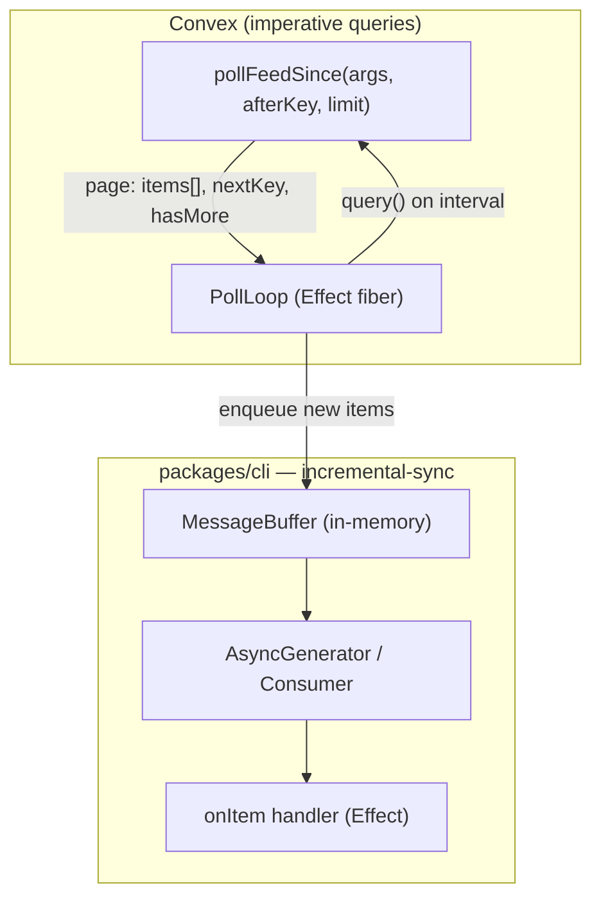

# Incremental Sync Feed — Daemon Polling Layer

**Status:** Proposal — for review
**Date:** 2026-06-28
**Motivation:** [getAssignedTasks bandwidth](../../services/backend/src/domain/usecase/machine/get-assigned-tasks.ts), file-tree heartbeat (~1GB/day), commit-detail re-fetch churn

---

## 1. Problem

The machine daemon (and some webapp paths) use Convex **reactive subscriptions** (`wsClient.onUpdate`) against queries that return **full snapshots**. Convex re-runs the query and **re-pushes the entire JSON result** whenever **any document read by the query** changes — even fields the consumer does not use.

We have hit this repeatedly:

| Surface                     | Symptom                                                                | Prior mitigation                                                                        |
| --------------------------- | ---------------------------------------------------------------------- | --------------------------------------------------------------------------------------- |
| `machines:getAssignedTasks` | Full `task.content` re-sent on every participant heartbeat (~30s/role) | Analysis only (Jun 2026)                                                                |
| File-tree push (legacy)     | ~1GB/day/user heartbeat pushes                                         | Replaced with reactive _pending-requests_ subscription                                  |
| `listMachines` / models     | No-op writes invalidated subscriptions                                 | `upsertMachineModels` deep-equality skip                                                |
| Commit detail sync          | Re-fetching known SHAs                                                 | Daemon-lifetime `seenShas` cache                                                        |
| Message timeline (webapp)   | Full window re-sent on edits                                           | Split: `subscribeNewMessages` (cursor tail) + `subscribeVisibleMessageUpdates` (deltas) |

**Root pattern:** coupling **high-churn dependency reads** with **large snapshot payloads** in a single reactive query.

Subscriptions are still appropriate when:

- The result set is **small and near-empty** most of the time (e.g. pending file-tree requests).
- The consumer needs **sub-second latency** and the query reads **only the rows that changed**.

For daemon **feeds** (tasks, commands, events, git requests), we want a **durable incremental contract**: poll deltas by cursor, buffer locally, process with explicit handlers.

---

## 2. Goals

1. **Incremental egress only** — each poll returns **new items since `lastSeenKey`**, never a full snapshot re-send.
2. **Stable conventions** — backend query shape + CLI consumer shape are standardized so new feeds do not reinvent polling.
3. **Effect-native** — composable with existing daemon `Effect.gen` wiring, testable layers, scoped resources.
4. **Simple handler authoring** — declare `onItem`; framework owns poll loop, cursor, buffer, dedupe, backoff.
5. **SQS-inspired delivery semantics** — FIFO vs standard, bounded buffer, at-least-once with dedupe, optional visibility / retry.

## Non-goals (this design)

- Replacing Convex subscriptions in the **webapp** real-time UI (keep cursor-based reactive queries where they already work).
- Exactly-once delivery across daemon restarts (at-least-once + idempotent handlers is sufficient for v1).
- Cross-machine fan-out (each daemon process owns its own buffer).

---

## 3. Architecture overview



**Key idea:** the daemon never subscribes to a snapshot query for feeds. It **polls** an imperative `poll*Since` query, advances a **cursor**, and enqueues **only unseen items** into a local buffer. Handlers drain the buffer.

---

## 4. Core types

### 4.1 Cursor (`StreamKey`)

A cursor is an **opaque, comparable, monotonic** key. The feed definition owns encoding.

```typescript
/** Opaque cursor carried across polls. Serialized to string for logs/persistence. */
export type StreamKey = string;

export interface PollPage<TItem> {
  readonly items: readonly TItem[];
  /** Greatest key in this page (used to advance cursor when items non-empty). */
  readonly highKey: StreamKey | null;
  readonly hasMore: boolean;
}

export interface PollRequest<TArgs> {
  readonly args: TArgs;
  readonly afterKey: StreamKey | null;
  readonly limit: number;
}
```

**Standard key strategies** (pick one per feed):

| Strategy                          | Example               | Backend index              |
| --------------------------------- | --------------------- | -------------------------- |
| `_creationTime` + `_id` tie-break | `"1700000000123:abc"` | `by_chatroom` + time range |
| Monotonic sequence                | `"42"`                | `by_machine_seq`           |
| Content hash / version            | `"v3"`                | snapshot revision row      |

Convention: `afterKey` is **exclusive** — poll returns items **strictly after** the key (matches `messageList.fetchMessagesStrictlyAfter`).

### 4.2 Feed definition

```typescript
export interface IncrementalFeedDef<TItem, TArgs> {
  readonly name: string;
  /** Imperative Convex query — NOT a reactive subscription target. */
  readonly poll: (req: PollRequest<TArgs>) => Promise<PollPage<TItem>>;
  /** Stable identity for dedupe + FIFO ordering. */
  readonly itemKey: (item: TItem) => StreamKey;
  /** Optional: extract cursor from item when highKey not provided by backend. */
  readonly itemToKey?: (item: TItem) => StreamKey;
}
```

### 4.3 Buffer config (SQS-inspired)

```typescript
export type DeliveryMode = 'fifo' | 'standard';

export interface BufferConfig {
  /** Max items retained; oldest dropped (or poll backpressure — see §6). */
  readonly maxSize: number;
  /** fifo: single worker, strict key order. standard: parallel workers allowed. */
  readonly deliveryMode: DeliveryMode;
  /** Drop duplicate itemKey while still in buffer or recently acked (default: true). */
  readonly dedupe?: boolean;
  /** How long to suppress re-delivery after ack (ms). 0 = until removed from buffer only. */
  readonly dedupeTtlMs?: number;
  /** standard mode only: max concurrent handler invocations. */
  readonly maxConcurrency?: number;
}
```

| SQS concept        | Our analogue                                                   |
| ------------------ | -------------------------------------------------------------- |
| Queue              | `MessageBuffer` per feed instance                              |
| Message ID         | `itemKey(item)`                                                |
| FIFO queue         | `deliveryMode: 'fifo'` + single consumer fiber                 |
| Standard queue     | `deliveryMode: 'standard'` + `maxConcurrency`                  |
| Visibility timeout | Optional `inFlightTtlMs` — re-enqueue if handler has not acked |
| Dead-letter queue  | Optional `onPoison` after `maxAttempts` (v2)                   |

### 4.4 Handler

```typescript
export interface FeedHandlerContext<TItem> {
  readonly item: TItem;
  readonly feedName: string;
  /** Call when side effects are durably applied (removes from in-flight set). */
  readonly ack: () => void;
  readonly nack: (opts?: { requeue?: boolean }) => void;
}

export type FeedItemHandler<TItem, R = void> = (
  ctx: FeedHandlerContext<TItem>
) => Effect.Effect<R, unknown, never>;
```

Handlers are **Effect** workflows — same as existing daemon handlers (`onRequestStartAgentEffect`, etc.).

---

## 5. Runtime components (CLI package)

Proposed location: `packages/cli/src/infrastructure/incremental-sync/`

```
incremental-sync/
  types.ts              # StreamKey, PollPage, configs
  message-buffer.ts     # in-memory queue + dedupe + fifo/standard
  poll-loop.ts          # Effect fiber: interval, backoff, cursor advance
  feed-runtime.ts       # wires poll + buffer + worker(s)
  async-iterable.ts     # AsyncGenerator adapter over buffer
  layers.ts             # Effect Context.Tag services for tests
  feeds/                # per-domain feed defs (thin)
    assigned-tasks.ts
    commands.ts
    ...
```

### 5.1 `MessageBuffer`

Responsibilities:

- `enqueue(items)` — insert if `itemKey` not in `seen` / in-flight (per dedupe config).
- `dequeue()` — fifo: smallest key; standard: any head.
- Bounded: when `size > maxSize`, drop **oldest unacked** (log warning) or signal backpressure to poll loop.
- Track `inFlight` with optional timeout → re-enqueue.

### 5.2 `PollLoop` (Effect)

```typescript
export interface PollLoopConfig {
  readonly intervalMs: number;
  readonly limit: number;
  readonly backoff: { readonly initialMs: number; readonly maxMs: number };
}

export const makePollLoop = <TItem, TArgs>(
  def: IncrementalFeedDef<TItem, TArgs>,
  args: TArgs,
  buffer: MessageBuffer<TItem>,
  config: PollLoopConfig
): Effect.Effect<never, never, PollClock | BackendQuery> =>
  Effect.gen(function* () {
    let afterKey: StreamKey | null = null;
    let backoffMs = config.intervalMs;

    while (true) {
      const page = yield* Effect.tryPromise(() =>
        def.poll({ args, afterKey, limit: config.limit })
      );

      if (page.items.length > 0) {
        buffer.enqueue(page.items);
        afterKey = page.highKey ?? buffer.highKeyOf(page.items);
        backoffMs = config.intervalMs; // reset on progress
      } else if (!page.hasMore) {
        backoffMs = config.intervalMs;
      }

      yield* PollClock.sleep(backoffMs);

      // On error: exponential backoff (cap maxMs), do not advance cursor.
    }
  });
```

Poll uses **`client.query()`** (HTTP), not `onUpdate`. Each response is **one page of deltas**.

### 5.3 Async generator surface

For consumers that prefer iteration over callback handlers:

```typescript
export async function* drainFeed<TItem>(
  buffer: MessageBuffer<TItem>,
  signal?: AbortSignal
): AsyncGenerator<TItem, void, undefined> {
  while (!signal?.aborted) {
    const item = buffer.waitDequeue(signal); // Promise + notify on enqueue
    if (item === null) return;
    yield item;
  }
}
```

The generator is a **thin adapter** over the buffer; the poll loop runs in a sibling Effect fiber.

### 5.4 `runIncrementalFeed` — primary entry point

```typescript
export interface RunFeedOptions<TItem, TArgs> {
  readonly def: IncrementalFeedDef<TItem, TArgs>;
  readonly args: TArgs;
  readonly buffer: BufferConfig;
  readonly poll: PollLoopConfig;
  readonly onItem: FeedItemHandler<TItem>;
}

export const runIncrementalFeed = <TItem, TArgs>(
  opts: RunFeedOptions<TItem, TArgs>
): Effect.Effect<FeedHandle, never, BackendQuery | PollClock> =>
  Effect.gen(function* () {
    const buffer = new MessageBuffer(opts.buffer, opts.def.itemKey);
    const pollFiber = yield* Effect.fork(makePollLoop(opts.def, opts.args, buffer, opts.poll));
    const workerFiber = yield* Effect.fork(runWorkers(buffer, opts));

    return {
      stop: () => Effect.all([Fiber.interrupt(pollFiber), Fiber.interrupt(workerFiber)]),
      buffer,
      /** Optional: expose async iterable for tests/tools */
      stream: (signal?: AbortSignal) => drainFeed(buffer, signal),
    };
  });
```

**Authoring example** (target ergonomics):

```typescript
export const startAssignedTaskFeedEffect = Effect.gen(function* () {
  const session = yield* DaemonSessionService;

  const handle = yield* runIncrementalFeed({
    def: assignedTaskSignalsFeed,
    args: { sessionId: session.sessionId, machineId: session.machineId },
    buffer: { maxSize: 200, deliveryMode: 'fifo', dedupe: true },
    poll: { intervalMs: 2_000, limit: 50, backoff: { initialMs: 1_000, maxMs: 30_000 } },
    onItem: ({ item, ack }) =>
      Effect.gen(function* () {
        yield* processAssignedTaskSignal(item);
        ack();
      }),
  });

  return handle;
});
```

---

## 6. Backend conventions

Every daemon feed gets **two** queries:

| Query                        | Purpose                            | Reactive?     |
| ---------------------------- | ---------------------------------- | ------------- |
| `getFeedSnapshot` (optional) | Initial hydrate / recovery         | No — one-shot |
| `pollFeedSince`              | `{ afterKey, limit }` → `PollPage` | No — polled   |

### 6.1 `pollFeedSince` contract

```typescript
// Example: services/backend/convex/machines.ts
export const pollAssignedTaskSignalsSince = query({
  args: {
    ...SessionIdArg,
    machineId: v.string(),
    afterKey: v.optional(v.string()), // exclusive cursor
    limit: v.number(),
  },
  handler: async (ctx, args) => {
    // Return SMALL signal rows only — not full task.content
    // {
    //   items: AssignedTaskSignal[],
    //   highKey: string | null,
    //   hasMore: boolean,
    // }
  },
});
```

**Payload rules:**

1. **Signal / delta rows** — IDs + volatile fields only (status, role, compressContext, timestamps).
2. **No embedded large blobs** in poll responses — fetch blobs in handler via separate one-shot query if needed.
3. **Index-backed range scan** on the cursor field — no full-table collect in poll path.
4. **Do not read high-churn tables** unrelated to new items (e.g. do not join participant heartbeats into a task list poll).

### 6.2 Snapshot vs delta split

Mirror the webapp message pattern (`messageList.ts`):

- **Snapshot** — rare, imperative, may be larger.
- **Delta poll** — frequent, tiny, cursor-scoped.

For `getAssignedTasks`, snapshot might hydrate current active task IDs; polls deliver `task.activated` / `task.statusChanged` signals only.

---

## 7. Comparison: subscription vs incremental feed

|               | Convex `onUpdate`              | Incremental feed        |
| ------------- | ------------------------------ | ----------------------- |
| Trigger       | Any dependency doc changes     | Timer + backoff         |
| Payload       | Full query result              | One delta page          |
| Latency       | Lowest                         | `intervalMs` (tunable)  |
| Bandwidth     | High for large snapshots       | Bounded per poll        |
| Handler model | Callback on every invalidation | Queue + worker          |
| Best for      | Tiny reactive tails            | Daemon feeds, bulk sync |

**Decision rule:** if the query reads **N > 3** documents or returns **> 4KB** routinely, use incremental feed for daemon consumers.

---

## 8. Migration plan

### Phase 0 — Framework + design (this PR)

- [x] Design doc
- [ ] Scaffold `incremental-sync/` types + `MessageBuffer` + tests (no production wiring)

### Phase 1 — Pilot: assigned task signals

- Add `pollAssignedTaskSignalsSince` backend query.
- Replace `task-monitor.ts` `onUpdate(getAssignedTasks)` with `assignedTaskSignalsFeed`.
- Keep `getAssignedTasks` temporarily for debugging; mark deprecated.

### Phase 2 — High-bandwidth daemon subscriptions

| Current subscription         | Replacement                    |
| ---------------------------- | ------------------------------ |
| `getAssignedTasks`           | `pollAssignedTaskSignalsSince` |
| Command stream (if snapshot) | `pollCommandsSince`            |
| Event stream slices          | `pollEventsSince`              |

### Phase 3 — Webapp

Only where imperative + cursor already exists (`getLatestMessages`, `listMessagesBefore`). **Do not** migrate reactive UI tails unless bandwidth metrics justify it.

---

## 9. Open questions

1. **Cursor persistence across daemon restart** — store `lastSeenKey` per feed in local SQLite / file (`~/.chatroom/feeds.json`)? Default v1: restart may re-process recent items (handlers must be idempotent).

2. **Poll interval defaults** — 2s for task signals vs 30s for git metadata? Per-feed `PollLoopConfig`.

3. **Backpressure** — when buffer full, pause poll loop vs drop oldest? Default: pause poll + log metric.

4. **Metrics** — expose `feed.poll.bytes`, `feed.buffer.depth`, `feed.handler.latency` on daemon heartbeat for Convex dashboard correlation.

5. **Shared package?** — if webapp ever needs the same buffer semantics, move types to `packages/shared`; v1 stays CLI-only.

---

## 10. Example: `assignedTaskSignalsFeed` (sketch)

**Signal row** (replaces fat `AssignedTaskView` in poll path):

```typescript
export interface AssignedTaskSignal {
  readonly taskId: Id<'chatroom_tasks'>;
  readonly chatroomId: Id<'chatroom_rooms'>;
  readonly role: string;
  readonly status: 'pending' | 'acknowledged' | 'in_progress';
  readonly compressContext: 'new_session' | 'none';
  readonly revisionKey: string; // `${updatedAt}:${taskId}`
}
```

**Handler** loads details only when acting:

```typescript
onItem: ({ item, ack }) =>
  Effect.gen(function* () {
    const session = yield* DaemonSessionService;
    const full = yield* Effect.tryPromise(() =>
      session.backend.query(api.machines.getAssignedTaskAction, {
        sessionId: session.sessionId,
        taskId: item.taskId,
        role: item.role,
      })
    );
    yield* processTaskAction(full);
    ack();
  }),
```

---

## 11. Testing strategy

| Layer                | Test                                                                       |
| -------------------- | -------------------------------------------------------------------------- |
| `MessageBuffer`      | fifo ordering, dedupe, maxSize eviction, inFlight timeout                  |
| `PollLoop`           | cursor advance, backoff on empty/error, does not skip pages when `hasMore` |
| `runIncrementalFeed` | integration with mocked `poll` returning scripted pages                    |
| Backend `poll*Since` | convex tests: insert rows, poll exclusive cursor, bounded limit            |

Prove correctness **from source + unit tests** before migrating production subscriptions.

---

## 12. References

- `services/backend/convex/messageList.ts` — cursor tail pattern (`subscribeNewMessages`)
- `packages/cli/src/commands/machine/daemon-start/file-tree-subscription.ts` — bandwidth comment
- `packages/cli/src/commands/machine/daemon-start/commit-detail-sync.ts` — `seenShas` cache
- `services/backend/convex/machines.ts` — `upsertMachineModels` no-op write suppression
- `docs/developer/event-handler-structure.md` — handler file conventions
