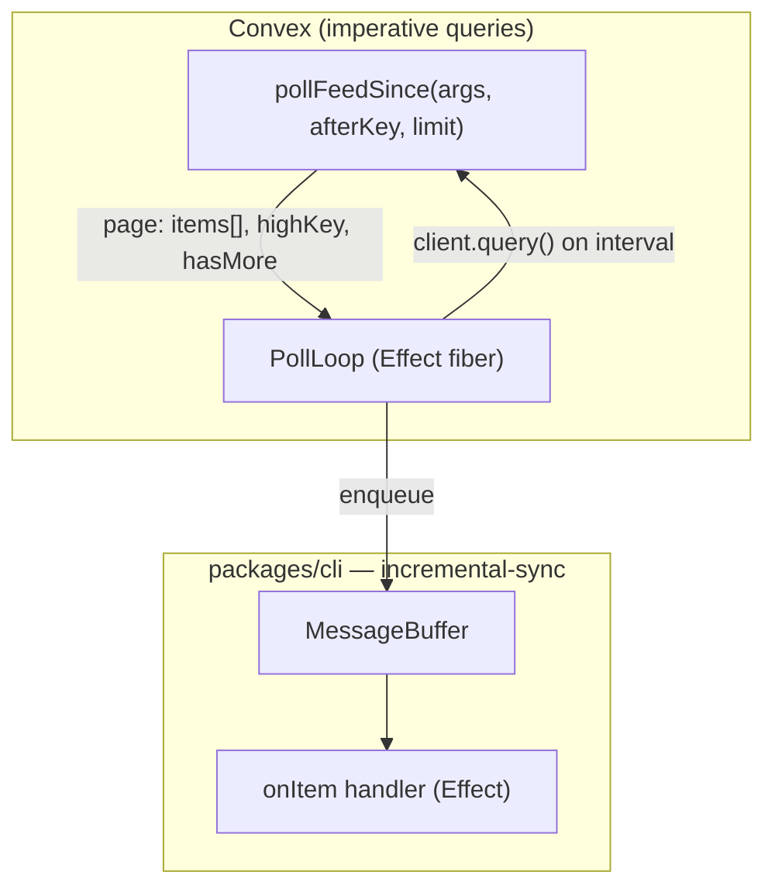

# Incremental Sync Feed — Daemon Polling Layer

**Status:** Implemented (task-monitor pilot, v1.58.0)  
**Date:** 2026-06-28  
**Motivation:** `getAssignedTasks` bandwidth — full `task.content` re-pushed on every participant heartbeat (~30s/role)

---

## 1. Problem

The machine daemon uses Convex **reactive subscriptions** (`wsClient.onUpdate`) against queries that return **full snapshots**. Convex re-runs the query and **re-pushes the entire JSON result** whenever **any document read by the query** changes — even fields the consumer does not use.

| Surface                     | Symptom                                            | Mitigation                               |
| --------------------------- | -------------------------------------------------- | ---------------------------------------- |
| `machines:getAssignedTasks` | Full `task.content` on every participant heartbeat | **Incremental sync** (this doc)          |
| File-tree push (legacy)     | ~1GB/day/user heartbeat pushes                     | Reactive _pending-requests_ subscription |
| `listMachines` / models     | No-op writes invalidated subscriptions             | `upsertMachineModels` deep-equality skip |
| Commit detail sync          | Re-fetching known SHAs                             | Daemon-lifetime `seenShas` cache         |
| Message timeline (webapp)   | Full window re-sent on edits                       | Cursor tail + visible-message deltas     |

**Root pattern:** coupling **high-churn dependency reads** with **large snapshot payloads** in a single reactive query.

Subscriptions remain appropriate when the result set is small, near-empty most of the time, and the query reads only rows that changed. For daemon **feeds** (tasks, commands, events), we use **imperative poll-by-cursor**: small delta pages, local buffer, explicit handlers.

---

## 2. Goals

1. **Incremental egress** — each poll returns **new items since `afterKey`**, not a full snapshot re-send.
2. **Stable conventions** — shared backend query shape + CLI consumer shape for new feeds.
3. **Effect-native** — composable with daemon `Effect.gen` wiring, testable `PollClock` layer.
4. **Simple handler authoring** — declare `onItem`; framework owns poll loop, cursor, buffer, dedupe, backoff.
5. **SQS-inspired delivery** — FIFO vs standard, bounded buffer, at-least-once with dedupe.

**Non-goals (v1):** replacing webapp reactive UI tails; exactly-once across daemon restarts; cross-machine fan-out.

---

## 3. Architecture



Poll uses **`client.query()`** (HTTP), not `onUpdate`. Handlers drain a local buffer; cursor advances on `highKey`.

---

## 4. CLI framework

**Location:** `packages/cli/src/infrastructure/incremental-sync/`

| File                | Role                                                               |
| ------------------- | ------------------------------------------------------------------ |
| `types.ts`          | `StreamKey`, `PollPage`, `IncrementalFeedDef`, buffer/poll configs |
| `message-buffer.ts` | FIFO/standard queue, dedupe, bounded size                          |
| `poll-loop.ts`      | Cursor advance, interval, error backoff, `hasMore` paging          |
| `feed-runtime.ts`   | `runIncrementalFeedLive`, `runReconcilePollLive`                   |
| `layers.ts`         | `PollClock` Effect tag + live layer                                |
| `feeds/*.ts`        | Per-domain feed defs (thin wrappers over Convex queries)           |

**Entry points:** `runIncrementalFeedLive` (signal channel with buffer + worker) and `runReconcilePollLive` (fixed-interval snapshot poll, no buffer).

**Cursor:** `afterKey` is **exclusive** — poll returns items strictly after the key (same convention as `messageList.fetchMessagesStrictlyAfter`).

Types and handler contracts live in source; see `types.ts` rather than duplicating here.

---

## 5. Backend conventions

Every daemon feed should expose:

| Query                              | Purpose                            | Reactive?   |
| ---------------------------------- | ---------------------------------- | ----------- |
| `list*Lite` or snapshot (optional) | Reconcile / initial hydrate        | No — polled |
| `poll*Since`                       | `{ afterKey, limit }` → delta page | No — polled |

**Payload rules:**

1. Poll rows are **signals** — IDs + volatile fields only, no large blobs.
2. Fetch blobs in the handler via a separate one-shot query when acting.
3. **Index-backed** cursor scans — no full-table collect in the poll path.
4. Do not join high-churn unrelated tables into delta polls (e.g. exclude pure `lastSeenAt` heartbeats from signal revision keys; reconcile handles idle).

---

## 6. Shipped: task monitor

Replaces `wsClient.onUpdate(getAssignedTasks)` in `task-monitor.ts`.

```
Signal feed (~2s)              Reconcile poll (~15s)
pollAssignedTaskSignalsSince   listAssignedTasksLite
small deltas                   no task.content
         │                              │
         └──────────┬───────────────────┘
                    ▼
         processTasksUpdate (nudge / revive / inject scans)
                    │ on action only
                    ▼
         getAssignedTaskForAction (includes task.content)
```

### Backend (`services/backend/src/domain/usecase/machine/`)

| Query                             | Convex export                           | Purpose                                                    |
| --------------------------------- | --------------------------------------- | ---------------------------------------------------------- |
| `pollAssignedTaskSignalsSince`    | `machines.pollAssignedTaskSignalsSince` | Delta signals; `revisionKey` excludes pure heartbeat ticks |
| `listAssignedTasksLiteForMachine` | `machines.listAssignedTasksLite`        | Participant staleness for nudge logic                      |
| `getAssignedTaskForAction`        | `machines.getAssignedTaskForAction`     | Full `taskContent` for nudge / revive / inject             |

Shared row collection: `assigned-tasks-core.ts`. Types: `assigned-tasks-types.ts`.

### CLI feed def

`feeds/assigned-task-signals.ts` — `makeAssignedTaskSignalsFeed`, defaults:

- Signal poll: 2s interval, limit 50, fifo buffer max 200
- Reconcile: 15s (matches `PENDING_IDLE_NUDGE_MS`)

### Decisions (v1)

| Topic                             | Choice                                                        |
| --------------------------------- | ------------------------------------------------------------- |
| Cursor persistence across restart | None — handlers idempotent (`NudgeCooldown`, delivery ledger) |
| Participant heartbeats in signals | Excluded from `revisionKey`; reconcile handles idle           |

---

## 7. Subscription vs incremental feed

|           | Convex `onUpdate`          | Incremental feed        |
| --------- | -------------------------- | ----------------------- |
| Trigger   | Any dependency doc changes | Timer + backoff         |
| Payload   | Full query result          | One delta page          |
| Latency   | Lowest                     | `intervalMs` (tunable)  |
| Bandwidth | High for large snapshots   | Bounded per poll        |
| Best for  | Tiny reactive tails        | Daemon feeds, bulk sync |

**Rule of thumb:** if the query reads many documents or returns >4KB routinely, use incremental feed for daemon consumers.

---

## 8. Future feeds

| Current subscription         | Replacement         |
| ---------------------------- | ------------------- |
| Command stream (if snapshot) | `pollCommandsSince` |
| Event stream slices          | `pollEventsSince`   |

Webapp: keep existing cursor-based reactive queries unless bandwidth metrics justify migration.

---

## 9. Open questions

1. **Cursor persistence** — optional `~/.chatroom/feeds.json` per feed for restart dedupe (v2).
2. **Backpressure** — when buffer full: pause poll vs drop oldest (today: drop oldest + warn).
3. **Metrics** — `feed.poll.bytes`, `feed.buffer.depth` on daemon heartbeat for Convex correlation.
4. **Shared package** — move types to `packages/shared` if webapp needs the same buffer semantics.

---

## 10. Testing

| Layer                                                 | Location                                                                |
| ----------------------------------------------------- | ----------------------------------------------------------------------- |
| `MessageBuffer`, `PollLoop`, `runIncrementalFeedLive` | `packages/cli/src/infrastructure/incremental-sync/*.test.ts`            |
| `pollAssignedTaskSignalsSince`                        | `services/backend/tests/integration/poll-assigned-task-signals.spec.ts` |
| Assigned-task core                                    | `assigned-tasks-core.test.ts`                                           |

---

## 11. References

- `packages/cli/src/infrastructure/incremental-sync/` — framework
- `packages/cli/src/commands/machine/daemon-start/task-monitor.ts` — consumer
- `services/backend/src/domain/usecase/machine/assigned-tasks-core.ts` — shared backend logic
- `services/backend/convex/messageList.ts` — cursor tail precedent
- `packages/cli/src/commands/machine/daemon-start/file-tree-subscription.ts` — prior bandwidth fix
- `packages/cli/src/commands/machine/daemon-start/commit-detail-sync.ts` — `seenShas` cache
