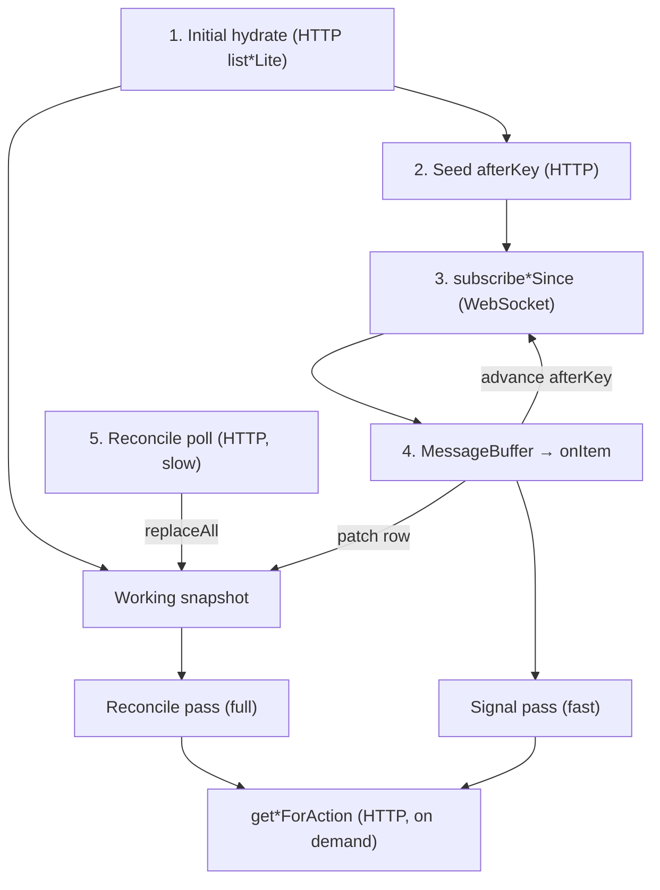

# Convex → Daemon Incremental Sync

Guide for syncing Convex data to the machine daemon without fat reactive snapshots or idle polling.

Use this document when adding or changing a daemon feed (tasks, commands, events, etc.).

---

## Overview

The daemon runs long-lived processes that need timely updates from Convex. Two approaches fail in production:

1. **Fat `onUpdate` on a snapshot query** — Convex re-pushes the full result whenever any dependency document changes (e.g. participant `lastSeenAt` heartbeats), including large fields the consumer never uses.
2. **Fixed-interval HTTP polling** — small responses, but query invocations accrue while idle (~1.3M/month at a 2s interval per daemon).

The standard pattern is **cursor-pinned delta subscription** plus a **consumer working snapshot**:

| Layer         | Location                                                         | Responsibility                                                         |
| ------------- | ---------------------------------------------------------------- | ---------------------------------------------------------------------- |
| **Transport** | `packages/cli/src/infrastructure/incremental-sync/`              | WS subscribe, cursor, `MessageBuffer`, reconcile poll helper           |
| **Consumer**  | Co-located with the subscriber (e.g. `task-monitor-snapshot.ts`) | In-memory lite rows, signal patch vs reconcile replace, handler passes |

**Reference implementation:** `task-monitor.ts` + `task-monitor-snapshot.ts`

---

## When to use this pattern

| Use incremental sync when…                             | Use something else when…                                                                                                |
| ------------------------------------------------------ | ----------------------------------------------------------------------------------------------------------------------- |
| The feed is long-lived and daemon-side                 | The webapp needs sub-second UI reactivity (use cursor queries in `messageList.ts`)                                      |
| Payloads would be large or grow with active work       | The result set is usually empty (e.g. pending file-tree requests — subscribe directly; see `file-tree-subscription.ts`) |
| Dependencies include high-churn fields you do not need | A one-shot fetch is enough                                                                                              |

**Rule of thumb:** if a query routinely reads many documents or returns more than ~4KB, do not put fat snapshots on `onUpdate`. Use delta tails + on-demand fetches for blobs.

---

## Canonical flow

Every new daemon feed should implement these steps:

### Transport (shared framework)

1. **Initial hydrate** — one-shot HTTP `list*Lite` (or equivalent snapshot).
2. **Seed cursor** — one-shot `subscribe*Since` to read current `highKey` so the subscription does not replay history.
3. **Subscribe** — `wsClient.onUpdate(subscribe*Since, { afterKey, … })`. On new items, advance `afterKey` and re-subscribe (`subscribe-loop` drains `hasMore` pages).
4. **Buffer** — `MessageBuffer` decouples transport from handlers; workers call `onItem`; handlers `ack()` only.

### Consumer (per feed — copy from task monitor)

5. **Working snapshot** — in-memory map of lite rows, keyed by stable identity (e.g. `taskId:role`). **Not** source of truth; not durable across restart.
6. **Signal path** — `onItem`: patch snapshot from signal payload → run **signal pass** on affected row(s). No full lite refetch unless the row is unknown (cold hydrate).
7. **Reconcile path** — slow HTTP poll: `replaceAll` snapshot from `list*Lite` → run **reconcile pass** on full snapshot.
8. **Action fetch** — when executing (inject, nudge, etc.), one-shot query for large blobs only.



### Cursor semantics

- `afterKey` is **exclusive** — items strictly **after** the key (same as `messageList.fetchMessagesStrictlyAfter`).
- Pin the cursor so the subscription stays near-empty until something new happens (`subscribeNewMessages` in the webapp uses the same idea).

---

## Consumer pattern: working snapshot

Reusable best practice for any feed that has **signal + reconcile** channels sharing a lite row shape.

### What it is

A `Map<rowKey, LiteRow>` held in the daemon process:

- **Reconcile poll** calls `replaceAll(rows)` from `list*Lite` — Convex is authoritative.
- **Each signal** calls `mergeSignal(signal)` — patch volatile fields the signal carries; **preserve** fields the signal omits (e.g. `lastSeenAt`, `createdAt`).
- **Restart** — snapshot is empty until the next hydrate/reconcile; no disk persistence.

This is **not** a local task store. It is a **working set** between reconcile ticks so signals can drive handlers without refetching the full lite list.

### Row key

Pick a stable key for one logical row in the feed:

```typescript
// task monitor: one row per (taskId, role)
function rowKey(taskId: string, role: string): string {
  return `${taskId}:${role}`;
}
```

Use the same key in `IncrementalFeedDef.itemKey` (signal cursor / dedupe) and in the snapshot map.

### Merge rules

| Source        | Updates                                                               | Preserves from existing lite row                              |
| ------------- | --------------------------------------------------------------------- | ------------------------------------------------------------- |
| **Signal**    | Fields on the signal DTO (status, config deltas, `lastSeenAction`, …) | Timing / heartbeat fields intentionally excluded from signals |
| **Reconcile** | Entire row from `list*Lite`                                           | — (full replace)                                              |

If `mergeSignal` returns `undefined` (no base row), **cold hydrate**: one `list*Lite` fetch, `replaceAll`, merge again. New tasks should be rare on the signal path; avoid refetching on every signal.

### Split handler passes

Do not run the same handler logic on signal and reconcile. Split by what each channel can know:

| Pass          | Trigger                 | Scope                                | Typical actions                                   |
| ------------- | ----------------------- | ------------------------------------ | ------------------------------------------------- |
| **Signal**    | WS `onItem` after patch | One row (or small batch from buffer) | Event-driven: inject, revive, config react        |
| **Reconcile** | HTTP poll timer         | Full snapshot                        | Timing / staleness: idle nudge, rows signals omit |

Example (task monitor):

- **Signal pass** — revive + native inject (needs `lastSeenAction`, status, PID; compares with local agent slots).
- **Reconcile pass** — above plus CLI nudge (needs `createdAt` vs `participant.lastSeenAt`).

Define `pass: 'signal' | 'reconcile'` on your processor and gate branches explicitly.

### Local vs backend state

| Concern                                       | Where it lives                                   |
| --------------------------------------------- | ------------------------------------------------ |
| Row lifecycle, assignment, participant record | Convex (`list*Lite`, action fetch)               |
| “Already delivered / in-flight” dedupe        | Daemon-only ledger (e.g. `NativeDeliveryLedger`) |
| Process alive, harness session                | Daemon `agentMgr` slots                          |
| Working lite rows between reconciles          | Snapshot map                                     |

**Rule:** Convex wins on every reconcile. Local state wins only for machine-specific facts (PID, session, delivery ledger).

### Skeleton (new feed)

```typescript
const snapshot = new FeedSnapshot(); // replaceAll + mergeSignal + get

// Reconcile poll
onResult: (result) => {
  const rows = result?.items ?? [];
  snapshot.replaceAll(rows);
  runHandlerPass(snapshot.values(), 'reconcile');
};

// Signal
onItem: ({ item: signal, ack }) => {
  ack();
  let row = snapshot.mergeSignal(signal);
  if (!row) {
    await hydrateSnapshotFromListLite();
    row = snapshot.mergeSignal(signal) ?? snapshot.get(signal.id, signal.scope);
  }
  if (row) runHandlerPass([row], 'signal');
};

// Action
if (shouldAct(row)) {
  const full = await fetchForAction(row.id, …);
  …
}
```

Extract `FeedSnapshot` to `<feed>-snapshot.ts` with unit tests for merge/replace/cold-miss.

---

## Two channels

| Channel       | Transport        | Carries                                   | Example                                            |
| ------------- | ---------------- | ----------------------------------------- | -------------------------------------------------- |
| **Signal**    | WS `onUpdate`    | Status, config, action changes            | `subscribeAssignedTaskSignalsSince`                |
| **Reconcile** | HTTP poll (slow) | Fields excluded from signal `revisionKey` | `listAssignedTasksLite` for `lastSeenAt` staleness |

Do not put pure heartbeat fields in `revisionKey`; let reconcile handle them. Document which fields are signal-only vs reconcile-only for each feed.

---

## Anti-patterns

| Avoid                                                                                         | Why                                                                 |
| --------------------------------------------------------------------------------------------- | ------------------------------------------------------------------- |
| `onUpdate` on a query that returns large blobs                                                | Bandwidth explosion on every invalidation                           |
| Fixed-interval poll for the signal tail                                                       | Idle invocation cost                                                |
| **Refetch full `list*Lite` on every signal** when the signal payload + snapshot patch suffice | Defeats the purpose of delta subscribe                              |
| **Persistent daemon mirror** of Convex rows (disk or long-lived cache as source of truth)     | Drift from webapp / other machines; reintroduces snapshot-sync bugs |
| Advancing subscribe cursor in handlers                                                        | Racey; belongs in `subscribe-loop`                                  |
| Skipping initial hydrate + cursor seed                                                        | Replay or missed state on subscribe start                           |
| Same handler pass for signal and reconcile without gating                                     | Nudge/timing logic on incomplete rows; or redundant work            |

---

## Backend conventions

| Query                      | Purpose                                               | Transport                |
| -------------------------- | ----------------------------------------------------- | ------------------------ |
| `subscribe*Since`          | `{ afterKey, limit }` → `{ items, highKey, hasMore }` | WS `onUpdate`            |
| `list*Lite`                | Current rows without large blobs                      | HTTP hydrate + reconcile |
| `get*ForAction` (optional) | One row with blobs for side effects                   | HTTP on demand           |

**Payload rules:**

1. Signal rows are **small** — IDs and volatile fields only.
2. Blobs only in the action query.
3. `revisionKey` from meaningful changes only; exclude noise (e.g. pure `lastSeenAt` ticks).
4. Prefer index-backed cursor scans.

### Signal projection tables (future backend optimization)

If the subscribe query re-runs too often because it reads high-churn tables, write signals to a **projection table** on meaningful mutations and subscribe to that table instead. Consumer snapshot pattern stays the same.

---

## CLI framework (transport)

**Location:** `packages/cli/src/infrastructure/incremental-sync/`

| Module                | Responsibility                                                          |
| --------------------- | ----------------------------------------------------------------------- |
| `types.ts`            | `FeedPage`, `IncrementalFeedDef`, `SubscribeQueryTarget`, handler types |
| `message-buffer.ts`   | FIFO queue, dedupe, bounded size                                        |
| `subscribe-loop.ts`   | Cursor-pinned `onUpdate`, drain `hasMore`, re-subscribe                 |
| `resolve-high-key.ts` | Derive `afterKey` from a page                                           |
| `feed-runtime.ts`     | `runIncrementalSubscribeLive`, `runReconcilePollLive`                   |
| `feeds/<name>.ts`     | Feed def + subscribe target                                             |

### Wiring a new feed

**Backend**

1. `subscribe*Since` + `list*Lite` (+ optional `get*ForAction`).
2. Integration spec: cursor exclusivity, no blobs in signal/lite path, heartbeat does not emit signal (if applicable).

**Transport**

3. `feeds/<your-feed>.ts` — `IncrementalFeedDef`, `SubscribeQueryTarget`, buffer limit.
4. `runIncrementalSubscribeLive` + `runReconcilePollLive` in the subscriber.

**Consumer**

5. `<your-feed>-snapshot.ts` — `replaceAll`, `mergeSignal`, row key, merge tests.
6. Split `signal` / `reconcile` handler passes; document which fields each pass needs.
7. Cold hydrate only when `mergeSignal` misses a base row.
8. Action fetch only inside the branch that performs the side effect.

---

## Example: assigned task monitor

```
Initial hydrate (HTTP)           Reconcile poll (~15s, HTTP)
listAssignedTasksLite  ──► replaceAll(snapshot)
         │
Seed cursor (HTTP) ──► subscribeAssignedTaskSignalsSince (WS)
         │
         ▼
onItem: mergeSignal(snapshot) ──► processTasksUpdate([row], 'signal')
         │                              revive + inject
         │
Reconcile: replaceAll(snapshot) ──► processTasksUpdate(all, 'reconcile')
                                       + nudge (needs lastSeenAt / createdAt)
         │
         ▼ on action only
getAssignedTaskForAction (full task.content)
```

| Piece            | Location                                     |
| ---------------- | -------------------------------------------- |
| Subscribe query  | `machines.subscribeAssignedTaskSignalsSince` |
| Lite snapshot    | `machines.listAssignedTasksLite`             |
| Action fetch     | `machines.getAssignedTaskForAction`          |
| Backend core     | `assigned-tasks-core.ts`                     |
| Feed def         | `feeds/assigned-task-signals.ts`             |
| Consumer         | `task-monitor.ts`                            |
| Working snapshot | `task-monitor-snapshot.ts`                   |

Signal buffer: max 200, dedupe on. Subscribe page limit: 50. Reconcile interval: 15s (matches idle nudge threshold).

---

## Testing

| Layer                     | Where                                                            |
| ------------------------- | ---------------------------------------------------------------- |
| Transport                 | `packages/cli/src/infrastructure/incremental-sync/*.test.ts`     |
| Snapshot merge/replace    | `<feed>-snapshot.test.ts`                                        |
| Backend cursor / payloads | `services/backend/tests/integration/subscribe-*-signals.spec.ts` |
| Handler predicates        | Co-located `*.test.ts` next to logic                             |

Prove: cursor exclusivity, no blob in signal path, signal omitted fields do not advance cursor, snapshot merge preserves reconcile-only fields.

---

## Related patterns in the repo

| Pattern                             | Location                                  |
| ----------------------------------- | ----------------------------------------- |
| Cursor-pinned message tail (webapp) | `messageList.ts` — `subscribeNewMessages` |
| Reactive pending work (small set)   | `file-tree-subscription.ts`               |
| Subscribe + reconcile poll          | `observed-sync.ts`                        |
| Daemon de-duplication ledger        | `commit-detail-sync.ts` — `seenShas`      |

---

## Checklist (new feed)

**Backend**

- [ ] `subscribe*Since` — small deltas, exclusive `afterKey`
- [ ] `list*Lite` — hydrate + reconcile snapshot
- [ ] `get*ForAction` (if blobs) — only for side effects
- [ ] `revisionKey` excludes fields handled by reconcile
- [ ] Integration tests for cursor, payload shape, heartbeat contract

**Transport**

- [ ] `feeds/<name>.ts` + `runIncrementalSubscribeLive` with `wsClient`
- [ ] Initial hydrate + cursor seed before subscribe
- [ ] No fixed-interval poll on the signal tail
- [ ] `subscribe-loop` handles `hasMore`

**Consumer**

- [ ] `<name>-snapshot.ts` with `replaceAll` + `mergeSignal` + tests
- [ ] Signal pass vs reconcile pass documented and gated
- [ ] `onItem` patches snapshot; no full lite refetch unless cold hydrate
- [ ] Reconcile poll `replaceAll` before full pass
- [ ] Local ledger / slots only for machine-specific dedupe and health

---

## Follow-up improvements

| Item                        | Description                                                                    |
| --------------------------- | ------------------------------------------------------------------------------ |
| **Signal projection table** | Backend: subscribe reads a projection table instead of live participant scans. |
| **Targeted action fetch**   | Index-backed `get*ForAction` instead of full collect.                          |
| **Additional feeds**        | Commands, events, etc. — same transport + snapshot consumer shape.             |
| **Parallel delivery mode**  | Optional concurrent workers in `MessageBuffer` when a feed needs it.           |
