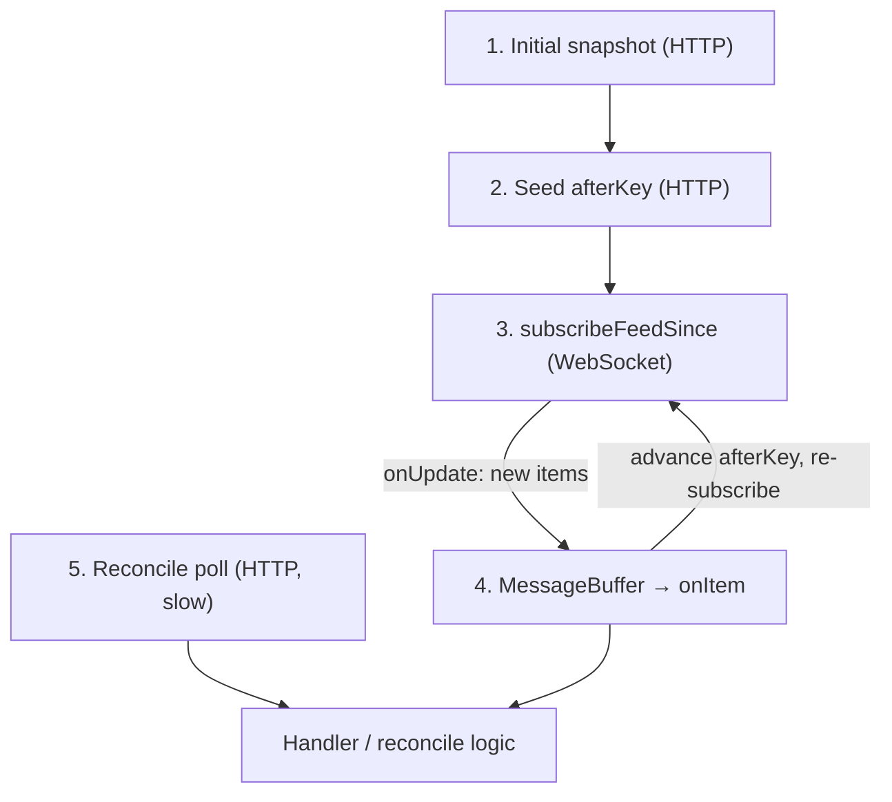

# Convex → Daemon Incremental Sync

Guide for syncing Convex data to the machine daemon without fat reactive snapshots or idle polling.

Use this document when adding or changing a daemon feed (tasks, commands, events, etc.).

---

## Overview

The daemon runs long-lived processes that need timely updates from Convex. Two approaches fail in production:

1. **Fat `onUpdate` on a snapshot query** — Convex re-pushes the full result whenever any dependency document changes (e.g. participant `lastSeenAt` heartbeats), including large fields the consumer never uses.
2. **Fixed-interval HTTP polling** — small responses, but query invocations accrue while idle (~1.3M/month at a 2s interval per daemon).

The standard pattern here is **cursor-pinned delta subscription**: hydrate once, subscribe to items strictly after a cursor, advance the cursor as new items arrive, and keep an internal buffer between transport and handlers.

**CLI framework:** `packages/cli/src/infrastructure/incremental-sync/`  
**Reference consumer:** `packages/cli/src/commands/machine/daemon-start/task-monitor.ts`

---

## When to use this pattern

| Use incremental sync when…                             | Use something else when…                                                                                                |
| ------------------------------------------------------ | ----------------------------------------------------------------------------------------------------------------------- |
| The feed is long-lived and daemon-side                 | The webapp needs sub-second UI reactivity (use existing cursor queries in `messageList.ts`)                             |
| Payloads would be large or grow with active work       | The result set is usually empty (e.g. pending file-tree requests — subscribe directly; see `file-tree-subscription.ts`) |
| Dependencies include high-churn fields you do not need | A one-shot fetch is enough                                                                                              |

**Rule of thumb:** if a query routinely reads many documents or returns more than ~4KB, do not put fat snapshots on `onUpdate`. Use delta tails + on-demand fetches for blobs.

---

## Canonical flow

Every new daemon feed should implement these steps in order:

1. **Initial hydrate** — one-shot HTTP query for the current snapshot (e.g. `listAssignedTasksLite`).
2. **Seed cursor** — one-shot delta query to read the current `highKey` / `afterKey` so the subscription does not replay history.
3. **Subscribe** — `wsClient.onUpdate(subscribeFeedSince, { afterKey, … })`. When new items arrive, **advance `afterKey` and re-subscribe**.
4. **Internal store** — enqueue into `MessageBuffer`; a worker invokes `onItem` handlers. Handlers call `ack()`; they do not manage the cursor.
5. **Reconcile (optional)** — slow HTTP poll of a **lite** snapshot for data intentionally excluded from the signal stream.



### Cursor semantics

- `afterKey` is **exclusive** — the query returns items strictly **after** the key (same as `messageList.fetchMessagesStrictlyAfter`).
- Pin the cursor to the newest item seen so the subscription result stays near-empty until something new happens (same idea as `subscribeNewMessages` in the webapp).

### Two channels

Many feeds need **signal + reconcile**:

| Channel       | Transport        | Carries                             | Example                                            |
| ------------- | ---------------- | ----------------------------------- | -------------------------------------------------- |
| **Signal**    | WS `onUpdate`    | Task status, config, action changes | `subscribeAssignedTaskSignalsSince`                |
| **Reconcile** | HTTP poll (slow) | Fields excluded from signals        | `listAssignedTasksLite` for `lastSeenAt` staleness |

Do not put pure heartbeat fields in signal `revisionKey`; let reconcile handle them.

---

## Anti-patterns

| Avoid                                                                            | Why                                       |
| -------------------------------------------------------------------------------- | ----------------------------------------- |
| `onUpdate` on a query that returns `task.content` (or similar blobs)             | Bandwidth explosion on every invalidation |
| Reading participant rows in the subscribe query when you only care about actions | Re-runs on every `lastSeenAt` heartbeat   |
| Fixed-interval poll for the signal tail                                          | Idle invocation cost                      |
| Advancing cursor in handlers                                                     | Racey; belongs in subscribe transport     |
| Skipping initial hydrate                                                         | Replay or missed state on subscribe start |

---

## Backend conventions

Expose two query surfaces per feed where needed:

| Query                  | Purpose                                               | Transport                |
| ---------------------- | ----------------------------------------------------- | ------------------------ |
| `subscribe*Since`      | `{ afterKey, limit }` → `{ items, highKey, hasMore }` | WS `onUpdate`            |
| `list*Lite` / snapshot | Current rows without large blobs                      | HTTP hydrate + reconcile |

**Payload rules:**

1. Signal rows are **small** — IDs and volatile fields only.
2. Load large blobs in a **separate one-shot query** when the handler acts (e.g. `getAssignedTaskForAction`).
3. Build `revisionKey` from meaningful changes only; exclude noise (e.g. pure `lastSeenAt` ticks).
4. Prefer index-backed range scans on the cursor field.

### Evolving practice: signal projection tables

If a subscribe query must stay correct but dependency reads are too broad, write signals to a **projection table** on meaningful mutations only. The subscribe query then reads that table (indexed by `machineId` + `revisionKey`), not live participant scans. Task monitor may adopt this when heartbeat-driven re-runs become costly.

---

## CLI framework

**Location:** `packages/cli/src/infrastructure/incremental-sync/`

| Module                | Responsibility                                                          |
| --------------------- | ----------------------------------------------------------------------- |
| `types.ts`            | `PollPage`, `IncrementalFeedDef`, `SubscribeQueryTarget`, handler types |
| `message-buffer.ts`   | FIFO queue, dedupe, bounded size                                        |
| `subscribe-loop.ts`   | Cursor-pinned `onUpdate`, re-subscribe on advance                       |
| `resolve-high-key.ts` | Derive next `afterKey` from a delta page                                |
| `feed-runtime.ts`     | `runIncrementalSubscribeLive`, `runReconcilePollLive`                   |
| `feeds/<name>.ts`     | Feed def + subscribe target for a domain                                |

### Wiring a new feed

1. Add backend `subscribe*Since` (+ optional `list*Lite`, action fetch).
2. Add `feeds/<your-feed>.ts` with `IncrementalFeedDef`, `SubscribeQueryTarget`, buffer defaults.
3. In the daemon subscriber:
   - `runIncrementalSubscribeLive({ wsClient, def, target, initialAfterKey, onItem, … })`
   - Optional `runReconcilePollLive` for lite snapshot polling.
4. Add tests: `subscribe-loop.test.ts` patterns, backend integration spec for cursor exclusivity.

### Entry points

- **`runIncrementalSubscribeLive`** — signal channel (WebSocket + buffer + worker fiber).
- **`runReconcilePollLive`** — fixed-interval HTTP poll without buffering (reconcile only).

---

## Example: assigned task monitor

Illustrates the full pattern; copy structure, not necessarily every interval.

```
Initial hydrate (HTTP)           Reconcile poll (~15s, HTTP)
listAssignedTasksLite            listAssignedTasksLite
         │                              │
         ▼                              │
Seed cursor (HTTP) ──► subscribeAssignedTaskSignalsSince (WS)
         │                              │
         └──────────┬───────────────────┘
                    ▼
              processTasksUpdate
                    │ on action only
                    ▼
         getAssignedTaskForAction (full task.content)
```

| Piece                | Location                                     |
| -------------------- | -------------------------------------------- |
| Subscribe query      | `machines.subscribeAssignedTaskSignalsSince` |
| Lite snapshot        | `machines.listAssignedTasksLite`             |
| Action fetch         | `machines.getAssignedTaskForAction`          |
| Shared backend logic | `assigned-tasks-core.ts`                     |
| Feed def             | `feeds/assigned-task-signals.ts`             |
| Consumer             | `task-monitor.ts`                            |

Default signal buffer: fifo, max 200, dedupe on. Subscribe page limit: 50.

---

## Testing

| Layer                                | Where                                                        |
| ------------------------------------ | ------------------------------------------------------------ |
| Buffer, subscribe loop, feed runtime | `packages/cli/src/infrastructure/incremental-sync/*.test.ts` |
| Backend cursor / payload rules       | `services/backend/tests/integration/` (per feed)             |
| Consumer logic                       | Co-located `*.test.ts` next to the subscriber                |

Prove cursor exclusivity and “no blob in signal path” in backend integration tests before wiring production subscribers.

---

## Related patterns in the repo

| Pattern                                  | Location                                                          |
| ---------------------------------------- | ----------------------------------------------------------------- |
| Cursor-pinned message tail (webapp)      | `services/backend/convex/messageList.ts` — `subscribeNewMessages` |
| Reactive pending work (small result set) | `file-tree-subscription.ts`                                       |
| Subscribe + safety reconcile poll        | `observed-sync.ts`                                                |
| Daemon commit de-duplication             | `commit-detail-sync.ts` — `seenShas`                              |

---

## Checklist (new feed)

- [ ] Snapshot/lite query for hydrate + reconcile defined
- [ ] `subscribe*Since` returns small deltas; `afterKey` exclusive
- [ ] Large payloads fetched only in action handler
- [ ] `feeds/<name>.ts` + `runIncrementalSubscribeLive` wired with `wsClient`
- [ ] Initial hydrate + cursor seed before subscribe
- [ ] Reconcile poll only if signal stream omits required fields
- [ ] Integration tests for cursor and payload shape
- [ ] No fixed-interval poll on the signal tail
