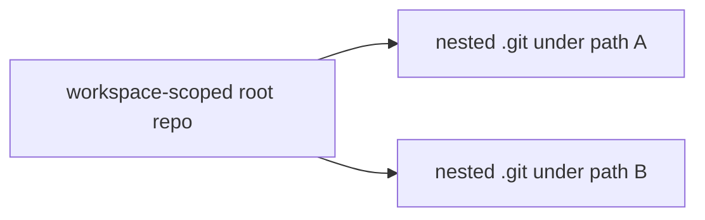

# Git Workspace Change Source — Plan & Progress

> **Status:** Complete + hardened (P0–P3 reliability fixes on `feat/git-workspace-change-source`)  
> **Branch:** `release/v1.67.0`  
> **Related:** [PR #947](https://github.com/conradkoh/chatroom/pull/947) (chokidar ignore + EMFILE fallback)  
> **Owner:** Planner coordinates; Builder implements slice-by-slice

## Problem Statement

PR #947 aligned chokidar’s `ignored` callback with workspace ignore rules and added EMFILE → reconcile-only fallback. Large workspaces can still exhaust watchers because chokidar recursively watches real directories.

When git is available, **git status (porcelain) is a better change oracle**: it respects ignore rules, includes untracked files, and does not require per-directory inotify watches. Nested git checkouts (submodules **and** nested `.git` directories) must be discovered and polled individually because a parent repo does not list files inside nested work trees.

## Confirmed Decisions

| #   | Topic                  | Decision                                                                                                              |
| --- | ---------------------- | --------------------------------------------------------------------------------------------------------------------- |
| 1   | Trigger model          | **Poll porcelain only** (~1s default). No `.git` metadata watch acceleration. No workspace-wide chokidar in git mode. |
| 2   | Nested repos           | **Discover all nested `.git`** (registered submodules and non-submodule nested repos).                                |
| 3   | Workspace subdirectory | **Scope status with pathspec** to the workspace root (and nested repos under it), not the entire outer monorepo.      |

## Target End State

```mermaid
flowchart TD
  coord[WorkspaceFileTreeCoordinator]
  factory[createWorkspaceChangeSource]
  hier[discoverGitWorkspaceHierarchy]
  gitSrc[GitWorkspaceChangeSource]
  fsSrc[createWorkspaceFsWatcher]
  apply[applyFsEvents → commitPaths]
  recon[periodic reconcile / scanFileTree]

  coord --> factory
  factory -->|git ok| hier
  hier --> gitSrc
  factory -->|fallback| fsSrc
  gitSrc -->|WorkspaceFsEvent[]| apply
  fsSrc -->|WorkspaceFsEvent[]| apply
  coord --> recon
```



### Core invariants

1. **Same event contract:** git and fs sources both emit `WorkspaceFsEvent[]` consumed by existing `applyFsEvents`.
2. **Git mode does not start workspace-wide chokidar.**
3. **Fallback:** missing git binary / not a git workspace / hierarchy discovery failure → existing fs watcher (+ EMFILE reconcile fallback).
4. **Reconcile remains the correctness backstop** (`scanFileTree` stays filesystem-based; no git-only full scan in this feature).
5. **Path relativity:** all event paths are relative to the daemon `workingDir` (workspace root), with nested-repo paths prefixed.

## Slices

| #   | Slice                   | Deliverable                                                                                   | Status   |
| --- | ----------------------- | --------------------------------------------------------------------------------------------- | -------- |
| 0   | Plan                    | This document + confirmed decisions                                                           | **Done** |
| 1   | Interfaces              | Hierarchy types, `WorkspaceChangeSource`, factory selecting git vs fs (fs wired; git stubbed) | **Done** |
| 2   | Utilities + tests       | Hierarchy discovery, porcelain parse, snapshot→events; unit tests                             | **Done** |
| 3   | Wire-up                 | Real git change source (poll); coordinator uses factory; PR to `release/v1.67.0`              | **Done** |
| H1  | Hardening — porcelain   | Typed git errors, timeouts, porcelain-leave detection (reconcile, not unlink)                 | **Done** |
| H2  | Hardening — poller      | `allSettled`, exponential backoff, baseline skip, `onPersistentFailure`                       | **Done** |
| H3  | Hardening — coordinator | Git→fs degradation, startup logging, enriched error context, `gitRepoCount`                   | **Done** |
| H4  | Hardening — tests       | Git-mode coordinator integration tests, porcelain `git restore` leave test, degrade mock      | **Done** |
| H5  | Hardening — docs        | Reliability table, known limitations (this document)                                          | **Done** |

---

## Slice 1 — High-level interfaces

**Goal:** Introduce the seam the coordinator will use, without implementing porcelain polling yet.

**Files (planned):**

- `packages/cli/src/infrastructure/services/workspace/workspace-change-source.ts` — shared handle/options + factory
- `packages/cli/src/infrastructure/services/workspace/git-workspace-hierarchy.ts` — hierarchy types + `discoverGitWorkspaceHierarchy` stub returning structured “unavailable” / empty until Slice 2
- Re-export / reuse `WorkspaceFsEvent` from `workspace-fs-watcher.ts` (do not duplicate)

**Acceptance:**

- Factory returns `{ mode: 'fs', source }` today when git path is not ready (or always fs until Slice 3), with types ready for `{ mode: 'git', source }`
- Types compile; no coordinator behavior change yet (or minimal import-only if factory is unused until Slice 3)
- Plan progress table updated when merged into the branch

**Progress notes:** _(updated by planner after review)_

- `git-workspace-hierarchy.ts`, `workspace-change-source.ts`, `workspace-change-source.test.ts` created; factory returns `{ mode: 'fs', source }` via stubbed hierarchy.

---

## Slice 2 — Low-level utilities + tests

**Goal:** Implement and unit-test hierarchy discovery and porcelain snapshot diffing in isolation.

**Planned APIs:**

- `discoverGitWorkspaceHierarchy(workingDir) → GitWorkspaceHierarchy | null`
  - Resolve whether `workingDir` is inside a git work tree
  - Compute workspace-scoped root + pathspec relative to repo toplevel
  - Walk / discover nested `.git` (file or directory) under the workspace; skip excluded dirs (`node_modules`, etc.)
- `parseGitPorcelainZ(stdout) → GitPorcelainEntry[]`
- `diffPorcelainSnapshots(prev, next) → WorkspaceFsEvent[]` (workspace-relative paths)
- Pathspec helpers for `git -C <workTree> status --porcelain=v1 -z -uall -- <pathspec…>`

**Acceptance:**

- Tests cover: non-git dir, simple repo, nested `.git`, submodule-shaped nested repo, workspace subdirectory pathspec prefixing
- No coordinator wiring yet

**Progress notes:**

- Real `discoverGitWorkspaceHierarchy` (hierarchy discovery with nested .git dir/file support, pathspec scoping)
- `git-workspace-porcelain.ts`: `parseGitPorcelainZ`, `toWorkspaceRelativePath`, `diffPorcelainSnapshots`, `readGitHead`/`headChanged`, `readGitPorcelainStatus`
- Full test coverage for hierarchy (6 test cases) and porcelain (parse, diff, head, status integration)
- Factory updated: non-null hierarchy falls back to fs (no longer throws)

---

## Slice 3 — Wire-up

**Goal:** Polling git change source + coordinator uses `createWorkspaceChangeSource`.

**Behavior:**

- Default poll interval ~1000ms; coalesce bursts; map snapshot diffs to events
- On ignore-file changes, existing reconcile path still applies
- Preserve EMFILE handling for `mode: 'fs'`
- Feature PR targeting `release/v1.67.0`

**Progress notes:**

- `git-workspace-change-source.ts` — porcelain polling change source (default ~1s poll, HEAD→reconcile, flattened hierarchy, dedup, shouldIgnore)
- `workspace-change-source.ts` — factory wires git source when hierarchy non-null (mode: 'git'), fs fallback otherwise
- `workspace-file-tree-coordinator.ts` — uses `createWorkspaceChangeSource`; EMFILE handling preserved for fs mode only
- `git-workspace-change-source.test.ts` — unit tests with mocked porcelain (add, no-leave-unlink, HEAD→reconcile, stop, shouldIgnore)
- `workspace-change-source.test.ts` — added real git repo integration test (mode:git)
- Pushed to `release/v1.67.0` (rides PR #950)
- Follow-up fix: skip HEAD→reconcile on initial baseline (`prev.head === null`) so daemon start does not always full-reconcile

---

## Reliability hardening (P0–P3, 2026-07-15)

| Area               | Behavior                                                                                                               |
| ------------------ | ---------------------------------------------------------------------------------------------------------------------- |
| Git command errors | `readGitHead` / `readGitPorcelainStatus` throw `GitWorkspaceCommandError`; poller preserves state on failure           |
| Porcelain leave    | `porcelainPathsLeftSnapshot` → `onNeedsReconcile` (e.g. `git restore`, `git clean`) — no false unlink                  |
| Initial baseline   | `baselineEstablished` per node — first successful poll emits no events                                                 |
| Backoff            | Exponential backoff on failures (cap 30s); `Promise.allSettled` per-node isolation                                     |
| Runtime fallback   | After 3 consecutive failure ticks → `onPersistentFailure` → coordinator degrades git→fs (one-way)                      |
| Observability      | Startup log: `[workspace-file-tree] change source: git (N repos)` or `fs`; enriched git error warnings                 |
| Tests              | Coordinator git-mode delta + git-clean reconcile; porcelain `git restore` leave; poller unit tests for failure/backoff |

## Known limitations

1. **Gitignored untracked files** — not reported by porcelain; baseline gap-fill (`diffPorcelainAgainstKnownPaths` + `getKnownPaths`) handles non-gitignored untracked files present at coordinator restart. Purely gitignored files still rely on periodic `scanFileTree` reconcile (same as fs watcher + ignore rules).
2. **Porcelain leave without reconcile latency** — untracked file deletes (`??` + file missing from disk) now emit immediate unlink via `porcelainUntrackedDeletedEvents`; other leaves (tracked `git restore`/`git clean`, committed) still trigger async reconcile.
3. **No `git worktree` discovery** — secondary worktrees are not polled; only filesystem `.git` walk under workspace.
4. **One-way degradation** — git→fs fallback does not re-upgrade until coordinator restarts.
5. **Committed clean paths** — paths leaving porcelain after commit rely on HEAD-change reconcile (or periodic reconcile); no unlink emitted from diff.

## Out of scope

- Replacing `scanFileTree` / full reconcile with git listing
- Removing chokidar entirely
- `.git` metadata watch acceleration (explicitly declined)
- Backend delta/checkpoint protocol changes

## Open questions

None — decisions confirmed 2026-07-14; hardening decisions resolved 2026-07-15.
