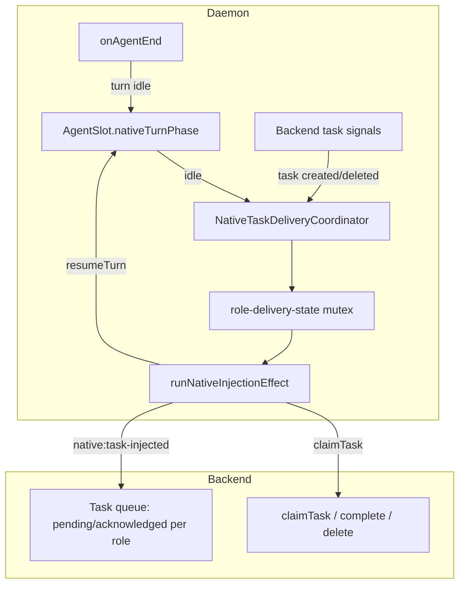

# Native Delivery Coordinator Refactor Plan

> **Status:** **Complete** — all 5 slices implemented  
> **Branch:** `feat/native-delivery-reliability`  
> **Owner:** Planner coordinates; Builder implements slice-by-slice

## Problem Statement

Native task delivery currently gates injection on a matrix of backend participant fields (`lastSeenAction` × `lastStatus` × task `status`). The daemon already has authoritative local harness state (slot running, turn in flight, harnessSessionId) but does not use it as the control plane. This caused the recent regression where the second user message stayed `pending` after the first turn completed.

**Smell:** Participant snapshots are both UI observability _and_ delivery readiness signals — creating cross-process races and predicate sprawl.

## Target End State



### Core Invariant (final)

```
shouldInject(task, slot) =
  isDeliverableNativeTaskStatus(task.status)
  ∧ slotMatchesSpawnedAgent(task, slot)
  ∧ slot.nativeTurnPhase === 'idle'
  ∧ roleDeliveryMutex.tryAcquire()
```

Participant `lastSeenAction` / `lastStatus` are **not** consulted for delivery eligibility. They remain for UI/status only.

## Slices

| #   | Slice                         | Deliverable                                                           | Status   |
| --- | ----------------------------- | --------------------------------------------------------------------- | -------- |
| 1   | Slot turn-phase state machine | `nativeTurnPhase` on `AgentSlot`, transitions in APM                  | **Done** |
| 2   | Event-driven trigger          | `notifyNativeTurnIdle` → `coordinator.tryInjectNextForRole`           | **Done** |
| 3   | Simplify eligibility          | Replace `participantAllowsNativeDelivery` with turn-phase check       | **Done** |
| 4   | Demote reconcile/nudge        | Keep as fallback; add logging; reduce primary reliance                | **Done** |
| 5   | Regression hardening          | G-criteria traceability, role-delivery-state test, deleted-task guard | **Done** |

---

## Slice 1: Slot Turn-Phase State Machine

### Goal

Add `nativeTurnPhase` to `AgentSlot` and wire transitions in `AgentProcessManager` so the daemon knows locally whether a harness turn is in flight.

### Type

```typescript
export type NativeTurnPhase = 'idle' | 'injecting' | 'turn_in_flight';
```

Add to `AgentSlot`:

```typescript
/** Native harness turn lifecycle — delivery control plane (not UI participant state). */
nativeTurnPhase?: NativeTurnPhase; // default 'idle' when native harness running
```

### Transitions

| Event                                         | From                            | To                  | Location                              |
| --------------------------------------------- | ------------------------------- | ------------------- | ------------------------------------- |
| Spawn finalize (native harness)               | —                               | `idle`              | `finalizeRunningSlot`                 |
| Injection starts (`resumeTurnForSlot` called) | `idle`                          | `injecting`         | `resumeTurnForSlot`                   |
| Injection succeeds (`resumeTurn` returns)     | `injecting`                     | `turn_in_flight`    | `resumeTurnForSlot`                   |
| Injection fails                               | `injecting`                     | `idle`              | `resumeTurnForSlot` catch             |
| `agent_end` handled (no handoff reminder)     | `turn_in_flight` or `injecting` | `idle`              | `runHandleNativeTurnEnd`              |
| Handoff reminder injected                     | any                             | `turn_in_flight`    | `injectHarnessReminder`               |
| Session lost / slot reset                     | any                             | `idle` (or cleared) | `notifyNativeSessionLost`, slot reset |
| Non-native harness                            | —                               | undefined           | N/A                                   |

### New module

`packages/cli/src/commands/machine/daemon-start/native-turn-phase.ts`:

- `export type NativeTurnPhase`
- `export function defaultNativeTurnPhase(): NativeTurnPhase` → `'idle'`
- `export function isNativeSlotIdleForDelivery(slot: AgentSlot | undefined): boolean`
  - `slot?.state === 'running' && (slot.nativeTurnPhase ?? 'idle') === 'idle'`

### Files

- **Create** `packages/cli/src/commands/machine/daemon-start/native-turn-phase.ts`
- **Create** `packages/cli/src/commands/machine/daemon-start/native-turn-phase.test.ts`
- **Modify** `packages/cli/src/infrastructure/services/agent-process-manager/agent-process-manager.ts`
- **Modify** `packages/cli/src/infrastructure/services/agent-process-manager/agent-process-manager.test.ts` (transition tests)

### Out of scope for Slice 1

- Do NOT change `participantAllowsNativeDelivery` yet
- Do NOT wire coordinator `tryInjectNext` yet
- Do NOT change task-monitor triggers

### Slice 1 acceptance criteria

- [ ] `NativeTurnPhase` type exported; `AgentSlot.nativeTurnPhase` field added
- [ ] `resumeTurnForSlot` sets `injecting` before call, `turn_in_flight` on success, `idle` on failure
- [ ] `runHandleNativeTurnEnd` sets `idle` after successful `handleNativeAgentEnd` (non-reminder path)
- [ ] `injectHarnessReminder` sets `turn_in_flight`
- [ ] `finalizeRunningSlot` initializes `nativeTurnPhase: 'idle'` for native harnesses
- [ ] Unit tests cover all transitions
- [ ] `pnpm typecheck` passes in `packages/cli`
- [ ] Existing tests pass (no behavior change to delivery eligibility yet)

---

## Slice 2: Event-Driven Trigger

### Goal

After harness turn completes (`agent_end` → idle), coordinator attempts next task injection without waiting for snapshot reconcile.

### New API

```typescript
// native-delivery-session-registry.ts
export function registerNativeDeliverySession(ctx: NativeTaskDeliverySessionContext): void;
export function unregisterNativeDeliverySession(): void;

// native-task-delivery-coordinator.ts
export function notifyNativeTurnIdle(params: { chatroomId: string; role: string }): void;
// → coordinator.tryInjectNextForRole — fetches pending tasks for role, calls reconcileAssignedTasks with filtered list
```

### Wiring

- `task-monitor.ts` calls `registerNativeDeliverySession` on start, `unregister` on stop
- `agent-process-manager.ts` `runHandleNativeTurnEnd` calls `notifyNativeTurnIdle` after successful handle (not reminder path)

### Slice 2 acceptance criteria

- [ ] `agent_end` → idle triggers injection attempt within same event loop tick (no 15s wait)
- [ ] Handoff reminder path does NOT trigger `notifyNativeTurnIdle`
- [ ] Mutex still serializes per-role delivery
- [ ] Integration test: post-agent_end promoted task injects via event path

---

## Slice 3: Simplify Eligibility

### Goal

Replace `participantAllowsNativeDelivery` predicate matrix with `isNativeSlotIdleForDelivery(slot)`.

### Changes to `native-ready-invariant.ts`

```typescript
function participantAllowsNativeDelivery(
  _task: AssignedTaskSnapshotView,
  slot: AgentSlot | undefined
): boolean {
  return isNativeSlotIdleForDelivery(slot);
}
```

Keep `isNativeAcknowledgedInjectionRetry` as task-status check in `shouldDeliverNativeTask` (claim succeeded, resume failed — task still `acknowledged`).

Remove imports of `isInjectableNativeAction`, `isNativeIdleAfterTaskComplete`, `isNativePendingRedeliveryAfterRelease` from ready-invariant (predicates remain in `predicates.ts` for other uses).

### Slice 3 acceptance criteria

- [x] `shouldDeliverNativeTask` no longer depends on participant action/status for primary path
- [x] Acknowledged retry still works (resume failed → retry without re-claim)
- [x] Redelivery after agent exit still works (slot idle + pending task)
- [x] All `native-task-injector-logic.test.ts` tests updated/passing

---

## Slice 4: Demote Reconcile/Nudge

### Goal

Make periodic reconcile and native light nudge fallback-only safety nets.

### Changes

- Add `console.log` with `[NativeDelivery:fallback]` prefix when reconcile timer or nudge path triggers delivery
- Document in HARNESS_GUIDE.md that primary path is `agent_end` event
- Do NOT remove reconcile/nudge yet — measure first

### Slice 4 acceptance criteria

- [x] Primary delivery path is event-driven (verifiable via log ordering in integration test)
- [x] Fallback paths still work when event missed (daemon restart mid-turn)

---

## Slice 5: Regression Hardening

### Goal

Prove end-state meets all user-facing goals.

### Automated tests

| Test file                                                    | Scenario                                    |
| ------------------------------------------------------------ | ------------------------------------------- |
| `native-queued-delivery-after-agent-end.integration.test.ts` | Second message after first completes        |
| `native-task-injector-logic.test.ts`                         | Eligibility via turn-phase, not participant |
| `native-task-delivery-coordinator.test.ts`                   | tryInjectNextForRole                        |
| `agent-process-manager.test.ts`                              | Turn-phase transitions                      |

### Manual validation checklist

1. Start agent teams (native SDK harness)
2. Send message 1 → processes to completion
3. Send message 2 → delivers immediately (no nudge, no restart)
4. Delete pending message 3 before injection → never delivered
5. Handoff without completing → handoff reminder injected, not next queued task
6. Agent crash + revive → pending task still deliverable

### Full refactor acceptance criteria — sign-off

| ID  | Criterion                                            | Status                 | Evidence                                                                                                         |
| --- | ---------------------------------------------------- | ---------------------- | ---------------------------------------------------------------------------------------------------------------- |
| G1  | Second message delivers immediately after first turn | **Manual**             | Integration proxy: `notifyNativeTurnIdle injects promoted pending task`. User E2E: checklist § Manual Validation |
| G2  | Slot turn-phase eligibility (no participant matrix)  | **Automated**          | `native-task-injector-logic.test.ts` turn-phase tests; `native-ready-invariant.ts`                               |
| G3  | agent_end primary trigger                            | **Automated**          | `agent-process-manager.test.ts` notifyNativeTurnIdle; integration primary log                                    |
| G4  | Per-role delivery mutex                              | **Automated**          | `role-delivery-state.test.ts`                                                                                    |
| G5  | Slot pid/harnessSessionId checks                     | **Automated**          | `native-task-injector-logic.test.ts` harness session missing                                                     |
| G6  | Handoff reminder unchanged                           | **Automated**          | `agent-process-manager.test.ts` handoff reminder + no notify on reminder path                                    |
| G7  | Acknowledged retry                                   | **Automated**          | `native-task-injector-logic.test.ts` acknowledged retry                                                          |
| G8  | Revive/restart/session-loss                          | **Automated** + Manual | `task-monitor-revive.test.ts`; user E2E crash scenario                                                           |
| G9  | Typecheck + all tests pass                           | **Automated**          | `pnpm typecheck`; vitest run (see § Test command)                                                                |
| G10 | Deleted pending not injected                         | **Automated** + Manual | `native-task-delivery-coordinator.test.ts` G10 empty hydrate; user UI delete                                     |

---

## Test command (run all native delivery tests)

```bash
cd packages/cli && pnpm typecheck && \
pnpm vitest run \
  src/commands/machine/daemon-start/native-turn-phase.test.ts \
  src/commands/machine/daemon-start/native-delivery-log.test.ts \
  src/commands/machine/daemon-start/native-delivery-session-registry.test.ts \
  src/commands/machine/daemon-start/native-task-injector-logic.test.ts \
  src/commands/machine/daemon-start/native-task-delivery-coordinator.test.ts \
  src/commands/machine/daemon-start/native-delivery-refactor-acceptance.test.ts \
  src/commands/machine/daemon-start/role-delivery-state.test.ts \
  src/commands/machine/daemon-start/task-monitor-revive.test.ts && \
pnpm vitest run --config vitest.integration.config.ts \
  src/commands/machine/daemon-start/native-queued-delivery-after-agent-end.integration.test.ts
```

---

## Manual Validation Record

| Step | Description                                                 | Result  | Date | Validator |
| ---- | ----------------------------------------------------------- | ------- | ---- | --------- |
| 1    | Start agent teams                                           | pending |      |           |
| 2    | Message 1 completes                                         | pending |      |           |
| 3    | Message 2 delivers immediately (`[NativeDelivery:primary]`) | pending |      |           |
| 4    | Delete pending message 3 before injection                   | pending |      |           |
| 5    | Handoff reminder, not queued task                           | pending |      |           |
| 6    | Agent crash + revive delivers pending                       | pending |      |           |

---

## Refactor Complete

All 5 slices implemented. Primary path: `agent_end` → `notifyNativeTurnIdle` → inject when `slot.nativeTurnPhase === 'idle'`. Fallback paths retained with `[NativeDelivery:fallback]` logging.

---

## Progress Log

| Date       | Slice | Agent   | Notes                                                                                                                                                                                                                                                                                                               |
| ---------- | ----- | ------- | ------------------------------------------------------------------------------------------------------------------------------------------------------------------------------------------------------------------------------------------------------------------------------------------------------------------- |
| 2026-07-13 | Plan  | Planner | Plan doc created; Slice 1 delegated to Builder                                                                                                                                                                                                                                                                      |
| 2026-07-13 | 1     | Builder | `native-turn-phase.ts` + tests created; transitions wired in APM; 144 tests pass; typecheck clean                                                                                                                                                                                                                   |
| 2026-07-13 | 2     | Builder | `native-delivery-session-registry.ts` + tests; `notifyNativeTurnIdle` + `tryInjectNextForRole` on coordinator; session registry in task-monitor; APM calls `notifyNativeTurnIdle` on non-reminder agent_end; 142 tests pass; typecheck clean                                                                        |
| 2026-07-13 | 3     | Builder | Replaced `participantAllowsNativeDelivery` predicate matrix with `isNativeSlotIdleForDelivery` in `native-ready-invariant.ts`; added turn-phase gating tests (turn_in_flight, injecting, mid-turn native:waiting); removed unused `notifyNativeTurnIdle` import from task-monitor; 149 tests pass; typecheck clean  |
| 2026-07-13 | 4     | Builder | Created `native-delivery-log.ts` helpers + tests; `notifyNativeTurnIdle` uses `[NativeDelivery:primary]`; all 3 fallback call sites log `[NativeDelivery:fallback]` with distinct reason; HARNESS_GUIDE.md updated with delivery paths table; integration test asserts primary log; 151 tests pass; typecheck clean |
| 2026-07-13 | 5     | Builder | G4: `role-delivery-state.test.ts` (4 tests); G10: coordinator empty-hydrate test; traceability file; plan doc sign-off with evidence table, test command, manual validation record, refactor complete; 159 tests pass; typecheck clean                                                                              |
