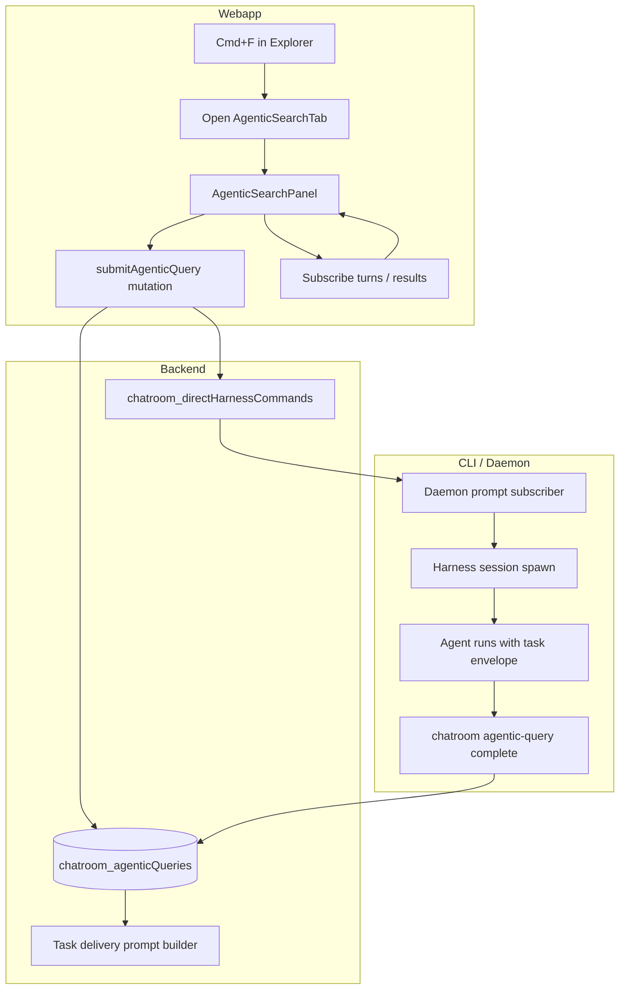

# Agentic Search / Ask (Cmd+F) — Implementation Plan

**Backlog:** `ps7c11c5gjb76vgx2f91zpes2n8akaj2`  
**Branch:** `feat/agentic-search-cmd-f` (from `release/v1.69.0`)  
**Status:** Planning — no implementation yet

## Problem

In the explorer view, **Cmd+F** (macOS) / **Ctrl+F** (Windows/Linux) should open an **agentic search panel as a new editor tab** — not a modal, not the explorer sidebar. Users can run workspace-scoped **Agentic Search** or **Agentic Ask**, see results with chatroom-consistent markdown, click file references to open in explorer, and send follow-ups in the same tab.

## Goals

| #   | Feature        | Summary                                                                |
| --- | -------------- | ---------------------------------------------------------------------- |
| 1   | Agentic Search | Plain-text query → agent explores codebase → structured search results |
| 2   | Agentic Ask    | Question with **grounding** requirement — concise answer + evidence    |
| 3   | Follow-up      | Refine search or ask follow-up questions in the same tab thread        |

## Non-goals (v1)

- Sidebar or modal search UI
- Replacing file-explorer tree filter search
- Multi-chatroom cross-workspace search
- Replacing the existing Direct Harness panel (parallel integration, not merge)

---

## Architecture Overview



**Pattern:** Mirror direct harness (web command → daemon → harness session → turns stream) but with a **dedicated domain** (query type, task envelope, return CLI, tab UX) instead of bolting onto generic harness sessions.

---

## Phase 0 — Foundations (builder slice 1)

### 0.1 Tab model extension

**Current:** `FileTab` in `useFileTabs.ts` assumes every tab is a file path.

**Target:** Discriminated union so the tab bar can host virtual agentic tabs alongside file tabs.

```typescript
// apps/webapp/src/modules/chatroom/workspace/hooks/useFileTabs.ts

export type AgenticQueryMode = 'search' | 'ask';

export type EditorTab =
  | { kind: 'file'; filePath: string; name: string; isPinned: boolean }
  | {
      kind: 'agentic-query';
      queryId: string; // Convex Id<'chatroom_agenticQueries'>
      name: string; // e.g. "Search" or truncated query
      mode: AgenticQueryMode;
      isPinned: boolean;
    };

export function editorTabKey(tab: EditorTab): string {
  return tab.kind === 'file' ? tab.filePath : `agentic-query:${tab.queryId}`;
}
```

**Persistence:** Extend `FileTabsPersistedState` to store `EditorTab[]` (with migration from legacy `FileTab[]` on read).

**Tab bar:** `FileTabBar` renders file tabs + agentic tabs (search icon for agentic, no file icon path).

**Content area:** `ExplorerContent` switches on `activeTab.kind`:

- `file` → existing `MarkdownFileEditorPane` / `FileContentViewer`
- `agentic-query` → new `AgenticQueryPanel`

### 0.2 Cmd+F keyboard shortcut

**Where:** `ExplorerContent` or explorer split panel wrapper in `ChatroomDashboard.tsx` when explorer view is active.

**Behavior:**

1. `preventDefault` on Cmd/Ctrl+F (don't trigger browser find)
2. If no agentic tab for current "draft" session, create query via mutation + open tab
3. If user already has an empty agentic tab focused, focus query input instead of spawning duplicate

**Guard:** Only when explorer split is visible and focus is not inside a native text field that should keep browser find (optional: allow Monaco/code editor to keep Cmd+F for in-file find later — v2).

### 0.3 Backend schema

Add to `services/backend/convex/schema.ts`:

```typescript
chatroom_agenticQueries: defineTable({
  workspaceId: v.id('chatroom_workspaces'),
  chatroomId: v.id('chatroom_rooms'),
  mode: v.union(v.literal('search'), v.literal('ask')),
  status: v.union(
    v.literal('draft'),
    v.literal('pending'),
    v.literal('running'),
    v.literal('complete'),
    v.literal('failed')
  ),
  title: v.string(), // tab display / session title
  harnessSessionId: v.optional(v.id('chatroom_harnessSessions')),
  parentQueryId: v.optional(v.id('chatroom_agenticQueries')), // follow-ups
  createdBySessionId: v.optional(v.string()),
  createdAt: v.number(),
  completedAt: v.optional(v.number()),
  errorMessage: v.optional(v.string()),
})
  .index('by_workspace', ['workspaceId'])
  .index('by_chatroom', ['chatroomId'])
  .index('by_parent', ['parentQueryId']),

chatroom_agenticQueryTurns: defineTable({
  queryId: v.id('chatroom_agenticQueries'),
  turnSeq: v.number(),
  role: v.union(v.literal('user'), v.literal('assistant')),
  content: v.string(), // markdown
  status: v.union(v.literal('pending'), v.literal('streaming'), v.literal('complete'), v.literal('failed')),
  structuredResult: v.optional(v.any()), // parsed CLI payload — see contract below
  startedAt: v.number(),
  completedAt: v.optional(v.number()),
})
  .index('by_query', ['queryId', 'turnSeq']),
```

**Reuse:** Link to `chatroom_harnessSessions` for daemon execution; do **not** show agentic sessions in Direct Harness session list (filter by `purpose` field on harness session or by join through `agenticQueries`).

**Harness session extension (minimal):**

```typescript
// On chatroom_harnessSessions add optional:
purpose: v.optional(v.union(v.literal('direct'), v.literal('agentic-query'))),
agenticQueryId: v.optional(v.id('chatroom_agenticQueries')),
```

---

## Phase 1 — Web UI shell (builder slice 2)

### 1.1 `AgenticQueryPanel` component

**Path:** `apps/webapp/src/modules/chatroom/workspace/components/AgenticQueryPanel.tsx`

**Layout (single tab):**

```
┌─────────────────────────────────────────────────┐
│ Mode: [Agentic Search ▾]  [Agentic Ask]         │
├─────────────────────────────────────────────────┤
│ Query input (textarea, autofocus on new tab)    │
│                                    [Search / Ask]│
├─────────────────────────────────────────────────┤
│ Thread (markdown messages, scrollable)           │
│  - user turns                                    │
│  - assistant turns (streaming)                   │
│  - grounding block for ask mode                  │
├─────────────────────────────────────────────────┤
│ Follow-up input (shown after first result)       │
└─────────────────────────────────────────────────┘
```

**Default mode:** Agentic Search (per backlog).

**Styling:** Reuse `chatroomRemarkPlugins`, `fullMarkdownComponents` / `TimelineMarkdownBody` patterns from `apps/webapp/src/modules/chatroom/components/timeline/TimelineMarkdownBody.tsx` so rendering matches multi-agent chatroom messages.

**File links:** Wrap panel in existing `WorkspaceFileLinkProvider` context (already in `ChatroomDashboard`) so `workspace:` / relative path links open files in explorer.

### 1.2 Convex web API

**Path:** `services/backend/convex/web/agenticQuery/`

| Endpoint          | Purpose                                                                       |
| ----------------- | ----------------------------------------------------------------------------- |
| `createDraft`     | Create draft query + return id (for tab open)                                 |
| `submit`          | User query text → create user turn, enqueue harness command, status → pending |
| `submitFollowUp`  | Append turn on same queryId                                                   |
| `get`             | Query metadata + turns for panel subscription                                 |
| `listByWorkspace` | Optional: reopen recent agentic tabs                                          |

### 1.3 Open tab helper

```typescript
// useAgenticQueryTabs.ts
function openAgenticQueryTab(mode: AgenticQueryMode = 'search'): void {
  // createDraft mutation → pinTab equivalent for agentic-query kind
}
```

Wire Cmd+F → `openAgenticQueryTab('search')`.

---

## Phase 2 — Agent execution path (builder slice 3)

### 2.1 Task envelope (strict)

Mirror `renderTaskEnvelopeLines` (`services/backend/prompts/task-delivery/render-task-envelope.ts`) with a dedicated builder:

**Path:** `services/backend/prompts/agentic-query/render-task-envelope.ts`

```xml
<agentic-query task-id="..." query-id="..." mode="search|ask">
  <context>...</context>
  <workspace>
    machineId, workingDir, file tree snapshot or scope rules
  </workspace>
  <query>...</query>
  <requirements>
    mode-specific rules (grounding for ask)
  </requirements>
  <handoff-templates>...</handoff-templates>
  <cli-complete-command>chatroom agentic-query complete ...</cli-complete-command>
</agentic-query>
```

**Mode-specific requirements:**

| Mode     | Agent must                                                                              |
| -------- | --------------------------------------------------------------------------------------- |
| `search` | Return ranked findings with file paths, short excerpts, relevance note                  |
| `ask`    | Return concise answer **and** grounding section with path:line evidence for every claim |

### 2.2 Handoff return template

**Path:** `services/backend/prompts/agentic-query/handoff-templates/complete.ts`

Agent completes via CLI (not `chatroom handoff` — avoids chatroom task FSM). Structured markdown body:

```markdown
## Summary

<one paragraph>

## Results

<concise bullets or numbered findings>

## Grounding

<!-- Required when mode=ask; optional but encouraged for search -->

- `path/to/file.ts:42` — <excerpt or explanation>

## Files

- path/to/file.ts — <why relevant>
```

CLI validates required sections based on `mode` before accepting.

### 2.3 CLI command

**Path:** `packages/cli/src/commands/agentic-query/complete.ts`

```bash
chatroom agentic-query complete \
  --chatroom-id=<id> \
  --query-id=<id> \
  --role=agent \
  << 'CHATROOM_AGENTIC_QUERY_END'
---RESULT---
<markdown matching template>
CHATROOM_AGENTIC_QUERY_END
```

**Register in** `packages/cli/src/index.ts` alongside `handoff`, `get-next-task`.

**Effect:**

1. Validate query status is `running`
2. Parse + validate template sections
3. Write assistant turn + `structuredResult` JSON
4. Mark query `complete`
5. Close harness session

### 2.4 Daemon integration

**Path:** `packages/cli/src/commands/machine/daemon-start/direct-harness/prompt-subscriber.ts` (extend)

Add command type `submitAgenticQuery` on `chatroom_directHarnessCommands`:

- Spawn harness with `purpose: 'agentic-query'`
- Inject task envelope as first user message
- Same turn streaming path as direct harness

**Filter:** Direct Harness UI `listSessions` excludes `purpose === 'agentic-query'`.

---

## Phase 3 — Streaming, follow-ups, polish (builder slice 4)

### 3.1 Live streaming

Subscribe to `chatroom_harnessSessionTurns` via query id → harness session id (same pattern as `useHarnessTurnStore`).

Map harness turns into `AgenticQueryPanel` thread. On CLI `complete`, finalize structured sections.

### 3.2 Follow-ups

- `submitFollowUp` creates new user turn with `parentTurnSeq` context
- Task envelope includes prior thread summary + new user message
- Same tab, same `queryId` (or `parentQueryId` chain — prefer single queryId thread for UX)

### 3.3 UX polish

- Tab title updates from first query line (truncated)
- Loading / failed states with retry
- Empty state copy for new Cmd+F tab
- Pin / close tab behavior matches file tabs
- Tests: keyboard shortcut, tab kind routing, markdown link click opens file

---

## File map (expected touch points)

| Area           | Files                                                                                            |
| -------------- | ------------------------------------------------------------------------------------------------ |
| Tab state      | `workspace/hooks/useFileTabs.ts`, `FileTabBar.tsx`, `ExplorerContent` in `ChatroomDashboard.tsx` |
| UI             | `workspace/components/AgenticQueryPanel.tsx`, `useAgenticQuery.ts`                               |
| Backend schema | `convex/schema.ts`                                                                               |
| Web API        | `convex/web/agenticQuery/*.ts`                                                                   |
| Prompts        | `prompts/agentic-query/*`                                                                        |
| CLI            | `packages/cli/src/commands/agentic-query/*`, `index.ts`                                          |
| Daemon         | `direct-harness/prompt-subscriber.ts`, `command-loop.ts`                                         |
| Tests          | webapp component tests, backend integration spec, CLI unit tests                                 |

---

## Implementation slices (delegation order)

| Slice | Owner   | Deliverable                                                           |
| ----- | ------- | --------------------------------------------------------------------- |
| **0** | Builder | Schema + `EditorTab` union + Cmd+F opens draft tab (no agent yet)     |
| **1** | Builder | `AgenticQueryPanel` shell + Convex CRUD + tab rendering               |
| **2** | Builder | Task envelope + daemon command + CLI `complete` + end-to-end search   |
| **3** | Builder | Ask mode grounding validation + follow-ups + streaming polish + tests |

---

## Open decisions (need user input before slice 2)

1. **Agent role:** Dedicated `workspace-searcher` agent type vs reusing `solo`/`builder` with a scoped prompt?
2. **Harness reuse:** Single shared harness pool or always ephemeral session per query?
3. **In-editor Cmd+F:** Should code editor tabs keep local find while explorer chrome uses agentic search?

**Recommendations:** (1) new lightweight `workspace-agent` role in team config, (2) ephemeral session per query, (3) defer in-editor conflict to v2 — explorer Cmd+F only when editor not focused.

---

## Verification

- [ ] Cmd+F in explorer opens new tab (not modal/sidebar)
- [ ] Default mode Agentic Search
- [ ] Search query returns structured results with clickable paths
- [ ] Ask query enforces grounding section
- [ ] Follow-up refines prior result in same tab
- [ ] Markdown matches chatroom timeline styling
- [ ] File path clicks open in explorer editor
- [ ] Agentic sessions hidden from Direct Harness panel
- [ ] CLI `agentic-query complete` rejects malformed templates
