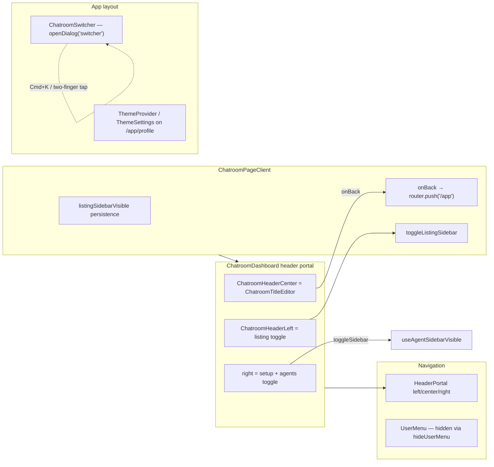

# Chatroom Top Bar Layout — Research & Implementation Plan

**Status:** Decisions locked — plan commit first, then implement in slices  
**Target branch:** `feat/chatroom-top-bar-layout` (from `origin/release/v1.70.1`)  
**Related prior PR:** bottom-bar settle (#1022) is unrelated; keep this change isolated

## Problem

The chatroom immersive header currently puts:

- **Left:** listing-sidebar show/hide (`PanelLeftOpen` / `PanelLeftClose`) — desktop `lg+` only
- **Center:** chatroom title dropdown (Edit Name, Settings, Back to chatroom list)
- **Right:** setup button (conditional) + agents-sidebar show/hide (`PanelRightOpen` / `PanelRightClose`) with aggregate status dot

## Locked product decisions

| # | Decision | Lock |
| --- | --- | --- |
| 1 | Theme | **Light ↔ dark toggle only** (not system cycle). Compact control on the **right**. If stored theme is `system`, resolve effective appearance then set explicit `light` or `dark` on toggle. |
| 2 | Switch Chatrooms | Open existing Cmd+K switcher: `openDialog('switcher')`. |
| 2b | Desktop focus mode | Title menu adds **Enable Focus Mode** / **Disable Focus Mode**. Focus mode **hides both** listing + agents sidebars. |
| 3 | Listing reopen | Covered by focus mode (disable restores sidebars). No separate listing toggle icon. |
| 4 | Agents sidebar | **Mobile only:** title menu **Show Agent Sidebar** (`setSidebarVisible(true)`). Desktop uses focus mode instead of a dedicated agents item. |
| 5 | Aggregate status badge | Move to the **left of the chatroom title**; **always visible** (mobile + desktop), not only when sidebar hidden. |
| 6 | Setup warning button | **Keep as-is** on the right. |
| 7 | Header geometry | **Title visually centered.** Back (and any left chrome) stacked left; theme (+ setup) stacked right. |

### Target header geometry

```
[ Back ]                    [● status][ Title ▾ ]                    [ Setup? ][ Theme ]
         left portal              absolute center                         right portal
```

### Title dropdown menu (final)

**Always**

1. Edit Name  
2. Settings (if handler provided)  
3. Switch Chatrooms → `openDialog('switcher')`  
4. User Profile → `router.push('/app/profile')`

**Desktop (`lg+` / `!isSmallScreen`)**

5. Enable Focus Mode **or** Disable Focus Mode (label from current focus state)

**Mobile (`isSmallScreen`)**

5. Show Agent Sidebar → `setSidebarVisible(true)`

**Remove**

- Back to chatroom list (replaced by visible Back button)  
- Header PanelLeft / PanelRight icon triggers

---

## Current ownership map



| Concern | File(s) | Notes |
| --- | --- | --- |
| Header injection | `ChatroomDashboard.tsx` ~1523–1604 | `setHeaderContent({ left, center, right, hideAppTitle, hideUserMenu })` |
| Listing toggle UI | `ChatroomHeaderLeft` in `ChatroomDashboard.tsx` | **Remove**; listing visibility driven by focus mode + persistence |
| Listing persistence | `useChatroomListingSidebarVisible.ts` + `ChatroomPageClient.tsx` | Keep; wire focus mode through page/dashboard |
| Title dropdown | `ChatroomTitleEditor.tsx` | Extend menu; remove Back item |
| Agents toggle UI | right portal button in `ChatroomDashboard.tsx` | **Remove**; mobile menu + focus mode replace it |
| Agents persistence | `useAgentSidebarVisible.ts` | Keep |
| Aggregate status | currently on agents toggle | Move left of title; always render when status ≠ `none` (or always render square — match existing color rules) |
| Mobile dismiss | overlay `onClick={toggleSidebar}` | Keep |
| Switcher | `ChatroomSwitcher.tsx` + `useCommandDialog` | Reuse |
| Theme | `ThemeProvider` / `ThemeSettings` | Add compact `ThemeToggleButton` |
| Profile | `UserMenu` → `/app/profile` | Expose via title menu |

---

## Focus mode semantics (implementation contract)

**Definition:** Focus mode is active when **both** listing sidebar and agents sidebar are hidden.

```typescript
const focusModeActive = !listingSidebarVisible && !sidebarVisible;
```

**Enable Focus Mode (desktop):**

1. Snapshot prior visibility: `{ listing: listingSidebarVisible, agents: sidebarVisible }` (module-level ref or component state in dashboard/page).
2. Set listing sidebar hidden (`setListingSidebarVisible(false)`).
3. Set agents sidebar hidden (`setSidebarVisible(false)`).

**Disable Focus Mode (desktop):**

1. Restore from snapshot if present; otherwise default both to `true`.
2. Clear snapshot.

**Mobile:** Do not show focus mode menu items. **Show Agent Sidebar** only sets agents visible (`true`). Listing sidebar remains `hidden lg:flex` on mobile page chrome (unchanged).

**Invariant:** Do not change persistence key shapes in `useAgentSidebarVisible` / `useChatroomListingSidebarVisible`.

---

## Proposed file touch list (implementation)

| File | Change |
| --- | --- |
| `docs/plans/chatroom-top-bar-layout.md` | This plan (committed on feature branch first) |
| `apps/webapp/src/modules/chatroom/components/ChatroomTitleEditor.tsx` | Menu items + conditional desktop/mobile actions; remove Back |
| `apps/webapp/src/modules/chatroom/components/ChatroomTitleEditor.test.tsx` | New — menu labels / callbacks |
| `apps/webapp/src/modules/chatroom/ChatroomDashboard.tsx` | Header rebuild: back left; status+title center; setup+theme right; focus mode wiring; remove sidebar icons |
| `apps/webapp/src/app/app/chatroom/ChatroomPageClient.tsx` | Expose listing setter for focus mode (may pass `setListingSidebarVisible` / `onSetListingSidebarVisible` instead of only toggle) |
| `apps/webapp/src/modules/theme/ThemeToggleButton.tsx` | New — light/dark toggle button styled for chatroom header |
| Optional tiny helper | e.g. `getFocusModeActive(listing, agents)` for testability |

**Do not change:** `ChatroomSwitcher` internals, mobile overlay dismiss behavior, small-screen force-hide effect (still applies), profile page `ThemeSettings` (full light/dark/system remains there).

---

## Implementation slices

### Slice 0 — Plan commit (this step)
- Branch `feat/chatroom-top-bar-layout` from `origin/release/v1.70.1`
- Commit only `docs/plans/chatroom-top-bar-layout.md`
- Push `-u` to origin
- **No product code yet**

### Slice 1 — Title dropdown API + tests
- Props: `onSwitchChatrooms`, `onOpenProfile`, `onEnableFocusMode?`, `onDisableFocusMode?`, `focusModeActive?`, `onShowAgentsSidebar?`, `isDesktop: boolean`
- Remove `onBack` from dropdown (Back becomes header button in Slice 2)
- Keep Edit Name + Settings
- Unit tests for menu composition desktop vs mobile

### Slice 2 — Header layout + theme toggle + focus mode wiring
- Left: Back button → `onBack`
- Center: aggregate status badge (always, when status ≠ none per existing colors) + `ChatroomTitleEditor`
- Right: setup (unchanged) + `ThemeToggleButton`
- Remove `ChatroomHeaderLeft` listing icon and agents PanelRight icon
- Wire focus mode + switcher + profile + mobile show agents
- Adjust `ChatroomPageClient` props so dashboard can set listing visibility for focus mode

### Slice 3 — Cleanup + PR
- Remove dead toggle props if unused
- Run targeted tests
- Planner raises PR against `release/v1.70.1`

---

## Acceptance criteria

- [ ] Header: Back left; status + title centered; setup (if any) + light/dark toggle right
- [ ] No PanelLeft / PanelRight sidebar toggle icons in header
- [ ] Title menu always: Edit Name, Settings, Switch Chatrooms, User Profile
- [ ] Desktop menu: Enable/Disable Focus Mode (hides/restores both sidebars)
- [ ] Mobile menu: Show Agent Sidebar (no focus mode items)
- [ ] Aggregate status badge left of title, always shown (same color rules as today)
- [ ] Setup warning button preserved
- [ ] Theme toggle flips light ↔ dark via `ThemeProvider`
- [ ] Unit tests for title menu wiring
- [ ] PR against `release/v1.70.1`

## Open decisions

None — all prior questions locked.
