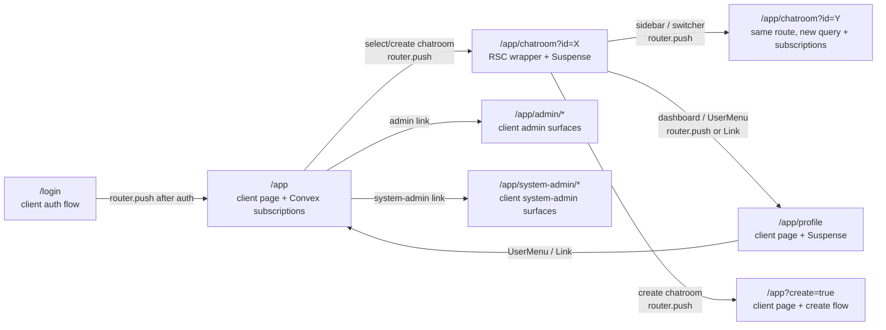

# Client-Side Rendering & Upfront Bundle — Discovery

**Status:** Discovery — architectural assessment (no implementation)<br>
**Branch:** `docs/csr-upfront-bundle-discovery`<br>
**Related:** [nextjs-conventions.md](../../developer/nextjs-conventions.md)<br>
**Backlog:** Discovery: assess if we can completely client side render the UI and load the bundle upfront

---

## 1. Goal

Assess whether the chatroom webapp can:

1. Fully client-side render all authenticated UI, eliminating server-component rendering for `/app/*` routes.
2. Load the JavaScript required by the authenticated shell upfront, so subsequent route and chatroom transitions feel instantaneous.

### Success criteria for “instantaneous transitions”

- No skeleton or spinner flash when navigating between `/app`, `/app/chatroom?id=...`, and `/app/profile`.
- No per-route JavaScript chunk fetch while moving within the authenticated shell.
- Clear separation between bundle fetch/parse, React loading boundaries, and Convex subscription warm-up.

### Non-goals

- Implementing CSR, prefetching, or bundle changes in this discovery.
- Replacing Next.js with Vite or CRA.
- Changing Convex data-fetching patterns.
- SEO optimization for marketing pages.

The assessment is based on source inspection and one successful production build. The build does not measure real-user navigation or subscription timing, so transition latency conclusions below are architectural and should be validated with browser instrumentation before implementation.

---

## 2. Current architecture (as-is)

### 2.1 Rendering model inventory

The authenticated route tree contains client-heavy pages, but it is not a pure client-side application. The root layout is a server component (fonts, metadata, and providers), the `/app` layout is a client component, and `/app/chatroom/page.tsx` is a server-component wrapper around a client page so that `useSearchParams()` can be used below a Suspense boundary. The `/app/admin` index is a server redirect to the users page.

`apps/webapp/src/app/app/loading.tsx` is inherited by all routes below `/app`; it is therefore a navigation boundary even where the leaf page is already a client component.

| Route                           | Page LOC | Page type                                               | Loading boundary                   | Suspense boundaries                                                             | Dynamic imports / split points                                                                    |
| ------------------------------- | -------: | ------------------------------------------------------- | ---------------------------------- | ------------------------------------------------------------------------------- | ------------------------------------------------------------------------------------------------- |
| `/app`                          |       18 | Client page                                             | Parent `/app/loading.tsx` (31 LOC) | `/app/layout.tsx`: `null` switcher fallback and `PageSpinner` children fallback | None in page                                                                                      |
| `/app/chatroom`                 |       13 | Server wrapper → `ChatroomPageClient` (108 LOC, client) | Parent `/app/loading.tsx`          | Page-level `PageSpinner`; app-layout `PageSpinner`                              | `ChatroomDashboard` has five `next/dynamic` imports; markdown and rich-text paths add lazy splits |
| `/app/profile`                  |      336 | Client page                                             | Parent `/app/loading.tsx`          | Page-level `ProfilePageLoading`; app-layout `PageSpinner`                       | None in page                                                                                      |
| `/app/admin`                    |        5 | Server redirect to `/app/admin/users`                   | Parent `/app/loading.tsx`          | App-layout `PageSpinner` can cover the destination                              | None                                                                                              |
| `/app/admin/invites`            |      103 | Client page; client admin layout (235 LOC)              | Parent `/app/loading.tsx`          | App-layout fallback; admin layout has auth/loading states                       | None in page                                                                                      |
| `/app/admin/users`              |      124 | Client page; client admin layout (235 LOC)              | Parent `/app/loading.tsx`          | App-layout fallback; admin layout has auth/loading states                       | None in page                                                                                      |
| `/app/system-admin`             |      156 | Client page; client system-admin layout (239 LOC)       | Parent `/app/loading.tsx`          | App-layout fallback; system-admin layout has auth/loading states                | None in page                                                                                      |
| `/app/system-admin/google-auth` |      942 | Client page; client system-admin layout (239 LOC)       | Parent `/app/loading.tsx`          | App-layout fallback; system-admin layout has auth/loading states                | None in page                                                                                      |

The page LOC counts are source line counts, not rendered payload sizes. The large Google Auth page and admin/system-admin layouts are useful indicators of route-specific code that can remain split until those areas are visited.

The root `apps/webapp/src/app/layout.tsx` is a server component. It owns document-level concerns that should remain server-compatible even if all authenticated leaf pages become client components. The `/app` layout remains mounted across many child transitions, but its child RSC segment and the client component tree can still suspend while a navigation is resolved.

### 2.2 Navigation flow (primary transitions)



There are two distinct chatroom transitions. Selecting a different chatroom uses the same route segment but changes the query parameter, while entering a chatroom from `/app` crosses a route boundary. Both can trigger client subscription changes; only the latter necessarily needs the chatroom route's client references. Imperative `router.push` calls are used by the app page, chatroom sidebar/switcher, and dashboard. `Link` is used in user and admin menus. Next can prefetch links, but an imperative selection is not itself evidence that the destination has already been prefetched.

### 2.3 Bundle and code-splitting analysis

The production build was run from the repository root:

```text
pnpm --filter webapp build
```

It completed successfully with Next.js 16.3.0 and Turbopack. The build output reported 39 prerendered/static route entries (including the `/app/*` routes) and four dynamic API route entries. A static marker here means Next generated an initial route shell; it does not mean that client components or Convex data are available without hydration.

The build output did not print route-by-route browser chunk sizes. The emitted `.next/static/chunks` directory was inspected immediately after the build:

| Artifact                               |                      Observed output |
| -------------------------------------- | -----------------------------------: |
| JavaScript chunk files                 |                                  492 |
| JavaScript total, uncompressed on disk |         21,760,108 bytes (20.75 MiB) |
| CSS chunk files                        |                                    2 |
| CSS total, uncompressed on disk        |             224,948 bytes (0.21 MiB) |
| Largest JavaScript chunk               | 1,474,009 bytes (`1tdsuglltf3y5.js`) |
| Next-largest JavaScript chunks         |      790,476 bytes and 786,777 bytes |

These are emitted-file sizes, not transfer sizes: production compression and browser caching will change network cost. Chunk filenames are build artifacts and are not stable API names. The practical finding is that “load everything upfront” would move a sizeable amount of code into the first-load budget, while Next's current split points allow infrequently used administration and workspace features to stay out of the critical path.

The primary chatroom split points are in `apps/webapp/src/modules/chatroom/ChatroomDashboard.tsx`:

- `components/AgentSettingsModal`
- `components/SetupChecklistModal`
- `workspace/components/FileExplorerPanel`
- `workspace/components/panels/PullRequestsPanel`
- `workspace/components/panels/ProcessesPanel`

Additional chatroom split points include `RichTextEditor` via `next/dynamic` in `components/detail-modal-shared.ts` and Mermaid rendering via React `lazy` in `components/markdown-utils.tsx`. These are interaction- or content-triggered costs, not necessarily costs on every route transition. Removing them would improve the first open of the associated feature only if their code is included in the initial route bundle; it would also increase initial parse and execution work.

The root and `/app` layouts establish shared client providers, so moving between child routes can reuse that mounted shell. Automatic App Router route splitting still means a new route segment may need its RSC payload and client references. `next/link` prefetching and explicit `router.prefetch` can reduce that fetch on likely paths, but neither makes Convex subscriptions instantaneous.

### 2.4 Latency source breakdown

| Source                                    | Evidence in this codebase                                                                                                                 | Affected transition                                                                     | Severity for perceived delay                          | Fixable without full CSR?                                                                              |
| ----------------------------------------- | ----------------------------------------------------------------------------------------------------------------------------------------- | --------------------------------------------------------------------------------------- | ----------------------------------------------------- | ------------------------------------------------------------------------------------------------------ |
| Server/RSC route resolution               | Server root layout; server chatroom page wrapper; App Router navigation protocol                                                          | All child route changes; most visible on entering chatroom                              | Medium                                                | Partially. A client shell can hide route resolution, but App Router still has server involvement       |
| `/app/loading.tsx` fallback               | One loading file inherited by all `/app/*` descendants                                                                                    | Any navigation that crosses a loading boundary                                          | High when it flashes a spinner                        | Yes. Replace with a stable shell or tune the boundary; removing it trades away a failure/loading state |
| Suspense fallbacks                        | `PageSpinner` in `/app/layout.tsx` and chatroom page; `ProfilePageLoading` in profile                                                     | Chatroom and profile entry, plus any suspended child                                    | High when old content is replaced by a spinner        | Partially. Keep stable chrome and use local placeholders instead of a full-page fallback               |
| Route JavaScript fetch/parse              | Next automatic route splitting; 492 emitted JS chunks in build artifact                                                                   | First visit to a route or feature                                                       | Medium on cold navigation; low when prefetched/cached | Yes. Prefetch likely routes or load selected feature chunks during idle time                           |
| Chatroom feature chunks                   | Five `next/dynamic` imports plus rich-text/Mermaid lazy paths                                                                             | First open of settings, setup, file explorer, pull requests, processes, or rich content | Medium, localized to first feature use                | Yes, selectively. Eager-load only high-frequency features; retain lazy loading for heavy/rare features |
| Convex subscription warm-up and hydration | App/layout providers and client pages subscribe to chatroom, auth, profile, admin, and workspace data                                     | Initial app entry, chatroom switch, and data-dependent screens                          | High and inherent to fresh data                       | No through CSR alone. Optimize query shape, subscription scope, caching, and loading UI                |
| Auth/session checks and redirects         | `RequireLogin` in app layout; admin/system-admin layouts check permissions and redirect; `/app` index redirects to chatroom when selected | Login → app and protected admin transitions                                             | Medium                                                | Partially. Keep auth gate mounted and prefetch only after session is known                             |
| Network/cache state                       | First load has no browser cache; repeat visits may reuse framework chunks                                                                 | Cold start and offline/poor network                                                     | Variable                                              | Partially. Caching/service-worker work can reduce repeat-load cost but cannot replace live data        |

The important distinction is that CSR can remove or conceal some framework work, but it cannot make a new Convex subscription have data before the server responds. A fast route transition with an empty chatroom is not an instantaneous user experience; the shell and data states need separate measurement.

---

## 3. Feasibility assessment

### 3.1 Full CSR for `/app/*`

**Verdict: Partial, with high confidence.** The visual surfaces under `/app/*` are already predominantly client components, so converting the remaining chatroom wrapper to an all-client page is technically feasible. It would not, by itself, produce a pure SPA:

- Next's root layout remains a server component for document metadata, fonts, and the application shell's server boundary.
- App Router navigation still exchanges an RSC payload even when the selected page is a client component.
- Auth callback routes and API routes remain server-side.
- Redirects and access-control behavior in admin and system-admin routes still need to be preserved.
- Removing Suspense boundaries would not remove Convex subscription latency; it would only change which UI is shown while waiting.

Literal full CSR for the authenticated experience requires a mounted client-side route shell that owns route state and renders the major screens without using App Router child navigation as the primary transition mechanism. That is a larger architectural change than adding `'use client'` to page files and would need explicit decisions about URLs, history, deep links, refresh, auth expiry, and error recovery.

### 3.2 Upfront bundle loading options

| Option                                                                                                                      | Effort      | Initial bundle / runtime impact                                                                     | Transition improvement                                                                  | Assessment                                                                                          |
| --------------------------------------------------------------------------------------------------------------------------- | ----------- | --------------------------------------------------------------------------------------------------- | --------------------------------------------------------------------------------------- | --------------------------------------------------------------------------------------------------- |
| **A. Single-page authenticated shell** — keep `/app` mounted and switch major screens from client state                     | High        | Highest JS and memory residency; more code parses up front                                          | Can remove most child-route RSC and route-chunk fetches after shell load                | Viable if instantaneous transitions justify SPA-like complexity; still waits for Convex data        |
| **B. Prefetch likely routes and dynamic modules after auth** — `router.prefetch`, link hover/visibility, or idle `import()` | Low–medium  | Adds background bandwidth and cache pressure; preserves split points                                | Good for first navigation to known hot paths; no benefit to uncached data subscriptions | Recommended first experiment; scope to `/app`, chatroom, and profile, then measure                  |
| **C. Remove selected `dynamic()` imports** — eagerly include frequently used chatroom panels                                | Low–medium  | Larger chatroom entry and higher parse/execute cost; less deferred work                             | Removes the first-open fetch for chosen panels only                                     | Use selectively. Keep rare/heavy panels and editors lazy                                            |
| **D. Custom webpack splitChunks configuration**                                                                             | Medium–high | May alter cache boundaries and make upgrades harder to reason about; this app builds with Turbopack | No guaranteed reduction in route or RSC latency; can regress caching                    | Not recommended as a first move; Next/Turbopack owns the current chunk graph                        |
| **E. Stable authenticated shell/loading UI** — retain routing but avoid replacing the whole view with a spinner             | Low         | Negligible bundle change                                                                            | Strong perceived improvement even when RSC or data work remains                         | Recommended alongside prefetch; it addresses the success criterion without pretending data is ready |

### 3.3 What “completely CSR” means in practice

There are three different claims that should not be conflated:

1. **Client page:** a route's UI component has `'use client'` and hydrates in the browser. Most authenticated leaf pages already meet this.
2. **Client shell:** a persistent authenticated component owns common navigation and can render major views while route data changes. This can hide some App Router transition work and is a realistic incremental direction.
3. **No-server SPA:** the browser owns routing and rendering after the initial document, with no child-route RSC requests. This is the literal interpretation of “completely CSR” and would require an explicit SPA-shell architecture, not only page directives.

The third option does not eliminate server requirements. The root document, auth/session establishment and expiry, callback handlers, API endpoints, deployment headers, and server-side error boundaries still exist. It also does not eliminate Convex network work. The useful product target is therefore “instant stable shell with data-aware loading,” rather than “no server work at all.”

---

## 4. Tradeoffs

| Dimension              | Current App Router hybrid                                                                       | Full CSR + upfront authenticated bundle                                                                                           |
| ---------------------- | ----------------------------------------------------------------------------------------------- | --------------------------------------------------------------------------------------------------------------------------------- |
| Initial load / TTI     | Smaller critical client graph; browser can begin with route shell, then hydrate and subscribe   | Larger transfer/parse/execute cost before the first interactive screen; especially expensive on mobile or cold cache              |
| Transition latency     | RSC/loading/Suspense and occasional route chunks can be visible; mounted app layout is reusable | Potentially no child-route fetch after shell load; route data and Convex subscriptions still take time                            |
| Bundle size            | Automatic splitting keeps admin, system-admin, and feature panels deferred                      | More code resident up front; fewer deferred fetches and potentially worse cache efficiency                                        |
| SEO / public pages     | Preserves server rendering choices for marketing and public routes                              | Can leave public routes hybrid, but a broad SPA migration risks server-rendering and metadata regressions                         |
| Auth / session         | Existing `RequireLogin`, redirects, and server callback boundaries remain aligned with Next     | Client route ownership must preserve deep links, refresh, expiry, unauthorized states, and callback handoff                       |
| Development experience | Follows framework conventions; route-level ownership is clear                                   | More custom routing/state coordination, more invalidation and error states to test                                                |
| PWA / service worker   | Framework chunks and cache policy can be evolved independently                                  | A precached app shell can improve repeat/offline behavior but increases install/update size and cache invalidation responsibility |
| Failure behavior       | Loading and error boundaries can isolate route/data failures                                    | A single shell can make transitions smooth but must explicitly handle route, chunk, auth, and data failures                       |

---

## 5. Recommendation

### Verdict

**Partially recommended — high confidence.** Invest in an instant-feeling authenticated shell and targeted prefetching, not in loading every `/app/*` chunk at login or rewriting the whole app as a no-server SPA. The current architecture already provides much of the client rendering benefit. The largest user-visible gains are likely to come from stable loading boundaries and warming the small set of likely route/feature chunks; Convex hydration must be measured and optimized separately.

### Phased approach

#### Phase 0: measure and remove avoidable flashes

1. Instrument navigation from intent (`router.push`/link click) to route shell painted, first meaningful UI, and Convex data ready. Record cold cache, warm cache, and chatroom switch separately.
2. Replace full-page spinner replacement with a stable authenticated shell or route-local skeleton where the existing layout allows it. Preserve explicit loading and error states.
3. Add targeted `router.prefetch` for the most likely `/app`, chatroom, and profile destinations after authentication and on hover/intent. Confirm that prefetch does not create excessive Convex subscriptions.

#### Phase 1: warm only high-frequency feature code

1. After a chatroom is mounted and the browser is idle, preload the most frequently opened panel module(s).
2. Keep setup, process, pull-request, file-explorer, rich-text, and Mermaid code deferred if usage data shows they are uncommon or expensive.
3. Re-measure JavaScript transfer, parse/execute time, first interaction, and data readiness. Use the build artifact as a budget baseline, not as a proxy for user timing.

#### Phase 2: evaluate a persistent client shell

If Phase 0 shows RSC/route resolution remains a material contributor after boundaries and prefetch are improved, prototype a persistent client shell for the authenticated chatroom workflow. Keep canonical URLs and App Router entry points for deep links, refresh, auth failures, and secondary admin pages. Only expand to SPA-owned route state if measured gains justify the added ownership and test surface.

### Quick wins that can ship independently

- Targeted route prefetch after login: expected to reduce cold first-navigation fetch time, with moderate bandwidth cost.
- Prefetch on explicit chatroom/profile intent: expected to improve perceived response without loading all routes for every user.
- Stable layout-preserving loading states: expected to remove spinner flashes, with negligible bundle cost.
- Idle preload of one or two high-use chatroom panels: expected to move a feature's first-open delay into idle time; validate against mobile CPU/bandwidth budgets.
- Navigation and subscription timing telemetry: no direct UX change, but necessary to identify whether route code or Convex hydration is the dominant delay.

### Not worth doing initially

- Loading all 492 build-generated JavaScript chunks at app start: it spends bandwidth and parse time on admin, system-admin, and rarely used workspace features for every user.
- Removing every `dynamic()` or `lazy()` boundary: it trades localized first-use delay for slower initial TTI and larger memory use.
- Removing all Suspense/loading boundaries: it may hide a spinner while producing blank or stale UI, and it does not shorten Convex response time.
- Custom chunk-graph surgery before measurement: Turbopack owns this build and custom splitting adds maintenance risk without a guaranteed transition win.
- Replacing Next.js globally: it is outside the stated goal and would duplicate existing auth, metadata, API, and deployment responsibilities.

---

## 6. Open questions for user

1. What is the acceptable additional first-load transfer and parse budget for the authenticated shell, especially on mobile and slow networks?
2. Which transitions are highest priority: login → app, app → first chatroom, switching chatrooms, chatroom → profile, or opening workspace panels?
3. Is “instantaneous” defined as the old shell remaining visible immediately, the destination shell appearing immediately, or the destination data being ready immediately? These have different implementations and metrics.
4. Should admin and system-admin routes be included in any upfront-loading budget, or remain explicitly deferred?
5. Are background network requests after login acceptable for prefetching, and should they be disabled on metered connections or when the app is not in the foreground?
6. Does the product require meaningful offline/PWA behavior, or is the goal limited to warm online navigation? A precached shell has update and storage implications.
7. What current navigation and Convex hydration timings should be treated as the baseline, and what percentile target (for example, p75 or p95) defines success?
