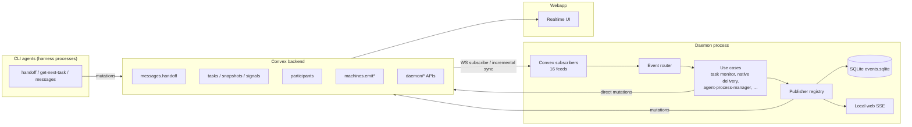
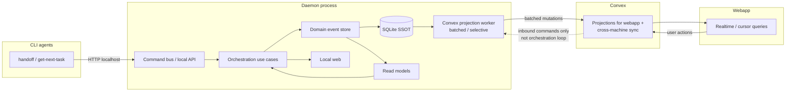

# Daemon-Centric Orchestration — Discovery

**Status:** Discovery — architectural decisions resolved (no implementation)  
**Branch:** `docs/daemon-centric-orchestration-discovery`  
**Related:** [Convex → Daemon incremental sync](../../../packages/cli/src/infrastructure/incremental-sync/README.md), [daemon persistence](../../../packages/cli/src/daemon/infrastructure/persistence/README.md), [local web](../../../packages/cli/src/daemon/local-web/README.md)  
**Plan folder:** [overview.md](./overview.md) · [phases/](./phases/) · discovery (this doc)

---

## 1. Goal

Move from a **Convex-mediated orchestration loop** (daemon writes state → Convex → daemon subscribes for signals → acts) to a **daemon-centric model** where:

1. **Orchestration runs inside the daemon** — handoffs, task delegation, agent start/stop, reminders, nudges, enhancer jobs, command runs, and native task delivery are decided and executed locally.
2. **The daemon publishes events to a local server** (in-process today; same process as daemon) for **persistence** (SQLite) and optional local UI (SSE).
3. **A sync layer** (initially co-located with persistence) **selectively projects** durable facts to Convex — batched, rate-limited, and categorized by sync priority — rather than realtime round-trips for every lifecycle tick.
4. **Bandwidth is controllable** — high-frequency data (harness streams, presence heartbeats, timeline signals) stays local or is summarized before Convex projection.
5. **SQLite is the local source of truth** for high-volume and recoverable state; Convex remains the multi-user, cross-machine, and webapp-facing store.

### Why now

| Pain today                                                                                                               | Daemon-centric benefit                                                                                  |
| ------------------------------------------------------------------------------------------------------------------------ | ------------------------------------------------------------------------------------------------------- |
| Task monitor, native delivery, and agent lifecycle each maintain **working snapshots** fed by Convex WS + HTTP reconcile | Single local event log + read models; Convex becomes a **projection target**, not the orchestration bus |
| Handoff CLI (`api.messages.handoff`) mutates Convex; daemon **reacts** via assigned-task signal/presence feeds           | Handoff becomes a **local command** that updates local state and enqueues a Convex projection           |
| Many `api.machines.emit*` mutations per agent lifecycle event                                                            | Lifecycle events append locally; sync worker batches/emits                                              |
| Harness stdout/stderr is console-only or high-churn if synced                                                            | Already modeled as `harness.stream` → SQLite + local-web SSE; extend pattern                            |
| Incremental sync reduced **wire** bandwidth but not always **DB read** cost on Convex                                    | Local SSOT allows Convex to receive **coarser** updates                                                 |

### Non-goals (this discovery)

- Implementation plan with file-by-file migration order
- Changing webapp real-time UX requirements
- Replacing Convex as the multi-user cloud database
- Moving workspace git/file fulfillment fully offline (still needs cloud coordination for webapp-initiated requests)

---

## 2. Current architecture (as-is)

### 2.1 Control-flow overview



**Pattern today:** Convex is both **orchestration bus** and **durable store**. The daemon is a **reactive executor** that subscribes to nudges, fetches action payloads, mutates Convex with outcomes, and waits for the next signal.

### 2.2 Existing v2 building blocks (already in repo)

| Component            | Path                                                        | Role today                                                          |
| -------------------- | ----------------------------------------------------------- | ------------------------------------------------------------------- |
| Inbound event model  | `packages/cli/src/daemon/domain/entities/inbound-event.ts`  | Normalized Convex→daemon facts                                      |
| Outbound event model | `packages/cli/src/daemon/domain/entities/outbound-event.ts` | Daemon→publisher facts                                              |
| Subscriber registry  | `packages/cli/src/daemon/entry/subscriber-registry.ts`      | 16 Convex WS subscribers → event router                             |
| Event router         | `packages/cli/src/daemon/entry/event-router.ts`             | Routes inbound events to domain use cases                           |
| Publisher registry   | `packages/cli/src/daemon/entry/publisher-registry.ts`       | Routes outbound events → SQLite + Convex publishers                 |
| Persistence          | `packages/cli/src/daemon/infrastructure/persistence/`       | Append-only events + outbox (`target: convex`, **drain not wired**) |
| Local web            | `packages/cli/src/daemon/local-web/`                        | SSE for `harness.stream`; reads SQLite history                      |
| Incremental sync     | `packages/cli/src/infrastructure/incremental-sync/`         | Cursor-pinned WS feeds (assigned-task signals/presence)             |

The daemon module already follows **partial clean architecture** (domain entities/use cases, infrastructure adapters, entry composition). The gap is that **orchestration authority** still lives in Convex for most flows.

---

## 3. Target architecture (to-be)

### 3.1 Control-flow overview



**Principles:**

- **Write path:** command → use case → append domain event → update read model → (async) enqueue projection.
- **Read path (orchestration):** read models in SQLite/memory, not Convex subscriptions.
- **Convex role:** multi-user visibility, webapp queries, cross-machine facts, and **inbound user intents** (messages, workspace file requests) — not per-tick agent lifecycle.
- **Fallback:** if Convex is unreachable, daemon continues orchestrating; projections catch up when online.

### 3.2 Sync tiers (proposal)

| Tier                    | Examples                                                     | Convex behavior                                                       |
| ----------------------- | ------------------------------------------------------------ | --------------------------------------------------------------------- |
| **T0 — local only**     | Harness stdout/stderr lines, debug traces                    | Never sync; SQLite + local-web only                                   |
| **T1 — batched low**    | Presence heartbeats, `lastSeenAt`, stream checkpoints        | Aggregate per role/chatroom; flush every N seconds                    |
| **T2 — batched medium** | Restart phases, delivery telemetry, stream checkpoints       | Outbox with debounce; idempotent projection mutations                 |
| **T3 — immediate**      | Handoff messages, new user messages, enhancer job completion | Project quickly for webapp; still via outbox for retry                |
| **T4 — on-demand**      | Workspace git/file requests from webapp                      | Remains Convex-initiated → daemon fulfills (inbound), not moved in v1 |

**Realtime SLI (locked):** The following projection types are **T3 — immediate** (webapp must see updates in realtime):

- **Task status** — task lifecycle transitions, delivery outcomes visible in UI
- **Agent status** — participant presence, turn phase, native agent lifecycle
- **Messages** — handoffs, user messages, task delivery content

All other types use T0 (local only), T1/T2 (batched), or T4 (on-demand inbound) as listed above.

### 3.3 Resolved architectural decisions

| Decision                  | Resolution                                                                                                                                                                  |
| ------------------------- | --------------------------------------------------------------------------------------------------------------------------------------------------------------------------- |
| **CLI→daemon transport**  | HTTP server on localhost (harness commands call daemon HTTP API)                                                                                                            |
| **Handoff migration**     | No dual-write. CLI calls daemon HTTP → daemon executes handoff locally (SQLite SSOT) → projection worker syncs to Convex (eventual consistency). Daemon is source of truth. |
| **Enhancer queue**        | Fully local — daemon owns enqueue, claim, and spawn; Convex receives projection only                                                                                        |
| **Webapp realtime SLI**   | Task status, agent status, and messages are **realtime** (T3 immediate). All other projection types use batch tiers (T0–T2, T4).                                            |
| **Shared domain package** | Not needed. Daemon maintains its own domain layer; do not extract shared rules to `services/backend/src/domain`. Domains remain separate.                                   |

---

## 4. Surface area inventory

### 4.1 Convex → Daemon (inbound signals)

All subscribers are registered in `subscriber-registry.ts` and map to `InboundEvent` types.

| Subscriber            | Convex API (subscribe target)                         | Inbound event                  | Primary handler / runtime            |
| --------------------- | ----------------------------------------------------- | ------------------------------ | ------------------------------------ |
| Command events        | `machines.getCommandEvents`                           | `command.received`             | `command-dispatch.ts`                |
| Command runs          | `daemon.commands.listActionableCommandRuns`           | `command-run.updated`          | `command-run-subscription.ts`        |
| Agentic query session | `daemon.agenticQuery.runs.pendingForMachine`          | `agentic-query.session-opened` | `agentic-query/session-processor.ts` |
| Agentic query prompt  | `daemon.agenticQuery.messages.pendingForMachine`      | `agentic-query.prompt`         | `agentic-query/prompt-drain.ts`      |
| Enhancer job          | `daemon.enhancer.index.pendingForMachine`             | `enhancer.job-assigned`        | `enhancer/job-subscriber.ts`         |
| Workspace list        | `workspaces.listRecentlyObservedWorkspacesForMachine` | `workspace.list-changed`       | `workspace-list-subscription.ts`     |
| Git request           | `workspaces.getPendingRequests`                       | `git.request`                  | `git-subscription.ts`                |
| File tree request     | `workspaceFiles.getPendingFileTreeRequests`           | `file-tree.request`            | `file-tree-subscription.ts`          |
| File content request  | `workspaceFiles.getPendingFileContentRequests`        | `file-content.request`         | `file-content-fulfillment.ts`        |
| File write request    | `workspaceFiles.getPendingFileWriteRequests`          | `file-write.request`           | `file-write-fulfillment.ts`          |

> Direct-harness session, prompt, and command subscribers were removed in
> v1.102.0. Agentic query work now uses the `daemon.agenticQuery.*` feeds and
> capability refresh uses `web.harnessCapabilities.*`.

**Enhancer (migration target):** Subscriber `enhancer.job-assigned` will be replaced by local queue; Convex projection for visibility only.

**Additional inbound (not via subscriber registry):**

| Source                             | Convex API                                                  | Consumer                                            |
| ---------------------------------- | ----------------------------------------------------------- | --------------------------------------------------- |
| Task monitor snapshot store        | `machines.listMachineAssignedTaskSnapshots` (WS `onUpdate`) | `task-monitor-runtime.ts`                           |
| Action fetch (on nudge/inject)     | `machines.getAssignedTaskForAction`                         | Task monitor, native delivery, restart orchestrator |
| Command run drain (legacy HTTP)    | `daemon.commands.listActionableCommandRuns`                 | `command-run-subscription.ts`                       |
| Log observers                      | `daemon.commands.listRunsWithLogObservers`                  | `log-observer-subscription.ts`                      |
| Init prompt / task delivery prompt | `messages.getInitPrompt`, `messages.getTaskDeliveryPrompt`  | Agent spawn, native task injector                   |
| Workspace lookup                   | `workspaces.getWorkspaceById`                               | Agentic query                                       |
| Enhancer claim/payload             | `daemon.enhancer.index.claimForSpawn`, `getSpawnPayload`    | `enhancer/job-subscriber.ts`                        |

### 4.2 Daemon → Convex (outbound)

#### 4.2.1 Publisher registry (`OutboundEvent` → Convex)

| Outbound event type                             | Convex publisher                      | Convex API                                                                        |
| ----------------------------------------------- | ------------------------------------- | --------------------------------------------------------------------------------- |
| `heartbeat`                                     | `daemon-heartbeat.ts`                 | `machines.daemonHeartbeat`                                                        |
| `task.status`                                   | `assigned-task-status.ts`             | `machines.emitTaskDelivered`, `emitTaskDeliveryFailed`                            |
| `git.state`                                     | `git-state.ts`                        | `workspaces.upsertWorkspaceGitState`                                              |
| `models.updated`, `harness.fingerprint.updated` | `models.ts`, `harness-fingerprint.ts` | `machines.refreshCapabilities`                                                    |
| `command.result.*`                              | `command-result.ts`                   | `machines.ackPing`, `reportFolderPickerResult`, `reportCapabilitiesRefreshResult` |
| `workspace.commands`                            | `workspace-commands.ts`               | `commands.syncCommands`                                                           |
| `harness.stream`                                | _(local only today)_                  | SQLite + SSE; **not** Convex                                                      |

#### 4.2.2 Direct mutations (bypass publisher registry)

These are high-churn orchestration writes — primary migration targets.

**Agent process manager** (`agent-process-manager.ts`):

| Mutation                                             | Purpose                                     |
| ---------------------------------------------------- | ------------------------------------------- |
| `participants.handleNativeAgentEnd`                  | Turn end, missed-handoff reminder injection |
| `machines.recordAgentExited`                         | Agent process exit                          |
| `machines.updateSpawnedAgent`                        | PID / spawn metadata                        |
| `machines.emitAgentStartFailed`                      | Spawn failure                               |
| `machines.emitSessionResumeRequested/Resumed/Failed` | Session resume lifecycle                    |
| `machines.emitSessionReopenRetry`                    | Reopen retry                                |
| `machines.emitHarnessSessionIdUpdated`               | Harness session binding                     |
| `machines.emitRestartLimitReached`                   | Restart guard                               |
| `machines.emitAgentStopTimeout`                      | Stop timeout                                |
| `messages.getInitPrompt`                             | Bootstrap prompt fetch                      |

**Task monitor & native delivery** (`task-monitor-runtime.ts`, `native-task-injector.ts`, `restart-orchestrator.ts`):

| Mutation / query                                        | Purpose                                      |
| ------------------------------------------------------- | -------------------------------------------- |
| `machines.emitSessionAugmented`                         | Session augmentation after delivery          |
| `machines.emitTaskDelivered` / `emitTaskDeliveryFailed` | Task delivery outcomes                       |
| `machines.syncMachineAssignedTaskSnapshotsMutation`     | Snapshot projection sync                     |
| `machines.listMachineAssignedTaskSnapshots`             | Reconcile                                    |
| `machines.getAssignedTaskForAction`                     | Fat payload fetch                            |
| `machines.emitRestartPhase` / `emitRestartCompleted`    | Restart orchestration                        |
| `participants.join`                                     | Ensure participant row before delivery/nudge |

**Presence** (`native-spawn-presence.ts`):

| Mutation                           | Purpose               |
| ---------------------------------- | --------------------- |
| `participants.join`                | Register native agent |
| `participants.updateTokenActivity` | Heartbeat             |

**Workspace git** (`git-subscription.ts`, `git-heartbeat.ts`, `commit-detail-sync.ts`):

| APIs                                                                                                                                                          | Purpose                                            |
| ------------------------------------------------------------------------------------------------------------------------------------------------------------- | -------------------------------------------------- |
| `workspaces.getPendingRequests`, `updateRequestStatus`, `resetProcessingRequests`                                                                             | Git sync job queue                                 |
| `workspaces.upsertFullDiffV2`, `upsertPRDiff`, `upsertCommitDetailV2`, `upsertRecentCommits`, `upsertAllPullRequests`, `upsertPRCommits`, `appendMoreCommits` | Git state projection                               |
| `workspaces.upsertWorkspaceGitState`                                                                                                                          | Branch/status heartbeat                            |
| `workspaces.registerWorkspace`                                                                                                                                | Workspace registration (`agent-control-bridge.ts`) |

**File fulfillment** (`file-tree-subscription.ts`, `file-content-fulfillment.ts`, `file-write-fulfillment.ts`):

| APIs                                                               | Purpose                   |
| ------------------------------------------------------------------ | ------------------------- |
| `workspaceFiles.*` (claim, fulfill, sync, checkpoint, delta batch) | Webapp-initiated file ops |

**Agentic query / enhancer / commands** (entry processors):

| Area          | Key APIs                                                 |
| ------------- | -------------------------------------------------------- |
| Agentic query | `daemon.agenticQuery.*` session/message processing       |
| Enhancer      | `daemon.enhancer.index.claimForSpawn`, `getSpawnPayload` |
| Commands      | `daemon.commands.updateRunTail`                          |

**Shutdown / lifecycle** (`on-daemon-shutdown.ts`, `shutdown-sessions.ts`):

| API                           | Purpose        |
| ----------------------------- | -------------- |
| `machines.updateDaemonStatus` | Offline marker |

### 4.3 CLI commands that talk to Convex directly (bypass daemon)

These run inside agent harness processes, not the daemon. They are **orchestration entry points** that today mutate Convex and rely on daemon subscribers to react.

| Command                   | Key Convex APIs                                                                                              | Daemon reaction                                        |
| ------------------------- | ------------------------------------------------------------------------------------------------------------ | ------------------------------------------------------ |
| `chatroom handoff`        | `messages.handoff` (atomic: complete tasks, insert handoff, create tasks, enhancer enqueue)                  | Assigned-task signals → task monitor / native delivery |
| `chatroom get-next-task`  | `tasks.getPendingTasksForRole`, `tasks.claimTask`, `messages.claimMessage`, `messages.getTaskDeliveryPrompt` | May spawn work; daemon delivers via native injector    |
| `chatroom messages *`     | `messages.listBySenderRole`, `listSinceMessage`, `getLastUserMessage`                                        | Read-only for agents                                   |
| `chatroom context *`      | `messages.getContextForRole`                                                                                 | Read-only                                              |
| `chatroom task read`      | `tasks.readTask`                                                                                             | Task acknowledgment                                    |
| `chatroom backlog *`      | `tasks.listHistoricalTasks`, backlog mutations                                                               | Mixed                                                  |
| `chatroom register-agent` | `machines.recordRemoteAgentRegistered`, `recordCustomAgentRegistered`                                        | Daemon tracks agents                                   |

**Migration note:** `handoff` and `get-next-task` are the highest-impact commands to route through daemon-local orchestration instead of Convex-first mutations.

**Transport (resolved):** `handoff` and `get-next-task` will call daemon HTTP on localhost; daemon writes to SQLite first, then projects to Convex asynchronously.

### 4.4 Convex schema tables (orchestration-relevant)

| Table / feed                            | Role in loop                              |
| --------------------------------------- | ----------------------------------------- |
| `chatroom_tasks`                        | Task queue, statuses, assignment          |
| `chatroom_messages`                     | Handoffs, user messages, task content     |
| `chatroom_machineAssignedTaskSnapshots` | Slim daemon-facing projection             |
| `chatroom_timelineTaskStatusSignals`    | Incremental task status signals           |
| `chatroom_participants`                 | Presence, native turn phase, `lastSeenAt` |
| `chatroom_enhancerJobs`                 | Async enhancer queue                      |
| `machines` / agent events               | Lifecycle telemetry (`emit*` targets)     |
| `daemon.agenticQuery.*`                 | Agentic search sessions                   |
| `daemon.commands.*`                     | Saved command runs                        |
| Workspace / file tables                 | Git and explorer sync                     |

---

## 5. Flow-by-flow migration map

| Flow                        | Current path                                                             | Target (daemon-centric)                                                                                       | Complexity |
| --------------------------- | ------------------------------------------------------------------------ | ------------------------------------------------------------------------------------------------------------- | ---------- |
| **Handoff planner→builder** | CLI `messages.handoff` → Convex → signal subscriber → native delivery    | CLI → daemon command → local handoff use case → append events → project handoff message + task rows to Convex | High       |
| **Task delivery / nudge**   | Convex snapshots + signals → task monitor → inject + `emitTaskDelivered` | Local task read model → nudge scheduler → inject; project delivery outcome (batched)                          | High       |
| **Missed handoff reminder** | `handleNativeAgentEnd` → Convex → (implicit) next turn                   | Local turn-end handler → schedule reminder without Convex round-trip                                          | Medium     |
| **Agent start/stop**        | APM ↔ `machines.updateSpawnedAgent`, `recordAgentExited`, many `emit*`   | APM emits local lifecycle events; sync worker projects subset to Convex                                       | High       |
| **Restart orchestrator**    | Direct `emitRestartPhase/Completed` + snapshot sync                      | Local restart state machine; project phases                                                                   | Medium     |
| **Enhancer job**            | Convex pending → subscriber → spawn                                      | Fully local job queue in daemon; Convex projection for webapp visibility only                                 | Medium     |
| **Agentic query**           | Convex pending queues → drain loops                                      | Local session queues with Convex as backup/projection                                                         | Medium     |
| **Command runs**            | Convex actionable runs → drain                                           | Local command inbox; project status                                                                           | Medium     |
| **Workspace git/file**      | Convex request queue → fulfill → upsert                                  | **Likely stays inbound-from-Convex** in v1; batch upserts                                                     | Low–Med    |
| **Harness stream**          | SQLite + SSE (done)                                                      | Extend to other high-frequency types                                                                          | Low        |

---

## 6. Clean architecture proposal

### 6.1 Layer responsibilities

| Layer                   | Responsibility                                                                                     | Depends on                   |
| ----------------------- | -------------------------------------------------------------------------------------------------- | ---------------------------- |
| **Domain**              | Entities, value objects, domain events, invariants, use case interfaces                            | Nothing external             |
| **Application**         | Use case implementations orchestrating domain + ports                                              | Domain                       |
| **Ports**               | Interfaces: `EventStore`, `TaskRepository`, `HandoffService`, `ProjectionQueue`, `AgentSpawner`, … | Domain types                 |
| **Infrastructure**      | SQLite, Convex projection adapter, process spawn, filesystem, HTTP local server                    | Ports                        |
| **Entry / composition** | `start-daemon.ts`, wiring, subscriber migration shims                                              | Application + Infrastructure |

**Dependency rule:** Domain ← Application ← Ports ← Infrastructure. Entry composes at the edge.

### 6.2 Proposed folder structure

Evolves current `packages/cli/src/daemon/` layout; new folders marked **(new)**.

```
packages/cli/src/daemon/
├── domain/
│   ├── entities/              # existing: inbound-event, outbound-event, assigned-task, …
│   ├── events/                # (new) domain events: HandoffCompleted, TaskDelivered, AgentStarted, …
│   ├── value-objects/         # (new) TaskId, ChatroomId, Role, SyncTier, …
│   └── errors/                # (new) typed domain failures
│
├── application/               # (new) rename/clarify from domain/usecase/
│   ├── ports/
│   │   ├── event-store.port.ts
│   │   ├── task-read-model.port.ts
│   │   ├── handoff.port.ts
│   │   ├── agent-lifecycle.port.ts
│   │   ├── projection-queue.port.ts
│   │   └── inbound-sync.port.ts      # Convex→daemon commands (file/git requests)
│   └── use-cases/
│       ├── handoff/
│       │   ├── execute-handoff.ts
│       │   └── complete-handoff-to-user.ts
│       ├── tasks/
│       │   ├── deliver-task.ts
│       │   ├── nudge-stuck-task.ts
│       │   └── claim-next-task.ts
│       ├── agents/
│       │   ├── start-agent.ts
│       │   ├── stop-agent.ts
│       │   └── handle-turn-end.ts
│       ├── restart/
│       │   └── orchestrate-restart.ts
│       └── sync/
│           └── enqueue-projection.ts
│
├── infrastructure/
│   ├── persistence/           # existing SQLite — extend schema for read models
│   │   ├── event-store.ts
│   │   ├── outbox.ts
│   │   ├── read-models/       # (new) task, participant, agent snapshots
│   │   └── schema.ts
│   ├── projection/            # (new)
│   │   ├── convex/
│   │   │   ├── outbox-drain-worker.ts
│   │   │   ├── mappers/         # domain event → Convex mutation args
│   │   │   └── handlers/        # per event type
│   │   └── sync-policy.ts       # tier rules, batching, debounce
│   ├── inbound/                 # (new) replaces convex/subscribers over time
│   │   ├── convex/
│   │   │   └── user-intent-subscribers.ts   # webapp-originated only
│   │   └── local/
│   │       └── cli-command-server.ts        # HTTP localhost API for handoff/get-next-task
│   ├── agents/                  # agent-process-manager (existing path)
│   ├── local/                   # harness services (existing)
│   └── convex/                  # transitional: publishers + subscribers
│       ├── publishers/          # shrink → projection handlers
│       └── subscribers/         # shrink → inbound user-intent only
│
├── entry/                       # existing composition root
│   ├── start-daemon.ts
│   ├── command-router.ts        # (new) local CLI/daemon commands
│   ├── subscriber-registry.ts   # transitional
│   ├── publisher-registry.ts    # becomes local event bus facade
│   └── …
│
└── local-web/                   # existing — local UI over read models
```

> **Note:** Detailed target structure with migration mapping and open questions is in [overview.md](./overview.md).

### 6.3 Shared contracts (cross-cutting)

- **`DomainEvent`** — append-only, typed union (separate from transport `OutboundEvent` during migration).
- **`ProjectionEnvelope`** — `{ eventId, target: 'convex', tier, payload, idempotencyKey }` in outbox.
- **`Read models`** — materialized views in SQLite (`tasks_by_role`, `agent_sessions`, `pending_handoffs`) updated synchronously in use cases after append.
- **CLI HTTP API** — harness commands call daemon HTTP on localhost for `handoff` / `get-next-task` instead of Convex mutations.

### 6.4 Backend (`services/backend`) impact

| Area                  | Change                                                                                                  |
| --------------------- | ------------------------------------------------------------------------------------------------------- |
| `convex/messages.ts`  | Handoff mutation becomes **idempotent projection** from daemon envelope (daemon-primary; no dual-write) |
| `convex/machines.ts`  | `emit*` mutations called by projection worker, not daemon hot path                                      |
| `convex/schema.ts`    | Possible slimmer signal tables if daemon owns orchestration                                             |
| `src/domain/usecase/` | **No shared extraction.** Backend domain stays backend-specific; daemon owns its own domain layer       |

---

## 7. Phased migration (high-level)

| Phase                      | Scope                                                                          | Outcome                                             |
| -------------------------- | ------------------------------------------------------------------------------ | --------------------------------------------------- |
| **P0 — Discovery**         | This document                                                                  | Shared vocabulary + inventory                       |
| **P1 — Outbox drain**      | Wire `outbox.ts` → Convex projection worker for existing `OutboundEvent` types | Proven retry/batch path                             |
| **P2 — Local read models** | Tasks + participants in SQLite; task monitor reads local                       | Remove snapshot WS dependency for orchestration     |
| **P3 — Handoff local**     | `chatroom handoff` → daemon; Convex projection                                 | Break largest CLI↔Convex↔daemon loop                |
| **P4 — Lifecycle local**   | APM events append locally; batch `emit*`                                       | Reduce mutation churn                               |
| **P5 — Subscriber shrink** | Keep only user-intent inbound (files, git, webapp commands)                    | Daemon no longer subscribes to self-projected state |
| **P6 — CLI migration**     | `get-next-task`, `task read`, context reads optional local                     | Agents use daemon as SSOT                           |

> **Detailed implementation plan:** See [phases/README.md](./phases/README.md) for per-phase todos and verification criteria.

Each phase should be **feature-flagged**. Daemon is SSOT from the start of each migrated flow — no dual-write. Validate projection catch-up and webapp consistency before cutting legacy Convex orchestration paths.

---

## 8. Risks and decisions

### Risks

| Risk                                                         | Mitigation                                                                                                                                                                    |
| ------------------------------------------------------------ | ----------------------------------------------------------------------------------------------------------------------------------------------------------------------------- |
| Split-brain between daemon SQLite and Convex                 | Idempotent projections + revision keys; Convex remains authority for **webapp-visible conflict resolution across machines**, daemon is SSOT for **per-machine** orchestration |
| Multi-machine same chatroom                                  | Convex still coordinates cross-machine; daemon owns **per-machine** orchestration                                                                                             |
| Migration duration / dual paths                              | Feature flags per flow; incremental sync library reused for inbound user-intent only                                                                                          |
| Handoff atomicity today (`messages.handoff` single mutation) | Local transaction in SQLite + compensating projection                                                                                                                         |

### Resolved decisions

| #   | Decision              | Resolution                                                            |
| --- | --------------------- | --------------------------------------------------------------------- |
| 1   | CLI→daemon transport  | HTTP on localhost                                                     |
| 2   | Handoff migration     | No dual-write; daemon-primary with eventual Convex projection         |
| 3   | Enhancer queue        | Fully local in daemon                                                 |
| 4   | Webapp realtime SLI   | Task status, agent status, messages = realtime (T3); others batchable |
| 5   | Shared domain package | Not needed; separate daemon and backend domains                       |

### Remaining open decisions

Not Applicable — all prior open decisions resolved. New gaps discovered during implementation should be tracked separately.

---

## 9. Success criteria (future implementation)

- [ ] Daemon orchestrates handoff → task delivery without Convex signal subscription on the hot path
- [ ] Harness streams and presence heartbeats do not cause Convex WS churn
- [ ] Outbox drain handles offline → online catch-up
- [ ] Webapp sees consistent handoff/task state within agreed SLA per sync tier
- [ ] `pnpm turbo run typecheck test --filter=chatroom-cli` green with feature flags off/on

---

## 10. References

| Doc / code              | Path                                                           |
| ----------------------- | -------------------------------------------------------------- |
| Incremental sync guide  | `packages/cli/src/infrastructure/incremental-sync/README.md`   |
| Daemon persistence      | `packages/cli/src/daemon/infrastructure/persistence/README.md` |
| Local web               | `packages/cli/src/daemon/local-web/README.md`                  |
| Subscriber registry     | `packages/cli/src/daemon/entry/subscriber-registry.ts`         |
| Publisher registry      | `packages/cli/src/daemon/entry/publisher-registry.ts`          |
| Task monitor            | `packages/cli/src/daemon/entry/task-monitor-runtime.ts`        |
| Handoff CLI             | `packages/cli/src/commands/handoff/index.ts`                   |
| Convex handoff mutation | `services/backend/convex/messages.ts`                          |
| Machine emit APIs       | `services/backend/convex/machines.ts`                          |
| Enhancer plan (related) | `docs/plans/enhancers.md`                                      |
