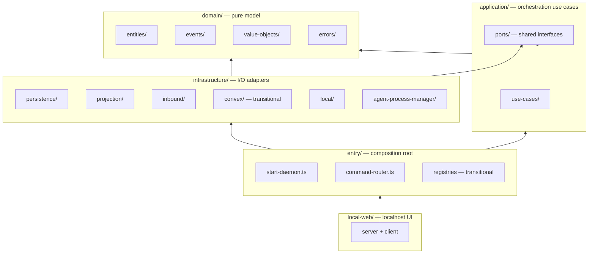

# Daemon-Centric Orchestration — Overview

**Status:** Structure proposal (for review)  
**Branch:** `docs/daemon-centric-orchestration-discovery`  
**Sibling docs:** [discovery.md](./discovery.md) — surface-area inventory, sync tiers, migration map

---

## 1. Purpose

This document describes the **target high-level structure** of the daemon-centric orchestration outcome: how responsibilities are separated, how clean architecture layers map to folders, and where existing code moves vs what is net-new.

**Scope of this doc:** folder and file layout for `packages/cli/src/daemon/`. For inventory, sync tiers, and phased migration, see [discovery.md](./discovery.md).

**Resolved constraints** (from discovery):

- CLI → daemon via **HTTP on localhost**
- Daemon is **SSOT** (SQLite); Convex is **projection** (eventual consistency, no dual-write)
- **Enhancer queue** fully local
- **Realtime SLI:** task status, agent status, messages → T3 immediate projection
- **Separate domains** — daemon owns its domain; no shared package with `services/backend`

---

## 2. Layer model

Aligns with existing daemon module conventions ([daemon/README.md](../../../packages/cli/src/daemon/README.md)) and extends them for orchestration authority.



### Layer responsibilities

| Layer              | Folder               | Responsibility                                                            | Depends on                              |
| ------------------ | -------------------- | ------------------------------------------------------------------------- | --------------------------------------- |
| **Domain**         | `domain/`            | Entities, domain events, value objects, invariants — no I/O               | Nothing external                        |
| **Application**    | `application/`       | Orchestration use cases; calls ports, appends events, updates read models | `domain/`                               |
| **Ports**          | `application/ports/` | Shared interfaces (`EventStore`, `ProjectionQueue`, `AgentSpawner`, …)    | `domain/` types only                    |
| **Infrastructure** | `infrastructure/`    | SQLite, Convex projection, HTTP CLI server, process spawn, harness SDKs   | `application/ports/`                    |
| **Entry**          | `entry/`             | Wiring, lifecycle, transitional registries                                | `application/`, `infrastructure/`       |
| **Presentation**   | `local-web/`         | Localhost SSE/UI over read models                                         | `entry/`, `infrastructure/persistence/` |

### Relationship to today's layout

| Today                                           | Target                                                                              | Notes                                                                                                                                       |
| ----------------------------------------------- | ----------------------------------------------------------------------------------- | ------------------------------------------------------------------------------------------------------------------------------------------- |
| `domain/usecase/`                               | `application/use-cases/` + keep legacy files during migration                       | New orchestration lands in `application/`; existing use cases move incrementally                                                            |
| Ports co-located in use case files              | `application/ports/` for **shared** ports; co-location OK for single-consumer ports | Matches [domain/usecase/README.md](../../../packages/cli/src/daemon/domain/usecase/README.md) spirit — don't force every port into `ports/` |
| `infrastructure/convex/subscribers/` (16 feeds) | `infrastructure/inbound/convex/` (user-intent only) + shrink                        | Orchestration subscribers removed as flows go local                                                                                         |
| `infrastructure/convex/publishers/`             | `infrastructure/projection/convex/handlers/`                                        | Hot-path mutations become projection handlers                                                                                               |
| `entry/publisher-registry.ts`                   | Becomes local event bus facade → persistence + projection enqueue                   | Transitional                                                                                                                                |
| `entry/subscriber-registry.ts`                  | Shrinks to inbound user-intent only                                                 | Transitional                                                                                                                                |

---

## 3. Target folder and file structure

Legend: `[exists]` unchanged · `[new]` net-new · `[migrate]` move/refactor from current path · `[transitional]` removed after migration · `[shrink]` reduced scope

```
packages/cli/src/daemon/
│
├── domain/                                    # Pure model — no I/O
│   ├── entities/                    [exists]  # inbound-event, outbound-event, assigned-task, …
│   ├── events/                      [new]     # HandoffCompleted, TaskDelivered, AgentStarted, …
│   │   ├── handoff-completed.ts
│   │   ├── task-delivered.ts
│   │   ├── agent-lifecycle.ts
│   │   └── index.ts                           # DomainEvent union + type guards
│   ├── value-objects/               [new]     # TaskId, ChatroomId, Role, SyncTier, MachineId
│   │   ├── ids.ts
│   │   ├── sync-tier.ts
│   │   └── index.ts
│   ├── errors/                      [new]     # HandoffRejected, AgentNotFound, ProjectionFailed
│   │   └── index.ts
│   ├── native-integration/          [exists]  # unchanged — separate integration boundary
│   └── usecase/                     [transitional]  # legacy — migrate to application/use-cases/
│       └── …                                  # existing files until slice-by-slice move
│
├── application/                     [new]     # Orchestration authority (daemon SSOT writes)
│   ├── ports/
│   │   ├── event-store.port.ts                # append DomainEvent, load by id
│   │   ├── read-models.port.ts                # tasks, participants, agents, handoffs
│   │   ├── projection-queue.port.ts           # enqueue ProjectionEnvelope (tier, idempotency)
│   │   ├── handoff.port.ts                    # execute handoff invariants
│   │   ├── task-delivery.port.ts              # claim, deliver, nudge
│   │   ├── agent-lifecycle.port.ts            # start, stop, turn-end
│   │   ├── enhancer-queue.port.ts             # local enqueue, claim, complete
│   │   ├── agent-spawner.port.ts              # spawn harness process
│   │   └── inbound-sync.port.ts               # user-intent from Convex (files, git)
│   └── use-cases/
│       ├── handoff/
│       │   ├── execute-handoff.ts             # CLI handoff command handler
│       │   └── complete-handoff-to-user.ts
│       ├── tasks/
│       │   ├── claim-next-task.ts             # get-next-task
│       │   ├── deliver-task.ts                # [migrate] from domain/usecase + entry/native-delivery
│       │   └── nudge-stuck-task.ts            # [migrate] from task-monitor
│       ├── agents/
│       │   ├── start-agent.ts
│       │   ├── stop-agent.ts
│       │   └── handle-turn-end.ts             # [migrate] from handle-turn-completed.ts
│       ├── enhancer/
│       │   ├── enqueue-enhancer-job.ts
│       │   └── process-enhancer-job.ts        # replaces Convex subscriber loop
│       ├── restart/
│       │   └── orchestrate-restart.ts         # [migrate] from entry/task-monitor
│       └── sync/
│           └── enqueue-projection.ts          # tier selection (T0–T4)
│
├── infrastructure/
│   ├── persistence/                 [exists]  # SQLite SSOT
│   │   ├── schema.ts                          # extend: read model tables
│   │   ├── event-store.ts           [exists]
│   │   ├── outbox.ts                [exists]  # ProjectionEnvelope queue
│   │   ├── persistence-store.ts     [exists]
│   │   ├── read-models/             [new]
│   │   │   ├── tasks.ts                       # tasks_by_role, pending by chatroom
│   │   │   ├── participants.ts                # presence, turn phase
│   │   │   ├── agents.ts                      # spawned agent sessions
│   │   │   └── handoffs.ts                    # pending handoff state
│   │   └── README.md
│   │
│   ├── projection/                  [new]     # Convex projection worker (daemon → cloud)
│   │   ├── sync-policy.ts                     # T0–T4 rules; realtime SLI (task/agent/message = T3)
│   │   ├── outbox-drain-worker.ts             # poll outbox, batch, retry
│   │   └── convex/
│   │       ├── convex-projection-adapter.ts   # Convex client wrapper
│   │       ├── mappers/                       # DomainEvent → mutation args
│   │       │   ├── handoff.mapper.ts
│   │       │   ├── task-status.mapper.ts
│   │       │   ├── agent-status.mapper.ts
│   │       │   └── message.mapper.ts
│   │       └── handlers/                      # idempotent per-event-type writers
│   │           ├── project-handoff.ts
│   │           ├── project-task-status.ts
│   │           ├── project-agent-status.ts
│   │           └── project-message.ts
│   │
│   ├── inbound/                     [new]     # External → daemon commands
│   │   ├── local/
│   │   │   ├── cli-http-server.ts             # HTTP localhost — handoff, get-next-task
│   │   │   ├── routes/
│   │   │   │   ├── handoff.route.ts
│   │   │   │   └── tasks.route.ts
│   │   │   └── cli-http-server.test.ts
│   │   └── convex/
│   │       ├── user-intent-subscribers.ts     # webapp-originated only (files, git, commands)
│   │       └── subscriber-registry.ts           # shrunk registry
│   │
│   ├── local/                       [exists]  # machine config, harness SDKs, process spawn
│   │   ├── harness/                 [exists]  # unchanged — spawn, stream adapters
│   │   ├── process-spawn.ts         [exists]
│   │   └── machine-config.ts        [exists]
│   │
│   ├── agent-process-manager/       [exists]  # [migrate] emits local lifecycle events, not direct Convex
│   │   └── agent-process-manager.ts
│   │
│   ├── convex/                      [transitional]
│   │   ├── publishers/              [shrink]  # → projection/convex/handlers/
│   │   └── subscribers/             [shrink]  # → inbound/convex/ (user-intent only)
│   │
│   └── git/                         [exists]  # unchanged in v1
│
├── entry/                           [exists]  # Composition root
│   ├── start-daemon.ts              [exists]  # wire cli-http-server, projection worker, read models
│   ├── init-daemon.ts               [exists]
│   ├── daemon-runtime.ts            [exists]
│   ├── command-router.ts            [new]     # dispatch local HTTP + inbound events → use cases
│   ├── deps.ts                      [exists]  # extend with application use case deps
│   ├── event-router.ts              [exists]  # [shrink] — only user-intent inbound events
│   ├── publisher-registry.ts        [transitional]  # → local event bus + persistence append
│   ├── subscriber-registry.ts       [transitional]  # → inbound/convex/subscriber-registry.ts
│   ├── task-monitor/                [exists]  # [migrate] reads local read models, not Convex snapshots
│   ├── native-delivery/               [exists]  # [migrate] → application/use-cases/tasks/
│   ├── enhancer/                      [exists]  # [migrate] → application/use-cases/enhancer/
│   ├── direct-harness/              [exists]  # stays; session queues may go local later
│   ├── agentic-query/                 [exists]
│   ├── files/                         [exists]  # stays inbound-from-Convex
│   ├── workspace-git/                 [exists]
│   └── …
│
├── local-web/                       [exists]  # localhost UI — reads SQLite read models + SSE
│   ├── server/
│   │   ├── create-local-web-server.ts
│   │   ├── routes.ts                        # extend: task/agent status endpoints
│   │   └── stream-hub.ts
│   └── client/
│
├── README.md                        [exists]  # update layer diagram when implementation starts
└── plan.md                          [exists]  # legacy daemon plan — superseded by docs/plans/
```

---

## 4. Key boundaries

### 4.1 What stays outside `daemon/`

| Concern                   | Location                                            | Role after migration                                                |
| ------------------------- | --------------------------------------------------- | ------------------------------------------------------------------- |
| Convex schema + mutations | `services/backend/convex/`                          | Projection targets; idempotent handlers called by projection worker |
| Backend domain rules      | `services/backend/src/domain/`                      | Backend-only; **not** shared with daemon                            |
| CLI harness commands      | `packages/cli/src/commands/`                        | Call daemon HTTP instead of Convex for handoff/get-next-task        |
| Incremental sync library  | `packages/cli/src/infrastructure/incremental-sync/` | Reused for inbound user-intent Convex feeds only                    |

### 4.2 Write path (orchestration)

```
CLI HTTP → inbound/local/cli-http-server.ts
         → entry/command-router.ts
         → application/use-cases/*
         → domain/events (append)
         → infrastructure/persistence (event store + read models)
         → infrastructure/persistence/outbox (ProjectionEnvelope)
         → infrastructure/projection/outbox-drain-worker.ts
         → Convex (T3 for task/agent/message; batched for rest)
```

### 4.3 Read path (orchestration)

```
application/use-cases/* → infrastructure/persistence/read-models/*
                       (NOT Convex subscriptions on hot path)
```

---

## 5. Migration mapping (selected)

| Current path                                                    | Target path                                                          | Phase                 |
| --------------------------------------------------------------- | -------------------------------------------------------------------- | --------------------- |
| `entry/publisher-registry.ts`                                   | Local bus facade + `projection/` enqueue                             | P1                    |
| `infrastructure/persistence/outbox.ts`                          | `projection/outbox-drain-worker.ts` wires drain                      | P1                    |
| `entry/task-monitor/task-monitor-runtime.ts`                    | Reads `read-models/tasks.ts`; stops snapshot WS                      | P2                    |
| `commands/handoff/index.ts`                                     | Calls `inbound/local/cli-http-server` route                          | P3                    |
| `entry/enhancer/job-subscriber.ts`                              | `application/use-cases/enhancer/process-enhancer-job.ts`             | P3–P4                 |
| `infrastructure/agent-process-manager/agent-process-manager.ts` | Emits `domain/events/agent-lifecycle.ts`; projection batches `emit*` | P4                    |
| `infrastructure/convex/subscribers/*` (orchestration)           | Removed; user-intent only in `inbound/convex/`                       | P5                    |
| `domain/usecase/*` (orchestration)                              | `application/use-cases/*`                                            | Incremental per slice |

---

## 6. Open structural questions (for review)

Please comment on these — structure will iterate based on your feedback.

1. **`application/` vs `domain/usecase/`** — Proposal: new orchestration in `application/`, legacy stays in `domain/usecase/` until migrated. Alternative: rename `domain/usecase/` → `application/use-cases/` in one shot (bigger blast radius). **Recommendation:** incremental `application/` folder.

2. **`application/ports/` vs co-located ports** — Proposal: shared ports in `application/ports/`; single-consumer ports may stay co-located in use case files per existing convention. **Recommendation:** hybrid.

3. **`infrastructure/inbound/` vs `entry/` for CLI HTTP** — Proposal: HTTP server in `infrastructure/inbound/local/`; routing/dispatch in `entry/command-router.ts`. Alternative: all in `entry/`. **Recommendation:** inbound infra owns transport, entry owns dispatch.

4. **`infrastructure/projection/` vs extending `convex/publishers/`** — Proposal: new `projection/` folder (clear SSOT boundary). Alternative: evolve publishers in place. **Recommendation:** new folder — publishers are transitional.

5. **Enhancer local queue location** — Proposal: port in `application/ports/enhancer-queue.port.ts`, SQLite backing in `persistence/read-models/` or dedicated `persistence/enhancer-queue.ts`. **Question:** separate table file or colocate with read-models?

6. **Read model granularity** — Proposal: one file per aggregate (`tasks.ts`, `participants.ts`, `agents.ts`, `handoffs.ts`). **Question:** merge into single `read-models/store.ts` for v1 simplicity?

---

## 7. References

| Doc                                  | Path                                                                                                                                  |
| ------------------------------------ | ------------------------------------------------------------------------------------------------------------------------------------- |
| Discovery (inventory, tiers, phases) | [discovery.md](./discovery.md)                                                                                                        |
| Daemon module README                 | [packages/cli/src/daemon/README.md](../../../packages/cli/src/daemon/README.md)                                                       |
| Domain layer rules                   | [packages/cli/src/daemon/domain/README.md](../../../packages/cli/src/daemon/domain/README.md)                                         |
| Use case conventions                 | [packages/cli/src/daemon/domain/usecase/README.md](../../../packages/cli/src/daemon/domain/usecase/README.md)                         |
| Entry composition                    | [packages/cli/src/daemon/entry/README.md](../../../packages/cli/src/daemon/entry/README.md)                                           |
| Persistence / outbox                 | [packages/cli/src/daemon/infrastructure/persistence/README.md](../../../packages/cli/src/daemon/infrastructure/persistence/README.md) |
