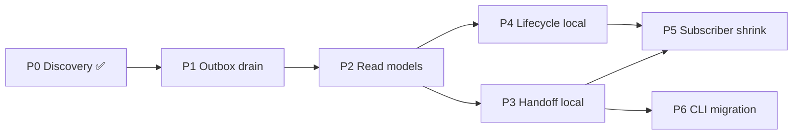

# Daemon-Centric Orchestration — Phases

**Status:** Implementation plan  
**Parent:** [discovery.md](../discovery.md) · [overview.md](../overview.md)

---

## Phase index

| Phase  | Doc                                                  | Depends on | Outcome                                                                                                                                       | Shippable alone                                                   |
| ------ | ---------------------------------------------------- | ---------- | --------------------------------------------------------------------------------------------------------------------------------------------- | ----------------------------------------------------------------- |
| **P0** | [p0-discovery.md](./p0-discovery.md)                 | —          | ✅ Complete — inventory, decisions, vocabulary                                                                                                | ✅ (docs only)                                                    |
| **P1** | [p1-outbox-drain.md](./p1-outbox-drain.md)           | P0         | ✅ Implemented (in review) — outbox drain + shadow/cutover via PRs #1341–#1343                                                                | Yes — merged stack; flags default off                             |
| **P2** | [p2-local-read-models.md](./p2-local-read-models.md) | P1         | ✅ Implemented (in review) — read models + shadow/cutover via PR [#1350](https://github.com/conradkoh/chatroom/pull/1350)                     | Yes — merged stack; flags default off                             |
| **P3** | [p3-handoff-local.md](./p3-handoff-local.md)         | P2         | ✅ Implemented (in review) — handoff via daemon HTTP + projection via PR [#1351](https://github.com/conradkoh/chatroom/pull/1351)             | Yes — handoff via daemon HTTP; flag off = Convex handoff          |
| **P4** | [p4-lifecycle-local.md](./p4-lifecycle-local.md)     | P2         | ✅ Implemented (in review) — lifecycle local via PR [#1355](https://github.com/conradkoh/chatroom/pull/1355)                                  | Yes — lifecycle local; flag off = direct emit\*; parallel with P3 |
| **P5** | [p5-subscriber-shrink.md](./p5-subscriber-shrink.md) | P3, P4     | ✅ Implemented (in review) — inbound-only subscribers + outbox-only publisher via PR [#1356](https://github.com/conradkoh/chatroom/pull/1356) | Yes — after P3+P4 soak (soak gate); removes redundant subscribers |
| **P6** | [p6-cli-migration.md](./p6-cli-migration.md)         | P3         | `get-next-task`, reads route through daemon HTTP                                                                                              | Yes — per-command; flag off = Convex CLI paths                    |

## Dependency order

## How to use

1. Complete todos in order within a phase.
2. Each todo lists **verification criteria** — run before marking done.
3. Feature-flag each phase at entry points; validate with flag on/off before cutting legacy paths.
4. No dual-write: when a flow migrates, daemon is SSOT immediately for that flow.

## Shippability contract

Every phase MUST be **independently shippable**: mergeable to main with the phase flag default-off, deployable without coordinating later phases, and an improvement (never a regression) when the flag is enabled.

| Principle                    | Meaning                                                                                                                                 |
| ---------------------------- | --------------------------------------------------------------------------------------------------------------------------------------- |
| **Flag-off = unchanged**     | With `DAEMON_ORCHESTRATION_P{n}` off, behavior is identical to pre-merge. No new code paths execute.                                    |
| **Flag-on = additive value** | Enables a measurable step toward daemon-centric orchestration (see each phase's **Toward outcome**).                                    |
| **Shadow before cutover**    | Phases that replace a hot path use shadow mode first (new path runs, legacy remains authoritative), then a sub-flag cutover after soak. |
| **No duplicate writes**      | Never enqueue outbox AND direct-publish the same event without shadow comparison. Cutover disables direct publish.                      |
| **Merge gates**              | Each phase's **Ship checklist** must pass before merge. E2E with flag on required — unit tests alone insufficient.                      |
| **Soak before delete**       | File/subscriber/legacy-path deletion only after shadow or cutover has soaked (see phase Ship checklist).                                |

Sub-flags (cutover within a phase):

| Sub-flag                                 | Phase | Purpose                                                                         |
| ---------------------------------------- | ----- | ------------------------------------------------------------------------------- |
| `DAEMON_ORCHESTRATION_P1_CUTOVER`        | P1    | Disable direct Convex publish; outbox drain is sole write path                  |
| `DAEMON_ORCHESTRATION_P2_CUTOVER`        | P2    | Task monitor reads local read models; disable Convex snapshot WS                |
| `DAEMON_ORCHESTRATION_P3_LOCAL_DELIVERY` | P3    | Delivery from local handoff event (optional within P3; not required to ship P3) |
| `DAEMON_ORCHESTRATION_P6_LEGACY_DELETE`  | P6    | Remove Convex-first CLI fallbacks (post-soak only)                              |

## Conventions

- **Todo IDs:** `P{n}-T{m}` — reference in commits and PRs.
- **Legend:** `[new]` create · `[modify]` change · `[delete]` remove · `[shrink]` reduce scope · `[migrate]` move logic
