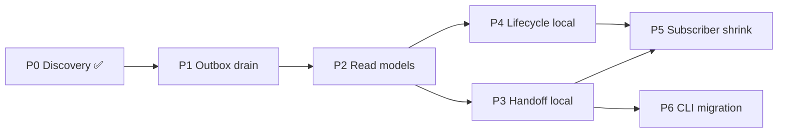

# Daemon-Centric Orchestration — Phases

**Status:** Implementation plan  
**Parent:** [discovery.md](../discovery.md) · [overview.md](../overview.md)

---

## Phase index

| Phase  | Doc                                                  | Depends on | Outcome                                                                   |
| ------ | ---------------------------------------------------- | ---------- | ------------------------------------------------------------------------- |
| **P0** | [p0-discovery.md](./p0-discovery.md)                 | —          | ✅ Complete — inventory, decisions, vocabulary                            |
| **P1** | [p1-outbox-drain.md](./p1-outbox-drain.md)           | P0         | Convex projection worker drains outbox for existing `OutboundEvent` types |
| **P2** | [p2-local-read-models.md](./p2-local-read-models.md) | P1         | Task/participant read models in SQLite; task monitor reads local          |
| **P3** | [p3-handoff-local.md](./p3-handoff-local.md)         | P2         | `chatroom handoff` → daemon HTTP; Convex receives projection only         |
| **P4** | [p4-lifecycle-local.md](./p4-lifecycle-local.md)     | P2         | APM lifecycle events local; batch `emit*` via projection                  |
| **P5** | [p5-subscriber-shrink.md](./p5-subscriber-shrink.md) | P3, P4     | Remove orchestration Convex subscribers; keep user-intent inbound only    |
| **P6** | [p6-cli-migration.md](./p6-cli-migration.md)         | P3         | `get-next-task`, reads route through daemon HTTP                          |

## Dependency order

## How to use

1. Complete todos in order within a phase.
2. Each todo lists **verification criteria** — run before marking done.
3. Feature-flag each phase at entry points; validate with flag on/off before cutting legacy paths.
4. No dual-write: when a flow migrates, daemon is SSOT immediately for that flow.

## Conventions

- **Todo IDs:** `P{n}-T{m}` — reference in commits and PRs.
- **Legend:** `[new]` create · `[modify]` change · `[delete]` remove · `[shrink]` reduce scope · `[migrate]` move logic
