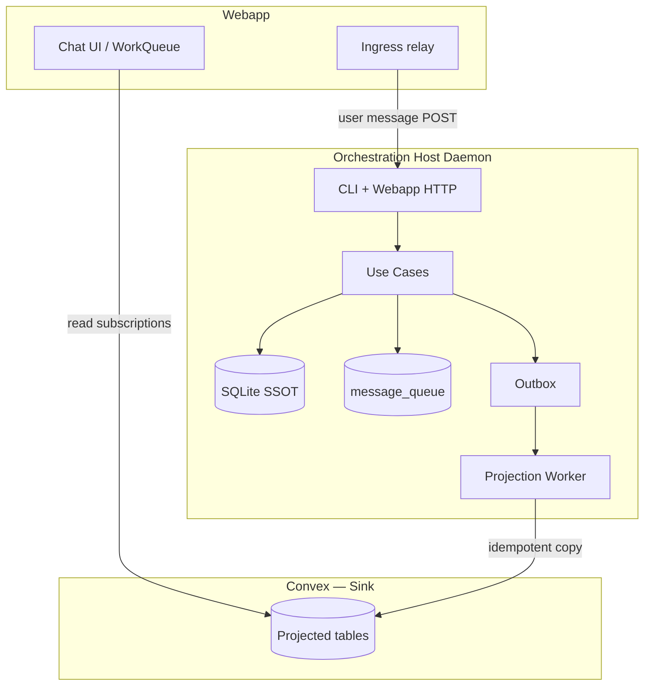

# Phase P9 — Convex as Event Sink

**Status:** Planned  
**Depends on:** [P8](./p8-single-machine.md)  
**Feature flags:** `DAEMON_ORCHESTRATION_P9` · `DAEMON_ORCHESTRATION_P9_CUTOVER` · per-flow sub-flags below

## Shippability

**Shippable alone:** No — requires P8 (single-machine binding). Sub-flags allow incremental rollout within P9.

### What ships

- **Daemon is sole orchestration authority** — handoff, task claim, user messages, queue enqueue/promote, lifecycle all execute in SQLite
- **Convex is event sink only** — outbox projects idempotent read-model copies for webapp; no orchestration mutation on hot path
- **Local message queue** on daemon replaces `chatroom_messageQueue` as authority
- Webapp ingress path for user messages routes to daemon (via Convex relay or direct tunnel — see P9-T1)
- P7 intent feed, assigned-task signals, snapshot WS orchestration subscribers **removed** post-cutover

### Flag-off guarantee

P9 off → P8 + P7 paths remain authoritative; Convex orchestration mutations still used.

### Progressive rollout

| Sub-flag                               | Scope                                                      |
| -------------------------------------- | ---------------------------------------------------------- |
| `DAEMON_ORCHESTRATION_P9_USER_MESSAGE` | User message write → daemon                                |
| `DAEMON_ORCHESTRATION_P9_QUEUE`        | Local queue enqueue/promote                                |
| `DAEMON_ORCHESTRATION_P9_HANDOFF`      | Remove Convex `messages.handoff` fallback                  |
| `DAEMON_ORCHESTRATION_P9_CLAIM`        | Remove Convex `tasks.claimTask` fallback                   |
| `DAEMON_ORCHESTRATION_P9_CUTOVER`      | All sub-flags on; delete legacy Convex orchestration paths |

### Ship checklist

- [ ] User message → daemon → local task + message → Convex projection → webapp sees message
- [ ] Queued message while task active → daemon local queue → promote on task complete → delivery
- [ ] Handoff planner → builder: zero Convex orchestration mutations (projection only)
- [ ] Convex offline: daemon continues orchestrating; projections catch up on reconnect
- [ ] Webapp WorkQueue UI reads projected queue state from Convex (not authoritative)
- [ ] Full test matrix scenarios 1–7 green with P9_CUTOVER on

### Toward outcome

Completes daemon-centric orchestration vision from discovery §3. Convex demoted to multi-user read replica + auth.

---

## Goal

Move the **entire orchestration workflow** to the daemon. Convex receives **projected event copies** (sink) for webapp realtime UI and historical queries — never as the write authority for handoffs, tasks, messages, or queue state.

## Prerequisites

- P8 complete: chatroom bound to single orchestration host.
- P1–P7 cutover flags on in dev (outbox drain, local read models, P3 handoff, P5 subscriber shrink, P6 CLI, P7 intent).

---

## Architecture



**Invariant:** No code path calls `api.messages.handoff`, `api.messages.sendMessage` (orchestration), `api.tasks.claimTask`, or `promoteQueuedMessage` on Convex when P9_CUTOVER on. Only `project*` mutations from drain worker.

---

## Todos

### P9-T1 — Webapp → daemon ingress `[new]`

**Problem:** Webapp cannot call `127.0.0.1` daemon directly when user is remote.

**Options (implement Option B unless blocked):**

- **Option A:** Direct tunnel (ngrok/cloudflare) — webapp POST to public daemon URL. High ops burden.
- **Option B (recommended):** Convex **ingress relay** — webapp calls thin `api.orchestration.submitUserMessage` that inserts `chatroom_orchestrationIngress` row; daemon pulls via incremental sync, executes locally, acks. Row is **not SSOT** — deleted after daemon claims. Convex table is transport only.
- **Option C:** SSE/WebSocket from daemon to webapp — inverted; webapp still needs write path.

**Implement (Option B):**

- `services/backend/convex/schema.ts` — `chatroom_orchestrationIngress` (ephemeral, TTL)
- `packages/cli/src/daemon/infrastructure/convex/subscribers/orchestration-ingress.ts`
- `packages/cli/src/daemon/application/use-cases/messages/receive-user-message.ts` — local write + task create or queue enqueue
- `apps/webapp/` — route `sendMessage` through ingress relay when P9 on (feature detect via chatroom config)

**Verify:**

| Check          | Test       | Expected                                                                             |
| -------------- | ---------- | ------------------------------------------------------------------------------------ |
| Direct message | E2E        | Webapp send → ingress row → daemon ingest → projected message in Convex → UI updates |
| Daemon offline | E2E        | Ingress rows queue; drain on reconnect                                               |
| No Convex SSOT | grep audit | `chatroom_messages` insert only in projection handler when P9_CUTOVER                |

### P9-T2 — Local message queue `[new]`

**Implement (mirror P4 enhancer-queue pattern):**

- `packages/cli/src/daemon/application/ports/message-queue.port.ts`
  ```typescript
  export interface MessageQueuePort {
    enqueue(input: QueuedMessageInput): Promise<QueuedMessageId>;
    listPending(chatroomId: ChatroomId): Promise<QueuedMessage[]>;
    promoteNext(chatroomId: ChatroomId): Promise<PromotedMessage | null>;
    promoteSpecific(id: QueuedMessageId): Promise<PromotedMessage | null>;
  }
  ```
- `packages/cli/src/daemon/infrastructure/persistence/message-queue.ts` — SQLite table `message_queue` (same fields as `chatroom_messageQueue` minus Convex IDs; use local UUIDs + projection id map)
- `packages/cli/src/daemon/application/use-cases/messages/enqueue-user-message.ts`
- `packages/cli/src/daemon/application/use-cases/messages/promote-queued-message.ts` — port of `services/backend/src/domain/usecase/task/promote-queued-message.ts` logic
- `packages/cli/src/daemon/domain/usecase/execute-handoff.ts` — on task complete path, call `promoteNext` locally (replaces Convex `maybePromoteNextQueuedTask`)
- `packages/cli/src/daemon/infrastructure/projection/convex/handlers/project-message-queue.ts` — project queue snapshot to Convex for webapp WorkQueue (T3)

**HTTP routes:**

- `POST /messages/enqueue` — internal (from P9-T1 ingress handler)
- `POST /messages/queue/promote` — manual promotion from webapp (proxied through ingress or daemon HTTP)

**Verify:**

| Check                    | Test        | Expected                                                     |
| ------------------------ | ----------- | ------------------------------------------------------------ |
| Enqueue while active     | unit + E2E  | Message in local queue, not delivered                        |
| Auto-promote on complete | E2E         | Task complete → next queued → task created → delivery        |
| Manual promote           | E2E         | WorkQueue promote → local promote → projected                |
| Convex queue deprecated  | grep        | No `chatroom_messageQueue` insert when P9_QUEUE + P9_CUTOVER |
| Projection               | integration | Webapp WorkQueue shows projected queue order                 |

### P9-T3 — Remove Convex orchestration write fallbacks `[shrink]`

**Modify (when P9_CUTOVER):**

- `packages/cli/src/commands/handoff/index.ts` — remove Convex `api.messages.handoff` fallback
- `packages/cli/src/commands/get-next-task/` — remove Convex claim fallback
- `services/backend/src/domain/usecase/chatroom/send-automated-user-message.ts` — no-op or redirect when P9 chatroom (ingress only)
- `services/backend/src/domain/usecase/task/promote-queued-message.ts` — no-op when P9 chatroom
- Delete/disable P7 intent subscriber (daemon owns writes)
- Delete assigned-task-signals orchestration subscriber for P9 chatrooms

**Verify:**

| Check       | Test                                                                           | Expected                  |
| ----------- | ------------------------------------------------------------------------------ | ------------------------- |
| Grep audit  | `rg "api\.messages\.handoff\|api\.tasks\.claimTask" packages/cli/src/commands` | Zero hits when P9_CUTOVER |
| Handoff E2E | manual                                                                         | Projection only to Convex |
| Rollback    | unset P9_CUTOVER                                                               | Legacy paths restored     |

### P9-T4 — Convex sink projection handlers `[modify]`

**Consolidate projection into sink handlers:**

- `packages/cli/src/daemon/infrastructure/projection/convex/handlers/` — ensure handlers exist for: message, task, participant, handoff, queue, lifecycle
- Each handler: idempotent on `idempotencyKey` / `revisionKey`; inserts/upserts Convex read tables only
- Document: Convex mutations renamed/namespaced to `project*` — orchestration mutations deprecated

**Verify:**

| Check             | Test        | Expected                                 |
| ----------------- | ----------- | ---------------------------------------- |
| Idempotent replay | unit        | Double projection is no-op               |
| Webapp realtime   | manual      | Message appears <2s after daemon write   |
| Offline catch-up  | integration | Outbox drains queued events on reconnect |

### P9-T5 — Delete legacy Convex orchestration `[delete]`

**Prerequisite:** P9_CUTOVER soaked ≥4 weeks in production.

**Delete/shrink:**

- `chatroom_daemonOrchestrationIntents` — delete table or stop writes (P7 obsolete)
- `chatroom_messageQueue` — stop writes; read from projection snapshot only
- Orchestration subscribers in `subscriber-registry.ts` not in inbound-only list
- `messages.handoff` public mutation — deprecate; keep `projectHandoffFromDaemon` only

**Verify:**

| Check        | Test                                     | Expected                         |
| ------------ | ---------------------------------------- | -------------------------------- |
| Schema audit | manual                                   | No new rows in deprecated tables |
| Full matrix  | `task-lifecycle-refactor-test-matrix.md` | Scenarios 1–7 pass               |
| Typecheck    | `pnpm turbo run typecheck test`          | Green                            |

---

## Sync tier mapping (P9)

| Event                  | Tier         | Convex table                          |
| ---------------------- | ------------ | ------------------------------------- |
| User message / handoff | T3 immediate | `chatroom_messages`, `chatroom_tasks` |
| Queue enqueue/promote  | T3 immediate | projected queue snapshot              |
| Agent lifecycle        | T2 batched   | `chatroom_teamAgentConfigs` mirrors   |
| Harness streams        | T0 local     | never synced                          |

---

## Definition of done

- [ ] P9-T1 through P9-T5 complete
- [ ] Zero Convex orchestration mutations on hot path (P9_CUTOVER)
- [ ] Local message queue is SSOT; Convex queue is projection only
- [ ] Webapp functional with Convex as read sink
- [ ] Daemon operates offline; projections catch up

## Rollback

Disable `DAEMON_ORCHESTRATION_P9` and sub-flags. Re-enable P7 intent + Convex orchestration paths. Local queue rows can be exported/migrated back to `chatroom_messageQueue` if needed (document migration in P9-T5).
