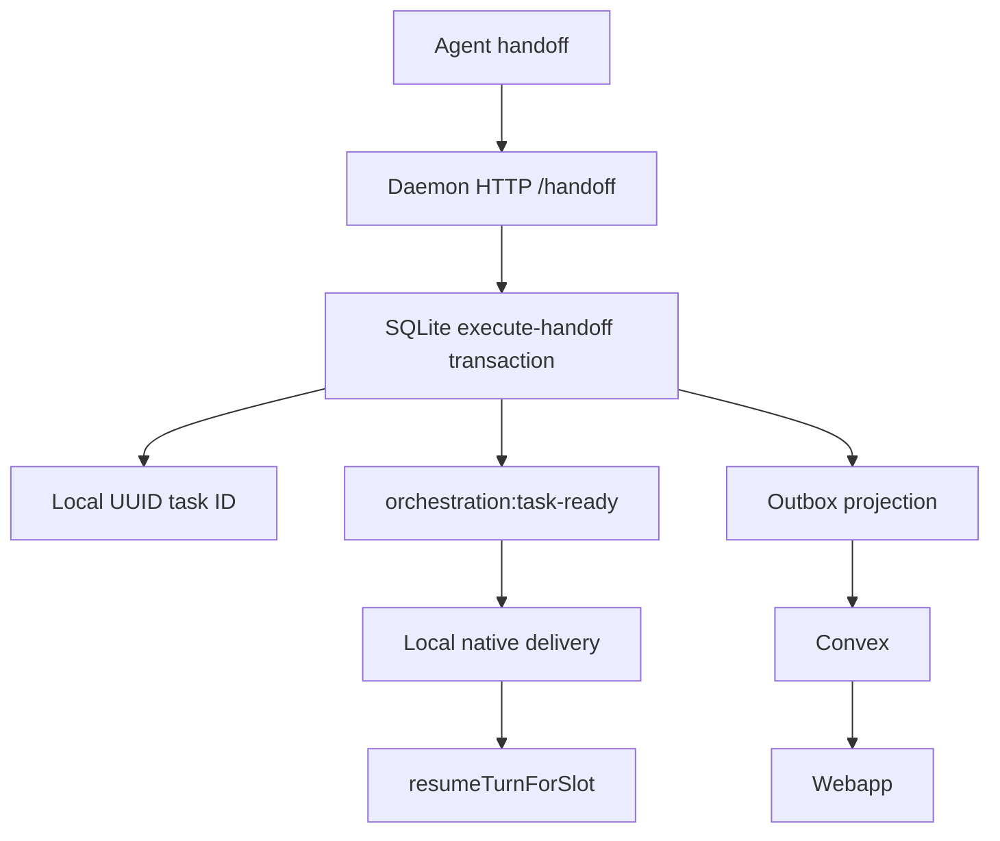

# Daemon Handoff Reliability Fix — Implementation Plan

**Branch:** `fix/daemon-handoff-reliability` (based on `release/v1.94.2`)
**Backlog:** `ps72tbe9eyt786fhmbb3dy21xs8cbeme`
**Status:** Complete — ready for review
**Background:** [daemon-centric orchestration overview](../daemon-centric-orchestration/overview.md)

## Problem Statement

Split-brain orchestration leaves tasks `pending` while agents are working. Native delivery eligibility is local, but task existence and action fetch currently depend on delayed Convex projections. The regression oracle is `native-signal-presence-after-handoff-stuck.test.ts`: idle notifications can precede snapshots, reconciliation can skip while a turn is in flight, and partial presence payloads can fail validation.

## Target Architecture



**Invariant:** when the target slot is idle, delivery is attempted in the same process tick as the handoff commit, without a Convex round-trip before injection.

## Feature Flags (all default off)

| Flag | Purpose |
|---|---|
| `DAEMON_ORCHESTRATION_P1` | Outbox drain and Convex projection |
| `DAEMON_ORCHESTRATION_P1_CUTOVER` | Outbox event routing |
| `DAEMON_ORCHESTRATION_P2` | SQLite read models |
| `DAEMON_ORCHESTRATION_P2_CUTOVER` | Local task-monitor read models |
| `DAEMON_ORCHESTRATION_P3` | Local handoff HTTP and execution |
| `DAEMON_ORCHESTRATION_P3_LOCAL_DELIVERY` | Local task-ready delivery |
| `DAEMON_ORCHESTRATION_P4` | Local lifecycle events |
| `DAEMON_ORCHESTRATION_P5` | Assigned-task subscriber removal |
| `DAEMON_ORCHESTRATION_P7` | Local user-message ingress |

P5 requires P1, P1_CUTOVER, P2, P2_CUTOVER, P3, P3_LOCAL_DELIVERY, and P4; startup validation enforces this.

## Progress Tracker

| Slice | Status | Commit(s) | Notes |
|---|---|---|---|
| 1 — Foundation | [x] Complete | through `c184cedc4` | P1–P5, identity mapping, provider/presence fixes, validation |
| 2 — Local delivery | [x] Complete | `5ac59346f`, `5442917f6`, `1dbd640e9`, pending test commit | Local task content, task-ready event, idempotent schema, and Convex-free injection path |
| 3 — Ingress + P5 cutover | [x] Complete | `0ee8f7e87`, `1d05d63de`, `82a541309`, `399b7efbe` | P7 local ingress, routing, projection, and delivery verification complete |
| 4 — E2E + PR | [x] Complete | PR #1403 | Flag-on verification, regression coverage, PR, and backlog review complete |

## Slice 1 — Foundation Integration ✅ COMPLETE

### Todos

- [x] Stack P1–P5 onto `release/v1.94.2`
- [x] Add indexed `daemonTaskId` and dual projection lookup
- [x] Fix snapshot-provider routing and partial presence parsing
- [x] Add P5 flag compatibility validation
- [x] Restore manifests and lockfile
- [x] Push clean branch; typecheck and tests green

### Validation Criteria

- [x] Remote branch contains all commits and worktree is clean
- [x] `pnpm turbo run typecheck test --filter=chatroom-cli --filter=@workspace/backend` passes
- [x] Flags remain off by default and regression tests pass

### Key Files (landed)

- `packages/cli/src/infrastructure/stores/assigned-task-snapshot-store.ts`
- `services/backend/convex/schema.ts` and `services/backend/convex/messages.ts`
- `services/backend/src/domain/usecase/machine/assigned-task-monitor-contract.ts`
- `packages/cli/src/daemon/infrastructure/projection/feature-flags.ts`
- Full P1–P5 orchestration stack

## Slice 2 — Local Delivery Path

**Goal:** create the pending task locally, emit `orchestration:task-ready`, and inject from read models without Convex `getAssignedTaskForAction`, `claimTask`, or `getTaskDeliveryPrompt` on the hot path.

### Todos

- [x] Add `orchestration:task-ready` to `DaemonEventMap` with `{ chatroomId, role, taskId, source: 'handoff' | 'promotion' | 'user-message' }`.
- [x] Make handoff read-model writes and event append one SQLite transaction; emit after commit.
- [x] Register a P3-local-delivery listener calling `tryInjectNextForRole`.
- [x] Add a local coordinator adapter using read-model deliverable tasks; claim locally and skip Convex fetches.
- [x] Add `local-handoff-delivery.test.ts`, execute-handoff event coverage, and preserve stuck-regression behavior.

### Validation Criteria

- [x] With P2/P2_CUTOVER/P3/P3_LOCAL_DELIVERY enabled, idle planner→builder handoff injects in the same tick.
- [x] No Convex query or mutation occurs on the local injection hot path.
- [x] Flag-off behavior is unchanged and aggregate typecheck/tests pass.
- [x] Separate commits cover persistence, event/listener, local injector, and tests.

### Key Files

- `packages/cli/src/daemon/entry/events/event-bus.ts`
- `packages/cli/src/daemon/entry/events/register-listeners.ts`
- `packages/cli/src/daemon/domain/usecase/execute-handoff.ts`
- `packages/cli/src/daemon/entry/native-delivery/native-task-delivery-coordinator.ts`
- `packages/cli/src/daemon/infrastructure/persistence/read-models/tasks.ts`

## Slice 3 — User-Message Ingress + P5 Cutover

**Goal:** user messages create local planner tasks and emit task-ready before P5 removes Convex assigned-task subscribers.

### Todos

- [x] Implement P7 local user-message ingress, pending planner task creation, event emission, and outbox projection.
- [x] Verify P5 skips assigned-task signal/presence subscribers while P2 cutover reads local models.
- [x] Ensure task-monitor runtime does not open the Convex snapshot WS under P2 cutover.

### Validation Criteria

- [x] Full flags deliver a second user message without a Convex signal round-trip (local user-message delivery integration test).
- [x] P5/P7 do not register assigned-task subscribers; flag-off behavior remains unchanged.
- [x] Stuck-regression scenarios and aggregate tests pass.

### Key Files

- `packages/cli/src/daemon/entry/subscriber-registry.ts`
- `packages/cli/src/daemon/entry/task-monitor-runtime.ts`
- `packages/cli/src/daemon/infrastructure/inbound/convex/user-intent-subscribers.ts`

## Slice 4 — E2E Verification + PR

### Todos

- [x] Run flag-on planner→builder and user-message delivery verification in the local test harness.
- [x] Verify delivery does not remain stuck pending/waiting in flag-on integration coverage.
- [x] Open PR against `release/v1.94.2` with test plan: PR #1403.
- [x] Mark backlog `ps72tbe9eyt786fhmbb3dy21xs8cbeme` for review.
- [x] Update this tracker, push, and leave a clean worktree.

### Validation Criteria

- [x] PR URL exists and local aggregate/pre-push checks are green; CI is tracked by PR #1403.
- [x] Flag-on verification is documented below.
- [x] Slice 2–3 criteria pass and backlog reaches `pending_user_review`.

### Verification

The flag-on local test harness verifies planner handoff and user-message ingress create local pending tasks, emit `orchestration:task-ready`, and inject into an idle native slot without Convex query/mutation calls on the delivery path. The stuck-regression oracle passes all four tests. A manual production duo run remains outside this slice; production flags remain default-off.

## Out of Scope

- `feat/model-provider-prefixes`, outbox dead-letter recovery, HTTP command idempotency, and production flag rollout.
- Local delivery, P7 ingress, and PR creation before their designated slices.

## References

- [Daemon-centric orchestration discovery](../daemon-centric-orchestration/discovery.md)
- [Native delivery refactor plan](../../native-delivery-coordinator-refactor-plan.md)
- [Persistence README](../../../packages/cli/src/daemon/infrastructure/persistence/README.md)

## Shared Contract

```typescript
'orchestration:task-ready': {
  chatroomId: Id<'chatroom_rooms'>;
  role: string;
  taskId: string;
  source: 'handoff' | 'promotion' | 'user-message';
};
```
