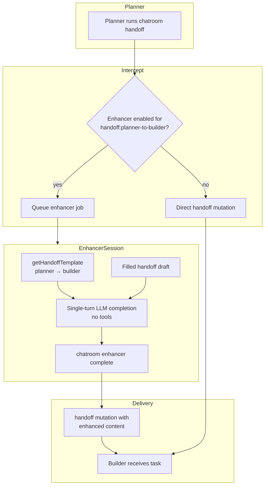
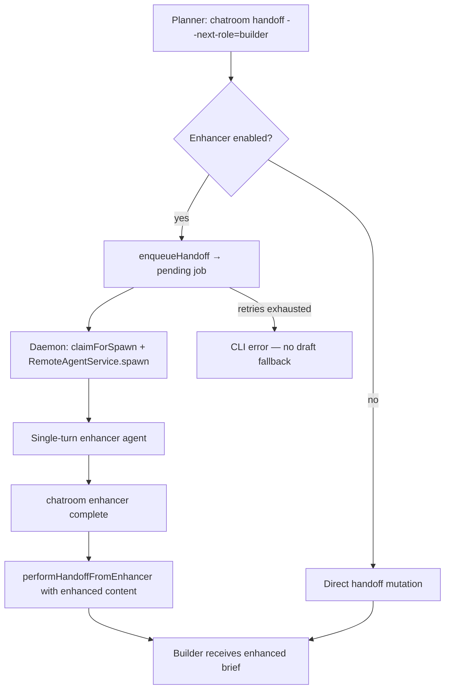

# Enhancers — Requirements & Implementation Plan

**Branch:** `feat/enhancers` (from `release/v1.74.0`)  
**PR:** #1085  
**Status:** Implemented (slices 1–2 complete)

## Problem

Planner→builder handoffs are the primary delegation surface in duo teams. Planners often use capable but cheaper models for ongoing work; the delegation brief quality varies with context pressure and model capability. We want to optionally route handoff text through a **single-turn enhancement pass** using a more capable (expensive) model — improving fidelity and detail **without** running that model for full agentic work (code editing, tool use, multi-turn sessions).

## Goals

| #   | Goal                    | Summary                                                                                                                        |
| --- | ----------------------- | ------------------------------------------------------------------------------------------------------------------------------ |
| 1   | Single-turn enhancement | One completion call; no tools, no research, no subagents                                                                       |
| 2   | Template-aware          | Enhancer sees the **canonical handoff template** for the sender→target pair **and** the **filled handoff** to enhance          |
| 3   | Same output shape       | Enhanced result remains a valid handoff in the **same markdown structure** as the input (delegation brief for planner→builder) |
| 4   | CLI delivery            | Enhancer agent submits output via `chatroom enhancer complete` before session disposal                                         |
| 5   | User control            | User enables enhancer per chatroom, picks target phase + harness/model (slice 1 UI)                                            |

## Non-goals (v1)

- Enhancing user-facing handoffs (planner→user) — first target is planner→builder only
- Multi-turn enhancer sessions or tool use
- Enhancer doing its own codebase research
- Replacing the planner agent or changing handoff FSM semantics beyond intercept-and-continue

---

## Architecture Overview



**Pattern:** Mirror **agentic query** (web/daemon command → harness session → task envelope → CLI complete) but domain is **handoff enhancement**, not workspace search.

## Shipped architecture



### Key modules

| Layer             | Path                                                                        | Purpose                                                     |
| ----------------- | --------------------------------------------------------------------------- | ----------------------------------------------------------- |
| Schema            | `services/backend/convex/schema.ts`                                         | `chatroom_enhancerConfigs` + `chatroom_enhancerJobs` tables |
| Config sync       | `services/backend/convex/web/enhancer/mutations.ts`                         | `upsertConfig`, `disableConfig`                             |
| Complete mutation | `services/backend/convex/web/enhancer/completeLogic.ts`                     | `applyEnhancerComplete` + handoff delivery                  |
| Interception      | `packages/cli/src/index.ts`                                                 | Commander action handler for `chatroom handoff`             |
| Polling           | `packages/cli/src/commands/enhancer/wait-for-job.ts`                        | CLI poll loop with timeout + retry                          |
| Daemon jobs       | `services/backend/convex/daemon/enhancer/jobs.ts`                           | `pendingForMachine`, `claimForSpawn`                        |
| Spawn payload     | `services/backend/convex/daemon/enhancer/spawnPayload.ts`                   | `getSpawnPayload` with envelope + prompt                    |
| Daemon subscriber | `packages/cli/src/commands/machine/daemon-start/enhancer/job-subscriber.ts` | `pendingForMachine` subscription → spawn                    |
| System prompt     | `services/backend/prompts/enhancer/system-prompt.ts`                        | `renderEnhancerSystemPrompt`                                |
| Task envelope     | `services/backend/prompts/enhancer/render-task-envelope.ts`                 | `renderEnhancerTaskEnvelope`                                |
| Event types       | `apps/webapp/src/modules/chatroom/eventTypes/enhancerEvents.tsx`            | 4 event stream variants                                     |

---

## Core inputs to the enhancer

The enhancer prompt **must** include:

### 1. Handoff template (structure contract)

Resolved server-side via `getHandoffTemplate()`:

```typescript
getHandoffTemplate({
  teamId: chatroom.teamId, // e.g. 'duo'
  fromRole: 'planner',
  toRole: 'builder',
  nativeIntegration: boolean, // from sender's harness capabilities
  chatroomId,
  role: 'planner',
  cliEnvPrefix,
});
```

Source: [services/backend/prompts/cli/handoff-templates/index.ts](services/backend/prompts/cli/handoff-templates/index.ts)  
Duo planner→builder body: [services/backend/prompts/teams/duo/handoff-templates/planner-to-builder.ts](services/backend/prompts/teams/duo/handoff-templates/planner-to-builder.ts)

The template tells the enhancer **what sections and quality bar** the output must satisfy.

### 2. Filled handoff (content to enhance)

The planner's draft handoff message body (markdown inside `---MESSAGE---` / heredoc), **before** it is delivered to the builder.

### 3. Enhancement instructions (system)

Fixed system prompt constraints:

- Improve clarity, detail, and fidelity; preserve intent
- **Do not** add research, file reads, or new scope
- **Do not** change the handoff format — output must match template structure
- Return only the enhanced handoff markdown (no preamble)

---

## CLI contract: `chatroom enhancer complete`

Mirror `chatroom agentic-query complete` ([packages/cli/src/commands/agentic-query/complete.ts](packages/cli/src/commands/agentic-query/complete.ts)).

```bash
chatroom enhancer complete \
  --chatroom-id=<id> \
  --job-id=<id> \
  << 'CHATROOM_ENHANCER_END'
---MESSAGE---
<enhanced handoff markdown — same structure as planner→builder delegation brief>
CHATROOM_ENHANCER_END
```

**Heredoc delimiter:** `CHATROOM_ENHANCER_END` (register in [services/backend/prompts/cli/stdin-heredoc.ts](services/backend/prompts/cli/stdin-heredoc.ts))

**CLI responsibilities:**

1. Authenticate session
2. Validate job exists and is `running`
3. Validate enhanced body (non-empty; optional: section headers match template expectations)
4. Persist enhanced content on job record
5. Trigger **delivery handoff** to builder with enhanced content (not the draft)
6. Mark job `complete`; dispose enhancer session

**Enhancer agent system prompt** must embed the complete command (like [renderAgenticQuerySystemPrompt](services/backend/prompts/agentic-query/system-prompt.ts)).

---

## Interception point

**Recommended:** Intercept in `chatroom handoff` CLI **before** calling `messages.handoff` mutation when:

- `nextRole === 'builder'` and `role === 'planner'`
- Chatroom has active enhancer config for `handoff:planner-to-builder`
- Enhancer config includes `agentHarness` + `model`

**Flow:**

1. Planner runs `chatroom handoff --next-role=builder` with draft message
2. CLI/backend detects enhancer enabled → creates `chatroom_enhancerJobs` row (status `pending`)
3. Daemon spawns enhancer harness session (user-selected harness/model from config)
4. Task envelope delivered with template + draft + complete command
5. Enhancer runs single turn → `chatroom enhancer complete`
6. Backend performs normal handoff mutation with **enhanced** content
7. Planner sees success output (same as today); builder receives enhanced brief

**Enhancer failure behavior:** When enhancer enabled, **no fallback to draft**. Retries with exponential backoff (`ENHANCER_RETRY_BASE_MS` in `services/backend/config/reliability.ts`). After `ENHANCER_MAX_ATTEMPTS` retries, the CLI exits with error — the builder never receives the original draft.

---

## Config sync (implemented in slice 2.1)

Config is stored in both **localStorage** (cache) and `chatroom_enhancerConfigs` Convex table (SSOT). Table schema:

```typescript
{
  chatroomId,           // v.id('chatroom_rooms')
  userId,               // v.id('users')
  enabled: boolean,
  targetId: 'handoff:planner-to-builder',
  agentHarness: AgentHarness,
  model: string,
  machineId: string,    // workspace machine for harness spawn
  updatedAt: number,
}
```

Indexed by `(chatroomId, userId)` — per-user per-chatroom isolation.

**Webapp:** on Enable/Disable in dialog → `upsertConfig` / `disableConfig` mutation; hydrate from server on mount.

---

## Schema (implemented)

### `chatroom_enhancerJobs` (schema.ts)

Full table with indexes: `by_chatroom_status`, `by_machine_status`, `by_status_nextRetryAt`.

Key additional fields beyond initial sketch: `runningSince`, `attemptCount`, `maxAttempts`, `nextRetryAt`, `lastError`, `workingDir`, `pendingHandoffArgs` (stores sender/target info for handoff delivery on complete).

### Daemon integration

Not a new command table — enhancer jobs are claimed via `claimForSpawn` mutation (atomic `pending` → `running`), spawned via `RemoteAgentService.spawn()` directly, not the AgentProcessManager. Enhancer is **not** a chatroom team role — ephemeral worker session.

---

## Implementation phases

| Phase | Slice            | Deliverable                                                     | Commit             |
| ----- | ---------------- | --------------------------------------------------------------- | ------------------ |
| 0     | **2.0 (this)**   | `docs/plans/enhancers.md`                                       | `d6bbde8b9`        |
| 1     | **2.1**          | Convex schema + `enhancerConfigs` sync from webapp              | `84dd9be85`        |
| 2     | **2.2**          | `chatroom enhancer complete` CLI + prompts + mutation           | `ee43e71a0`        |
| 3     | **2.3**          | Handoff CLI interception + job lifecycle + retries + delivery   | `bd2647605`        |
| 4     | **2.4**          | Daemon spawn + single-turn session lifecycle                    | `0dc4eae1a`        |
| 5     | **2.5** (merged) | Combined with 2.4 — same daemon lifecycle                       | —                  |
| 6     | **2.6** (merged) | Integration tests (config, complete, handoff, spawn — 17 tests) | Across all commits |

---

## Task envelope (sketch)

**Path (proposed):** `services/backend/prompts/enhancer/render-task-envelope.ts`

```xml
<enhancer-job job-id="..." target="handoff:planner-to-builder">
  <handoff-template>
  ... resolved getHandoffTemplate output ...
  </handoff-template>
  <draft-handoff>
  ... planner draft markdown ...
  </draft-handoff>
  <requirements>
  - Single-turn only. No tools. No research.
  - Output must follow handoff-template structure exactly.
  - Improve detail and fidelity; do not change scope.
  </requirements>
  <cli-complete-command>
  chatroom enhancer complete --chatroom-id=... --job-id=... << 'CHATROOM_ENHANCER_END'
  ...
  CHATROOM_ENHANCER_END
  </cli-complete-command>
</enhancer-job>
```

---

## Resolved decisions

| Decision                        | Resolution                                                                                                 |
| ------------------------------- | ---------------------------------------------------------------------------------------------------------- |
| Enhancer failure                | **No fallback.** Retries with exponential backoff; terminal failure surfaces CLI error, no draft delivered |
| Config scope                    | **Per user per chatroom** (matches localStorage key)                                                       |
| Harness spawn                   | **Remote agent** via daemon `RemoteAgentService.spawn()`                                                   |
| Template validation on complete | **None** — trust the enhancer; non-empty only                                                              |

---

## References

- Slice 1 UI: [apps/webapp/src/modules/chatroom/features/enhancers/](apps/webapp/src/modules/chatroom/features/enhancers/)
- Backend enhancer module: [services/backend/convex/web/enhancer/](services/backend/convex/web/enhancer/)
- Daemon enhancer module: [services/backend/convex/daemon/enhancer/](services/backend/convex/daemon/enhancer/)
- Enhancer prompts: [services/backend/prompts/enhancer/](services/backend/prompts/enhancer/)
- CLI complete command: [packages/cli/src/commands/enhancer/complete.ts](packages/cli/src/commands/enhancer/complete.ts)
- CLI wait-for-job: [packages/cli/src/commands/enhancer/wait-for-job.ts](packages/cli/src/commands/enhancer/wait-for-job.ts)
- Daemon subscriber: [packages/cli/src/commands/machine/daemon-start/enhancer/](packages/cli/src/commands/machine/daemon-start/enhancer/)
- Handoff templates: [services/backend/prompts/cli/handoff-templates/](services/backend/prompts/cli/handoff-templates/)
- Agentic query plan: [docs/plans/agentic-search-ask.md](docs/plans/agentic-search-ask.md)
- Handoff mutation: [services/backend/convex/messages.ts](services/backend/convex/messages.ts) (`_handoffHandler` | `performHandoffFromEnhancer`)
- Integration tests: [services/backend/tests/integration/enhancer-config.spec.ts](services/backend/tests/integration/enhancer-config.spec.ts), [enhancer-complete.spec.ts](services/backend/tests/integration/enhancer-complete.spec.ts), [enhancer-handoff.spec.ts](services/backend/tests/integration/enhancer-handoff.spec.ts), [enhancer-spawn.spec.ts](services/backend/tests/integration/enhancer-spawn.spec.ts)
- Event stream types: [apps/webapp/src/domain/entities/event-stream-event.ts](apps/webapp/src/domain/entities/event-stream-event.ts)
- Event type registry: [apps/webapp/src/modules/chatroom/eventTypes/enhancerEvents.tsx](apps/webapp/src/modules/chatroom/eventTypes/enhancerEvents.tsx)
