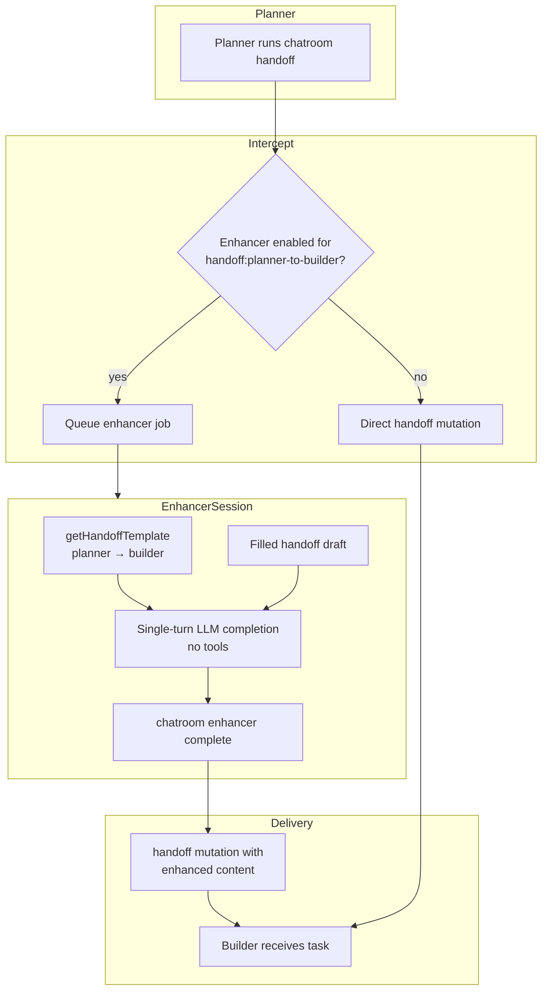

# Enhancers — Requirements & Implementation Plan

**Branch:** `feat/enhancers` (from `release/v1.74.0`)  
**PR:** #1085 (slice 1 — config UI)  
**Status:** Planning slice 2 — requirements captured, implementation not started

## Problem

Planner→builder handoffs are the primary delegation surface in duo teams. Planners often use capable but cheaper models for ongoing work; the delegation brief quality varies with context pressure and model capability. We want to optionally route handoff text through a **single-turn enhancement pass** using a more capable (expensive) model — improving fidelity and detail **without** running that model for full agentic work (code editing, tool use, multi-turn sessions).

## Goals

| #   | Goal                    | Summary                                                                                                                        |
| --- | ----------------------- | ------------------------------------------------------------------------------------------------------------------------------ |
| 1   | Single-turn enhancement | One completion call; no tools, no research, no subagents                                                                       |
| 2   | Template-aware          | Enhancer sees the **canonical handoff template** for the sender→target pair **and** the **filled handoff** to enhance          |
| 3   | Same output shape       | Enhanced result remains a valid handoff in the **same markdown structure** as the input (delegation brief for planner→builder) |
| 4   | CLI delivery            | Enhancer agent submits output via `chatroom enhancer complete` before session disposal                                         |
| 5   | User control            | User enables enhancer per chatroom, picks target phase + harness/model (slice 1 UI)                                            |

## Non-goals (v1)

- Enhancing user-facing handoffs (planner→user) — first target is planner→builder only
- Multi-turn enhancer sessions or tool use
- Enhancer doing its own codebase research
- Replacing the planner agent or changing handoff FSM semantics beyond intercept-and-continue

---

## Architecture Overview



**Pattern:** Mirror **agentic query** (web/daemon command → harness session → task envelope → CLI complete) but domain is **handoff enhancement**, not workspace search.

---

## Core inputs to the enhancer

The enhancer prompt **must** include:

### 1. Handoff template (structure contract)

Resolved server-side via `getHandoffTemplate()`:

```typescript
getHandoffTemplate({
  teamId: chatroom.teamId, // e.g. 'duo'
  fromRole: 'planner',
  toRole: 'builder',
  nativeIntegration: boolean, // from sender's harness capabilities
  chatroomId,
  role: 'planner',
  cliEnvPrefix,
});
```

Source: [services/backend/prompts/cli/handoff-templates/index.ts](services/backend/prompts/cli/handoff-templates/index.ts)  
Duo planner→builder body: [services/backend/prompts/teams/duo/handoff-templates/planner-to-builder.ts](services/backend/prompts/teams/duo/handoff-templates/planner-to-builder.ts)

The template tells the enhancer **what sections and quality bar** the output must satisfy.

### 2. Filled handoff (content to enhance)

The planner's draft handoff message body (markdown inside `---MESSAGE---` / heredoc), **before** it is delivered to the builder.

### 3. Enhancement instructions (system)

Fixed system prompt constraints:

- Improve clarity, detail, and fidelity; preserve intent
- **Do not** add research, file reads, or new scope
- **Do not** change the handoff format — output must match template structure
- Return only the enhanced handoff markdown (no preamble)

---

## CLI contract: `chatroom enhancer complete`

Mirror `chatroom agentic-query complete` ([packages/cli/src/commands/agentic-query/complete.ts](packages/cli/src/commands/agentic-query/complete.ts)).

```bash
chatroom enhancer complete \
  --chatroom-id=<id> \
  --job-id=<id> \
  << 'CHATROOM_ENHANCER_END'
---MESSAGE---
<enhanced handoff markdown — same structure as planner→builder delegation brief>
CHATROOM_ENHANCER_END
```

**Heredoc delimiter:** `CHATROOM_ENHANCER_END` (register in [services/backend/prompts/cli/stdin-heredoc.ts](services/backend/prompts/cli/stdin-heredoc.ts))

**CLI responsibilities:**

1. Authenticate session
2. Validate job exists and is `running`
3. Validate enhanced body (non-empty; optional: section headers match template expectations)
4. Persist enhanced content on job record
5. Trigger **delivery handoff** to builder with enhanced content (not the draft)
6. Mark job `complete`; dispose enhancer session

**Enhancer agent system prompt** must embed the complete command (like [renderAgenticQuerySystemPrompt](services/backend/prompts/agentic-query/system-prompt.ts)).

---

## Interception point

**Recommended:** Intercept in `chatroom handoff` CLI **before** calling `messages.handoff` mutation when:

- `nextRole === 'builder'` and `role === 'planner'`
- Chatroom has active enhancer config for `handoff:planner-to-builder`
- Enhancer config includes `agentHarness` + `model`

**Flow:**

1. Planner runs `chatroom handoff --next-role=builder` with draft message
2. CLI/backend detects enhancer enabled → creates `chatroom_enhancerJobs` row (status `pending`)
3. Daemon spawns enhancer harness session (user-selected harness/model from config)
4. Task envelope delivered with template + draft + complete command
5. Enhancer runs single turn → `chatroom enhancer complete`
6. Backend performs normal handoff mutation with **enhanced** content
7. Planner sees success output (same as today); builder receives enhanced brief

**Fallback:** If enhancer fails/times out → deliver original draft (configurable; default: fallback with log).

---

## Config sync (slice 1 → backend)

Slice 1 stores config in **localStorage** ([enhancerConfigStore.ts](apps/webapp/src/modules/chatroom/features/enhancers/stores/enhancerConfigStore.ts)). Slice 2 requires **server-visible config** so CLI/daemon can check at handoff time.

**Proposed:** Convex table `chatroom_enhancerConfigs` (per chatroom, per user):

```typescript
{
  chatroomId,
  userId,
  enabled: boolean,
  targetId: 'handoff:planner-to-builder',
  agentHarness: AgentHarness,
  model: string,
  machineId: string,  // workspace machine for harness spawn
  updatedAt: number,
}
```

Webapp: on Enable/Disable in dialog → mutation sync; hydrate localStorage on load.

---

## Schema sketch (slice 2)

### `chatroom_enhancerJobs`

| Field              | Type            | Notes                                            |
| ------------------ | --------------- | ------------------------------------------------ |
| `_id`              | Id              | job-id for CLI                                   |
| `chatroomId`       | Id              |                                                  |
| `targetId`         | string          | `handoff:planner-to-builder`                     |
| `fromRole`         | string          | `planner`                                        |
| `toRole`           | string          | `builder`                                        |
| `status`           | union           | `pending` \| `running` \| `complete` \| `failed` |
| `draftContent`     | string          | original handoff                                 |
| `enhancedContent`  | optional string | set by complete                                  |
| `templateSnapshot` | string          | resolved template at job creation                |
| `agentHarness`     | string          | from config                                      |
| `model`            | string          | from config                                      |
| `machineId`        | string          | spawn target                                     |
| `createdAt`        | number          |                                                  |
| `completedAt`      | optional number |                                                  |

### Daemon command

Extend `chatroom_directHarnessCommands` or add `chatroom_enhancerCommands` with `runEnhancer` — spawn single-turn session, inject envelope, await complete.

**Session constraints:** Disable tools at harness level (see harness-specific controls documented in chatroom). Enhancer is **not** a chatroom team role — ephemeral worker session.

---

## Implementation phases

| Phase | Slice          | Deliverable                                                   |
| ----- | -------------- | ------------------------------------------------------------- |
| 0     | **2.0 (this)** | `docs/plans/enhancers.md`                                     |
| 1     | **2.1**        | Convex schema + `enhancerConfigs` sync from webapp            |
| 2     | **2.2**        | `chatroom enhancer complete` CLI + validation                 |
| 3     | **2.3**        | Enhancer system prompt + task envelope builder                |
| 4     | **2.4**        | Handoff CLI interception + job queue                          |
| 5     | **2.5**        | Daemon spawn + single-turn session lifecycle                  |
| 6     | **2.6**        | E2E integration test: planner handoff → enhanced builder task |

---

## Task envelope (sketch)

**Path (proposed):** `services/backend/prompts/enhancer/render-task-envelope.ts`

```xml
<enhancer-job job-id="..." target="handoff:planner-to-builder">
  <handoff-template>
  ... resolved getHandoffTemplate output ...
  </handoff-template>
  <draft-handoff>
  ... planner draft markdown ...
  </draft-handoff>
  <requirements>
  - Single-turn only. No tools. No research.
  - Output must follow handoff-template structure exactly.
  - Improve detail and fidelity; do not change scope.
  </requirements>
  <cli-complete-command>
  chatroom enhancer complete --chatroom-id=... --job-id=... << 'CHATROOM_ENHANCER_END'
  ...
  CHATROOM_ENHANCER_END
  </cli-complete-command>
</enhancer-job>
```

---

## Open decisions

| Decision                        | Options                         | Recommendation                                                  |
| ------------------------------- | ------------------------------- | --------------------------------------------------------------- |
| Enhancer failure                | Fail handoff vs deliver draft   | **Deliver draft** with warning log (don't block builder)        |
| Config scope                    | Per-user vs per-chatroom        | **Per-user per-chatroom** (matches localStorage key)            |
| Harness spawn                   | Remote agent vs direct harness  | **Remote agent** on configured machine (reuse daemon spawn)     |
| Template validation on complete | Strict section check vs lenient | **Lenient v1** — non-empty + contains `## Goal` or `## Summary` |

---

## References

- Slice 1 UI: [apps/webapp/src/modules/chatroom/features/enhancers/](apps/webapp/src/modules/chatroom/features/enhancers/)
- Handoff templates: [services/backend/prompts/cli/handoff-templates/](services/backend/prompts/cli/handoff-templates/)
- Agentic query plan: [docs/plans/agentic-search-ask.md](docs/plans/agentic-search-ask.md)
- Handoff mutation: [services/backend/convex/messages.ts](services/backend/convex/messages.ts) (`_handoffHandler`)
