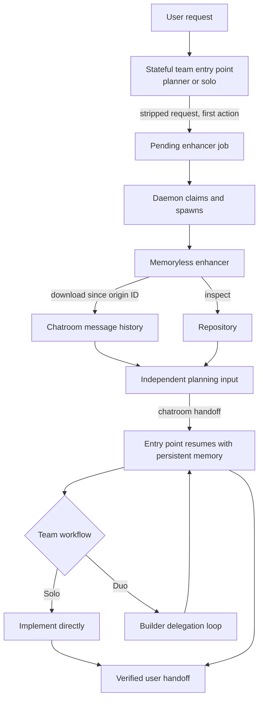

# Enhancers — Request-First Architecture

**Status:** Implemented

## Purpose

The enhancer is an optional, high-intelligence first planning pass for Solo and Duo teams. The team entry point is stateful and owns durable memory, the final plan, execution or delegation, verification, and user delivery. The enhancer is memoryless and runs once per originating user request.

This split is deliberate: use the more expensive enhancer for one context-grounded analysis, then let the persistent entry-point agent retain and apply that input throughout the rest of the task. The enhancer does not review an agent draft and does not need to know downstream handoff formats.

## Workflow

With enhancement enabled in a Duo team:

```text
user request → planner forwards request → enhancer analyzes → planner plans → [builder → planner] → user
```

With enhancement enabled in a Solo team:

```text
user request → solo forwards request → enhancer analyzes → solo plans and implements → user
```

With enhancement disabled, each team follows its normal workflow without the enhancer pass.

For Duo:

```text
user request → planner plans → [builder → planner] → user
```

The entry point's first action on a new user task is its handoff to the enhancer. It must not research, draft a plan, or prepare implementation instructions first. The handoff body is intentionally limited to:

```xml
<user-message>
<!-- Injected automatically from the originating user message; the planner does not copy it -->
{{USER_MESSAGE}}
</user-message>
<additional-context>
## Goal
<what the user wants>
</additional-context>
```

The server resolves `{{USER_MESSAGE}}` from the originating user message before storing the handoff and enhancer job. Planners fill only `<additional-context>`; the placeholder is never copied or edited manually.

The backend permits only one enhancer job for a given `originUserMessageId`. Enhancer output returns to the originating team entry point (`planner` or `solo`), and later work does not retrigger enhancement.

## Context recovery

The request forward is only a pointer to the work, not a substitute for conversation history. Each enhancer job carries its originating user message ID. The enhancer must first use current message-history conventions:

```bash
chatroom messages anchor --chatroom-id="<id>" --role="enhancer"
chatroom messages download --chatroom-id="<id>" --role="enhancer" --since-message-id="<origin-user-message-id>" --limit=100
```

The CLI prints an absolute path to the downloaded history. The enhancer reads that file, widens history when a terse request depends on earlier messages, and increases the limit when output is truncated. Actual user messages are authoritative.

After recovering history, the enhancer independently inspects the repository and produces planning input grounded in user intent and codebase evidence.

## Enhancer inputs and output

The spawn payload and remote daemon delivery use the standard task-delivery pipeline (`getTaskDeliveryForJob` → `generateFullCliOutput`). They contain:

- job, chatroom, and originating user-message identifiers;
- the enhancer→entry-point output template (handoff command, not `enhancer complete`);
- the stripped forwarded request;
- role constraints and mandatory `chatroom handoff` completion.

They deliberately exclude:

- entry-point research, grounding, or a draft plan;
- downstream implementation and user-delivery templates;
- builder brief requirements or eventual user-report structure.

The enhancer output is independent design input organized around:

- user intent and constraints;
- repository evidence;
- Proof of Principles (SSOT from `handoff-quality-principles.ts`);
- one recommended design;
- frontend and data/query design at code granularity when applicable (per-flow UX quality checklist embedded in frontend design);
- open questions for the user;
- recommended implementation sequence and files touched index.

For large or multi-surface revisions, the entry point should activate the `defragmentation` skill before delegating slices.

The output is advisory. The stateful entry-point agent reconciles it with persistent task context and owns the final plan and execution.

## Runtime architecture


```mermaid
flowchart TD
    U[User request] --> P[Stateful team entry point<br/>planner or solo]
    P -->|stripped request, first action| E[Pending enhancer job]
    E --> D[Daemon claims and spawns]
    D --> H[Memoryless enhancer]
    H -->|download since origin ID| M[Chatroom message history]
    H -->|inspect| R[Repository]
    M --> A[Independent planning input]
    R --> A
    A -->|chatroom handoff| P2[Entry point resumes with persistent memory]
    P2 --> B{Team workflow}
    B -->|Solo| I[Implement directly]
    B -->|Duo| D2[Builder delegation loop]
    D2 --> P2
    I --> X[Verified user handoff]
    P2 --> X[Verified user handoff]
```

The enhancer is an ephemeral chatroom team role rather than part of the persistent team roster. It runs one turn, completes through the CLI, and is disposed. Active invocations are visible through the normal participant/status surface, while retries and terminal failure use the enhancer job lifecycle for both teams; no entry-point draft is available as a fallback.

## Key modules

| Layer                        | Path                                                                          | Responsibility                                                  |
| ---------------------------- | ----------------------------------------------------------------------------- | --------------------------------------------------------------- |
| Team capability              | `packages/shared/src/domain/enhancer-team-capability.ts`                      | Defines supported teams and their persistent entry-point roles  |
| Initial entry-point guidance | `services/backend/prompts/task-delivery/enhancer-guidance.ts`                 | Requires request forwarding as the entry point's first action   |
| Shared enhancer templates    | `services/backend/prompts/enhancer/handoff-templates.ts`                      | Defines request-only and advisory-input contracts               |
| Team template routing        | `services/backend/prompts/teams/{duo,solo}/handoff-templates/index.ts`        | Maps planner/solo handoff pairs to shared contracts             |
| Workflow policy              | `services/backend/src/domain/usecase/enhancer/enhancer-workflow.ts`           | Limits enhancer availability to the initial user task           |
| Handoff enforcement          | `services/backend/convex/messages.ts`                                         | Authorizes entry points; completes job on enhancer handoff      |
| Entry-point status           | `services/backend/src/domain/usecase/enhancer/enhancer-entry-point-status.ts` | Tracks planner or solo while the transient enhancer is active   |
| Task delivery query          | `services/backend/convex/daemon/enhancer/taskDeliveryForJob.ts`               | Remote daemon prompt via standard task pipeline                 |
| Spawn payload (deprecated)   | `services/backend/convex/daemon/enhancer/spawnPayload.ts`                     | Legacy envelope; use `getTaskDeliveryForJob`                    |
| History guidance             | `services/backend/prompts/enhancer/history-retrieval.ts`                      | Renders anchor and origin-based download commands               |
| Enhancer role                | `services/backend/prompts/enhancer/system-prompt.ts`                          | Defines independent, memoryless planning behavior               |
| Task envelope                | `services/backend/prompts/enhancer/render-task-envelope.ts`                   | Excludes entry-point drafts and downstream templates            |
| Ephemeral release            | `services/backend/src/domain/usecase/task/transition-task.ts`                 | Terminal transitions release ephemeral roles (incl. enhancer)   |
| Completion (salvage)         | `services/backend/convex/web/enhancer/completeLogic.ts`                       | `@deprecated` — daemon salvage when agent exits without handoff |

## Compatibility constraints

- `targetId: 'handoff:planner-to-builder'` remains the persisted configuration discriminator to avoid a schema/config migration. It is not exposed to the enhancer as workflow knowledge.
- `draftContent` remains the persisted job-field name for compatibility, but request-first jobs store the forwarded user request there.
- `inputTemplateSnapshot` remains optional in the schema so existing documents continue to validate; new jobs no longer populate or consume it.
- The legacy `plannerEnhancerEnabled` field and helper names remain during this migration to avoid changing persisted task snapshots and public API shapes.
- Legacy XML tags remain renderable in the webapp for historical messages, but new entry-point→enhancer handoffs use only `<request>`.

## Verification focus

Tests should prove both required behavior and forbidden context:

- enhancer is the first enabled workflow action and runs once per origin message;
- Solo and Duo both route the initial user task to the enhancer, then return input to their own entry point;
- later handbacks cannot target enhancer;
- history commands include the exact `originUserMessageId`;
- spawn/delivery output includes handoff command and output contract;
- spawn/delivery output does not include `enhancer complete` or downstream handoff templates;
- enhancer read model returns to `offline` after handoff (ephemeral release on terminal task transition).
