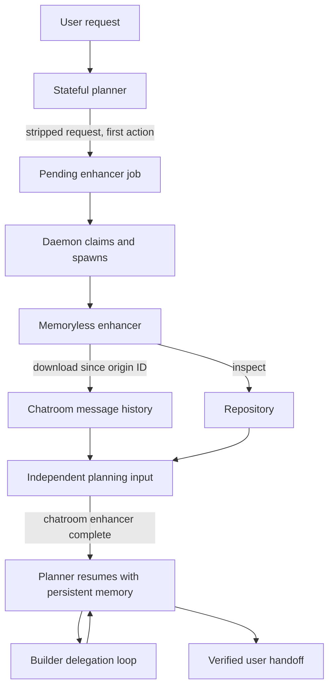

# Enhancers — Request-First Architecture

**Status:** Implemented

## Purpose

The enhancer is an optional, high-intelligence first planning pass for duo teams. The planner is stateful and owns the durable plan, delegation, verification, and user delivery. The enhancer is memoryless and runs once per originating user request.

This split is deliberate: use the more expensive enhancer for one context-grounded analysis, then let the planner retain and apply that input throughout the rest of the task. The enhancer does not review a planner draft and does not need to know downstream handoff formats.

## Workflow

With enhancement enabled:

```text
user request → planner forwards request → enhancer analyzes → planner plans → [builder → planner] → user
```

With enhancement disabled:

```text
user request → planner plans → [builder → planner] → user
```

The planner's first action on a new user task is the planner→enhancer handoff. It must not research, draft a plan, or prepare a builder brief first. The handoff body is intentionally limited to:

```xml
<request>
<the user's request, faithfully forwarded without analysis or a proposed solution>
</request>
```

The backend permits only one enhancer job for a given `originUserMessageId`. Builder handbacks return directly to the planner and do not retrigger enhancement.

## Context recovery

The request forward is only a pointer to the work, not a substitute for conversation history. Each enhancer job carries its originating user message ID. The enhancer must first use current message-history conventions:

```bash
chatroom messages anchor --chatroom-id="<id>" --role="enhancer"
chatroom messages download --chatroom-id="<id>" --role="enhancer" --since-message-id="<origin-user-message-id>" --limit=100
```

The CLI prints an absolute path to the downloaded history. The enhancer reads that file, widens history when a terse request depends on earlier messages, and increases the limit when output is truncated. Actual user messages are authoritative.

After recovering history, the enhancer independently inspects the repository and produces planning input grounded in user intent and codebase evidence.

## Enhancer inputs and output

The spawn payload contains only:

- job, chatroom, and originating user-message identifiers;
- the enhancer→planner output template;
- the stripped forwarded request;
- role constraints and the mandatory `chatroom enhancer complete` command.

It deliberately excludes:

- planner research, grounding, or a draft plan;
- planner→builder and planner→user templates;
- builder brief requirements or eventual user-report structure.

The enhancer output is independent planning input organized around:

- user intent and constraints;
- codebase grounding;
- a recommended approach;
- UX or defragmentation considerations when applicable;
- open questions;
- risks and mitigations;
- recommended next steps;
- implementation notes, last and only when useful.

The output is advisory. The stateful planner reconciles it with persistent task context and owns the final plan.

## Runtime architecture


```mermaid
flowchart TD
    U[User request] --> P[Stateful planner]
    P -->|stripped request, first action| E[Pending enhancer job]
    E --> D[Daemon claims and spawns]
    D --> H[Memoryless enhancer]
    H -->|download since origin ID| M[Chatroom message history]
    H -->|inspect| R[Repository]
    M --> A[Independent planning input]
    R --> A
    A -->|chatroom enhancer complete| P2[Planner resumes with persistent memory]
    P2 --> B[Builder delegation loop]
    B --> P2
    P2 --> X[Verified user handoff]
```

The enhancer is a daemon worker, not a persistent chatroom team role. It runs one turn, completes through the CLI, and is disposed. Retries and terminal failure use the existing enhancer job lifecycle; no planner draft is available as a fallback.

## Key modules

| Layer                     | Path                                                                          | Responsibility                                            |
| ------------------------- | ----------------------------------------------------------------------------- | --------------------------------------------------------- |
| Initial planner guidance  | `services/backend/prompts/task-delivery/enhancer-guidance.ts`                 | Requires request forwarding as the planner's first action |
| Planner→enhancer template | `services/backend/prompts/teams/duo/handoff-templates/planner-to-enhancer.ts` | Defines the stripped `<request>` body                     |
| Workflow policy           | `services/backend/src/domain/usecase/enhancer/enhancer-workflow.ts`           | Limits enhancer availability to the initial user task     |
| Handoff enforcement       | `services/backend/convex/messages.ts`                                         | Rejects duplicate jobs for an originating user message    |
| Spawn payload             | `services/backend/convex/daemon/enhancer/spawnPayload.ts`                     | Supplies origin, request, output contract, and prompts    |
| History guidance          | `services/backend/prompts/enhancer/history-retrieval.ts`                      | Renders anchor and origin-based download commands         |
| Enhancer role             | `services/backend/prompts/enhancer/system-prompt.ts`                          | Defines independent, memoryless planning behavior         |
| Task envelope             | `services/backend/prompts/enhancer/render-task-envelope.ts`                   | Excludes planner drafts and downstream templates          |
| Enhancer→planner template | `services/backend/prompts/teams/duo/handoff-templates/enhancer-to-planner.ts` | Structures independent planning input                     |
| Completion                | `packages/cli/src/commands/enhancer/complete.ts`                              | Returns planning input to the planner task queue          |

## Compatibility constraints

- `targetId: 'handoff:planner-to-builder'` remains the persisted configuration discriminator to avoid a schema/config migration. It is not exposed to the enhancer as workflow knowledge.
- `draftContent` remains the persisted job-field name for compatibility, but request-first jobs store the forwarded user request there.
- `inputTemplateSnapshot` remains optional in the schema so existing documents continue to validate; new jobs no longer populate or consume it.
- Legacy XML tags remain renderable in the webapp for historical messages, but new planner→enhancer handoffs use only `<request>`.

## Verification focus

Tests should prove both required behavior and forbidden context:

- enhancer is the first enabled workflow action and runs once per origin message;
- builder handbacks cannot target enhancer;
- history commands include the exact `originUserMessageId`;
- spawn payload includes the request and output contract;
- spawn payload does not include downstream handoff templates, planner grounding, or a planner draft;
- enhancer output sections describe independent analysis rather than critique.
