# Workspace file-tree sync queue and daemon lifecycle

## Context

Workspace file-tree sync from daemon → Convex was producing checkpoint floods: dozens of identical `File tree checkpoint` lines (same workspace, same entry count, `revision 1`) within seconds. Root causes:

1. **Orphan daemons** — `machine daemon start` with `detached: true` left many processes (PPID 1) after local restarts. The PID file tracked only one; each orphan independently fulfilled file-tree requests and uploaded full checkpoints.
2. **Unbounded parallel sync** — `enqueueFileTreeSync` existed but was never wired into file-tree subscription; every Convex request could trigger a parallel full-tree upload.
3. **Heavy walk targets** — `.nx` and `.convex` local cache dirs were walked and included in checkpoints.

Separately, the webapp explorer conflated **never-synced** workspaces with **truly empty** trees (`No files found` during loading).

## Decision

### 1. Orphan daemon reap (start/stop lifecycle)

- **`daemon-process-scan.ts`** — scan `ps` for all `machine daemon start` processes matching the current Convex URL (`CHATROOM_CONVEX_URL` or default cloud URL), not only the PID-file holder.
- **`stopExistingDaemons()`** before PID-lock acquisition in `pid.ts`; **`daemon-stop.ts`** uses scan-based stop.
- **Local stack** — `process-manager.stopAndWait()` and daemon restart in `process-definitions.ts` stop the daemon before rebuild/restart.

### 2. Per-workspace sync queue + debounce

- **`workspace-sync-queue.ts`** — SSOT for `enqueueFileTreeSync(machineId, workingDir, task)`.
- **One runner** per `(machineId, workingDir)`; concurrent enqueues update `pendingTask` and share one drain promise.
- **`queueMicrotask`** deferral coalesces same-tick burst enqueues before drain starts.
- **`FILE_TREE_SYNC_DEBOUNCE_MS = 5_000`** in `workspace-sync-config.ts` — minimum interval between consecutive runs; **first run is immediate** (`lastCompletedAt === 0` skips wait).
- **`lastCompletedAtByKey`** persists debounce across queue teardown between drain cycles.
- **`file-tree-subscription.ts`** — all `processPendingFileTreeRequests` paths call `enqueueFileTreeSync` before `ensureCoordinator`.

Git state pushes (`git-heartbeat.ts`) are **not** queued by this change.

### 3. Walk exclusions

- **`workspace-visibility-policy.ts`** — treat `.nx` and `.convex` as shallow-sync exclusions (alongside `.turbo`, `node_modules`, etc.).

### 4. Webapp explorer states

- **`WorkspaceFileExplorer`** + hooks distinguish loading, error, syncing, never-synced, and truly-empty — not a single empty placeholder during hydration.

## Architecture

```mermaid
flowchart TD
    subgraph lifecycle [Daemon lifecycle]
        L1[local restart / daemon start] --> L2[scan ps for machine daemon start]
        L2 --> L3[stopExistingDaemons SIGTERM/SIGKILL]
        L3 --> L4[acquire PID lock + start single daemon]
    end

    subgraph requests [File-tree request path]
        A[Convex file-tree.request] --> B[drainPendingFileTreeRequests]
        B --> C[enqueueFileTreeSync per workspace]
        C --> D{Draining?}
        D -->|Yes| E[Coalesce pendingTask]
        D -->|No| F[queueMicrotask → drainQueue]
        F --> G{5s since last run?}
        G -->|No| H[await debounce]
        G -->|Yes| I[ensureCoordinator]
        H --> I
        I --> J[walk tree minus .nx/.convex]
        J --> K[publish checkpoint to Convex]
        K --> L{pendingTask during run?}
        L -->|Yes| G
        L -->|No| M[Done]
    end
```

## Consequences

- Rapid file-explorer opens or subscription events coalesce to one checkpoint per workspace per debounce window instead of N parallel uploads.
- Orphan reap requires rebuilt CLI + daemon restart to take effect locally.
- Debounce constant is CLI-local (`workspace-sync-config.ts`); cross-package sharing would move to `services/backend/config/reliability.ts` if needed later.

## Related

- [Workspace file tree sync strategies](workspace-file-tree-sync-strategies.md) — blob/sharded snapshot strategies and watch lifecycle
- [Workspace file-tree tech debt tracker](/development/workspace-file-tree-tech-debt.md)
