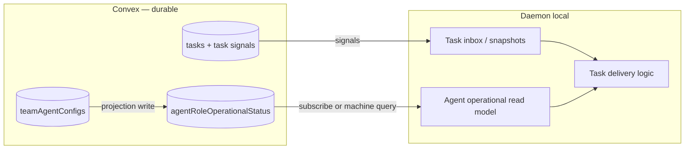

# Agent operational status — daemon integration plan

## Context

While `feat/agent-operational-status-projection` landed backend projection tables and projection-only Convex readers, **master** merged PR #1479 (`fix(cli): make task inbox delivery recoverable`) which introduced a **daemon-local workaround** for agent status lag inside the task inbox path.

This document captures the problem, the master workaround, the edge case that motivated it, and the phased plan to replace the workaround with the operational projection as SSOT.

## Master workaround (#1479) — what landed

### `MachineTaskSnapshotState` (daemon in-memory)

- File: `packages/cli/src/daemon/infrastructure/inbox/task-snapshot-state.ts`
- In-memory `Map` owned by the task inbox; rebuilt on bootstrap and updated per signal page.
- **`setDesiredState(chatroomId, role, 'running' | 'stopped')`** — mutates `agentConfig.desiredState` on all matching snapshot rows without a backend round-trip.

### Optimistic updates in `agent-control-bridge.ts`

On `ensureRunning` start:

```typescript
taskSnapshotState?.setDesiredState(args.chatroomId, args.role, 'running');
// ... spawn ...
if (!result.success) {
  taskSnapshotState?.setDesiredState(args.chatroomId, args.role, 'stopped');
}
```

### Why it exists

Documented in master `memory/migrations/task-inbox-machine-level-migration.md` § **Agent-status coupling**:

> Agent configuration changes do not necessarily emit task-status signals. Stopping clears PID + sets `desiredState: stopped`; starting sets `desiredState: running`, but the task inbox may not receive a task signal. The daemon updates local snapshot state on start and trusts a healthy local slot while backend PID propagation catches up.

### Task snapshot embeds agent metadata

`chatroom_machineAssignedTaskSnapshots` projection denormalizes `desiredState`, `spawnedAgentPid`, harness, workingDir, participant status into each task row. Delivery logic (`task-delivery-logic.ts`, `native-ready-invariant.ts`) reads **`task.agentConfig.desiredState`** to decide wake / revive / nudge / inject.

## Edge case — pending task not picked up on agent restart

**Scenario:**

1. Agent is working a task (`in_progress` / `acknowledged`).
2. Agent exits or is stopped; backend releases task → **`pending`**.
3. Task-status signal hydrates snapshot, but agent metadata on the snapshot may be **stale** (`desiredState: stopped`, `spawnedAgentPid: null`) until the next config patch or full re-sync.
4. Daemon restarts or agent restarts; pending task exists but delivery skips it because snapshot says agent is stopped.

**Master mitigation:**

- `listNativePendingTasksNeedingWake` — pending native task + `desiredState: stopped` on snapshot → call `ensureRunning` with reason `platform.pending_task_wake`.
- `setDesiredState('running')` on start so delivery doesn't wait for backend snapshot refresh.
- `native-ready-invariant` trusts **local slot PID** over snapshot PID when slot is healthy (backend lag tolerance).

**User concern:** Storing `desiredState` inside the task snapshot store is a workaround. With authoritative agent operational status + proper status transitions, the daemon should react to operational state changes instead of denormalizing agent config into task rows.

## Target architecture



**Principles:**

- **Task inbox** — authoritative for task lifecycle events only (pending, acknowledged, in_progress, completed).
- **Agent operational projection** — authoritative for `desiredState`, `isRunning`, `isAlive`, `operationalState`, daemon connectivity.
- **Delivery** — combines task snapshot + operational read model at decision time; no `desiredState` denormalized into task snapshots long-term.
- **Reactive transitions** — when operational status changes (start/stop/exit/lifecycle outbox), daemon delivery re-evaluates pending tasks for that `(chatroomId, role)` without requiring a task signal.

## Branch state (2026-08-22)

`feat/agent-operational-status-projection` includes:

- Master #1479 is merged, and PR #1481 targets `release/v1.98.8`.
- Projection tables, projection-only Convex readers, daemon-startup backfill, and the daemon operational read model are complete.
- Delivery now reads operational state reactively; `setDesiredState` and snapshot agent metadata wiring were removed.
- Backend task snapshots are slimmed to task-only data, with Phase E regression/integration tests passing.

## Phased implementation plan

### Phase A — Merge master + reopen PR (immediate)

- [x] Merge `origin/master` into `feat/agent-operational-status-projection`
- [x] Resolve conflicts while retaining daemon operational backfill and task inbox bootstrap behavior
- [x] Reopen PR #1481 targeting **`release/v1.98.8`**, not `master` directly
- [x] Verify tests pass after merge

### Phase B — Daemon agent operational read model (complete)

- [x] Add machine-scoped Convex subscription query by `machineId` index
- [x] Daemon: `AgentOperationalReadModel` — in-memory map `(chatroomId, role) → operational row`, refreshed by Convex subscription
  - Inbox bootstrap (after `backfillAgentOperationalStatusForMachine`)
  - Lifecycle outbox drain events (if daemon receives them) OR periodic reconcile OR Convex subscription
- [x] Do **not** add more `setDesiredState` paths — subscription is the SSOT

### Phase C — Decouple delivery from snapshot `desiredState` (complete)

- [x] `task-delivery-logic.ts` / `native-ready-invariant.ts`: read operational state from `AgentOperationalReadModel`
- [x] `listNativePendingTasksNeedingWake`: wake when operational model says stopped/none but pending task exists
- [x] Remove `MachineTaskSnapshotState.setDesiredState` and bridge optimistic patches
- [x] On operational status transition → trigger targeted `processTasksUpdate` reconcile (Convex subscription)

### Phase D — Backend snapshot slimming (complete)

- [x] Stop writing `desiredState` / `spawnedAgentPid` / `circuitState` into task snapshot projection
- [x] Task signals remain task-only; agent metadata comes from operational projection at hydrate time or daemon-side join

### Phase E — Verification

- [x] Integration test: task worked → released to pending → agent restart → task delivered (regression for #1479 edge case)
- [x] Integration test: agent start without task signal → pending task delivers after operational row shows running
- [ ] Manual: daemon restart with pending tasks across multiple chatrooms (optional post-merge verification)

## Post-merge note (2026-08-22)

- `stopAgent` eagerly releases tasks via `onAgentExited` (commit `241f41392`).

## Open decisions

| Decision                                 | Options                          | Recommendation                                                              |
| ---------------------------------------- | -------------------------------- | --------------------------------------------------------------------------- |
| Daemon refresh path for operational rows | Convex subscription by machineId | Chosen; reactive updates avoid operational polling                          |
| Merge vs rebase master                   | Merge commit vs rebase           | Merge — preserves both histories; easier conflict audit                     |
| Remove snapshot agent fields             | Big-bang vs gradual              | Gradual: daemon reads operational model first, then slim backend projection |

## Related

- [Agent operational status projection migration](../migrations/agent-operational-status-projection.md)
- [Agent operational status tech debt](./agent-operational-status-tech-debt.md)
- [Task inbox machine-level migration](../migrations/task-inbox-machine-level-migration.md) — master § Agent-status coupling
- PR #1481 — operational projection and daemon integration
- PR #1479 — task inbox recoverable delivery (master workaround)
- PR #1480 — `release/v1.98.8` target branch
