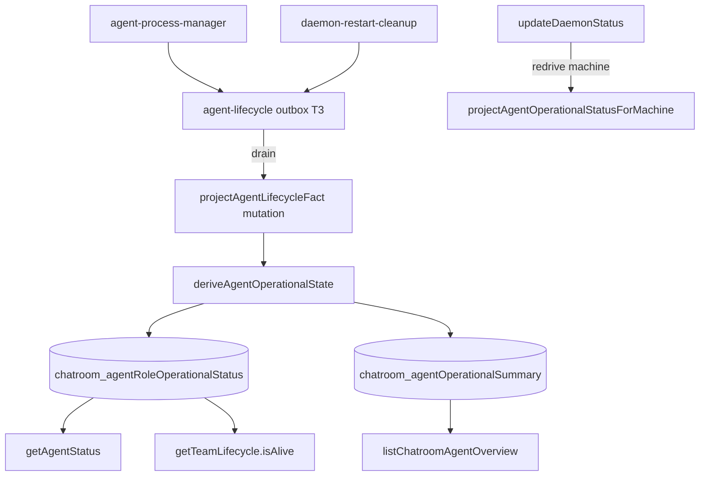

# Agent operational status projection

## Context

Agent operational state is currently derived at read time in four or more places, with inconsistent rules. This inconsistency was the root cause of the AgentPanel bugs addressed by PR #1475. Operational facts (whether a process is alive and whether its daemon is connected) must be separated from participant timeline labels.

| Consumer                 | Query / hook                           | Fields derived                                  | File                                     |
| ------------------------ | -------------------------------------- | ----------------------------------------------- | ---------------------------------------- |
| AgentPanel quick actions | `machines.getAgentStatus`              | `AgentRoleView.state`                           | `get-agent-statuses.ts`                  |
| Sidebar remote dots      | `machines.listAgentOverview`           | `agentStatus`, `runningRoles`, `aliveRoles`     | `list-chatroom-agent-overview.ts`        |
| Status labels + isAlive  | `participants.getTeamLifecycle`        | `isAlive`, participant timeline                 | `participants.ts`, `useAgentStatuses.ts` |
| Single-room overview     | `machines.getAgentOverviewForChatroom` | same as sidebar per-room                        | `machines.ts` ~L2480                     |
| Chat list dots           | `ChatroomListingContext`               | merges overview + presence + `deriveChatStatus` | `ChatroomListingContext.tsx`             |
| Bulk start/stop          | `ChatroomDashboard`                    | `hasRunningRemoteAgents` from panel state       | `ChatroomDashboard.tsx`                  |

## Decision

- The daemon owns operational facts: PID set/clear, exit, restart phase, and desired-state changes initiated locally.
- Convex stores materialized projections in new tables, derived on write by one `deriveAgentOperationalState()` function.
- Delivery starts with a T3 immediate outbox event drained into a Convex projection mutation, matching the daemon-centric discovery pattern.
- `updateDaemonStatus` redrives projection for every role on the affected machine.
- `participant.lastStatus` remains the timeline/label stream and is not merged into operational tables.

## Schema design

`chatroom_agentRoleOperationalStatus` stores one row per `(chatroomId, role)` for the current team:

```typescript
{
  chatroomId: Id<'chatroom_rooms'>,
  role: string, // lowercase normalized
  teamId: string,
  machineId?: string,
  operationalState: 'running' | 'stopped' | 'starting' | 'circuit_open',
  isAlive: boolean, // spawnedAgentPid != null
  isRunning: boolean, // isAlive && daemonConnected
  daemonConnected: boolean,
  projectedAt: number,
  revisionKey: string,
}
```

Indexes: `by_chatroom`, unique `by_chatroom_role`, and `by_machineId`.

`chatroom_agentOperationalSummary` stores one row per chatroom:

```typescript
{
  chatroomId: Id<'chatroom_rooms'>,
  teamId: string,
  remoteConfigCount: number,
  agentStatus: 'running' | 'stopped' | 'none',
  runningRoles: string[],
  aliveRoles: string[],
  runningAgents: { role: string; machineId: string }[],
  projectedAt: number,
}
```

Index: unique `by_chatroom`.

## Projection triggers

Phase 2 wiring must cover the following sources:

- Outbox drain: PID set/clear, agent exit, restart phase, and desired-state changes.
- `updateDaemonStatus`: redrive all roles on the affected machine.
- `patchTeamAgentConfig`: desired state, circuit state, PID, and machine changes.
- `clearAllSpawnedPids`, `startAgent`, `stopAgent`, and `recordAgentExited`.
- `transitionAgentStatus`, only for in-flight `starting` inference (`agent.requestStart`, `agent.restart`, `agent.restartPhase`).
- Team switches and config removal (`update-team.ts`, `config-removal.ts`).

## Architecture



## Progress tracker

### Phase 0 — Planning scaffold

- [x] Migration memory + index entry
- [x] Stacked PR opened against `release/v1.98.7`

### Phase 1 — Agent lifecycle outbox (daemon, BEFORE projection)

- [x] Add `agent.lifecycle` outbound event types to `outbound-event.ts`
- [x] Create `agent-lifecycle-outbox.ts` (T3 immediate, keyed by `{machineId}:{chatroomId}:{role}`)
- [x] Route `agent-process-manager` PID/exited/restart facts through outbox
- [x] Route daemon-restart-cleanup `clearAllSpawnedPids` through outbox
- [x] Add Convex receive mutation stub (`machines.projectAgentLifecycleFact`)
- [x] Add integration tests for enqueue, drain, and retry on failure

### Phase 2 — Write-time projection (Convex)

- [x] Add schema tables and indexes
- [x] Implement `derive-agent-operational-state.ts`
- [x] Implement `project-agent-operational-status.ts` (role + summary upsert and machine-scoped redrive)
- [x] Wire outbox drain to the projection mutation
- [x] Wire `updateDaemonStatus` to `projectAgentOperationalStatusForMachine`
- [x] Wire remaining mutation triggers
- [x] Add a backfill mutation for existing chatrooms
- [x] Add derivation-matrix integration tests

### Phase 3 — Reader migration (one PR commit per reader)

### Bandwidth constraints

Operational projection hot paths use role-scoped indexed reads and writes: config
patches, lifecycle transitions, and daemon connectivity changes do not scan a
whole chatroom. Full chatroom scans are reserved for team switches (where stale
role rows must be pruned) and explicit machine backfill. Summary rows carry the
remote configuration count so `none` versus `stopped` can be maintained without
reloading all configs.

- [x] `getAgentStatusForChatroom` reads materialized role rows
- [x] `listAgentOverview` reads summary rows
- [x] `getTeamLifecycle` reads `isAlive` from role rows
- [x] `getAgentOverviewForChatroom` reads the summary row
- [ ] Production backfill migration wired into `migrations.runAll` — Skipped; cold-start deploy per 2026-08-22 decision
- [ ] Verify AgentPanel, sidebar, and `deriveChatStatus` behavior is unchanged
- [x] Supersede or close tactical PR #1475 (closed as superseded by #1478)

### Phase 4 — Cleanup

See also [agent operational status tech debt tracker](../development/agent-operational-status-tech-debt.md).

- [x] Remove read-time derivation from migrated use cases
- [ ] Remove duplicate daemon-connectivity joins in queries
- [ ] Remove direct Convex mutations from `agent-process-manager` once outbox is sole path
- [ ] Update `transition-agent-status.ts` comment to point to the projection table
- [ ] Archive this migration document

## Cleanup plan

| Stage                      | Cleanup                                                                                                                                                                                                                                      |
| -------------------------- | -------------------------------------------------------------------------------------------------------------------------------------------------------------------------------------------------------------------------------------------- |
| After Phase 3 reader flips | Remove `IN_FLIGHT_START_STATUSES` derivation from `get-agent-statuses.ts`; remove `runningConfigs` filtering from `list-chatroom-agent-overview.ts`; remove inline `isAgentAlive(config.spawnedAgentPid)` derivation from `participants.ts`. |
| After all readers migrate  | Keep `is-agent-alive.ts` only for daemon-local use and remove it from Convex query paths.                                                                                                                                                    |
| After outbox stabilization | Remove direct mutations from `agent-process-manager`; PR #1475 changes are superseded.                                                                                                                                                       |
| Final archive              | Update this tracker to `status: archived` after operational and projection parity is verified.                                                                                                                                               |

## Open decisions and risks

- Cold-start deploy chosen over CI backfill (2026-08-22).

- During the dual-write period, the projection must match old derivation before any reader flips.
- `aliveRoles` and `runningRoles` have distinct semantics and must remain distinct.
- Outbox idempotency keys must survive daemon restart.
- Team switches must delete stale role rows and the corresponding summary.
