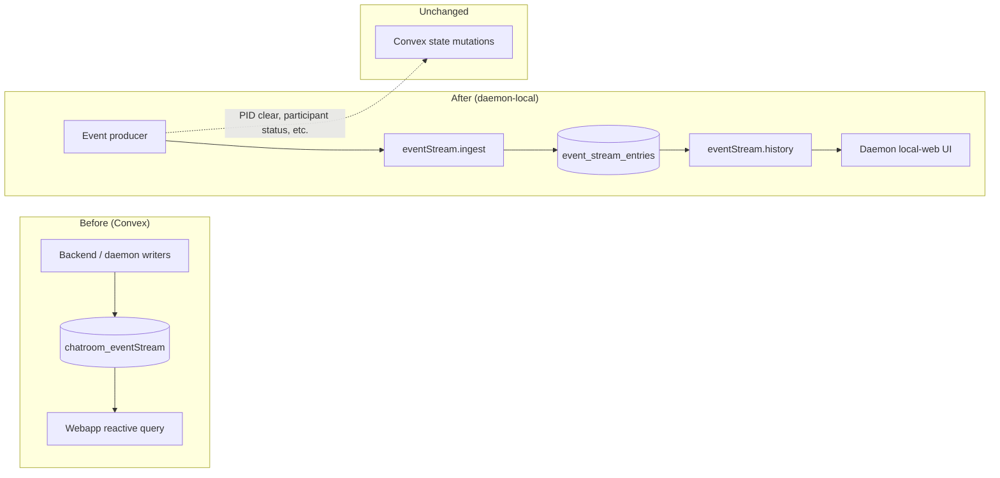
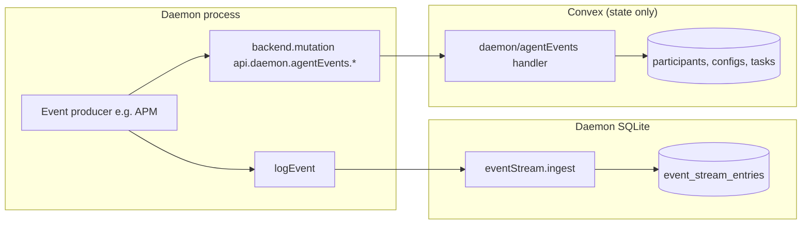

# Chatroom event stream daemon migration

## Context

The webapp event stream reads from Convex `chatroom_eventStream` — a large, reactive table synced to every connected client. High event volume (agent lifecycle, tasks, daemon pings, enhancer jobs) creates significant Convex bandwidth and subscription cost.

The daemon already captures agent session logs locally (`log_entries` + `logs.stream.subscribe`). This migration moves **structured chatroom events** to the same local-first model without duplicating Convex state mutations.

See also: [Chatroom event stream writer inventory](/migrations/chatroom-event-stream-writers.md) for the Convex write-site baseline.

## Primary goal: bandwidth saving

Reduce Convex read/write/sync bandwidth by:

1. **Stopping Convex `chatroom_eventStream` inserts** for migrated event types.
2. **Persisting events locally** on the daemon in SQLite (`event_stream_entries`).
3. **Serving history on demand** via `eventStream.history` socket queries — not pushing events to subscribers.

## End state

All event stream **audit records produced by the daemon process** are written to daemon-local persistent storage (`event_stream_entries` SQLite via `logEvent` → `eventStream.ingest`), not to Convex `chatroom_eventStream`.

| Stays on Convex                                         | Moves to daemon SQLite                              |
| ------------------------------------------------------- | --------------------------------------------------- |
| State mutations (PID, participant, task status, config) | Immutable audit/event log entries                   |
| Backend-originated events (tasks, team, enhancer, etc.) | Daemon-originated lifecycle/delivery/session events |

**Success criteria:** Zero daemon-originated `chatroom_eventStream` inserts remain; daemon local-web can query full history per chatroom via `eventStream.history`.

## Progress tracker

_Last updated: 2026-08-19 — daemon event stream migration complete (17/17)_

### Infrastructure

| Item                                                  | Status         | Evidence                                            |
| ----------------------------------------------------- | -------------- | --------------------------------------------------- |
| `event_stream_entries` SQLite table (schema v2)       | ✅ Done        | `log-schema.ts`, `log-store.ts`                     |
| `eventStream.ingest` socket handler                   | ✅ Done        | `register-handlers.ts`                              |
| `eventStream.history` with required `chatroomId`      | ✅ Done        | `queryEventStream` + Zod schema                     |
| Chatroom index on payload `chatroomId`                | ✅ Done        | `log-schema.ts`                                     |
| Domain use-case layer                                 | ✅ Done        | `event-stream-history.ts`, `log-event-ingestion.ts` |
| Daemon local-web Event Stream tab + chatroom selector | ✅ Done        | `EventStreamPage.tsx`                               |
| Pull-based history only (no live rebroadcast)         | ✅ Done        | By design — see Primary goal                        |
| Typed event renderers / pagination                    | ⬜ Not started | Future UX work                                      |

### Daemon-originated event types

Events the daemon currently emits via `logEvent` (local) or `api.machines.emit*` (Convex — to migrate).

| Event type                      | Status          | Class         | Current write path                                                    | Convex state side effects                                            |
| ------------------------------- | --------------- | ------------- | --------------------------------------------------------------------- | -------------------------------------------------------------------- |
| `agent.exited`                  | ✅ Done         | audit + state | `logEvent` + `api.daemon.agentEvents.agentExited`                     | `agentExited` use case + `onAgentExited`                             |
| `agent.started`                 | ✅ Done         | audit + state | `logEvent` + `agentEvents.agentStarted`; PID via `updateSpawnedAgent` | `transitionAgentStatus`, restart metrics (`recordAgentSpawnedState`) |
| `agent.startFailed`             | ✅ Done         | audit + state | `logEvent` + `agentEvents.agentStartFailed`                           | `transitionAgentStatus`, `desiredState: stopped`                     |
| `agent.providerUnavailable`     | ✅ Done         | audit + state | `logEvent` + `agentEvents.agentProviderUnavailable`                   | `transitionAgentStatus`, optional `desiredState: stopped`            |
| `agent.stopTimeout`             | ✅ Done         | audit only    | `logEvent` only (APM stop-timeout path)                               | none                                                                 |
| `agent.sessionResumeRequested`  | ✅ Done         | audit + state | `logEvent` + `agentEvents.sessionResumeRequested`                     | `transitionAgentStatus`                                              |
| `agent.sessionResumed`          | ✅ Done         | audit + state | `logEvent` + `agentEvents.sessionResumed`                             | `transitionAgentStatus`                                              |
| `agent.sessionResumeFailed`     | ✅ Done         | audit + state | `logEvent` + `agentEvents.sessionResumeFailed`                        | `transitionAgentStatus`                                              |
| `agent.sessionReopenRetry`      | ✅ Done         | audit + state | `logEvent` + `agentEvents.sessionReopenRetry`                         | `transitionAgentStatus`                                              |
| `agent.harnessSessionIdUpdated` | ✅ Done         | audit only    | `logEvent` only (APM harness session update)                          | none                                                                 |
| `agent.restartLimitReached`     | ✅ Done         | audit only    | `logEvent` only (APM crash-loop gate)                                 | none                                                                 |
| `agent.restartPhase`            | ✅ Done         | audit only    | `logEvent` only (`restart-orchestrator`)                              | none                                                                 |
| `agent.restartCompleted`        | ✅ Done         | audit only    | `logEvent` only (`restart-orchestrator`)                              | none                                                                 |
| `agent.sessionAugmented`        | ✅ Done         | audit + state | `logEvent` + `agentEvents.sessionAugmented`                           | `consumeTaskStartInNewSession` when `newSessionStarted`              |
| `agent.taskDelivered`           | ✅ Done         | audit only    | `logEvent` only (native injector, assigned-task publisher)            | none                                                                 |
| `agent.taskDeliveryFailed`      | ✅ Done         | audit only    | `logEvent` only (native injector, assigned-task publisher)            | none                                                                 |
| `daemon.pong`                   | ✅ Done         | audit only    | `logEvent` only (`command-dispatch`, `command-result` publisher)      | none (machine-scoped; no `chatroomId`)                               |
| `daemon.*` command events       | ⬜ Out of scope | —             | Convex/web command path                                               | Backend-originated; not daemon audit migration                       |

**Status legend:** ✅ Migrated (audit + state complete) · 🟡 Partial (audit or state only) · ⬜ Pending · ⬜ Out of scope

**Class legend:** **audit only** = remove Convex insert, `logEvent` only · **audit + state** = split into `logEvent` + `api.daemon.agentEvents.*` state handler

**Progress:** 17 / 17 fully migrated (100%).

### Phase 1 shipped (v1.98.1)

Merged to master via PR. Includes: event ingestion API, SQLite persistence, `agent.exited` local routing, chatroom-scoped history API + UI, migration memory docs.

> **Intentional non-goal:** Live event rebroadcast (e.g. `eventStream.stream.subscribe` or a `logStreamHub` equivalent for events) is **out of scope**. Pull-based history keeps bandwidth low. Do not flag missing live streaming as a gap.

## Scope: chatroom-level only

All event stream storage, queries, and UI **must be scoped to a single chatroom**:

- Every ingested event carries `chatroomId` (required for query filtering).
- `eventStream.history` must accept `chatroomId` and filter by it (mirror `logs.history` pattern).
- Daemon local-web UI must select or filter by chatroom — no global cross-room event dump.
- Indexes should support `chatroomId` lookups (e.g. `json_extract(payload_json, '$.chatroomId')`).

This matches the web event stream, which queries `by_chatroom` index per room.

## Architecture



### Separation of concerns

| Concern                                                 | Where it lives                                           |
| ------------------------------------------------------- | -------------------------------------------------------- |
| Event audit trail (immutable log)                       | Daemon SQLite `event_stream_entries`                     |
| Backend state mutations (PID, participant, task status) | Convex mutations (unchanged responsibility)              |
| Event display                                           | Daemon local-web (migrating from web `EventStreamPanel`) |

Do not conflate audit events with agent session logs (`log_entries`). Events are structured documents with typed payloads; logs are harness output lines.

## Socket API

| Event                 | Purpose                                                          |
| --------------------- | ---------------------------------------------------------------- |
| `eventStream.ingest`  | Write one event to local store (from daemon `logEvent` callback) |
| `eventStream.history` | Pull paginated/filtered history for a chatroom                   |

Renamed from `logs.events.ingest` — events are not agent session logs.

## Migration conventions

This section is the **SSOT for migrating each event type**. Any agent implementing a tracker row should follow these conventions exactly. Reference implementation: PR [#1465](https://github.com/conradkoh/chatroom/pull/1465), commit `9f7908136`.

### Terminology

| Term                   | Meaning                                                                                                |
| ---------------------- | ------------------------------------------------------------------------------------------------------ |
| **Audit event**        | Immutable log entry — moves to daemon SQLite via `logEvent` → `eventStream.ingest`                     |
| **State mutation**     | Convex DB change (participant status, PID, config, task flags, metrics) — **stays on Convex**          |
| **Daemon-originated**  | Emitted from `packages/cli` daemon code (APM, restart-orchestrator, native-delivery, command-dispatch) |
| **Backend-originated** | Emitted from Convex domain use cases or web/backend paths — **out of scope** for this migration track  |

### Core rule: always split audit from state

Today most daemon paths call `api.machines.emit*` or `updateSpawnedAgent`, which **combine** a `chatroom_eventStream` insert with Convex state updates. Migration **must not** move state mutations to SQLite. Instead:

1. **Audit** → daemon `logEvent({ type, timestamp, chatroomId, ... })` → local SQLite
2. **State** → separate Convex mutation under `services/backend/convex/daemon/agentEvents.ts` (new handlers) or an existing state-only mutation

Do **not** leave combined audit+state mutations on `machines.emit*`. Deprecate the event-stream insert in those handlers; route daemon callers to the split pattern.



### Decision tree (per handler)

For each daemon call site that currently hits `machines.emit*` or a combined mutation:

1. **Identify the audit payload** — fields currently inserted into `chatroom_eventStream` (must include `type`, `timestamp`, and `chatroomId` when the event is room-scoped).
2. **Identify state side effects** — anything that patches `chatroom_participants`, `chatroom_teamAgentConfigs`, `chatroom_tasks`, metrics tables, or schedules follow-up work.
3. **Classify:**
   - **audit only** → replace Convex call with `logEvent` only; delete the `ctx.db.insert('chatroom_eventStream', …)` from the Convex handler (or remove the handler if unused).
   - **audit + state** → `logEvent` for audit **and** `api.daemon.agentEvents.<handler>` for state. Extract shared state logic into a domain use case if not already extracted.
4. **Wire daemon caller** — replace `api.machines.emit*` with the two-call pattern (audit first; state call can be fire-and-forget with `.catch()` like today).
5. **Update tests** — integration tests that asserted Convex event-stream rows must assert daemon SQLite ingest instead; state assertions stay on Convex.
6. **Update tracker** — mark row ✅ only when audit **and** state paths are complete.

### Daemon-side call pattern

`logEvent` is injected via `AgentProcessManagerDeps` and wired in `start-daemon.ts` → `ingestChatroomEvent` → `eventStream.ingest`.

```typescript
// Audit — always local first
await deps.logEvent({
  type: 'agent.startFailed',
  timestamp: Date.now(),
  chatroomId,
  role,
  machineId: deps.machineId,
  error,
  // ...other event-specific fields matching the Convex insert shape
});

// State — only when the old emit* mutation also mutated Convex tables
await deps.backend.mutation(api.daemon.agentEvents.agentStartFailed, {
  sessionId: deps.sessionId,
  machineId: deps.machineId,
  chatroomId,
  role,
  error,
});
```

**Retry:** For high-value audit events, follow `agent.exited` — queue failed `logEvent` calls and retry (see `exitRetryQueue` in APM). State mutations can remain best-effort `.catch()` unless idempotency requires otherwise.

**Required payload fields:** `type`, `timestamp`, `chatroomId` (when room-scoped). Preserve all fields the web `EventStreamPanel` renderers expect — check `apps/webapp/src/modules/chatroom/eventTypes/`.

### Backend-side refactor pattern

**New state handlers** live in `services/backend/convex/daemon/agentEvents.ts` (namespace: `api.daemon.agentEvents.*`). Follow `agentExited` as the template:

```typescript
// services/backend/convex/daemon/agentEvents.ts
export const agentStartFailed = mutation({
  args: {
    ...SessionIdArg,
    machineId: v.string(),
    chatroomId: v.id('chatroom_rooms'),
    role: v.string(),
    error: v.string(),
  },
  handler: async (ctx, args) => {
    await requireMachineOwner(ctx, args.sessionId, args.machineId);
    // State only — NO ctx.db.insert('chatroom_eventStream', …)
    await transitionAgentStatus(ctx, args.chatroomId, args.role, 'agent.startFailed', 'stopped');
    // ...other state from the old emitAgentStartFailed handler
    return { success: true };
  },
});
```

Steps for each `machines.emit*` being migrated:

1. Copy state logic from the old handler into a new `daemon/agentEvents` mutation (or existing domain use case called from it).
2. **Remove** `ctx.db.insert('chatroom_eventStream', …)` from the old handler.
3. Leave `machines.emit*` as a thin deprecated shim **only if** external callers remain; otherwise delete and update all call sites.
4. Run `services/backend/tests/integration/event-stream.spec.ts` and event-specific integration tests.

**Existing split example:** `agent.exited` — audit removed from `agent-exited.ts` use case (`9f7908136`); state handler at `api.daemon.agentEvents.agentExited` wraps `agentExited` use case + `onAgentExited`. Daemon must call this for state (see partial status below).

### What cannot migrate

These **must remain Convex mutations** called by the daemon:

- Participant status updates (`transitionAgentStatus`)
- PID / config patches (`patchTeamAgentConfig`, `updateSpawnedAgent` state portion)
- Task lifecycle (`consumeTaskStartInNewSession`, `releaseTasksOnAgentExit` via `onAgentExited`)
- Restart metrics (`chatroom_agentRestartMetrics` upsert)
- Auth / machine ownership checks (`requireMachineOwner`, `assertMachineBelongsToChatroom`)

The bandwidth win is eliminating **high-frequency `chatroom_eventStream` inserts and reactive sync**, not moving authoritative state off Convex.

### Per-event migration worksheet

Copy this checklist for each tracker row:

- [ ] List all daemon write sites (grep `emit*` / mutation name)
- [ ] Classify audit vs state (see tracker **Class** column)
- [ ] Implement `logEvent` at each daemon write site with full payload
- [ ] Add `api.daemon.agentEvents.<handler>` for state (if audit + state)
- [ ] Remove `chatroom_eventStream` insert from Convex handler
- [ ] Update daemon tests (APM unit tests assert `logEvent` calls)
- [ ] Update backend integration tests (event stream assertions → local or removed)
- [ ] Mark tracker row ✅ and note commit hash

### Per-event migration guides

Each guide lists **daemon write sites**, **Convex handler to split**, and **exact steps**.

#### `agent.exited` {#agentexited}

|                      |                                                   |
| -------------------- | ------------------------------------------------- |
| **Status**           | 🟡 Partial — audit migrated; state wiring pending |
| **Class**            | audit + state                                     |
| **Reference commit** | `9f7908136` (audit path)                          |

**Daemon write sites** (`packages/cli/src/daemon/infrastructure/agent-process-manager/agent-process-manager.ts`):

- `emitExitEvent` / `recordAgentExitedOrQueueRetry` — normal exit, recovery, respawn, stop-timeout
- Retry queue: `exitRetryQueue` / `drainExitRetryQueue`

**Convex handlers:**

- Audit: removed from `services/backend/src/domain/usecase/agent/agent-exited.ts`
- State: `api.daemon.agentEvents.agentExited` (wraps `agentExited` use case + `onAgentExited`)
- Legacy combined: `api.machines.recordAgentExited` — keep for tests until daemon wired

**Steps to finish:**

1. ✅ `logEvent({ type: 'agent.exited', ... })` at all exit sites
2. ⬜ After `logEvent`, call `api.daemon.agentEvents.agentExited` with same args (PID-gated cleanup, participant update, task release)
3. ⬜ Update APM tests to expect both `logEvent` and `agentEvents.agentExited`
4. ⬜ Mark ✅ when state path wired and integration tests pass

#### `agent.started`

|                       |                                                                                         |
| --------------------- | --------------------------------------------------------------------------------------- |
| **Class**             | audit + state                                                                           |
| **Daemon write site** | `AgentProcessManager.emitSpawnedAgentUpdate` → `api.machines.updateSpawnedAgent`        |
| **Convex handler**    | `services/backend/convex/machines.ts` — `updateSpawnedAgent` (insert at ~L1567 + state) |

**Steps:**

1. `logEvent` with fields: `chatroomId`, `role`, `machineId`, `agentHarness`, `model`, `workingDir`, `pid`, `reason`, `harnessSessionId`
2. Add `api.daemon.agentEvents.agentStarted` — move PID patch, `transitionAgentStatus('agent.started')`, restart metrics upsert
3. Slim `updateSpawnedAgent` to state-only (or replace daemon call with new handler)
4. Test: spawn flow in APM tests + `event-stream.spec.ts`

#### `agent.startFailed`

|                        |                                                              |
| ---------------------- | ------------------------------------------------------------ |
| **Class**              | audit + state                                                |
| **Daemon write sites** | `APM.emitStartFailedEvent`; also turn-completed bridge paths |
| **Convex handler**     | `machines.emitAgentStartFailed`                              |

**State side effects:** `transitionAgentStatus('agent.startFailed', 'stopped')`, `patchTeamAgentConfig({ desiredState: 'stopped' })`

**Steps:** `logEvent` → `api.daemon.agentEvents.agentStartFailed` (state). Remove event insert from `emitAgentStartFailed`.

#### `agent.providerUnavailable`

|                       |                                         |
| --------------------- | --------------------------------------- |
| **Class**             | audit + state                           |
| **Daemon write site** | `APM.maybeEmitProviderUnavailable`      |
| **Convex handler**    | `machines.emitAgentProviderUnavailable` |

**State:** `transitionAgentStatus('agent.providerUnavailable', …)`, optional `desiredState: 'stopped'` when not recoverable.

#### `agent.stopTimeout`

|                       |                                  |
| --------------------- | -------------------------------- |
| **Class**             | audit only                       |
| **Daemon write site** | `APM` stop-timeout path (~L2130) |
| **Convex handler**    | `machines.emitAgentStopTimeout`  |

**Steps:** `logEvent` only. Delete insert from handler; remove or no-op `emitAgentStopTimeout`.

#### `agent.sessionResumeRequested` / `agent.sessionResumed` / `agent.sessionResumeFailed`

|                        |                                                                                        |
| ---------------------- | -------------------------------------------------------------------------------------- |
| **Class**              | audit + state (each)                                                                   |
| **Daemon write sites** | `APM.emitSessionResumeRequested`, `emitSessionResumed`, `emitSessionResumeFailed`      |
| **Convex handlers**    | `machines.emitSessionResumeRequested`, `emitSessionResumed`, `emitSessionResumeFailed` |

**State:** each calls `transitionAgentStatus` with matching status string.

**Steps:** One migration per event type (three separate PRs/commits recommended). Pattern: `logEvent` + `api.daemon.agentEvents.sessionResume*`.

#### `agent.sessionReopenRetry`

|                       |                                   |
| --------------------- | --------------------------------- |
| **Class**             | audit only                        |
| **Daemon write site** | `APM.emitSessionReopenRetry`      |
| **Convex handler**    | `machines.emitSessionReopenRetry` |

#### `agent.harnessSessionIdUpdated`

|                       |                                        |
| --------------------- | -------------------------------------- |
| **Class**             | audit only                             |
| **Daemon write site** | `APM` harness session update (~L1590)  |
| **Convex handler**    | `machines.emitHarnessSessionIdUpdated` |

#### `agent.restartLimitReached`

|                       |                                    |
| --------------------- | ---------------------------------- |
| **Class**             | audit only                         |
| **Daemon write site** | `APM` crash-loop gate (~L1636)     |
| **Convex handler**    | `machines.emitRestartLimitReached` |

#### `agent.restartPhase` / `agent.restartCompleted`

|                       |                                                              |
| --------------------- | ------------------------------------------------------------ |
| **Class**             | audit only                                                   |
| **Daemon write site** | `packages/cli/src/daemon/entry/restart-orchestrator.ts`      |
| **Convex handlers**   | `machines.emitRestartPhase`, `machines.emitRestartCompleted` |

**Note:** `emitRestartPhase` uses `buildAgentRestartPhaseEvent` — preserve exact payload shape in `logEvent`.

#### `agent.sessionAugmented`

|                        |                                                                                                              |
| ---------------------- | ------------------------------------------------------------------------------------------------------------ |
| **Class**              | audit + state                                                                                                |
| **Daemon write sites** | `task-monitor-runtime.ts`, `native-delivery/native-task-injector.ts`, `native-cold-session-before-inject.ts` |
| **Convex handler**     | `machines.emitSessionAugmented`                                                                              |

**State:** `consumeTaskStartInNewSession(ctx, taskId)` when `newSessionStarted === true`.

**Steps:** `logEvent` + `api.daemon.agentEvents.sessionAugmented` (state: consume flag only).

#### `agent.taskDelivered` / `agent.taskDeliveryFailed`

|                        |                                                                                                       |
| ---------------------- | ----------------------------------------------------------------------------------------------------- |
| **Class**              | audit only                                                                                            |
| **Daemon write sites** | `native-delivery/native-task-injector.ts`, `infrastructure/convex/publishers/assigned-task-status.ts` |
| **Convex handlers**    | `machines.emitTaskDelivered`, `machines.emitTaskDeliveryFailed`                                       |

#### `daemon.pong`

|                        |                                                                            |
| ---------------------- | -------------------------------------------------------------------------- |
| **Class**              | audit only (machine-scoped)                                                |
| **Daemon write sites** | `command-dispatch.ts`, `publishers/command-result.ts` → `machines.ackPing` |
| **Convex handler**     | `machines.ackPing`                                                         |

**Scope note:** `daemon.pong` has no `chatroomId` (machine-level). Store with `chatroomId` omitted or document as machine-scoped exception; `eventStream.history` requires `chatroomId` so machine events may need a separate query path or synthetic scope — resolve before migrating.

#### `daemon.*` command events (out of scope)

`daemon.gitRefresh`, `daemon.ping`, etc. are **backend/web-originated** commands inserted into Convex for daemon subscription. Not part of daemon-originated audit migration. Do not migrate in this track.

### Phase 1 infrastructure commits (reference)

| Commit      | What it does                                                                |
| ----------- | --------------------------------------------------------------------------- |
| `dd019288d` | `feat(cli): add chatroom event ingestion API` — socket `eventStream.ingest` |
| `3bcbc49cb` | `feat(cli): persist ingested chatroom events` — `appendChatroomEvent`       |
| `3f98131bd` | `refactor(cli): add logging use cases` — domain layer                       |
| `8c3507a44` | chatroom-scoped storage + `eventStream.history`                             |
| `9f7908136` | `agent.exited` audit migration (reference)                                  |
| `986de2bfc` | PR #1465 merge to master at v1.98.1                                         |

## Dual display goals

The daemon event stream UI serves two goals (not mutually exclusive):

1. **Web parity** — show the same data users see in the web `EventStreamPanel` (typed event renderers, list + detail, pagination). Reuse or share `eventTypes/*` registry where practical.
2. **Log-stream conventions** — follow daemon `LogsPage` patterns for filters, URL state, dimensions, and detail panels. **Do not** copy live log tailing (`logs.stream.subscribe`) — events use pull-based history only.

## Migration checklist (quick reference)

See [Migration conventions](#migration-conventions) for the full guide. Per tracker row:

- [ ] Classify audit-only vs audit+state
- [ ] `logEvent` at daemon write site(s)
- [ ] `api.daemon.agentEvents.*` for state (if needed)
- [ ] Remove Convex `chatroom_eventStream` insert
- [ ] Tests updated
- [ ] Tracker row marked ✅

## Consequences

- Webapp will eventually read event history from daemon (or a thin proxy), not Convex reactive queries — major bandwidth win.
- Convex `chatroom_eventStream` table can be deprecated once all writers migrate and historical data strategy is decided.
- Daemon local-web becomes the primary event stream viewer during development/ops.

## Review corrections (2026-08-19)

Prior gap analysis incorrectly flagged these as missing:

| Prior flag                        | Correction                                           |
| --------------------------------- | ---------------------------------------------------- |
| No live stream hub for events     | **Intentional** — pull-based history saves bandwidth |
| Global vs per-chatroom scope open | **Resolved** — must be chatroom-scoped               |

Remaining valid gaps: typed event renderers, pagination, web UX parity.
