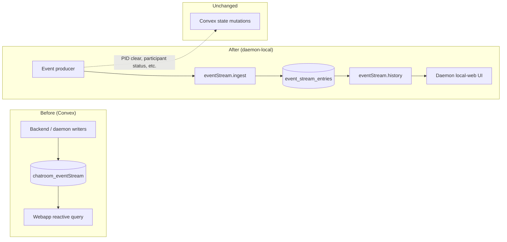

# Chatroom event stream daemon migration

## Context

The webapp event stream reads from Convex `chatroom_eventStream` — a large, reactive table synced to every connected client. High event volume (agent lifecycle, tasks, daemon pings, enhancer jobs) creates significant Convex bandwidth and subscription cost.

The daemon already captures agent session logs locally (`log_entries` + `logs.stream.subscribe`). This migration moves **structured chatroom events** to the same local-first model without duplicating Convex state mutations.

See also: [Chatroom event stream writer inventory](/migrations/chatroom-event-stream-writers.md) for the Convex write-site baseline.

## Primary goal: bandwidth saving

Reduce Convex read/write/sync bandwidth by:

1. **Stopping Convex `chatroom_eventStream` inserts** for migrated event types.
2. **Persisting events locally** on the daemon in SQLite (`event_stream_entries`).
3. **Serving history on demand** via `eventStream.history` socket queries — not pushing events to subscribers.

## End state

All event stream **audit records produced by the daemon process** are written to daemon-local persistent storage (`event_stream_entries` SQLite via `logEvent` → `eventStream.ingest`), not to Convex `chatroom_eventStream`.

| Stays on Convex | Moves to daemon SQLite |
| --------------- | ---------------------- |
| State mutations (PID, participant, task status, config) | Immutable audit/event log entries |
| Backend-originated events (tasks, team, enhancer, etc.) | Daemon-originated lifecycle/delivery/session events |

**Success criteria:** Zero daemon-originated `chatroom_eventStream` inserts remain; daemon local-web can query full history per chatroom via `eventStream.history`.

## Progress tracker

_Last updated: 2026-08-19 — Phase 1 merged at v1.98.1_

### Infrastructure

| Item | Status | Evidence |
| ---- | ------ | -------- |
| `event_stream_entries` SQLite table (schema v2) | ✅ Done | `log-schema.ts`, `log-store.ts` |
| `eventStream.ingest` socket handler | ✅ Done | `register-handlers.ts` |
| `eventStream.history` with required `chatroomId` | ✅ Done | `queryEventStream` + Zod schema |
| Chatroom index on payload `chatroomId` | ✅ Done | `log-schema.ts` |
| Domain use-case layer | ✅ Done | `event-stream-history.ts`, `log-event-ingestion.ts` |
| Daemon local-web Event Stream tab + chatroom selector | ✅ Done | `EventStreamPage.tsx` |
| Pull-based history only (no live rebroadcast) | ✅ Done | By design — see Primary goal |
| Typed event renderers / pagination | ⬜ Not started | Future UX work |

### Daemon-originated event types

Events the daemon currently emits via `logEvent` (local) or `api.machines.emit*` (Convex — to migrate):

| Event type | Status | Current write path | Notes |
| ---------- | ------ | ------------------ | ----- |
| `agent.exited` | ✅ Migrated | `logEvent` → `eventStream.ingest` | Reference impl `9f7908136` |
| `agent.started` | ⬜ Pending | `updateSpawnedAgent` mutation | Spawn success |
| `agent.startFailed` | ⬜ Pending | `emitAgentStartFailed` | APM, turn-completed, bridge |
| `agent.providerUnavailable` | ⬜ Pending | `emitAgentProviderUnavailable` | APM |
| `agent.stopTimeout` | ⬜ Pending | `emitAgentStopTimeout` | APM |
| `agent.sessionResumeRequested` | ⬜ Pending | `emitSessionResumeRequested` | APM |
| `agent.sessionResumed` | ⬜ Pending | `emitSessionResumed` | APM |
| `agent.sessionResumeFailed` | ⬜ Pending | `emitSessionResumeFailed` | APM |
| `agent.sessionReopenRetry` | ⬜ Pending | `emitSessionReopenRetry` | APM |
| `agent.harnessSessionIdUpdated` | ⬜ Pending | `emitHarnessSessionIdUpdated` | APM |
| `agent.restartLimitReached` | ⬜ Pending | `emitRestartLimitReached` | APM |
| `agent.restartPhase` | ⬜ Pending | `emitRestartPhase` | restart-orchestrator |
| `agent.restartCompleted` | ⬜ Pending | `emitRestartCompleted` | restart-orchestrator |
| `agent.sessionAugmented` | ⬜ Pending | `emitSessionAugmented` | task-monitor, native-delivery |
| `agent.taskDelivered` | ⬜ Pending | `emitTaskDelivered` | native-delivery, publishers |
| `agent.taskDeliveryFailed` | ⬜ Pending | `emitTaskDeliveryFailed` | native-delivery, publishers |
| `daemon.pong` | ⬜ Pending | `ackPing` mutation | command-dispatch |
| `daemon.*` command events | ⬜ Pending | Convex command path | ping, gitRefresh, localAction, pickFolder, refreshCapabilities |

**Progress:** 1 / 17 daemon-originated event paths migrated (~6%).

### Phase 1 shipped (v1.98.1)

Merged to master via PR. Includes: event ingestion API, SQLite persistence, `agent.exited` local routing, chatroom-scoped history API + UI, migration memory docs.

> **Intentional non-goal:** Live event rebroadcast (e.g. `eventStream.stream.subscribe` or a `logStreamHub` equivalent for events) is **out of scope**. Pull-based history keeps bandwidth low. Do not flag missing live streaming as a gap.

## Scope: chatroom-level only

All event stream storage, queries, and UI **must be scoped to a single chatroom**:

- Every ingested event carries `chatroomId` (required for query filtering).
- `eventStream.history` must accept `chatroomId` and filter by it (mirror `logs.history` pattern).
- Daemon local-web UI must select or filter by chatroom — no global cross-room event dump.
- Indexes should support `chatroomId` lookups (e.g. `json_extract(payload_json, '$.chatroomId')`).

This matches the web event stream, which queries `by_chatroom` index per room.

## Architecture

### Separation of concerns

| Concern                                                 | Where it lives                                           |
| ------------------------------------------------------- | -------------------------------------------------------- |
| Event audit trail (immutable log)                       | Daemon SQLite `event_stream_entries`                     |
| Backend state mutations (PID, participant, task status) | Convex mutations (unchanged responsibility)              |
| Event display                                           | Daemon local-web (migrating from web `EventStreamPanel`) |

Do not conflate audit events with agent session logs (`log_entries`). Events are structured documents with typed payloads; logs are harness output lines.

## Socket API

| Event                 | Purpose                                                          |
| --------------------- | ---------------------------------------------------------------- |
| `eventStream.ingest`  | Write one event to local store (from daemon `logEvent` callback) |
| `eventStream.history` | Pull paginated/filtered history for a chatroom                   |

Renamed from `logs.events.ingest` — events are not agent session logs.

## Commit direction (bandwidth-optimization branch)

Recent commits establish this migration pattern:

| Commit      | What it does                                                                                                |
| ----------- | ----------------------------------------------------------------------------------------------------------- |
| `dd019288d` | `feat(cli): add chatroom event ingestion API` — socket `eventStream.ingest` handler                         |
| `3bcbc49cb` | `feat(cli): persist ingested chatroom events` — `appendChatroomEvent` in log-store                          |
| `3f98131bd` | `refactor(cli): add logging use cases` — domain use-case layer (`log-event-ingestion`, `log-history`, etc.) |
| `184c0d9a2` | `docs(memory): record chatroom event stream migration inventory` — Convex writer baseline                   |
| `9f7908136` | `refactor: route agent exit events through daemon logging` — **first migrated event type**                  |

### `agent.exited` migration pattern (reference implementation)

`9f7908136` demonstrates the target pattern for all event types:

1. **Remove** `ctx.db.insert('chatroom_eventStream', …)` from backend use cases.
2. **Emit locally** via `AgentProcessManager.deps.logEvent({ type: 'agent.exited', … })` → `ingestChatroomEvent` → SQLite.
3. **Keep** backend state cleanup (clear PID, update participant) via existing Convex mutations — separate from audit trail.
4. **Add** `services/backend/convex/daemon/agentEvents.ts` for daemon-facing state mutations that no longer include event stream writes.

Retry queue for failed local event writes (`exitRetryQueue`) replaces Convex mutation retry for the audit record only.

## Dual display goals

The daemon event stream UI serves two goals (not mutually exclusive):

1. **Web parity** — show the same data users see in the web `EventStreamPanel` (typed event renderers, list + detail, pagination). Reuse or share `eventTypes/*` registry where practical.
2. **Log-stream conventions** — follow daemon `LogsPage` patterns for filters, URL state, dimensions, and detail panels. **Do not** copy live log tailing (`logs.stream.subscribe`) — events use pull-based history only.

## Migration checklist (per event type)

For each Convex writer in the [inventory](/migrations/chatroom-event-stream-writers.md):

- [ ] Identify whether the write is audit-only or also triggers state mutation.
- [ ] Move audit insert to daemon `logEvent` → `eventStream.ingest`.
- [ ] Remove `chatroom_eventStream` insert from Convex path.
- [ ] Preserve state mutations on their existing Convex endpoints.
- [ ] Ensure payload includes `chatroomId`, `type`, `timestamp`.
- [ ] Add/adjust daemon local-web rendering for the event type.

## Consequences

- Webapp will eventually read event history from daemon (or a thin proxy), not Convex reactive queries — major bandwidth win.
- Convex `chatroom_eventStream` table can be deprecated once all writers migrate and historical data strategy is decided.
- Daemon local-web becomes the primary event stream viewer during development/ops.

## Review corrections (2026-08-19)

Prior gap analysis incorrectly flagged these as missing:

| Prior flag                        | Correction                                           |
| --------------------------------- | ---------------------------------------------------- |
| No live stream hub for events     | **Intentional** — pull-based history saves bandwidth |
| Global vs per-chatroom scope open | **Resolved** — must be chatroom-scoped               |

Remaining valid gaps: typed event renderers, pagination, web UX parity.
