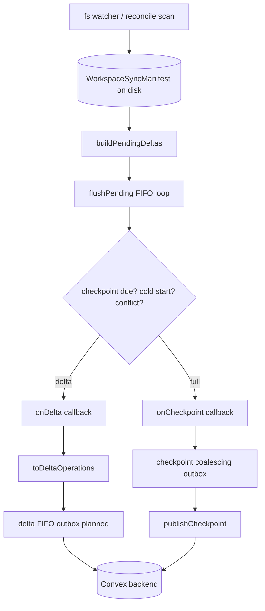

# Daemon outbox consolidation

## Context

The daemon pushes workspace file-tree state to Convex via checkpoint snapshots
and incremental delta batches. Direct Convex calls on every filesystem change
create bandwidth pressure and make delivery policy implicit.

This migration introduces reusable outbox components under
`packages/cli/src/daemon/infrastructure/outbox/` that make outbound delivery
explicit: coalescing for latest-state projections, FIFO for ordered operations.

See also: checkpoint wiring in `packages/cli/src/daemon/entry/files/file-tree-subscription.ts`.

## Primary goal

Make outbound delivery policy explicit per stream type while keeping the
persisted workspace sync manifest as the source of truth.

## System design (agreed)

### Ownership boundaries

| Concern | Owner | Location |
| --- | --- | --- |
| Tree path index + pending delta queue | Coordinator + sync manifest | `~/.chatroom/sync-state/{machineId}/{hash}/manifest.json` |
| Diff → `WorkspacePendingDelta` | Coordinator | `buildPendingDeltas()` in `workspace-file-tree-coordinator.ts` |
| Full vs delta sync strategy | Coordinator | `flushPending()`, cold start, reconcile, checkpoint cadence |
| Delta → Convex wire format | Subscription (thin transport) | `toDeltaOperations()` in `file-tree-subscription.ts` |
| Checkpoint snapshot upload | Subscription via checkpoint outbox | `publishCheckpoint()` |
| Delta Convex mutation | Subscription via delta outbox (planned) | `applyFileTreeDeltaBatch` |
| Delivery scheduling / retry / rate limit | Outbox adapters | `daemon/infrastructure/outbox/` |

The outbox owns delivery scheduling only. It does not store tree state, compute
diffs, or decide whether to checkpoint versus delta.

### Separate outboxes for checkpoints and deltas

Checkpoints and deltas use different adapters and must not share a coalescing
instance. They share the keyed-registry pattern and delivery key:
`normalizedWorkingDir`. File-tree Convex tables are workspace-scoped
(`machineId + workingDir`), not chatroom-scoped.

| | Checkpoint outbox | Delta outbox (planned) |
| --- | --- | --- |
| Semantics | Latest-state coalescing | FIFO ordered delivery |
| Supersede pending? | Yes — newer checkpoint replaces older | No — each delta is distinct |
| Idempotency | Revision + snapshot identity | Per-delta `operationId` |
| Rate limit | 5s (`WORKSPACE_FILE_TREE_CHECKPOINT_OUTBOX_MIN_INTERVAL_MS`) | TBD |
| Status | ✅ Implemented | ⬜ Planned |

Coalescing deltas would silently drop intermediate `operationId` operations.

### Full sync vs delta — coordinator decides

| Trigger | Strategy | Callback |
| --- | --- | --- |
| Cold start / no local manifest | Full checkpoint | `onCheckpoint` after initial scan |
| Backend has no checkpoint | Full checkpoint | `coordinator.checkpoint()` |
| Normal filesystem changes | Delta | `onDelta` via `flushPending()` |
| Every N revisions (default 100) | Full checkpoint | `publishCheckpoint()` inside `flushPending()` |
| Periodic reconcile / force request | Rescan → deltas and/or checkpoint | `reconcileNow()` / `forceReconcile` |
| Backend `resync-required` | Adjust revision, retry | conflict handling in `flushPending()` |

“Full sync” is a V2 blob or V3 sharded snapshot plus
`publishFileTreeCheckpoint`; “delta sync” is `applyFileTreeDeltaBatch`.

### Blocking enqueue contract

The coordinator awaits `onCheckpoint` and `onDelta` promises. Outbox enqueue
resolves only when that delivery unit is sent, including rate-limit wait. This
provides intentional backpressure and preserves ordering without a shared
wire-level mutex.

### Shutdown behavior (resolved)

Shutdown does not flush pending outbox state. The persisted manifest remains
authoritative; unsent pending delivery is discarded on `stop()`.

## Architecture diagram

## Decisions

Outboxes live under `packages/cli/src/daemon/infrastructure/outbox/`.

- `coalescing-state-outbox.ts` — latest-state scheduling, rate limiting, retry/backoff, serialization, and shutdown rejection
- `keyed-coalescing-state-outbox-registry.ts` — one coalescing outbox per delivery key
- `workspace-file-tree-checkpoint-outbox.ts` — checkpoint adapter owning the 5s interval constant

Planned next: a FIFO delta primitive, a keyed
`workspace-file-tree-delta-outbox.ts` adapter, and delta wiring in
`file-tree-subscription.ts`. Subscription and daemon runtime APIs do not expose
outbox interval configuration.

## Progress tracker

| Item | Status | Evidence / next location |
| --- | --- | --- |
| Coalescing-state outbox primitive | ✅ Done | `coalescing-state-outbox.ts` |
| Keyed coalescing registry | ✅ Done | `keyed-coalescing-state-outbox-registry.ts` |
| Checkpoint outbox adapter + wiring | ✅ Done | adapter and `file-tree-subscription.ts` |
| Checkpoint outbox tests | ✅ Done | primitive, registry, adapter, subscription tests |
| Release-path coordinator map cleanup | ✅ Done | `0bc97b2bf` |
| System design recorded in memory | ✅ Done | this document |
| FIFO ordered delta outbox primitive | ⬜ Pending | New file under `outbox/` |
| Delta outbox adapter + wiring | ⬜ Pending | `file-tree-subscription.ts` `onDelta` path |
| Delta delivery policy | ⬜ Pending | Decide rate limit / backoff before implementation |
| Durable SQLite outbox drain | ⬜ Pending | `daemon/infrastructure/persistence/outbox.ts` |
| Buffered journal migration | ⬜ Pending | `infrastructure/repos/journal-factory.ts` |
| Workspace request queue consolidation | ⬜ Pending | `workspace-sync-queue.ts` |
| Outbox metrics and diagnostics | ⬜ Pending | pending-state, retry, and coalescing visibility |

## Policy boundaries

Not every queue is an outbound outbox: `MessageBuffer` and `SseEventBuffer`
are inbound transport buffers; `TurnEndQueue` is a handler serializer;
`retry-queue` is a retry utility; and `workspace-sync-queue` is inbound request
coalescing. Only outbound projection concerns migrate to outboxes.

## Safety requirements

1. Identify whether a stream is latest-state or FIFO before migrating it.
2. Keep source of truth separate from delivery bookkeeping.
3. Preserve idempotency keys across retries (`operationId` for deltas).
4. Bound payloads before sending to Convex.
5. Add focused tests for coalescing/rate-limit/retry/shutdown and FIFO ordering/idempotency.
6. Mark a tracker row complete only after the old direct send path is removed.

## Unresolved decisions

- Delta delivery policy: FIFO retry/backoff; one `operationId` per send versus batching
- Whether checkpoint and delta outboxes need a shared in-flight mutex per working directory
- Whether durable delta outbox storage is needed sooner than checkpoints due to higher churn
