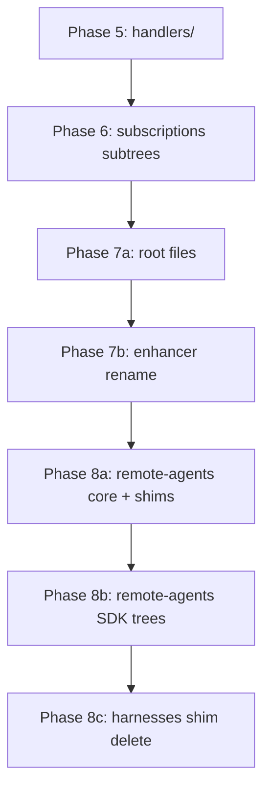

# Daemon consolidation plan — Phases 5–8

> **Status:** Phases 0–8 ✅ complete on `feat/daemon-consolidation-plan`.
> **Inventory SSOT:** [`consolidate.md`](./consolidate.md)
> **Branch for execution:** Continue on `feat/daemon-consolidation-plan` or a fresh `feat/daemon-consolidation-5-8` branch cut from `release/v1.88.2` after this plan merges.

## Executive summary

Phases 0–4 moved events, git, native-integration, fatal-error-guard, and agent-process-manager under `packages/cli/src/daemon/`. **~79 source files (~9.8k LOC)** remain in `commands/machine/daemon-start/` plus **99 files** in `infrastructure/services/remote-agents/` and **6 shim files** in `infrastructure/harnesses/`.

This plan completes consolidation in four phases (5–8), following the same discipline as Phases 0–4: one phase = one commit, move files, update imports, update fallow baselines, run `pnpm turbo run typecheck test --filter=chatroom-cli`.

**Estimated scope:** ~125 consolidate moves + ~26 consolidate+shim re-exports + enhancer rename sub-step.

---

## Resolved decisions

All items from `consolidate.md` §Open decisions are resolved here. No further user input required before execution.

### 1. `remote-agents/` registry strategy → **Move with thin re-exports**

**Decision:** Move the entire `infrastructure/services/remote-agents/` tree to `daemon/infrastructure/local/harness/services/` (paths per `consolidate.md` §9). Leave **thin re-export shims** at the old `infrastructure/services/remote-agents/` paths for files marked `consolidate+shim` (registry, index, base-cli-agent-service, detection-result, init-registry, and CLI-agent service index files used by `harness-status` / `machine/detection`).

**Rationale:** Daemon harness registry is the primary consumer. Re-exports preserve stable paths for two external CLI commands without duplicating implementation. Matches Phase 0–4 shim-deletion pattern inverted: delete shims only when all importers updated.

**Phase:** 8a (registry + shared types), 8b (native SDK subsets), 8c (delete harnesses/ shims).

### 2. `daemon-start/index.ts` path → **Keep `commands/machine/daemon-start/`**

**Decision:** Do **not** rename to `commands/machine/daemon/`. After Phase 7, `daemon-start/index.ts` remains the CLI command entry point (~20 lines: `daemonStart()` delegates to `daemon/entry/start-daemon.ts` + test re-exports). Only `types.ts` and `daemon-services.ts` may retain thin re-export shims temporarily if test imports lag.

**Rationale:** Command path is CLI UX surface (`machine daemon start`). `daemon/` is runtime module. Mixing them breaks command discovery conventions.

### 3. `enhancer-legacy/` naming → **Rename in Phase 7b**

**Decision:** After Phase 7a moves `daemon-start/` root files, rename `daemon/entry/enhancer-legacy/` → `daemon/entry/enhancer/` (5 implementation files + tests). Update imports in `daemon-runtime.ts`, `init-daemon.ts`, and tests. No merge with deleted `daemon-start/enhancer/` shims (already removed in Phase 0).

**Rationale:** Shims gone; `-legacy` suffix is misleading. Rename is low-risk once enhancer code lives exclusively under `daemon/entry/`.

### 4. `agent-lifecycle/` coupling → **Defer — keep as shared infrastructure**

**Decision:** Leave `infrastructure/services/agent-lifecycle/` outside `daemon/`. Do not consolidate in Phases 5–8.

**Rationale:** Consumed by agent-process-manager and remote-agents but also potentially other lifecycle paths. Boundary unclear; moving now risks wrong-layer coupling. Revisit only if a dedicated lifecycle consolidation slice is scoped.

### 5. `infrastructure/services/workspace/` → **Defer (unchanged)**

**Decision:** Keep workspace I/O shared. File subscription modules move to `daemon/entry/files/` in Phase 6 but continue importing workspace services from infrastructure.

---

## Current tech debt (pre-Phases 5–8)

| Item                                                              | Severity | Addressed in               |
| ----------------------------------------------------------------- | -------- | -------------------------- |
| ~9.8k LOC in `daemon-start/` handlers, subscriptions, drains      | medium   | Phases 5–7                 |
| `daemon-runtime.ts` imports 12 `daemon-start/` modules directly   | medium   | Phase 7                    |
| `enhancer-legacy/` misleading name                                | low      | Phase 7b                   |
| `remote-agents/` (99 files) outside daemon module                 | medium   | Phase 8                    |
| `infrastructure/harnesses/` re-export shims (6 files)             | low      | Phase 8c                   |
| `daemon-services.ts` / `types.ts` imported via old paths in tests | low      | Phase 7 (shim then delete) |

---

## Phase dependency graph



**Rule:** Each phase is one commit. Run typecheck + tests before committing.

---

## Phase 5 — `handlers/` → `daemon/entry/handlers/`

**Commit message:** `refactor(daemon): consolidate phase 5 — handlers to daemon/entry/handlers`

### Scope (from consolidate.md §2a)

Move entire `daemon-start/handlers/` tree:

| Source                                    | Target                                            |
| ----------------------------------------- | ------------------------------------------------- |
| `handlers/command-runner.ts`              | `daemon/entry/handlers/command-runner.ts`         |
| `handlers/daemon-restart-cleanup.ts`      | `daemon/entry/handlers/daemon-restart-cleanup.ts` |
| `handlers/daemon-startup-log.ts`          | `daemon/entry/handlers/daemon-startup-log.ts`     |
| `handlers/orphan-tracker.ts`              | `daemon/entry/handlers/orphan-tracker.ts`         |
| `handlers/ping.ts`                        | `daemon/entry/handlers/ping.ts`                   |
| `handlers/state-recovery.ts`              | `daemon/entry/handlers/state-recovery.ts`         |
| `handlers/status.ts`                      | `daemon/entry/handlers/status.ts`                 |
| `handlers/stop-agent.ts`                  | `daemon/entry/handlers/stop-agent.ts`             |
| `handlers/process/*` (10 files + 2 specs) | `daemon/entry/handlers/process/*`                 |

Co-located tests (`*.test.ts`, `*.spec.ts`) move with sources.

### Import sweep

```bash
# Find all importers of handlers/
rg -l 'daemon-start/handlers' packages/cli/src
```

**Known importers:** `daemon-runtime.ts`, `command-dispatch.ts`, `init-daemon.ts`, `events/agent/*`, other `daemon-start/` files (updated in later phases).

### Fallow

Update `.fallow/baseline.json`, `.fallow/dupes-baseline.json`, `.fallow/health-baseline.json` for relocated paths.

### Verification

- `pnpm turbo run typecheck test --filter=chatroom-cli`
- `rg 'daemon-start/handlers' packages/cli/src` → zero matches (except consolidate.md / plan.md)

---

## Phase 6 — Subscription subtrees → `daemon/entry/`

**Commit message:** `refactor(daemon): consolidate phase 6 — daemon-start subscriptions to daemon/entry`

### Scope (consolidate.md §2b–2g, excluding §2f root files)

| Subtree           | Files | Target                         |
| ----------------- | ----- | ------------------------------ |
| `direct-harness/` | 7     | `daemon/entry/direct-harness/` |
| `agentic-query/`  | 4     | `daemon/entry/agentic-query/`  |
| `file-*`          | 7     | `daemon/entry/files/`          |
| `shared-harness/` | 4     | `daemon/entry/shared-harness/` |
| `testing/`        | 3     | `daemon/entry/testing/`        |

**Note:** `file-content-classifier.ts` etc. live at `daemon-start/` root in inventory §2e — move to `daemon/entry/files/` per consolidate.md.

### High-risk files

- `direct-harness/prompt-drain.ts`, `agentic-query/prompt-drain.ts` — harness drain loops
- `file-tree-subscription.ts`, `file-content-subscription.ts`, `file-write-subscription.ts` — incremental sync wiring
- `shared-harness/get-or-create-bound-harness.ts` — session binding

### Import sweep

```bash
rg -l 'daemon-start/(direct-harness|agentic-query|file-|shared-harness|testing)' packages/cli/src
```

**Critical:** Update `daemon-runtime.ts` imports for subscriptions moved in this phase (start-subscriptions, drains, file-tree).

### Verification

- Full CLI typecheck + tests
- Zero stale paths for moved subtrees

---

## Phase 7a — Root files → `daemon/entry/`

**Commit message:** `refactor(daemon): consolidate phase 7 — daemon-start root files to daemon/entry`

### Scope (consolidate.md §2f)

| Source                              | Target                                                      | Shim?                |
| ----------------------------------- | ----------------------------------------------------------- | -------------------- |
| `capabilities-snapshot.ts`          | `daemon/entry/capabilities-snapshot.ts`                     | no                   |
| `command-event-types.ts`            | `daemon/entry/command-event-types.ts`                       | no                   |
| `command-sync-heartbeat.ts`         | `daemon/entry/command-sync-heartbeat.ts`                    | no                   |
| `commit-detail-sync.ts`             | `daemon/entry/workspace-git/commit-detail-sync.ts`          | no                   |
| `daemon-layers.ts`                  | `daemon/entry/daemon-layers.ts`                             | no                   |
| `daemon-services.ts`                | `daemon/entry/daemon-services.ts`                           | **shim at old path** |
| `deps.ts`                           | `daemon/entry/daemon-deps.ts`                               | no                   |
| `models-refresh.ts`                 | `daemon/entry/models-refresh.ts`                            | no                   |
| `refresh-models-outcome.ts`         | `daemon/entry/refresh-models-outcome.ts`                    | no                   |
| `restart-orchestrator-in-flight.ts` | `daemon/entry/restart-orchestrator-in-flight.ts`            | no                   |
| `restart-orchestrator.ts`           | `daemon/entry/restart-orchestrator.ts`                      | no                   |
| `role-delivery-state.ts`            | `daemon/entry/role-delivery-state.ts`                       | no                   |
| `types.ts`                          | `daemon/entry/daemon-types.ts`                              | **shim at old path** |
| `utils.ts`                          | `daemon/entry/daemon-utils.ts`                              | no                   |
| `workspace-cache.ts`                | `daemon/entry/workspace-git/workspace-cache.ts`             | no                   |
| `workspace-list-subscription.ts`    | `daemon/entry/workspace-git/workspace-list-subscription.ts` | no                   |

### Shim strategy for `daemon-services.ts` and `types.ts`

1. Move implementation to `daemon/entry/`
2. Replace `daemon-start/daemon-services.ts` and `daemon-start/types.ts` with thin re-exports
3. Update all daemon-internal imports to new paths
4. **Follow-up commit (optional Phase 7a.1):** Once test imports updated, delete shims

### Post-phase state

`daemon-start/` should contain only:

- `index.ts` (CLI entry)
- `daemon-services.ts` (shim, if not yet deleted)
- `types.ts` (shim, if not yet deleted)
- `event-bus.test.ts` and any tests that intentionally reference command path

### Critical consumer: `daemon-runtime.ts`

All 12 `daemon-start/` imports must point to `daemon/entry/` after this phase.

### Verification

- `daemon-runtime.ts` has zero `daemon-start/` imports (except shim types if retained)
- `pnpm turbo run typecheck test --filter=chatroom-cli`

---

## Phase 7b — Rename `enhancer-legacy/` → `enhancer/`

**Commit message:** `refactor(daemon): rename enhancer-legacy to enhancer`

### Scope

Rename directory `daemon/entry/enhancer-legacy/` → `daemon/entry/enhancer/` (8 files).

### Import sweep

```bash
rg -l 'enhancer-legacy' packages/cli/src
```

**Known importers:** `daemon-runtime.ts`, `init-daemon.ts`, tests.

### Verification

- Zero `enhancer-legacy` path references
- Tests pass

---

## Phase 8a — `remote-agents/` core + re-export shims

**Commit message:** `refactor(daemon): consolidate phase 8a — remote-agents core to daemon harness services`

### Scope

Move per consolidate.md §9 — **first batch: non-SDK plumbing + shim files:**

- `agent-log-format.ts`, `assistant-text-capture.ts`, `line-stream-reader.ts`
- `native-spawn-presence.ts`, `native-stream-adapter-base.ts`
- `remote-agent-service.ts`, `spawn-prompt.ts`, `tap-process-stream-writes.ts`
- `wire-native-stream-adapter.ts`, `with-timeout.ts`
- `base-cli-agent-service.ts`, `detection-result.ts`, `index.ts`, `init-registry.ts`, `registry.ts` → **consolidate+shim**

### Shim pattern

```typescript
// packages/cli/src/infrastructure/services/remote-agents/registry.ts (example)
export * from '../../../daemon/infrastructure/local/harness/services/registry.js';
```

Keep shims for: `harness-status.ts`, `infrastructure/machine/detection.ts` consumers.

### Verification

- `harness-status` and `detection` still resolve imports via shims
- Daemon harness registry imports from new path internally

---

## Phase 8b — `remote-agents/` SDK and CLI agent subtrees

**Commit message:** `refactor(daemon): consolidate phase 8b — remote-agents SDK trees`

### Scope

Move remaining §9 files:

- `claude-sdk/`, `cursor-sdk/`, `pi-sdk/`, `opencode-sdk/` (native SDK)
- `claude/`, `cursor/`, `copilot/`, `commandcode/`, `pi/`, `opencode/` (CLI agents — **consolidate+shim** on index/service files)

Co-located `*.test.ts` and `*.integration.test.ts` move with sources.

### Verification

- Full test suite including integration tests under moved SDK paths
- Fallow baselines updated

---

## Phase 8c — Delete `infrastructure/harnesses/` shims + `harness-key.ts` move

**Commit message:** `refactor(daemon): consolidate phase 8c — harnesses shims and harness-key`

### Scope (consolidate.md §8)

| Action      | Path                                                                    |
| ----------- | ----------------------------------------------------------------------- |
| delete-shim | `infrastructure/harnesses/claude-sdk/index.ts`                          |
| delete-shim | `infrastructure/harnesses/cursor-sdk/index.ts`                          |
| delete-shim | `infrastructure/harnesses/opencode-sdk/index.ts`                        |
| delete-shim | `infrastructure/harnesses/pi-sdk/index.ts`                              |
| delete-shim | `infrastructure/harnesses/registry.ts`                                  |
| delete-shim | `infrastructure/harnesses/shared-chunk-extractor.ts`                    |
| consolidate | `harness-key.ts` → `daemon/infrastructure/local/harness/harness-key.ts` |

**Precondition:** All importers of harnesses/ shims updated to `daemon/infrastructure/local/harness/`.

### Verification

- `infrastructure/harnesses/` directory empty or removed
- Zero imports to deleted shim paths

---

## Post-Phases 5–8 cleanup

### `consolidate.md` header

Update to: `Phases 0–8 ✅ complete` (after all phases executed — not in this planning task).

### Optional follow-ups (out of scope for Phases 5–8)

| Item                             | Recommendation                                                  |
| -------------------------------- | --------------------------------------------------------------- |
| Delete `remote-agents/` shims    | New slice after updating `harness-status` / `detection` imports |
| `agent-lifecycle/` consolidation | Deferred — shared infrastructure                                |
| `workspace/` consolidation       | Deferred — shared beyond daemon                                 |
| Smoke test                       | `chatroom machine daemon start` after Phase 7                   |

---

## Execution checklist (per phase)

1. `git checkout -b feat/daemon-consolidation-5-8` (or continue plan branch)
2. `git mv` files per phase table
3. `rg` import sweep + fix
4. Update `.fallow/*.json` baselines
5. `pnpm turbo run typecheck test --filter=chatroom-cli`
6. Commit with phase message
7. Repeat

## Risk register

| Risk                                          | Mitigation                                                    |
| --------------------------------------------- | ------------------------------------------------------------- |
| `daemon-runtime.ts` import churn              | Complete Phase 7 before Phase 8; grep-verify after each phase |
| Test files import via `daemon-start/types`    | Retain shims in 7a; delete in follow-up                       |
| `harness-status` breaks on remote-agents move | consolidate+shim for all shared exports in 8a                 |
| Fallow baseline drift                         | Update all three baseline files each phase                    |
| Integration tests path-sensitive              | Run full test filter, not just typecheck                      |

## Success criteria

- [ ] Zero production imports from `commands/machine/daemon-start/` except `index.ts` (+ optional shims)
- [ ] `daemon/` is SSOT for daemon runtime, handlers, subscriptions, harness services
- [ ] `consolidate.md` inventory fully executed (Phases 5–8)
- [ ] `pnpm turbo run typecheck test --filter=chatroom-cli` green
- [ ] Fallow baselines current
