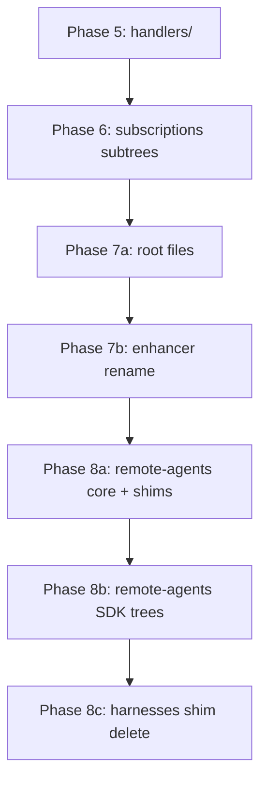

# Daemon consolidation plan — Phases 5–8

> **Status:** Phases 0–8 ✅ complete on `feat/daemon-consolidation-plan`.
> **Inventory SSOT:** [`consolidate.md`](./consolidate.md)
> **Branch for execution:** Continue on `feat/daemon-consolidation-plan` or a fresh `feat/daemon-consolidation-5-8` branch cut from `release/v1.88.2` after this plan merges.

## Executive summary

Phases 0–4 moved events, git, native-integration, fatal-error-guard, and agent-process-manager under `packages/cli/src/daemon/`. `commands/machine/daemon-start/` is now CLI entry only (`index.ts`); post-consolidation cleanup complete.

This plan completes consolidation in four phases (5–8), following the same discipline as Phases 0–4: one phase = one commit, move files, update imports, update fallow baselines, run `pnpm turbo run typecheck test --filter=chatroom-cli`.

**Estimated scope:** ~125 consolidate moves + ~26 consolidate+shim re-exports + enhancer rename sub-step.

## Native handoff-reminder simplification

The current missed-handoff flow is split between the native delivery inbox, the
agent process manager, participant state, and backend task state. Replace it in
two deliberate stages so the old behavior is removed before the new behavior is
introduced.

### Removal of the current implementation

- [x] Delete the local inbox handoff decision path, including
      `native-turn-end-inbox.ts` and its tests.
- [x] Delete the agent process manager's backend fallback and reminder-specific
      turn-end branches, including their tests.
- [x] Remove obsolete handoff-reminder constants, mocks, fixtures, and assertions.
- [x] Remove or update tests that assume `lastInFlightTaskId`, local task snapshots,
      or participant state independently prove that a handoff occurred.
- [x] Verify that native `agent_end` no longer injects a reminder through the
      legacy multi-path implementation.

### Cleanup completed

- [x] Remove disabled legacy recovery assertions from
      `agent-process-manager.test.ts`, including obsolete Cursor retry
      constants and unreachable test bodies.
- [x] Run the focused agent process manager tests and monorepo typecheck after
      the cleanup.

### Remaining cleanup candidates

- [x] Replace the dedicated `turn-end-queue.ts` with the manager's shared
      per-agent serialization boundary. Turn-end callbacks now wait behind and
      cannot race lifecycle commands for the same agent.
- [x] Remove `lastInFlightTaskId` from the daemon `AgentSlot` and delete the
      related manager setters, clearers, and slot-based duplicate checks.
- [ ] Simplify native task injection duplicate detection to use the centralized
      daemon task-state store.
- [x] Migrate or remove backend recovery readers such as
      `find-native-harness-in-progress-work.ts` so the daemon does not rebuild
      live task state from participant snapshots.
- [x] Reassess `native-stale-turn-phase` and other fallback guards after the
      command queue and task-state store enforce the lifecycle invariant.
- [x] Remove obsolete recovery-focused integration tests after their behavior
      has been replaced by serialized task-state tests.

### Deferred until the new implementation

- [x] Replace `turn-end-queue.ts` with the shared per-agent serialization
      boundary; the dedicated queue and its tests were deleted. A future
      command-message representation is not required for this internal event.
- [ ] Remove backend `participant.lastInFlightTaskId` and its tests after
      token-activity handling is migrated to the daemon task-state model.
      Do not remove it as part of the daemon-only cleanup because it remains
      an active backend dependency.

### Reimplementation around one decision path

- [x] Define a daemon-owned `ActiveTaskStateStore` keyed by chatroom and role,
      with task identity/generation, lifecycle status, handoff status, and
      reminder-attempt state. The in-memory implementation owns generation
      assignment so callers cannot fabricate task generations.
- [x] Add a `handleAgentTurnEnded` use case that reads the active task state
      and resolves one of: no active work, already handed off, or reminder
      required.
- [x] Expose the state transitions through a single `AgentTaskStateService`
      façade with a composition-root constructor.
- [x] Make task delivery and successful handoff update the store through one
      state-transition interface; task delivery starts state and explicit
      completed-task signals mark handoff. Keep the backend as durable
      persistence, not the synchronous source for the live turn-end decision.
- [ ] Route `AgentProcessManager` `onAgentEnd` events into the command queue
      instead of embedding handoff policy in the process callback.
- [ ] Serialize turn-end handling, task delivery, handoff updates, and lifecycle
      commands with the same chatroom/role key.
- [x] Add an injected `HandoffReminder` port; issue a reminder through the
      agent manager and track its attempt number in daemon state.
- [x] Validate task identity/generation before acting so stale `agent_end` events
      cannot affect a later task for the same agent.
- [ ] Keep `AgentProcessManager` responsible for process lifecycle and transport;
      keep the coordinator responsible for task outcome and reminder policy.
- [x] Add focused tests for state transitions, duplicate events, stale
      generations, and missing active tasks.
- [ ] Add integration tests for handoff/turn-end races and reminder failures.
- [ ] Update the native delivery documentation and run focused CLI tests plus
      typecheck before committing the reimplementation.

### Native delivery service boundary

- [x] Introduce a constructed, daemon-scoped `NativeDeliveryService` owning
      native task snapshots, task state, serialized process operations, and
      delivery coordination for the production inbox path.
- [x] Construct the service during daemon/task-inbox initialization and pass
      it explicitly to the production inbox handler and task delivery processor.
- [x] Route production task delivery and handoff state transitions through the
      service while retaining registry adapters for legacy callers.
- [x] Extend the service boundary to bootstrap, periodic reconciliation, and
      operational updates.
- [ ] Extend the service boundary to restart delivery paths.
- [ ] Make `handleTaskInboxUpdate` consume required dependencies directly and
      remove its remaining compatibility branch and session-registry fallbacks.
- [x] Move production task-state transition calls behind the service API and
      remove the registry-level `recordNativeTaskDelivered` and
      `recordNativeTaskHandedOff` helpers.
- [ ] Remove the module-level native-delivery session singleton after all
      callers use the constructed service.

---

## Resolved decisions

All items from `consolidate.md` §Open decisions are resolved here. No further user input required before execution.

### 1. `remote-agents/` registry strategy → **Move with thin re-exports**

**Decision:** Move the entire `infrastructure/services/remote-agents/` tree to `daemon/infrastructure/local/harness/services/` (paths per `consolidate.md` §9). Thin re-export shims at old paths were removed in post-consolidation slice 1 after updating `harness-status` / `machine/detection` imports.

**Rationale:** Daemon harness registry is the primary consumer. Re-exports preserve stable paths for two external CLI commands without duplicating implementation. Matches Phase 0–4 shim-deletion pattern inverted: delete shims only when all importers updated.

**Phase:** 8a (registry + shared types), 8b (native SDK subsets), 8c (delete harnesses/ shims).

### 2. `daemon-start/index.ts` path → **Keep `commands/machine/daemon-start/`**

**Decision:** Do **not** rename to `commands/machine/daemon/`. `daemon-start/index.ts` remains the CLI command entry point (`daemonStart()` delegates to `daemon/entry/start-daemon.ts` + test type re-exports). Shims (`daemon-services.ts`, `types.ts`) deleted in post-consolidation slice 2.

**Rationale:** Command path is CLI UX surface (`machine daemon start`). `daemon/` is runtime module. Mixing them breaks command discovery conventions.

### 3. Enhancer entry-point naming → **Completed**

**Decision:** The enhancer implementation lives under `daemon/entry/enhancer/`. The former compatibility shims and legacy directory name were removed during the completed consolidation.

**Rationale:** The current path describes the active entry point and avoids carrying migration history in the runtime module name.

### 4. `agent-lifecycle/` coupling → **Defer — keep as shared infrastructure**

**Decision:** Leave `infrastructure/services/agent-lifecycle/` outside `daemon/`. Do not consolidate in Phases 5–8.

**Rationale:** Consumed by agent-process-manager and remote-agents but also potentially other lifecycle paths. Boundary unclear; moving now risks wrong-layer coupling. Revisit only if a dedicated lifecycle consolidation slice is scoped.

### 5. `infrastructure/services/workspace/` → **Defer (unchanged)**

**Decision:** Keep workspace I/O shared. File subscription modules move to `daemon/entry/files/` in Phase 6 but continue importing workspace services from infrastructure.

---

## Current tech debt (pre-Phases 5–8)

| Item                                                              | Severity                                | Addressed in |
| ----------------------------------------------------------------- | --------------------------------------- | ------------ |
| ~9.8k LOC in `daemon-start/` handlers, subscriptions, drains      | medium                                  | Phases 5–7   |
| `daemon-runtime.ts` imports 12 `daemon-start/` modules directly   | medium                                  | Phase 7      |
| Enhancer entry-point naming                                       | ✅                                      | Phase 7b     |
| `remote-agents/` (99 files) outside daemon module                 | medium                                  | Phase 8      |
| `infrastructure/harnesses/` re-export shims (6 files)             | low                                     | Phase 8c     |
| `daemon-services.ts` / `types.ts` imported via old paths in tests | ✅ Deleted (post-consolidation slice 2) |

---

## Phase dependency graph



**Rule:** Each phase is one commit. Run typecheck + tests before committing.

---

## Phase 5 — `handlers/` → `daemon/entry/handlers/`

**Commit message:** `refactor(daemon): consolidate phase 5 — handlers to daemon/entry/handlers`

### Scope (from consolidate.md §2a)

Move entire `daemon-start/handlers/` tree:

| Source                                    | Target                                            |
| ----------------------------------------- | ------------------------------------------------- |
| `handlers/command-runner.ts`              | `daemon/entry/handlers/command-runner.ts`         |
| `handlers/daemon-restart-cleanup.ts`      | `daemon/entry/handlers/daemon-restart-cleanup.ts` |
| `handlers/daemon-startup-log.ts`          | `daemon/entry/handlers/daemon-startup-log.ts`     |
| `handlers/orphan-tracker.ts`              | `daemon/entry/handlers/orphan-tracker.ts`         |
| `handlers/ping.ts`                        | `daemon/entry/handlers/ping.ts`                   |
| `handlers/state-recovery.ts`              | `daemon/entry/handlers/state-recovery.ts`         |
| `handlers/status.ts`                      | `daemon/entry/handlers/status.ts`                 |
| `handlers/stop-agent.ts`                  | `daemon/entry/handlers/stop-agent.ts`             |
| `handlers/process/*` (10 files + 2 specs) | `daemon/entry/handlers/process/*`                 |

Co-located tests (`*.test.ts`, `*.spec.ts`) move with sources.

### Import sweep

```bash
# Find all importers of handlers/
rg -l 'daemon-start/handlers' packages/cli/src
```

**Known importers:** `daemon-runtime.ts`, `command-dispatch.ts`, `init-daemon.ts`, `events/agent/*`, other `daemon-start/` files (updated in later phases).

### Fallow

Update `.fallow/baseline.json`, `.fallow/dupes-baseline.json`, `.fallow/health-baseline.json` for relocated paths.

### Verification

- `pnpm turbo run typecheck test --filter=chatroom-cli`
- `rg 'daemon-start/handlers' packages/cli/src` → zero matches (except consolidate.md / plan.md)

---

## Phase 6 — Subscription subtrees → `daemon/entry/`

**Commit message:** `refactor(daemon): consolidate phase 6 — daemon-start subscriptions to daemon/entry`

### Scope (consolidate.md §2b–2g, excluding §2f root files)

| Subtree           | Files | Target                         |
| ----------------- | ----- | ------------------------------ |
| `direct-harness/` | 7     | `daemon/entry/direct-harness/` |
| `agentic-query/`  | 4     | `daemon/entry/agentic-query/`  |
| `file-*`          | 7     | `daemon/entry/files/`          |
| `shared-harness/` | 4     | `daemon/entry/shared-harness/` |
| `testing/`        | 3     | `daemon/entry/testing/`        |

**Note:** `file-content-classifier.ts` etc. live at `daemon-start/` root in inventory §2e — move to `daemon/entry/files/` per consolidate.md.

### High-risk files

- `direct-harness/prompt-drain.ts`, `agentic-query/prompt-drain.ts` — harness drain loops
- `file-tree-subscription.ts`, `file-content-subscription.ts`, `file-write-subscription.ts` — incremental sync wiring
- `shared-harness/get-or-create-bound-harness.ts` — session binding

### Import sweep

```bash
rg -l 'daemon-start/(direct-harness|agentic-query|file-|shared-harness|testing)' packages/cli/src
```

**Critical:** Update `daemon-runtime.ts` imports for subscriptions moved in this phase (start-subscriptions, drains, file-tree).

### Verification

- Full CLI typecheck + tests
- Zero stale paths for moved subtrees

---

## Phase 7a — Root files → `daemon/entry/`

**Commit message:** `refactor(daemon): consolidate phase 7 — daemon-start root files to daemon/entry`

### Scope (consolidate.md §2f)

| Source                              | Target                                                      | Shim?                     |
| ----------------------------------- | ----------------------------------------------------------- | ------------------------- |
| `capabilities-snapshot.ts`          | `daemon/entry/capabilities-snapshot.ts`                     | no                        |
| `command-event-types.ts`            | `daemon/entry/command-event-types.ts`                       | no                        |
| `command-sync-heartbeat.ts`         | `daemon/entry/command-sync-heartbeat.ts`                    | no                        |
| `commit-detail-sync.ts`             | `daemon/entry/workspace-git/commit-detail-sync.ts`          | no                        |
| `daemon-layers.ts`                  | `daemon/entry/daemon-layers.ts`                             | no                        |
| `daemon-services.ts`                | `daemon/entry/daemon-services.ts`                           | no (shim deleted slice 2) |
| `deps.ts`                           | `daemon/entry/daemon-deps.ts`                               | no                        |
| `models-refresh.ts`                 | `daemon/entry/models-refresh.ts`                            | no                        |
| `refresh-models-outcome.ts`         | `daemon/entry/refresh-models-outcome.ts`                    | no                        |
| `restart-orchestrator-in-flight.ts` | `daemon/entry/restart-orchestrator-in-flight.ts`            | no                        |
| `restart-orchestrator.ts`           | `daemon/entry/restart-orchestrator.ts`                      | no                        |
| `role-delivery-state.ts`            | `daemon/entry/role-delivery-state.ts`                       | no                        |
| `types.ts`                          | `daemon/entry/daemon-types.ts`                              | no (shim deleted slice 2) |
| `utils.ts`                          | `daemon/entry/daemon-utils.ts`                              | no                        |
| `workspace-cache.ts`                | `daemon/entry/workspace-git/workspace-cache.ts`             | no                        |
| `workspace-list-subscription.ts`    | `daemon/entry/workspace-git/workspace-list-subscription.ts` | no                        |

### Shim strategy for `daemon-services.ts` and `types.ts`

1. Move implementation to `daemon/entry/`
2. Replace `daemon-start/daemon-services.ts` and `daemon-start/types.ts` with thin re-exports
3. Update all daemon-internal imports to new paths
4. **Done (post-consolidation slice 2):** Shims deleted; `index.ts` re-exports types from `daemon/entry/daemon-types.js`

### Post-phase state

`daemon-start/` contains only:

- `index.ts` (CLI entry + test type re-exports)

`event-bus.test.ts` co-located at `daemon/entry/events/event-bus.test.ts`.

### Critical consumer: `daemon-runtime.ts`

All 12 `daemon-start/` imports must point to `daemon/entry/` after this phase.

### Verification

- `daemon-runtime.ts` has zero `daemon-start/` imports
- `pnpm turbo run typecheck test --filter=chatroom-cli`

---

## Phase 7b — Rename enhancer entry point (completed)

**Commit message:** `refactor(daemon): rename enhancer entry point`

### Scope

The enhancer entry point was renamed to `daemon/entry/enhancer/` (8 files).

### Import sweep

```bash
rg -l 'daemon/entry/enhancer' packages/cli/src
```

**Known importers:** `daemon-runtime.ts`, `init-daemon.ts`, tests.

### Verification

- Enhancer imports resolve from the current `daemon/entry/enhancer/` path
- Tests pass

---

## Phase 8a — `remote-agents/` core + re-export shims

**Commit message:** `refactor(daemon): consolidate phase 8a — remote-agents core to daemon harness services`

### Scope

Move per consolidate.md §9 — **first batch: non-SDK plumbing + shim files:**

- `agent-log-format.ts`, `assistant-text-capture.ts`, `line-stream-reader.ts`
- `native-spawn-presence.ts`, `native-stream-adapter-base.ts`
- `remote-agent-service.ts`, `spawn-prompt.ts`, `tap-process-stream-writes.ts`
- `wire-native-stream-adapter.ts`, `with-timeout.ts`
- `base-cli-agent-service.ts`, `detection-result.ts`, `index.ts`, `init-registry.ts`, `registry.ts` → **consolidate+shim**

### Shim pattern

```typescript
// packages/cli/src/infrastructure/services/remote-agents/registry.ts (example)
export * from '../../../daemon/infrastructure/local/harness/services/registry.js';
```

Keep shims for: `harness-status.ts`, `infrastructure/machine/detection.ts` consumers.

### Verification

- `harness-status` and `detection` still resolve imports via shims
- Daemon harness registry imports from new path internally

---

## Phase 8b — `remote-agents/` SDK and CLI agent subtrees

**Commit message:** `refactor(daemon): consolidate phase 8b — remote-agents SDK trees`

### Scope

Move remaining §9 files:

- `claude-sdk/`, `cursor-sdk/`, `pi-sdk/`, `opencode-sdk/` (native SDK)
- `claude/`, `cursor/`, `copilot/`, `commandcode/`, `pi/`, `opencode/` (CLI agents — **consolidate+shim** on index/service files)

Co-located `*.test.ts` and `*.integration.test.ts` move with sources.

### Verification

- Full test suite including integration tests under moved SDK paths
- Fallow baselines updated

---

## Phase 8c — Delete `infrastructure/harnesses/` shims + `harness-key.ts` move

**Commit message:** `refactor(daemon): consolidate phase 8c — harnesses shims and harness-key`

### Scope (consolidate.md §8)

| Action      | Path                                                                    |
| ----------- | ----------------------------------------------------------------------- |
| delete-shim | `infrastructure/harnesses/claude-sdk/index.ts`                          |
| delete-shim | `infrastructure/harnesses/cursor-sdk/index.ts`                          |
| delete-shim | `infrastructure/harnesses/opencode-sdk/index.ts`                        |
| delete-shim | `infrastructure/harnesses/pi-sdk/index.ts`                              |
| delete-shim | `infrastructure/harnesses/registry.ts`                                  |
| delete-shim | `infrastructure/harnesses/shared-chunk-extractor.ts`                    |
| consolidate | `harness-key.ts` → `daemon/infrastructure/local/harness/harness-key.ts` |

**Precondition:** All importers of harnesses/ shims updated to `daemon/infrastructure/local/harness/`.

### Verification

- `infrastructure/harnesses/` directory empty or removed
- Zero imports to deleted shim paths

---

## Recent recovery-cleanup follow-ups

These items were discovered after the recent recovery-removal phases and should
be completed before treating the cleanup as finished.

- [x] Delete bypassed or obsolete recovery tests rather than leaving early
      returns, temporary constants, or unreachable historical assertions.
- [x] Remove the remaining agent-process-manager recovery state and helpers,
      including daemon-memory session resume, harness-session snapshots, resume
      event emission, and related fields that no longer have production callers.
      Native `resumeTurn` remains because it is the active task-delivery API.
- [x] Remove the orphaned Cursor SDK run-error/reopen detection module and tests;
      repository search found no production consumer.
- [x] Delete commented-out recovery blocks from task orchestration and task
      delivery code; comments must not preserve retired control flow as an
      implied compatibility path.
- [x] Remove `RecoveryCooldown`, native wake/revive helpers, and all callers and
      tests that only existed to support automatic task recovery. The remaining
      `platform.pending_task_wake` start reason belongs to the explicit native
      pending-task activation flow, not the retired recovery helpers.
- [x] Remove obsolete session-monitor recovery types and no-op registrations
      introduced solely to replace deleted recovery behavior.
- [x] Audit `resumeStormTracker`, resume-storm handling, crash/restart stop
      reasons, and recovery-related lifecycle events. Rapid-resume tracking,
      `platform.resume_storm`, the backend event/mutation, and their tests were
      removed; ordinary exit and provider-failure handling remain separate.
- [ ] Audit backend exit handling and task-release paths for automatic restart,
      revive, wake, or requeue behavior that conflicts with the current
      shutdown-and-clear policy.
- [ ] Run repository-wide searches for recovery terminology and update stale
      comments, README guidance, tests, and plan entries after the code is
      removed.
- [ ] Re-run focused tests, CLI typecheck, and the relevant backend tests after
      each cleanup phase; mark an item complete only when its callers and tests
      are removed or intentionally retained with a documented reason.

---

## Post-Phases 5–8 cleanup

### `consolidate.md` header

Update to: `Phases 0–8 ✅ complete` (after all phases executed — not in this planning task).

### Optional follow-ups (out of scope for Phases 5–8)

| Item                                                        | Recommendation                                |
| ----------------------------------------------------------- | --------------------------------------------- |
| Delete `remote-agents/` shims                               | ✅ Complete (post-consolidation slice 1)      |
| Delete `daemon-start/` shims + relocate `event-bus.test.ts` | ✅ Complete (post-consolidation slice 2)      |
| `agent-lifecycle/` consolidation                            | Deferred — shared infrastructure              |
| `workspace/` consolidation                                  | Deferred — shared beyond daemon               |
| Smoke test                                                  | `chatroom machine daemon start` after Phase 7 |

---

## Execution checklist (per phase)

1. `git checkout -b feat/daemon-consolidation-5-8` (or continue plan branch)
2. `git mv` files per phase table
3. `rg` import sweep + fix
4. Update `.fallow/*.json` baselines
5. `pnpm turbo run typecheck test --filter=chatroom-cli`
6. Commit with phase message
7. Repeat

## Risk register

| Risk                                          | Mitigation                                                    |
| --------------------------------------------- | ------------------------------------------------------------- |
| `daemon-runtime.ts` import churn              | Complete Phase 7 before Phase 8; grep-verify after each phase |
| Test files import via `daemon-start/types`    | ✅ Shims deleted (post-consolidation slice 2)                 |
| `harness-status` breaks on remote-agents move | consolidate+shim for all shared exports in 8a                 |
| Fallow baseline drift                         | Update all three baseline files each phase                    |
| Integration tests path-sensitive              | Run full test filter, not just typecheck                      |

## Success criteria

- [x] Zero production imports from `commands/machine/daemon-start/` except `index.ts`
- [ ] `daemon/` is SSOT for daemon runtime, handlers, subscriptions, harness services
- [ ] `consolidate.md` inventory fully executed (Phases 5–8)
- [ ] `pnpm turbo run typecheck test --filter=chatroom-cli` green
- [ ] Fallow baselines current
      cannot affect a later task for the same agent.
- [ ] Keep `AgentProcessManager` responsible for process lifecycle and transport;
      keep the coordinator responsible for task outcome and reminder policy.
- [ ] Add focused tests for state transitions, handoff/turn-end races, duplicate
      events, stale generations, missing active tasks, and reminder failures.
- [ ] Update the native delivery documentation and run focused CLI tests plus
      typecheck before committing the reimplementation.
      +- [x] Remove `lastInFlightTaskId` from the daemon `AgentSlot` and delete the
- [x] Remove `lastInFlightTaskId` from the daemon `AgentSlot` and delete the
      +- [x] Migrate or remove backend recovery readers such as
- [x] Migrate or remove backend recovery readers such as
      +- [x] Reassess `native-stale-turn-phase` and other fallback guards after the
- [x] Reassess `native-stale-turn-phase` and other fallback guards after the
      +- [x] Remove obsolete recovery-focused integration tests after their behavior
- [x] Remove obsolete recovery-focused integration tests after their behavior
