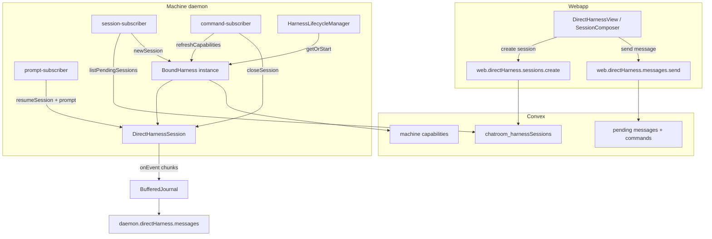

# Direct Harness Implementation Guide

This guide walks through adding a **new native SDK direct harness** end to end — the pattern used by `opencode-sdk`, `cursor-sdk`, and `pi-sdk` on the `feat/direct-harness-native-sdks` branch.

It is **not** about CLI remote-agent harnesses (`RemoteAgentService`, `get-next-task`, `init-registry.ts`). For that path, see [`../services/remote-agents/HARNESS_GUIDE.md`](../services/remote-agents/HARNESS_GUIDE.md).

---

## What you are building

A **direct harness** runs in-process inside the machine daemon. The web UI creates a Convex session row, the daemon opens a live SDK session, streams assistant output back to Convex, and the user chats without a per-role `get-next-task` loop.

| Layer                      | Responsibility                                                                                              |
| -------------------------- | ----------------------------------------------------------------------------------------------------------- |
| **`BoundHarness`**         | One long-lived process wrapper per `workspaceId:harnessName` — lists agents/models, spawns/resumes sessions |
| **`DirectHarnessSession`** | One conversation with the SDK — `prompt()`, `onEvent()`, `close()`                                          |
| **Chunk extractor**        | Maps SDK events → `{ content, messageId, partType }` for the output journal                                 |
| **Registry**               | Factory + install detection + extractor dispatch                                                            |
| **Daemon subscribers**     | Generic — session open, prompt delivery, idle finalization, capabilities publish                            |
| **Convex + webapp**        | Session rows, capabilities snapshot, selector UI                                                            |

You implement the harness package and wire it into the registry and domain catalog. The daemon loop (`startDirectHarnessSubscriptions`) usually needs **no changes** if your harness honors the contracts below.

---

## Architecture



**Session lifecycle (happy path)**

1. User sends first message → `sessions.create` inserts row (`status: pending`).
2. `session-subscriber` sees pending row → `lifecycleManager.getOrStart` → `harness.newSession()` → wires `onEvent` → `associateHarnessSessionId` (stores `opencodeSessionId` + `sessionTitle`).
3. `prompt-subscriber` delivers queued user messages via `handle.prompt()` or `resumeSession` + `prompt`.
4. Harness emits streaming events → chunk extractor → journal → Convex chunks.
5. Harness emits `session.idle` → `idle-handler` finalizes turn, dequeues next message.
6. User clicks stop → `closeSession` command → `closeHarnessSession` → journal flush + SDK close + `markClosed`.

---

## Core contracts

### `BoundHarness`

Defined in `packages/cli/src/domain/direct-harness/entities/bound-harness.ts`.

| Method                     | Purpose                                                                    |
| -------------------------- | -------------------------------------------------------------------------- |
| `type` / `displayName`     | Stable id (e.g. `pi-sdk`) and UI label                                     |
| `listAgents()`             | Agents for the harness selector (`mode`: `primary` \| `all` \| `subagent`) |
| `listProviders()`          | Provider + model list for the model selector                               |
| `newSession(config)`       | Create a new SDK session                                                   |
| `resumeSession(id, opts?)` | Reattach to an existing SDK session id                                     |
| `fetchSessionTitle(id)`    | Optional pull for title refresh (OpenCode implements; others may stub)     |
| `isAlive()` / `close()`    | Process lifecycle                                                          |

`NewSessionConfig` fields: `title?`, `model?` (`provider/model`), `systemPrompt?`, `agent?`, `harnessSessionId?` (Convex row id for replication).

### `DirectHarnessSession`

Defined in `packages/cli/src/domain/direct-harness/entities/direct-harness-session.ts`.

| Method              | Purpose                                                            |
| ------------------- | ------------------------------------------------------------------ |
| `opencodeSessionId` | SDK session id (name is historical — all harnesses use this field) |
| `sessionTitle`      | Display title; optional `setTitle(title)` for live updates         |
| `prompt(input)`     | Send user turn (`agent`, `model?`, `parts[]`)                      |
| `onEvent(listener)` | Subscribe to normalized events (see below)                         |
| `close()`           | Abort/dispose SDK resources                                        |

### Events your session **must** emit

The daemon is harness-agnostic if you speak this protocol:

| Event type           | When                                 | Payload expectations                                     |
| -------------------- | ------------------------------------ | -------------------------------------------------------- |
| `message.part.delta` | Streaming text/reasoning token       | `{ messageID, delta, partType?: 'text' \| 'reasoning' }` |
| `session.idle`       | Turn complete, ready for next prompt | `{}` (required for turn finalization + queue drain)      |
| `session.updated`    | Optional — title changed             | `{ info: { title?: string } }` (OpenCode only today)     |

**Chunk extraction:** Implement `createYourHarnessChunkExtractor()` or reuse `createStandardSdkChunkExtractor()` from `shared-chunk-extractor.ts` when you already emit `message.part.delta` in the standard shape.

**Idle semantics:** After every successful `prompt()` resolution, emit `session.idle`. The idle handler flushes the journal, marks the assistant turn complete in Convex, and sends the next queued user message.

---

## Reference implementations

Use these as templates — simplest first:

| Harness          | Folder          | Process model                                | Complexity                      |
| ---------------- | --------------- | -------------------------------------------- | ------------------------------- |
| **pi-sdk**       | `pi-sdk/`       | In-process `@earendil-works/pi-coding-agent` | Low — good first read           |
| **cursor-sdk**   | `cursor-sdk/`   | In-process `@cursor/sdk` `Agent`             | Medium                          |
| **opencode-sdk** | `opencode-sdk/` | Child `opencode serve` + HTTP/SSE fan-out    | High — multi-session SSE router |

### Typical file layout

```
my-sdk/
  index.ts              # barrel: startMySdkHarness, createMySdkChunkExtractor
  my-harness.ts         # class implements BoundHarness + factory startMySdkHarness
  my-session.ts         # class implements DirectHarnessSession
  event-extractor.ts    # maps events → ExtractedChunk (often delegates to shared)
  my-harness.test.ts    # unit tests (mock SDK)
  my-harness.integration.test.ts  # optional; requires API keys / binary
```

### `my-harness.ts` checklist

- [ ] `readonly type = 'my-sdk'` and `displayName`
- [ ] `constructor(cwd)` — store working directory from `StartBoundHarnessConfig.workingDir`
- [ ] `private sessions = new Map<string, MySdkSession>()` — track open sessions
- [ ] `listAgents()` — return at least one `primary` agent (or multiple if the SDK supports roles)
- [ ] `listProviders()` — introspect SDK model list; shape: `{ providerID, name, models: [{ modelID, name }] }`
- [ ] `newSession(config)` — create SDK handle, wrap in `MySdkSession`, register in map
- [ ] `resumeSession(id)` — return cached session or reconnect via SDK API
- [ ] `fetchSessionTitle(id)` — return title string or `undefined` if unsupported
- [ ] `close()` — close all sessions, tear down SDK resources, idempotent

### `my-session.ts` checklist

- [ ] Implement `DirectHarnessSession`
- [ ] `prompt()`: map `input.parts` to SDK send API; subscribe to streaming callbacks
- [ ] Translate SDK stream → `message.part.delta` events with a stable `messageId` (use `randomUUID()` per turn if the SDK has no message id)
- [ ] On turn completion → emit `session.idle`
- [ ] `onEvent()`: register listeners; start consumer on first subscription (see `opencode-session.ts` for buffering pattern if events can arrive before listeners attach)
- [ ] `close()`: idempotent; call SDK abort/close; invoke `onClose` callback so harness removes session from map

### SDK loader pattern

Both `cursor-sdk` and `pi-sdk` use lazy dynamic import with a module-level cache:

```typescript
let _sdkCache: LoadedSdk | undefined;

async function loadSdk(): Promise<LoadedSdk> {
  if (_sdkCache) return _sdkCache;
  _sdkCache = await importBundledMySdk();
  return _sdkCache;
}
```

Place bundled import helpers under `packages/cli/src/infrastructure/services/remote-agents/<name>-sdk/` if you need optional dependency isolation (follow `cursor-sdk-package.ts` / `pi-sdk-package.ts`).

### Environment / install detection

Add a function in `registry.ts`:

```typescript
async function isMySdkInstalled(): Promise<boolean> {
  // e.g. check env var, try loadSdk(), or shell out to a binary
}
```

Register in `listInstalledNativeDirectHarnesses()` so the harness only appears when usable.

---

## Wiring checklist (end to end)

Work through this list in order. Each step has a concrete file path.

### 1. Domain — harness id union

| File                                                               | Change                              |
| ------------------------------------------------------------------ | ----------------------------------- |
| `services/backend/src/domain/entities/agent.ts`                    | Add `'my-sdk'` to `AGENT_HARNESSES` |
| `packages/cli/src/domain/direct-harness/entities/bound-harness.ts` | Add to `NativeDirectHarnessName`    |

### 2. Domain — capabilities config

Create `services/backend/src/domain/entities/harness/my-sdk.config.ts`:

```typescript
import type { HarnessCapabilities } from './types';

export const mySdkCapabilities: HarnessCapabilities = {
  runtimeKind: 'sdk',
  supportsDaemonMemoryResume: false, // true only if you implement daemon-memory resume like cursor-sdk
  supportsNativeIntegration: true, // required for Direct Harness UI
  lifecycle: {
    turnCompleted: true,
    outputActivity: true,
    processExited: true,
  },
  wireEvents: ['sdk.my.session.event'], // document your wire kinds
};
```

Register in `services/backend/src/domain/entities/harness/types.ts` → `HARNESS_CAPABILITIES`.

Update `types.test.ts` expectations for `supportsNativeIntegration` / `isNativeHarness`.

### 3. CLI registry

| File                                                         | Change                                                                                                                  |
| ------------------------------------------------------------ | ----------------------------------------------------------------------------------------------------------------------- |
| `packages/cli/src/infrastructure/harnesses/my-sdk/`          | Implement harness (see above)                                                                                           |
| `packages/cli/src/infrastructure/harnesses/registry.ts`      | Add to `NATIVE_DIRECT_HARNESS_NAMES`, `startBoundHarness`, `createChunkExtractor`, `listInstalledNativeDirectHarnesses` |
| `packages/cli/src/infrastructure/harnesses/registry.test.ts` | Assert new name in `NATIVE_DIRECT_HARNESS_NAMES`                                                                        |

### 4. Webapp catalog

| File                                                                         | Change                                  |
| ---------------------------------------------------------------------------- | --------------------------------------- |
| `apps/webapp/src/modules/chatroom/types/machine.ts`                          | Add `HARNESS_DISPLAY_NAMES['my-sdk']`   |
| `apps/webapp/src/modules/chatroom/direct-harness/utils/harness-selection.ts` | Add to `NATIVE_SDK_HARNESS_NAMES` array |

The selector merges daemon-reported capabilities with this static catalog when capabilities are still loading.

### 5. Daemon (usually no edits)

Confirm behavior via contracts — these files are harness-agnostic:

- `command-loop.ts` — starts subscriptions when `featureFlags.directHarnessWorkers`
- `start-subscriptions.ts` — wires session/message/command subscribers + lifecycle manager
- `session-subscriber.ts` — `newSession`, event wiring, title sync on `session.updated`
- `prompt-subscriber.ts` — `resumeSession` + `prompt` on queued messages
- `idle-handler.ts` — requires `session.idle`
- `command-subscriber.ts` — `refreshCapabilities`, `closeSession`, `refreshSessionTitle`
- `harness-lifecycle-manager.ts` — auto-start on demand, idle kill after 15 min

`createChunkExtractor(harness.type)` is called from `session-subscriber` — your registry entry must return a working extractor.

### 6. Convex schema

No harness-specific tables. Sessions use `chatroom_harnessSessions` with `opencode.harnessName` storing your `type` string. Commands (`closeSession`, `refreshCapabilities`, etc.) are generic.

Ensure `requireDirectHarnessWorkers()` guards remain (feature flag in `services/backend/config/featureFlags.ts`).

---

## Testing

### Unit tests (required)

| File                                 | Covers                                                                 |
| ------------------------------------ | ---------------------------------------------------------------------- |
| `my-harness.test.ts`                 | `listAgents`, `newSession`, `resumeSession`, `close`, install guard    |
| `my-session.test.ts` or harness test | `prompt` emits deltas + `session.idle`, `close` idempotent             |
| `event-extractor.test.ts`            | If custom extractor logic (see `opencode-sdk/event-extractor.test.ts`) |
| `registry.test.ts`                   | Name registered                                                        |

Mock the SDK — follow `cursor-harness.test.ts` / `pi-harness.test.ts` patterns.

### Integration tests (recommended)

`my-harness.integration.test.ts` — skip in CI without credentials:

```typescript
const HAS_CREDENTIALS = Boolean(process.env.MY_SDK_API_KEY);
describe.skipIf(!HAS_CREDENTIALS)('MySdkHarness integration', () => { ... });
```

Verify: `newSession` → `prompt` → receive chunks → `session.idle` → `close`.

### Backend integration

If you add new Convex surface area (unlikely for a standard harness), add tests under `services/backend/tests/integration/direct-harness-*.spec.ts`. Existing session/message/command tests apply to all native harnesses.

### Manual smoke test

1. `chatroom machine daemon-start` with `directHarnessWorkers` enabled.
2. Open Direct Harness in webapp, select your harness.
3. Create session, send message, confirm streaming + turn completion.
4. Stop session (square button) — status → closed.
5. Stop daemon — sessions should transition to closed (graceful shutdown path).

---

## UI behaviors (no harness code required)

Once `supportsNativeIntegration: true` and capabilities publish succeeds:

- Harness appears in `HarnessHarnessSelect`
- Agents/models populate from `refreshCapabilities` (daemon calls your `listAgents` / `listProviders`)
- Single-role harnesses show agent label **"default"** (`display-agent-role.ts`)
- User can **rename** session title (`web.directHarness.sessions.renameSession`) — Convex only, no SDK sync
- **Refresh title** button calls OpenCode `fetchSessionTitle` — implement meaningfully only if your SDK exposes titles

---

## Design notes from production harnesses

### opencode-sdk

- Spawns `opencode serve`, fans SSE events to per-session buffers (`opencode-harness.ts` + `sse-event-buffer.ts`).
- Stateful chunk extractor maps `message.part.updated` + `message.part.delta` (see `event-extractor.ts`).
- `session.updated` syncs auto-generated titles to Convex.
- `fetchSessionTitle` uses `client.session.get`.

### cursor-sdk

- `Agent.create` / `Agent.resume`; maps `assistant` + `thinking` SDK messages to deltas.
- Single `builder` agent; models from `Cursor.models.list`.
- `sessionTitle` from `config.title` only; `fetchSessionTitle` stub.

### pi-sdk

- `createAgentSession` from `@earendil-works/pi-coding-agent`.
- Maps `message_update` text/thinking deltas to standard events.
- Resume loads session file via `SessionManager.list` / `open`.
- `fetchSessionTitle` stub; resume uses `match.name` for title.

---

## Common pitfalls

| Symptom                      | Likely cause                                                                                         |
| ---------------------------- | ---------------------------------------------------------------------------------------------------- |
| Session stuck `pending`      | `associateHarnessSessionId` failed — check daemon logs in `session-subscriber`                       |
| No streaming in UI           | Extractor returns `null` — verify event types and `messageID` on deltas                              |
| Turn never completes         | Missing `session.idle` after `prompt()`                                                              |
| Duplicate sessions on resume | `resumeSession` must return existing in-memory session when already open                             |
| Harness not in selector      | Not in `listInstalledNativeDirectHarnesses()` or capabilities refresh failed                         |
| Model selector empty         | `listProviders()` returned `[]` — check env vars / SDK auth                                          |
| Title shows agent name       | `sessionTitle` empty and `displaySessionTitle` falls back — user can rename, or implement title sync |

---

## Minimal diff summary

For a harness named `my-sdk`, expect to touch:

```
packages/cli/src/infrastructure/harnesses/my-sdk/     (new, ~4–6 files)
packages/cli/src/infrastructure/harnesses/registry.ts
packages/cli/src/infrastructure/harnesses/registry.test.ts
packages/cli/src/domain/direct-harness/entities/bound-harness.ts
services/backend/src/domain/entities/agent.ts
services/backend/src/domain/entities/harness/my-sdk.config.ts
services/backend/src/domain/entities/harness/types.ts
services/backend/src/domain/entities/harness/types.test.ts
apps/webapp/src/modules/chatroom/types/machine.ts
apps/webapp/src/modules/chatroom/direct-harness/utils/harness-selection.ts
```

Optional: SDK import shim under `packages/cli/src/infrastructure/services/remote-agents/my-sdk/`.

---

## Related docs

- CLI remote agents (legacy chatroom roles): [`../services/remote-agents/HARNESS_GUIDE.md`](../services/remote-agents/HARNESS_GUIDE.md)
- Domain `BoundHarness` API: `packages/cli/src/domain/direct-harness/entities/bound-harness.ts`
- Daemon subscribers: `packages/cli/src/commands/machine/daemon-start/direct-harness/`
