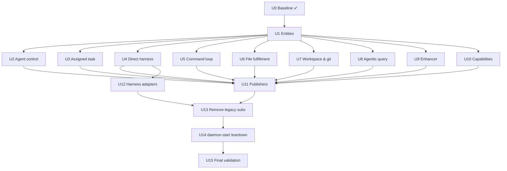

# Daemon v2 migration — progress tracker

Single-branch migration: `feat/v2-daemon-migration` → `release/v1.88.2` (one PR, no stack).

**Baseline:** v1.88.2 (scaffold + entities + policies + parallel subscribers shipped)

**Guide:** [README.md](./README.md) | **Use case map:** [domain/usecase/README.md](./domain/usecase/README.md)

---

## Definition of done (global)

Migration is **complete** when all of the following are true:

| #   | Criterion                         | Validation command / check                                                                                                          |
| --- | --------------------------------- | ----------------------------------------------------------------------------------------------------------------------------------- |
| G1  | Zero stub use cases               | `grep -r "Not implemented — migrate from legacy" packages/cli/src/v2/domain/usecase` returns empty                                  |
| G2  | Zero placeholder entities         | `grep -r "_placeholder: true" packages/cli/src/v2/domain/entities` returns empty                                                    |
| G3  | Zero publisher TODOs              | `grep -r "TODO: migrate from legacy" packages/cli/src/v2/infrastructure/convex/publishers` returns empty                            |
| G4  | No duplicate Convex subscriptions | Legacy `start*Subscription*` calls removed from `command-loop.ts` for every migrated context; v2 subscribers are the sole listeners |
| G5  | v2 router fully wired             | `createDefaultEventRouterDeps()` provides real hooks (not empty `{}`) for all bounded contexts                                      |
| G6  | Legacy command loop retired       | `startCommandLoopEffect` replaced by v2-orchestrated loop OR `daemon-start/` deleted with entry at `v2/entry/start-daemon.ts`       |
| G7  | Net daemon LOC reduced            | `wc -l packages/cli/src/commands/machine/daemon-start/**/*.ts` significantly below ~20k baseline                                    |
| G8  | Tests green                       | `pnpm turbo run typecheck test --filter=chatroom-cli` passes                                                                        |
| G9  | Integration tests pass            | Existing daemon integration tests pass unchanged behavior                                                                           |
| G10 | Tracker complete                  | Every unit below marked ✅ with evidence linked in PR description                                                                   |

---

## Progress summary

| Unit | Title                          | Status  | Backlog |
| ---- | ------------------------------ | ------- | ------- |
| U0   | Baseline (v1.88.2 scaffold)    | ✅ Done | —       |
| U1   | Placeholder entity types       | ✅ Done | backlog |
| U2   | Agent control use cases        | ✅ Done | backlog |
| U3   | Assigned task delivery         | ✅ Done | backlog |
| U4   | Direct harness processing      | ✅ Done | backlog |
| U5   | Command loop migration         | ⬜ Todo | backlog |
| U6   | File fulfillment               | ⬜ Todo | backlog |
| U7   | Workspace & git                | ⬜ Todo | backlog |
| U8   | Agentic query processing       | ⬜ Todo | backlog |
| U9   | Enhancer job processing        | ⬜ Todo | backlog |
| U10  | Machine capabilities refresh   | ⬜ Todo | backlog |
| U11  | Outbound publishers            | ⬜ Todo | backlog |
| U12  | Local harness adapters         | ⬜ Todo | backlog |
| U13  | Legacy subscription removal    | ⬜ Todo | backlog |
| U14  | daemon-start teardown          | ⬜ Todo | backlog |
| U15  | Final validation & doc cleanup | ⬜ Todo | backlog |

**Legend:** ⬜ Todo · 🔄 In progress · ✅ Done · ⏸ Blocked

---

## U0 — Baseline (v1.88.2) ✅

**Outcome:** v2 folder scaffold, entity SSOT, policies, harness session use cases, persistence, local-web, 15 subscribers, event router, entry cutover.

**Validation:**

- [x] `v2/domain/entities/` has real types for agent-slot, bound-harness, assigned-task, etc.
- [x] `startDaemonV2()` active via `daemon-start/index.ts`
- [x] Legacy domain shims removed (#1307)
- [x] 23+ implemented use case files with tests

---

## U1 — Placeholder entity types ✅

**Outcome:** Replace 5 `_placeholder: true` entity stubs with real v2 types modeled from legacy sources.

**Files:**

- `domain/entities/command-event.ts` ← `daemon-start/command-loop.ts`
- `domain/entities/enhancer-job.ts` ← `daemon-start/enhancer/`
- `domain/entities/file-tree-request.ts` ← `daemon-start/file-tree-subscription.ts`
- `domain/entities/git-request.ts` ← `daemon-start/git-subscription.ts`
- `domain/entities/machine-command.ts` ← `daemon-start/types.ts`
- `domain/entities/file-content-request.ts` ← workspace file content schema
- `domain/entities/file-write-request.ts` ← file-write subscription schema

**Validation criteria:**

- [x] Each entity file has real fields (no `_placeholder`)
- [x] Co-located `*.test.ts` for narrowing/validation helpers where applicable
- [x] `inbound-event.ts` / `outbound-event.ts` updated if event payloads reference these types
- [x] G2 passes

---

## U2 — Agent control use cases ✅

**Outcome:** Migrate start/stop/restart/recover agent orchestration from legacy event handlers to v2 use cases.

**Files:**

- `domain/usecase/start-agent.ts` ← `events/daemon/agent/on-request-start-agent.ts`
- `domain/usecase/stop-agent.ts` ← `events/daemon/agent/on-request-stop-agent.ts`
- `domain/usecase/restart-agent.ts` ← `events/daemon/agent/on-request-restart-agent.ts`
- `domain/usecase/recover-agent-state.ts` ← `daemon-start/handlers/state-recovery.ts`
- `entry/bridge/agent-control-bridge.ts` — adapts legacy Effect services to v2 ports

**Validation criteria:**

- [x] All 4 files implement real logic (no `Not implemented` throw)
- [x] Co-located tests cover happy path + key error paths
- [x] Ports co-located per use case README convention
- [x] Legacy event handler files deleted or reduced to thin v2 delegates
- [x] G1 passes for these 4 files

---

## U3 — Assigned task delivery ✅

**Outcome:** `deliver-assigned-task` implements inbound reaction logic; `handle-assigned-task-inbound` wired with real hook.

**Files:**

- `domain/usecase/deliver-assigned-task.ts` ← registry dispatch to task monitor
- `domain/usecase/handle-assigned-task-inbound.ts` — wire to `deliverAssignedTaskInbound`
- `entry/bridge/assigned-task-bridge.ts` — router + registry bridge
- `entry/assigned-task-monitor-registry.ts` — task monitor handler registry
- `entry/default-router-deps.ts` — provide `deliverInbound` hook
- `daemon-start/task-monitor.ts` — register/unregister inbound handler

**Validation criteria:**

- [x] Assigned tasks delivered end-to-end via v2 path
- [x] Integration test or existing `task-monitor` test adapted for v2
- [x] `startTaskMonitorEffect` removed from `command-loop.ts` (deferred to U13 if partial)
- [x] G1 passes for `deliver-assigned-task.ts`

---

## U4 — Direct harness processing ✅

**Outcome:** Process direct-harness prompts/commands/sessions via v2; wire inbound router.

**Files:**

- `domain/usecase/process-direct-harness-prompt.ts` ← registry dispatch to legacy drains
- `domain/usecase/handle-direct-harness-inbound.ts` — wire to `processDirectHarnessInbound`
- `entry/bridge/direct-harness-bridge.ts` — router + registry bridge
- `entry/direct-harness-inbound-registry.ts` — inbound handler registry
- `entry/default-router-deps.ts` — provide `deliverInbound` hook
- `daemon-start/direct-harness/start-subscriptions.ts` — register/unregister inbound handler

**Validation criteria:**

- [x] Direct harness prompt delivery works via v2 subscriber → router → use case
- [x] Session open/resume/close use cases (already done) called from inbound handler
- [x] Tests for inbound routing + prompt processing
- [x] G1 passes for `process-direct-harness-prompt.ts`

---

## U5 — Command loop migration

**Outcome:** Command event processing migrated to `handle-command-event`; command inbound wired.

**Files:**

- `domain/usecase/handle-command-event.ts` ← `daemon-start/command-loop.ts` (event dispatch logic)
- `domain/usecase/handle-command-inbound.ts` — wire to `handleCommandEvent`
- `entry/default-router-deps.ts` — provide command hook

**Validation criteria:**

- [ ] Machine commands (start/stop agent, ping, etc.) processed via v2 path
- [ ] Dedup/heartbeat logic preserved
- [ ] Existing `daemon-command-loop-d5.test.ts` passes
- [ ] G1 passes for `handle-command-event.ts`

---

## U6 — File fulfillment

**Outcome:** File tree/content/write requests fulfilled via v2 use cases; file inbound wired.

**Files:**

- `domain/usecase/fulfill-file-tree-request.ts` ← `daemon-start/file-tree-subscription.ts`
- `domain/usecase/fulfill-file-content-request.ts` ← `daemon-start/file-content-fulfillment.ts`
- `domain/usecase/fulfill-file-write-request.ts` ← `daemon-start/file-write-fulfillment.ts`
- `domain/usecase/handle-file-inbound.ts` — wire to fulfill use cases

**Validation criteria:**

- [ ] All 3 fulfill use cases implemented with tests
- [ ] File requests fulfilled end-to-end via v2 subscriber → router → use case
- [ ] G1 passes for all 3 fulfill files

---

## U7 — Workspace & git

**Outcome:** Workspace list updates and git state sync/requests via v2.

**Files:**

- `domain/usecase/update-workspace-list.ts` ← `daemon-start/workspace-list-subscription.ts`
- `domain/usecase/sync-git-state.ts` ← `daemon-start/git-heartbeat.ts`
- `domain/usecase/fulfill-git-request.ts` ← `daemon-start/git-subscription.ts`
- `domain/usecase/handle-workspace-git-inbound.ts` — wire hooks

**Validation criteria:**

- [ ] Workspace list changes propagated via v2
- [ ] Git heartbeat + request fulfillment work via v2
- [ ] Existing `git-heartbeat.test.ts` behavior preserved
- [ ] G1 passes for all 3 use case files

---

## U8 — Agentic query processing

**Outcome:** Agentic query session/prompt handling via v2.

**Files:**

- `domain/usecase/process-agentic-query-prompt.ts` ← `daemon-start/agentic-query/prompt-subscriber.ts`
- `domain/usecase/handle-agentic-query-inbound.ts` — wire to processor

**Validation criteria:**

- [ ] Agentic query prompts processed via v2 path
- [ ] Tests cover session-opened + prompt events
- [ ] G1 passes for `process-agentic-query-prompt.ts`

---

## U9 — Enhancer job processing

**Outcome:** Enhancer jobs processed via v2.

**Files:**

- `domain/usecase/process-enhancer-job.ts` ← `daemon-start/enhancer/job-subscriber.ts`
- `domain/usecase/handle-enhancer-inbound.ts` — wire to processor

**Validation criteria:**

- [ ] Enhancer jobs dispatched via v2 subscriber → router → use case
- [ ] Tests cover job-assigned event
- [ ] G1 passes for `process-enhancer-job.ts`

---

## U10 — Machine capabilities refresh

**Outcome:** Model/capability refresh migrated to v2.

**Files:**

- `domain/usecase/refresh-machine-capabilities.ts` ← `daemon-start/models-refresh.ts`

**Validation criteria:**

- [ ] Capabilities refresh runs on schedule/trigger via v2
- [ ] `refresh-models-outcome.ts` logic preserved
- [ ] G1 passes for `refresh-machine-capabilities.ts`

---

## U11 — Outbound publishers

**Outcome:** All 10 Convex publisher stubs implement real mutations; `publisher-registry` routes outbound events.

**Files:**

- `infrastructure/convex/publishers/assigned-task-status.ts`
- `infrastructure/convex/publishers/capabilities.ts`
- `infrastructure/convex/publishers/command-result.ts`
- `infrastructure/convex/publishers/daemon-heartbeat.ts`
- `infrastructure/convex/publishers/git-state.ts`
- `infrastructure/convex/publishers/harness-fingerprint.ts`
- `infrastructure/convex/publishers/models.ts`
- `infrastructure/convex/publishers/session-lifecycle.ts`
- `infrastructure/convex/publishers/turn-output.ts`
- `infrastructure/convex/publishers/workspace-commands.ts`
- `entry/publisher-registry.ts` — wire all publishers

**Validation criteria:**

- [ ] Each publisher calls correct Convex mutation(s)
- [ ] Co-located tests per publisher
- [ ] `harness.stream` fans to persistence + local-web streamHub
- [ ] G3 passes

---

## U12 — Local harness adapters

**Outcome:** Harness SDK registry and adapters moved to `infrastructure/local/harness/`.

**Files:**

- `infrastructure/local/harness/registry.ts` ← `infrastructure/services/remote-agents/init-registry.ts`
- `infrastructure/local/harness/adapters/*` ← per-provider harness SDK files
- `infrastructure/local/process-spawn.ts` ← `daemon-start/handlers/process/spawner.ts`
- `infrastructure/local/machine-config.ts` ← `infrastructure/machine/storage.ts`

**Validation criteria:**

- [ ] Harness registry resolves all providers (claude, cursor, opencode, pi)
- [ ] Integration tests for each harness still pass
- [ ] v2 use cases import from `infrastructure/local/harness/` not legacy paths
- [ ] Adapter README folders contain real code (not README-only)

---

## U13 — Legacy subscription removal

**Outcome:** Remove duplicate legacy Convex subscriptions from `command-loop.ts` for all migrated contexts.

**Files:**

- `commands/machine/daemon-start/command-loop.ts` — remove `start*Subscription*` for migrated contexts
- `commands/machine/daemon-start/direct-harness/start-subscriptions.ts` — delete or gut
- `commands/machine/daemon-start/agentic-query/start-subscriptions.ts` — delete or gut
- `commands/machine/daemon-start/enhancer/start-subscriptions.ts` — delete or gut
- File/git/workspace subscription files — delete or gut

**Validation criteria:**

- [ ] G4 passes — no duplicate WS subscriptions for same Convex query
- [ ] v2 subscribers are sole listeners per context
- [ ] Daemon starts and processes all event types correctly
- [ ] No regression in integration tests

---

## U14 — daemon-start teardown

**Outcome:** Delete or minimize `daemon-start/` — v2 is the sole runtime.

**Files:**

- `commands/machine/daemon-start/` — delete migrated files
- `v2/entry/start-daemon.ts` — absorb any remaining init/lifecycle wiring
- `commands/machine/daemon-start/index.ts` — thin re-export or delete

**Validation criteria:**

- [ ] G6 passes — no parallel legacy command loop
- [ ] G7 passes — `daemon-start/` LOC reduced by >50% from ~20k baseline
- [ ] `daemonStart()` entry still works for CLI `chatroom machine daemon start`
- [ ] All chatroom-cli tests pass

---

## U15 — Final validation & doc cleanup

**Outcome:** Global DoD verified; migration READMEs updated; tracker marked complete.

**Files:**

- `packages/cli/src/v2/MIGRATION-TRACKER.md` — mark all units ✅
- `packages/cli/src/v2/README.md` — update migration order (all phases done)
- `packages/cli/src/v2/domain/usecase/README.md` — remove stub markers
- Scaffold READMEs — trim or consolidate if redundant

**Validation criteria:**

- [ ] G1–G10 all pass
- [ ] PR description links evidence for each unit
- [ ] No `TODO: migrate` or `Not implemented` strings in `v2/`
- [ ] Fallow baseline updated if needed

---

## Dependency graph

**Recommended implementation order:** U1 → U2–U10 (can parallelize U3–U10 after U2) → U11 → U12 → U13 → U14 → U15

---

## How to update this tracker

1. Complete a backlog unit of work on `feat/v2-daemon-migration`
2. Run that unit's validation criteria checks
3. Change status from ⬜ to ✅ in the progress summary table
4. Commit with message referencing unit ID (e.g. `feat(daemon): U3 assigned task delivery`)
