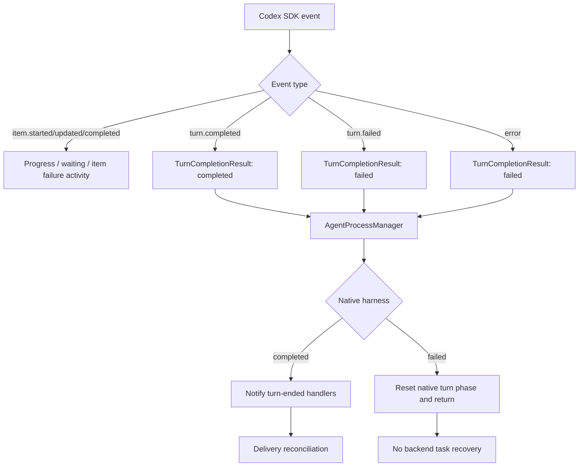
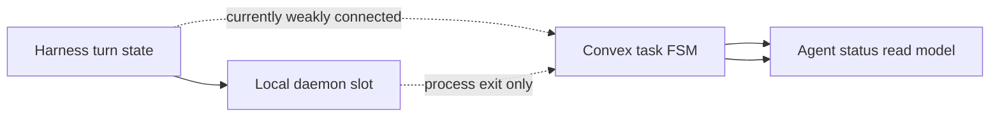
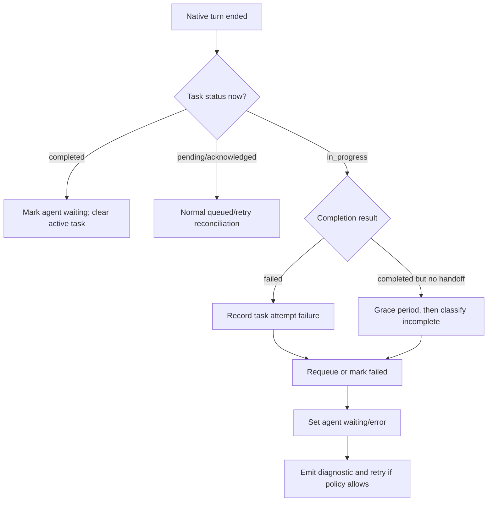

# Production Chatroom Task Processing Incident Report

**Date:** 2026-09-10  
**Chatroom:** `jn7fmvz7sd76z5wwgj1m7ty6vd7z81x2`  
**Task:** `md7bs5211y305fj5c54dv6jxqx8e32ft`  
**Affected role:** `planner`  
**Machine:** `755fcae8-cb04-4420-818b-ea16631baec7`  
**Harness:** `codex-sdk`

## Executive summary

The task was successfully delivered to the planner, acknowledged, and marked `in_progress`. The planner then ended its native turn without producing a task completion or handoff transition. The daemon treated that turn end as a normal lifecycle event, reset its local turn phase, and attempted another delivery reconciliation.

The reconciliation saw the task in `in_progress` and classified it as `task_status_not_deliverable`. Because the planner process/session still appeared alive, no process-exit recovery ran. The task therefore remained permanently `in_progress`, while the planner status read model remained `working`.

The primary failure is not task-signal delivery. Convex contains the correct task transitions and a native delivery receipt. The gap is the missing state transition between a native turn ending and the task still being active:

```text
native turn ended
    + task remains in_progress
    + no handoff/completion occurred
    + process still appears alive
    ------------------------------------------------
    = task attempt is orphaned, with no recovery path
```

## Production evidence

The production Convex deployment was queried read-only for the chatroom, task, status projections, assigned-task snapshot, task signals, and delivery receipt.

### Task lifecycle

The task transitioned as follows:

| Event                            |           UTC timestamp | Evidence                                         |
| -------------------------------- | ----------------------: | ------------------------------------------------ |
| Task created, `pending`          | 2026-09-09 14:45:56.943 | Task row and machine task signal                 |
| Task claimed, `acknowledged`     | 2026-09-09 14:45:59.272 | Task row and machine task signal                 |
| Task started, `in_progress`      | 2026-09-09 14:46:09.311 | Task row and machine task signal                 |
| Native delivery receipt recorded | 2026-09-09 14:46:01.308 | `native_inject`, planner harness session present |
| Reconciliation blocked           | 2026-09-09 23:10:19.474 | Daemon `task_status_not_deliverable` log         |

The task has no `completedAt` and no later completion transition.

The task’s relevant persisted state was:

```text
status:          in_progress
assignedTo:      planner
acknowledgedAt:  1788965159272
startedAt:       1788965169311
completedAt:     absent
updatedAt:       1788965169311
```

The task was not waiting in the queue. It had already been accepted by the planner and was considered active by the backend.

### Planner status

The planner’s production state was internally consistent with the stuck task, but incorrect from the user’s perspective:

```text
agentRoleStatusReadModel.status: working
activeWork.id:                    md7bs5211y305fj5c54dv6jxqx8e32ft
operationalState:                 running
viewState:                        running
isAlive:                          true
isRunning:                        true
acceptsTasks:                     true
daemonConnected:                  true
participant.lastStatus:           task.inProgress
participant.lastSeenAction:       native:waiting
```

The planner configuration also still showed:

```text
desiredState:      running
spawnedAgentPid:   85668
lifecycleRevision: 103
```

There was an older `agent.sessionResumeFailed` error retained in the status read model. That error was stale: the same read model was subsequently projected as `working`, but the projection does not clear the previous error field when a healthy status arrives.

### Daemon logs

The supplied daemon logs show:

```text
[NativeDelivery:trigger] source=periodic-reconcile
  role=planner
  task=md7bs5211y305fj5c54dv6jxqx8e32ft

[NativeDelivery:decision]
  decision=blocked:task_status_not_deliverable
  slotState=running
  nativeTurnPhase=idle
  harnessSessionPresent=true
  operationalState=running

[NativeDelivery:skip]
  reason=task_status_not_deliverable
```

This rules out several other causes:

- The task was discovered by the daemon.
- The task was assigned to the expected role.
- The daemon did not think the planner process was stopped.
- The daemon did not think the native turn was still running.
- The daemon did not think the harness session was missing.
- The daemon rejected the task before attempting injection because of its persisted task status.

## Observed lifecycle

The actual incident path was:

```mermaid
sequenceDiagram
    participant User
    participant Convex as Convex task state
    participant Daemon
    participant Codex as Codex SDK

    User->>Convex: Create task
    Convex-->>Daemon: pending task signal
    Daemon->>Codex: Native task injection
    Convex: pending → acknowledged
    Convex: acknowledged → in_progress
    Codex-->>Daemon: Turn ends / agent_end
    Daemon->>Daemon: nativeTurnPhase = idle
    Daemon->>Daemon: Request turn-ended reconciliation
    Daemon->>Daemon: See task = in_progress
    Daemon-->>Daemon: Block: task_status_not_deliverable
    Note over Convex,Codex: No completion, handoff, failure, or task requeue transition
```

The important point is that `agent_end` was processed as a turn boundary, not as a task outcome.

## What `agent_end` means here

The repository defines three normalized harness lifecycle events:

```text
lifecycle.output.activity   Output, stream, tool, or token activity
lifecycle.turn.completed    One model turn finished
lifecycle.process.exited    The OS-tracked child process exited
```

`agent_end` maps to `lifecycle.turn.completed`. It does not necessarily mean that the persistent native agent process died. For SDK-backed agents, the same process may accept another turn.

For `codex-sdk`, the adapter receives events including:

- `turn.started`
- `turn.completed`
- `turn.failed`
- top-level `error`
- `item.started`
- `item.updated`
- `item.completed`

Items may represent assistant messages, reasoning, command execution, file changes, MCP tool calls, web searches, or errors.

The Codex adapter already distinguishes successful and failed terminal events:



## Where handling breaks down

### 1. Native delivery only considers `pending` and `acknowledged` deliverable

The daemon’s deliverability predicate is explicit:

```ts
return status === 'pending' || status === 'acknowledged';
```

See [assigned-task.ts](/Users/conradkoh/Documents/Repos/chatroom/packages/cli/src/daemon/domain/entities/assigned-task.ts:44).

When the only assigned task is `in_progress`, the decision function returns:

```text
blocked: task_status_not_deliverable
```

See [delivery-decision.ts](/Users/conradkoh/Documents/Repos/chatroom/packages/cli/src/daemon/services/task-service/service/native-delivery/delivery-decision.ts:103).

That is correct for duplicate prevention, but insufficient for recovering a task whose turn ended without completion.

### 2. `agent_end` only triggers another delivery pass

The turn-ended handler currently does this:

```ts
handleAgentTurnEnded(event) {
  scheduleRoleDelivery(event.chatroomId, event.role);
}
```

See [native-delivery-service.ts](/Users/conradkoh/Documents/Repos/chatroom/packages/cli/src/daemon/services/task-service/service/native-delivery/native-delivery-service.ts:129).

It does not:

- identify the task associated with the turn;
- query whether that task completed or produced a handoff;
- distinguish successful completion from incomplete output;
- requeue the task;
- transition the agent to waiting or error;
- record a task-attempt failure.

### 3. Failed native turns are dropped before backend recovery

The process manager receives a `TurnCompletionResult`. For a non-completed native turn, it resets the local turn phase and returns:

```ts
if (completionStatus !== 'completed') {
  setNativeTurnPhase(slot, defaultNativeTurnPhase());
  return;
}
```

See [agent-process-manager.ts](/Users/conradkoh/Documents/Repos/chatroom/packages/cli/src/daemon/services/agent-process-service/infrastructure/agent-process-manager.ts:678).

This means `turn.failed` and top-level SDK errors do not enter the same handler path as successful turn completion, and they do not invoke the backend `agent.exited` cleanup path.

### 4. Process-exit recovery is not applicable when the process remains alive

The backend has an explicit `agent.exited` recovery path that can release in-flight tasks. However, it is only invoked for process exit or equivalent agent lifecycle cleanup.

The incident did not satisfy that condition:

```text
backend: agent alive / running
daemon:  slot running / harness session present
```

Therefore the orphan-task release logic never ran.

### 5. Agent status is derived from the task status

The status read model maps `task.inProgress` to `working`:

```ts
if (lastStatus === 'task.inProgress') return { status: 'working' };
```

See [project-agent-role-status-read-model.ts](/Users/conradkoh/Documents/Repos/chatroom/services/backend/src/domain/usecase/agent/project-agent-role-status-read-model.ts:19).

Because no later event changed the task or agent status, the UI’s `working` state was a faithful projection of stale backend state, not proof that the planner was actively doing work.

## Root cause

The root cause is a missing task-attempt outcome transition for native turn termination.

The current system has separate concepts:



The task is moved to `in_progress` when work starts, but there is no corresponding rule for:

```text
turn ended without completion/handoff
```

Consequently, the system has a state that is technically active but operationally abandoned.

## Recommended fix

### Preferred state model

Treat the end of a native turn as an attempt boundary, not automatically as task completion or process failure.

After a turn ends, evaluate the task outcome:



### Suggested implementation locations

#### 1. Native turn-ended handler

Extend [native-delivery-service.ts](/Users/conradkoh/Documents/Repos/chatroom/packages/cli/src/daemon/services/task-service/service/native-delivery/native-delivery-service.ts:129) to pass a turn outcome and associated task/session identity into a task-attempt reconciliation step.

It should not immediately mark every `agent_end` as failure. A normal native turn can end after a valid handoff or completion. Instead, it should check whether the task state changed within a short, bounded grace period.

#### 2. Agent process manager

Extend [agent-process-manager.ts](/Users/conradkoh/Documents/Repos/chatroom/packages/cli/src/daemon/services/agent-process-service/infrastructure/agent-process-manager.ts:678) so failed native turns do not disappear after local phase reset.

The manager should emit a structured event containing:

```text
chatroomId
role
taskId
harnessSessionId
completionStatus
completionSource
error
```

#### 3. Backend task recovery mutation/use case

Add a backend operation near the existing agent-exit recovery path:

- verify the task and harness session correlation;
- ensure the task is still `in_progress`;
- transition it to `pending` for retry, or introduce an explicit `failed` status;
- record the failure reason and attempt metadata;
- update the agent status to `waiting` or `error`.

This should be separate from `agent.exited`, because a turn can fail while the native process remains alive.

Relevant existing code:

- [on-agent-exited.ts](/Users/conradkoh/Documents/Repos/chatroom/services/backend/src/events/agent/on-agent-exited.ts:25)
- [release-tasks-on-agent-exit.ts](/Users/conradkoh/Documents/Repos/chatroom/services/backend/src/domain/usecase/task/release-tasks-on-agent-exit.ts:181)
- [taskStateMachine.ts](/Users/conradkoh/Documents/Repos/chatroom/services/backend/convex/lib/taskStateMachine.ts:80)

#### 4. Status projection cleanup

Update [project-agent-role-status-read-model.ts](/Users/conradkoh/Documents/Repos/chatroom/services/backend/src/domain/usecase/agent/project-agent-role-status-read-model.ts:91) so a subsequent healthy status clears a stale error field. The current projection can leave `agent.sessionResumeFailed` attached even after the agent becomes `working` or `waiting`.

#### 5. Task-attempt observability

Add structured events for:

```text
task_attempt.started
task_attempt.activity
task_attempt.turn_completed
task_attempt.turn_failed
task_attempt.completed
task_attempt.requeued
task_attempt.abandoned
```

This would make the incident classifiable without inferring task state from process logs.

## Alternative recovery policies

There are two reasonable product choices for an incomplete turn:

### Requeue automatically

```text
in_progress → pending
agent status → waiting/error
```

Advantages:

- preserves existing task statuses;
- allows the normal delivery path to retry;
- simplest operational recovery.

Risks:

- a delayed handoff could race with the requeue;
- repeated failures need an attempt limit or backoff.

### Add an explicit `failed` task state

```text
in_progress → failed
agent status → error
```

Advantages:

- clearer audit trail;
- avoids hiding failures as ordinary pending work;
- supports user-visible retry decisions.

Risks:

- requires schema, UI, queue, and state-machine changes;
- requires defining retry semantics.

For the current architecture, a guarded requeue with attempt metadata is the smallest safe fix. An explicit `failed` status is the cleaner long-term model.

## Test coverage needed

At minimum, add tests for:

1. Native `turn.completed` with a completed task: no requeue.
2. Native `turn.completed` with an `in_progress` task and no handoff: task becomes recoverable.
3. Native `turn.failed` with an `in_progress` task: task is requeued or failed and agent status becomes error.
4. Native process exit with an `in_progress` task: existing exit recovery remains unchanged.
5. Duplicate/stale turn-ended events: no duplicate retry or task corruption.
6. A delayed valid handoff during the grace period: no false failure.
7. Status projection clears stale errors after healthy status.
8. Task/session correlation prevents an old turn from requeueing a newer task.

## Final assessment

The current implementation successfully handles task discovery, assignment, delivery receipts, and ordinary turn-ended reconciliation. It does not yet handle the semantic outcome of a native turn when the task remains active.

The planner was not truly working, despite the UI saying `working`. The UI reflected `task.inProgress`; it did not have an independent proof-of-life or task-progress signal. The harness supplied enough signals to detect the problem, especially `turn.failed`, `turn.completed`, output activity, and process exit, but those signals were not connected to the task state machine.

The highest-value fix is therefore a native turn outcome reconciliation path that closes the gap between harness lifecycle events and Convex task/agent state.
