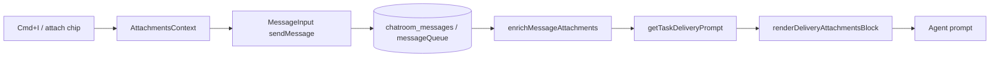

# Attachment Implementation Guide

End-to-end steps for adding a new message attachment type to Chatroom.

> **Canonical source:** `services/backend/prompts/attachments/ATTACHMENTS_GUIDE.md` (this file).  
> Webapp copy: symlink at `apps/webapp/src/modules/chatroom/attachments/ATTACHMENTS_GUIDE.md`.  
> Agents: `chatroom skill activate attachments --chatroom-id=<id> --role=<role>`

---

## 1. Attachment kinds

| Kind     | Schema field             | Compose (webapp) | Primary delivery       | Task read |
| -------- | ------------------------ | ---------------- | ---------------------- | --------- |
| task     | `attachedTaskIds`        | ✅ chip          | ✅ `<attachments>` XML | ✅ XML    |
| backlog  | `attachedBacklogItemIds` | ✅ chip          | ✅ `<attachments>` XML | ✅ XML    |
| message  | `attachedMessageIds`     | ✅ chip          | ✅ `<attachments>` XML | ✅ XML    |
| snippet  | `attachedSnippets`       | ✅ chip + Cmd+I  | ✅ `<attachments>` XML | ✅ XML    |
| artifact | `attachedArtifactIds`    | ❌ reserved      | ❌ reserved            | ❌        |

**Policy notes**

- **Snippets** appear in primary delivery (`get-next-task` / native injection) and `task read`, using the shared XML renderer.
- **Backlog** items appear in primary delivery and `task read`, using the shared `<attachments>` XML renderer.
- **Attached messages** appear in primary delivery and `task read` as `<attachment type="message" message-id="...">` inside the shared `<attachments>` block (source message only).
- **Tasks** appear in primary delivery and `task read` as `<attachment type="task">` inside the shared `<attachments>` block (source message only).

---

## 2. File layout (webapp)

All attachment UI and compose logic lives under one module:

```
apps/webapp/src/modules/chatroom/attachments/
  ATTACHMENTS_GUIDE.md
  index.ts                              # Barrel — preferred import path
  context/
    AttachmentsContext.tsx              # Compose-time registry (discriminated union)
  shared/
    AttachmentChipShell.tsx           # Shared chip chrome (editable + view)
    AttachmentMarkdownModal.tsx       # Shared markdown preview modal
    attachmentChipUtils.ts            # Preview line truncation helpers
    useAttachmentChipPreview.ts       # Chip preview + modal state hook
    MessageAttachmentChips.tsx          # Read-only chip strip (timeline, queue)
    MessageAttachmentChips.test.tsx
    messageAttachmentUtils.ts           # countMessageAttachments()
  task/
    AttachedTaskChip.tsx
  backlog/
    AttachedBacklogItemChip.tsx
  message/
    AttachedMessageChip.tsx
  snippet/
    AttachedSnippetChip.tsx
    explorerSelectionAttachment.ts      # Cmd+I reference IDs + inline tokens
    explorerSelectionAttachment.test.ts
    composerPrefill.ts                  # Window event bridge (explorer → composer)
    composerPrefill.test.ts
```

**Preferred import**

```typescript
import {
  AttachmentsProvider,
  useAttachments,
  MessageAttachmentChips,
  AttachedSnippetChip,
  buildExplorerSelectionPrefill,
} from '../attachments';
```

---

## 3. The compose contract (`AttachmentsContext`)

Defined in `attachments/context/AttachmentsContext.tsx`.

| Export                    | Purpose                                                            |
| ------------------------- | ------------------------------------------------------------------ |
| `MAX_ATTACHMENTS`         | Combined limit across all types (10)                               |
| `Attachment`              | Discriminated union: `task` \| `backlog` \| `message` \| `snippet` |
| `AttachmentsProvider`     | Wrap `ChatroomDashboard` (or parent with `MessageInput`)           |
| `useAttachments()`        | Full registry: `add`, `remove`, `isAttached`, `clearAll`           |
| `useTaskAttachments()`    | Selector — task attachments only                                   |
| `useBacklogAttachments()` | Selector — backlog attachments only                                |
| `useMessageAttachments()` | Selector — message attachments only                                |
| `useSnippetAttachments()` | Selector — snippet attachments only                                |

**Discriminated union shape**

```typescript
type Attachment =
  | { type: 'task'; id: Id<'chatroom_tasks'>; content: string }
  | { type: 'backlog'; id: Id<'chatroom_backlog'>; content: string }
  | { type: 'message'; id: Id<'chatroom_messages'>; content: string; senderRole: string }
  | { type: 'snippet'; id: string; fileSource: string; selectedContent: string };
```

`add()` deduplicates by `type + id` and enforces `MAX_ATTACHMENTS`.

---

## 4. End-to-end flow



1. **Compose** — User attaches via chip UI or Cmd+I explorer selection → `AttachmentsContext` holds pending attachments.
2. **Send** — `MessageInput` maps registry to mutation fields (`attachedTaskIds`, `attachedBacklogItemIds`, `attachedMessageIds`, `attachedSnippets`).
3. **Persist** — Convex `sendMessage` stores attachment fields on `chatroom_messages` or `chatroom_messageQueue`.
4. **Enrich** — Timeline/queue queries resolve IDs to full objects for display (`MessageAttachmentChips`).
5. **Deliver** — `getTaskDeliveryPrompt` reads **source message** snippets → `generateFullCliOutput` / native → `renderDeliveryAttachmentsBlock`.
6. **Task read** — `readTask` + CLI `render.ts` delegate to the same renderer for all four kinds via shared renderer.

---

## 5. Backend delivery (shared renderer)

Backend files are **not** in the webapp module — document and wire from `services/backend/`:

| File                                                                        | Purpose                                                                                                         |
| --------------------------------------------------------------------------- | --------------------------------------------------------------------------------------------------------------- |
| `services/backend/src/domain/entities/message-attachments.ts`               | `MESSAGE_ATTACHMENT_KINDS`, `PRIMARY_DELIVERY_ATTACHMENT_KINDS`, `DELIVERY_ATTACHMENT_FIELD_MAP`, payload types |
| `services/backend/prompts/attachments/render-delivery-attachments.ts`       | `DELIVERY_ATTACHMENT_RENDERERS` (exhaustive), `renderDeliveryAttachmentsBlock`                                  |
| `services/backend/prompts/attachments/delivery-attachment-contract.test.ts` | Exhaustiveness regression guard for primary delivery kinds                                                      |
| `services/backend/convex/messages.ts`                                       | `getTaskDeliveryPrompt` passes `sourceAttachments` from source message                                          |
| `packages/cli/src/commands/task/read/render.ts`                             | Task-read delegates to shared renderer                                                                          |

**Field map** (`message-attachments.ts`):

```typescript
export const DELIVERY_ATTACHMENT_FIELD_MAP = {
  attachedBacklogItemIds: 'backlog',
  attachedMessageIds: 'message',
  attachedSnippets: 'snippet',
  attachedArtifactIds: 'artifact', // reserved — no renderer yet
  attachedTaskIds: 'task',
} as const;
```

**Primary delivery kinds** (`message-attachments.ts`):

```typescript
export const PRIMARY_DELIVERY_ATTACHMENT_KINDS = ['backlog', 'snippet', 'task', 'message'] as const;
export const PRIMARY_DELIVERY_INPUT_KEY_BY_KIND = {
  backlog: 'attachedBacklogItems',
  snippet: 'attachedSnippets',
  task: 'attachedTasks',
  message: 'attachedMessages',
} as const satisfies Record<PrimaryDeliveryAttachmentKind, keyof DeliveryAttachmentsInput>;
```

Add a kind to `PRIMARY_DELIVERY_ATTACHMENT_KINDS` and `PRIMARY_DELIVERY_INPUT_KEY_BY_KIND` when agents must see it without running `task read`. Compiler enforces exhaustiveness.

---

## 6. Adding a new attachment type — checklist

### Webapp

1. Add variant to `Attachment` discriminated union in `attachments/context/AttachmentsContext.tsx`
2. Add selector hook (e.g. `useFooAttachments`) if needed
3. Create `attachments/<kind>/AttachedFooChip.tsx` (editable + view modes via `mode` prop)
4. Export chip from `attachments/index.ts`
5. Wire chip into `MessageInput` editable strip
6. Wire chip into `attachments/shared/MessageAttachmentChips.tsx` view strip
7. Map registry → mutation field in `MessageInput` `sendMessage` call
8. Add UI tests under `attachments/<kind>/` or extend shared tests

### Backend

1. Add schema field + validator in `services/backend/convex/schema.ts`
2. Add field to `DELIVERY_ATTACHMENT_FIELD_MAP` in `message-attachments.ts`
3. Add kind to `MESSAGE_ATTACHMENT_KINDS` if it has a delivery renderer
4. Implement renderer in `DELIVERY_ATTACHMENT_RENDERERS` (`render-delivery-attachments.ts`)
5. Add unit tests in `render-delivery-attachments.test.ts`
6. If primary delivery: add to `PRIMARY_DELIVERY_ATTACHMENT_KINDS` + wire `sourceAttachments` in `messages.getTaskDeliveryPrompt` and `fullOutput.ts` / `native/task-delivery.ts`
7. If task-read only: wire through `readTask` → CLI `render.ts` input only
8. Add integration test in `get-next-task-prompt.spec.ts` when delivery path changes

---

## 7. XML conventions (agent-facing)

### Backlog (primary delivery + task read)

```xml
  <attachment type="backlog" backlog-item-id="item-111">
    - [PENDING] Add login page
    <hint>Work on this item. When done: chatroom backlog mark-for-review --chatroom-id="..." --role="..." --backlog-item-id=item-111</hint>
  </attachment>
```

### Task (primary delivery + task read)

```xml
  <attachment type="task" task-id="task-abc123">
    - [BACKLOG] Fix login redirect
    <hint>Referenced task attached by user.</hint>
  </attachment>
```

### Message (primary delivery + task read)

```xml
  <attachment type="message" message-id="msg-abc123">
    From: builder
    ---
    Prior discussion content here
  </attachment>
```

### Snippet (primary delivery + task read)

Rendered by `renderDeliveryAttachmentsBlock` — identical in both paths:

```xml

<attachments>
  <attachment type="snippet" reference="attachment-reference-001">
  <snippet file-source="./windsurfrules">
    <user-selected-content>
# Shadcn
    </user-selected-content>
  </snippet>
  </attachment>
</attachments>
```

### Inline reference token (composer)

Users see a short token in the message body; full content is in the `<attachments>` block:

```
What library is [attachment: attachment-reference-001]?
```

Created by `renderInlineReference()` in `attachments/snippet/explorerSelectionAttachment.ts`.

---

## 8. Reference implementations

| Kind        | Webapp folder          | Notes                                                                           |
| ----------- | ---------------------- | ------------------------------------------------------------------------------- |
| **Snippet** | `attachments/snippet/` | Most complete: Cmd+I (`composerPrefill.ts`), chip, primary delivery + task read |
| **Backlog** | `attachments/backlog/` | Compose chip + primary delivery + task-read XML                                 |
| **Message** | `attachments/message/` | Compose chip + primary delivery + task-read XML (`type="message"`)              |
| **Task**    | `attachments/task/`    | Compose chip + primary delivery + task-read XML (`type="task"`)                 |

**Snippet Cmd+I flow** (copy this pattern for explorer-driven attachments):

1. `ChatroomDashboard.handleExplorerSelectionToComposer` → `dispatchComposerPrefill`
2. `MessageInput` subscribes via `subscribeComposerPrefill`
3. `buildExplorerSelectionPrefill` creates attachment + inline reference
4. `AttachmentsContext.add({ type: 'snippet', ... })`

**Read-only display** (timeline, work queue):

- Import `MessageAttachmentChips` from `../attachments`
- Pass enriched `Message` with `attachedTasks`, `attachedBacklogItems`, `attachedMessages`, `attachedSnippets`
